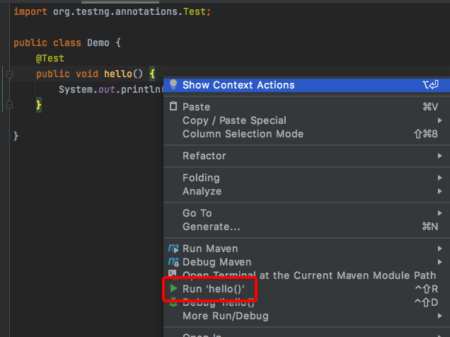
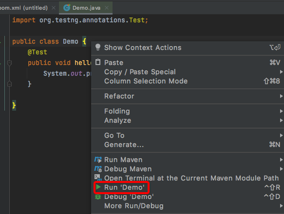
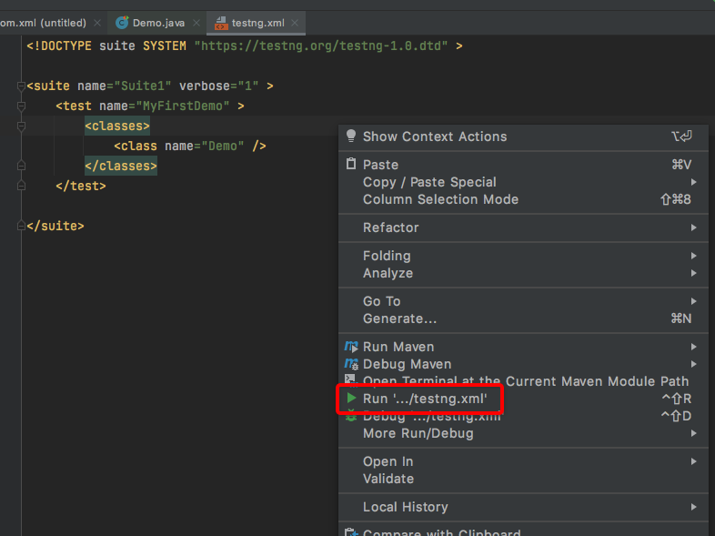
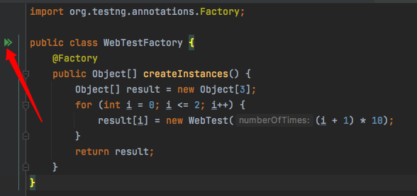
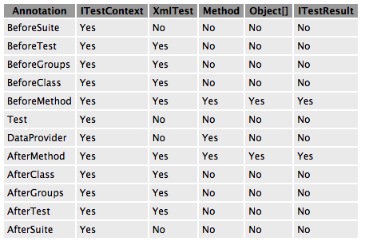

# 【TestNG】单篇长文TestNG从入门到精通


## 简介

TestNG是Test Next Generation的缩写，它的灵感来自于JUnit和NUnit，在它们基础上增加了很多很牛的功能，比如说：

- 注解。
- 多线程，比如所有方法都在各自线程中，一个测试类一个线程等。
- 验证代码是否多线程安全。
- 灵活的测试配置。
- 支持数据驱动（@DataProvider）。
- 支持参数化。
- 强大的执行机制（不需要TestSuite）。
- 能跟各种工具结合（比如IDEA、Maven等）。
- 内嵌BeanShell。
- 提供运行时和日志的JDK函数（不需要添加dependencies）。
- 提供应用服务器测试依赖的方法。

一句话总结就是，**TestNG强大到能覆盖所有测试类型：单元测试、功能测试、端到端测试、集成测试**等等等。

一个简单的示例如下：

```java
package example1;
 
import org.testng.annotations.*;
 
public class SimpleTest {
 
 @BeforeClass
 public void setUp() {
   // code that will be invoked when this test is instantiated
 }
 
 @Test(groups = { "fast" })
 public void aFastTest() {
   System.out.println("Fast test");
 }
 
 @Test(groups = { "slow" })
 public void aSlowTest() {
    System.out.println("Slow test");
 }
 
}
```

- setUp()会在**测试类创建后，测试方法执行前**运行。
- 测试方法名字可以任意的，TestNG通过@Test注解来标识。
- 可以把测试方法按group分组。

然后使用xml来配置运行策略：

```xml
<project default="test">
 
 <path id="cp">
   <pathelement location="lib/testng-testng-5.13.1.jar"/>
   <pathelement location="build"/>
 </path>
 
 <taskdef name="testng" classpathref="cp"
          classname="org.testng.TestNGAntTask" />
 
 <target name="test">
   <testng classpathref="cp" groups="fast">
     <classfileset dir="build" includes="example1/*.class"/>
   </testng>
 </target>
 
</project>
```

使用ant调用（**下面第2节给出了最新的运行方式**）：

```
c:> ant
Buildfile: build.xml
 
test:
[testng] Fast test
[testng] ===============================================
[testng] Suite for Command line test
[testng] Total tests run: 1, Failures: 0, Skips: 0
[testng] ===============================================
 
 
BUILD SUCCESSFUL
Total time: 4 seconds
```

最后就能看报告了：

```
start test-output\index.html (on Windows)
```

## 如何运行TestNG

除了前面提到的ant调用，更常见的运行TestNG的方式是以下两种：

1. IDEA
2. Maven

### IDEA

在IDEA中运行TestNG第①种方式是点击方法或类前面的小箭头：


第②种方式是在方法或类内部点击右键：





第③种方式是使用testng.xml，IDEA可以右键testng.xml来运行，在文件名和文件内部点击均可：



testng.xml支持很多种配置，比如配置测试类：

```xml
<!DOCTYPE suite SYSTEM "https://testng.org/testng-1.0.dtd" >
  
<suite name="Suite1" verbose="1" >
  <test name="Nopackage" >
    <classes>
       <class name="NoPackageTest" />
    </classes>
  </test>
 
  <test name="Regression1">
    <classes>
      <class name="test.sample.ParameterSample"/>
      <class name="test.sample.ParameterTest"/>
    </classes>
  </test>
</suite>
```

配置测试包：

```xml
<!DOCTYPE suite SYSTEM "https://testng.org/testng-1.0.dtd" >
 
<suite name="Suite1" verbose="1" >
  <test name="Regression1"   >
    <packages>
      <package name="test.sample" />
   </packages>
 </test>
</suite>
```

配置组和方法：

```xml
<!DOCTYPE suite SYSTEM "https://testng.org/testng-1.0.dtd" >
 
<suite name="Suite1" verbose="1" >
  <test name="Regression1">
    <groups>
      <run>
        <exclude name="brokenTests"  />
        <include name="checkinTests"  />
      </run>
    </groups>

    <classes>
      <class name="test.IndividualMethodsTest">
        <methods>
          <include name="testMethod" />
        </methods>
      </class>
    </classes>
  </test>
</suite>
```

默认TestNG会按xml顺序执行，可以设置 `preserve-order`为false变成随机顺序：

```xml
<!DOCTYPE suite SYSTEM "https://testng.org/testng-1.0.dtd" >
 
<suite name="Suite1" verbose="1" >
  <test name="Regression1" preserve-order="false">
    <classes>

      <class name="test.Test1">
        <methods>
          <include name="m1" />
          <include name="m2" />
        </methods>
      </class>

      <class name="test.Test2" />

    </classes>
  </test>
</suite>
```

### Maven

官方教程给出了命令行执行TestNG：

```
java org.testng.TestNG testng1.xml [testng2.xml testng3.xml ...]
```

**实际调用是调不通的，可以借助Maven来实现**。

先在pom.xml添加：

```xml
<build>
    <plugins>
        <plugin>
            <groupId>org.apache.maven.plugins</groupId>
            <artifactId>maven-surefire-plugin</artifactId>
            <version>2.19.1</version>
            <configuration>
                <suiteXmlFiles>
                    <suiteXmlFile>testng.xml</suiteXmlFile>
                </suiteXmlFiles>
            </configuration>
        </plugin>
    </plugins>
</build>
```

然后执行`mvn clean test`命令就行啦。

## 测试方法和测试类

使用了@Test注解的方法就是测试方法，包含测试方法的类就是测试类。比如：

```java
package example1;
 
import org.testng.annotations.*;
 
public class SimpleTest {
 
 @BeforeClass
 public void setUp() {
   // code that will be invoked when this test is instantiated
 }
 
 @Test(groups = { "fast" })
 public void aFastTest() {
   System.out.println("Fast test");
 }
 
 @Test(groups = { "slow" })
 public void aSlowTest() {
    System.out.println("Slow test");
 }
 
}
```

@Test也能放在测试类上面，这样测试类下的所有方法都是测试方法，比如：

```java
@Test
public class Test1 {
  public void test1() {
  }
 
  public void test2() {
  }
}
```

而且可以在测试类和测试方法上同时使用@Test，比如给某个Test加入分组：

```java
@Test
public class Test1 {
  public void test1() {
  }
 
  @Test(groups = "g1")
  public void test2() {
  }
}
```

有个点需要注意的是@Test注解的测试方法，默认是会忽略返回值的，除非在testng.xml配置：

```xml
<suite allow-return-values="true">
 
or
 
<test allow-return-values="true">
```

## 测试组

测试组其实就是给测试方法打标记，比如冒烟测试用例和功能测试用例：

```java
public class Test1 {
  @Test(groups = { "functest", "checkintest" })
  public void testMethod1() {
  }
 
  @Test(groups = {"functest", "checkintest"} )
  public void testMethod2() {
  }
 
  @Test(groups = { "functest" })
  public void testMethod3() {
  }
}
```

如果只配置functest，就会执行全部测试方法：

```xml
<test name="Test1">
  <groups>
    <run>
      <include name="functest"/>
    </run>
  </groups>
  <classes>
    <class name="example1.Test1"/>
  </classes>
</test>
```

如果只配置checkintest，就会只执行前面2个方法：

```xml
<test name="Test1">
  <groups>
    <run>
      <include name="checkintest"/>
    </run>
  </groups>
  <classes>
    <class name="example1.Test1"/>
  </classes>
</test>
```

除了指定完整name，也可以使用正则表达式：

```java
@Test
public class Test1 {
  @Test(groups = { "windows.checkintest" })
  public void testWindowsOnly() {
  }
 
  @Test(groups = {"linux.checkintest"} )
  public void testLinuxOnly() {
  }
 
  @Test(groups = { "windows.functest" )
  public void testWindowsToo() {
  }
}
```

```xml
<test name="Test1">
  <groups>
    <run>
      <include name="windows.*"/>
    </run>
  </groups>
 
  <classes>
    <class name="example1.Test1"/>
  </classes>
</test>
```

进一步，测试组除了include测试方法，还可以exclude：

```xml
<test name="Test1">
  <classes>
    <class name="example1.Test1">
      <methods>
        <include name=".*enabledTestMethod.*"/>
        <exclude name=".*brokenTestMethod.*"/>
      </methods>
     </class>
  </classes>
</test>
```

> 还有一个办法是使用*@Test*和*@Before/After*的`enabled`属性。

测试组也能进行嵌套：

```xml
<test name="Regression1">
  <groups>
    <define name="functest">
      <include name="windows"/>
      <include name="linux"/>
    </define>
  
    <define name="all">
      <include name="functest"/>
      <include name="checkintest"/>
    </define>
  
    <run>
      <include name="all"/>
    </run>
  </groups>
  
  <classes>
    <class name="test.sample.Test1"/>
  </classes>
</test>
```

`<define></define>`定义了父分组，里面`<include>`的就是子分组。

同样的，嵌套分组也可以对子分组进行exclude：

```java
@Test(groups = {"checkintest", "broken"} )
public void testMethod2() {
}
```

```java
<test name="Simple example">
  <groups>
    <run>
      <include name="checkintest"/>
      <exclude name="broken"/>
    </run>
  </groups>
  
  <classes>
    <class name="example1.Test1"/>
  </classes>
</test>
```

最后，对于分组的位置，如果测试类和测试方法都标记了分组，那么测试类的分组会作用到所有方法中，比如：

```java
@Test(groups = {"checkin-test"})
public class All {
    @Test(groups = {"func-test")
    public void method1() { ...}

    public void method2() { ...}
}
```

method2()属于checkin-test分组，method1属于func-test和checkin-test两个分组。

## TestNG参数化

TestNG参数化有两种方式，第一种是从testng.xml读取数据，第二种是通过代码读取数据。

### 从testng.xml读取数据

直接看示例：

```java
@Parameters({ "first-name" })
@Test
public void testSingleString(String firstName) {
  System.out.println("Invoked testString " + firstName);
  assert "Cedric".equals(firstName);
}
```

```
<suite name="My suite">
  <parameter name="first-name"  value="Cedric"/>
  <test name="Simple example">
  <-- ... -->
```

- @Parameters指定参数化名字。

- 测试方法入参与参数化名字一一对应。

- testng.xml中`<parameter>`定义参数化的值。

  > 在testng.xml中，`<parameter>`既可以定义在`<suite>`中也可以定义在`<test>`中，如果有同名的，会以`<test>`的覆盖`<suite>`。

@Parameters既可以作用到`@Test`，也可以作用到 `@Before/After`和`@Factory`，比如：

```java
@Parameters({ "datasource", "jdbcDriver" })
@BeforeMethod
public void beforeTest(String ds, String driver) {
  m_dataSource = ...;                              // look up the value of datasource
  m_jdbcDriver = driver;
}
```

> 也可以作用到测试类的构造方法中，但是只能最多一个构造方法，这样就能在初始化类的时候，进行参数化赋值，便于测试方法使用

@Optional用于标识参数是否可选，比如：

```java
@Parameters("db")
@Test
public void testNonExistentParameter(@Optional("mysql") String db) { ... }
```

- 如果db这个参数取不到名字，那么就会取mysql的值。

### 通过代码读取数据

第一种参数化方式其实比较鸡肋，第二种方式才是TestNG参数化的灵魂，用到了**@DataProvider**，它会返回一个二维数组：

```java
import org.testng.annotations.DataProvider;
import org.testng.annotations.Test;

public class DPTest {
    @DataProvider(name = "test1")
    public Object[][] createData1() {
        return new Object[][] {
                { "Cedric", 36},
                { "Anne", 37},
        };
    }

    @Test(dataProvider = "test1")
    public void verifyData1(String n1, Integer n2) {
        System.out.println(n1 + " " + n2);
    }
}
```

- @DataProvider用于生产数据，name是唯一标识。
- 在@Test中通过dataProvider属性指定name。
- 测试方法的入参跟数组中元素一一对应。

默认@DataProvider和@Test是在同一个类中，如果想放在不同的类，那么需要定义为静态方法（或者无参数构造方法的类），比如：

```java
import org.testng.annotations.DataProvider;

public class StaticProvider {
    @DataProvider(name = "create")
    public static Object[][] createData() {
        return new Object[][] {
                new Object[] {42}
        };
    }
}
```

```java
import org.testng.annotations.Test;

public class DiffClazzTest {
    @Test(dataProvider = "create", dataProviderClass = StaticProvider.class)
    public void test(Integer n) {
        System.out.println(n);
    }
}
```

- createData()为static。
- 需要额外通过@Test的dataProviderClass属性指定@DataProvider所在的类。

@DataProvider的返回值（**参数类型**）除了已经提到的`Object[][]`，还可以是`Iterator<Object[]>`，它不会一次性生成所有数据，而是每调用一次生成一次，节约内存，比如：

```java
import org.testng.annotations.DataProvider;
import org.testng.annotations.Test;

import java.util.Arrays;
import java.util.Iterator;

public class IterTest {
    @DataProvider(name = "test1")
    public Iterator<Object[]> createData1() {
        Object[][] myObjects = new Object[][]{
                {"Cedric", 36},
                {"Anne", 37},
        };
        return Arrays.asList(myObjects).iterator();
    }

    @Test(dataProvider = "test1")
    public void verifyData1(String n1, Integer n2) {
        System.out.println(n1 + " " + n2);
    }
}
```

**看到这里，对@DataProvider已经有了足够的认识，它支持两种参数类型**：

- `Object[][]`
- `Iterator<Object[]>`

假如测试方法只有一个入参，是不是只能用二维来实现：

```java
import org.testng.annotations.DataProvider;
import org.testng.annotations.Test;

import java.util.Arrays;
import java.util.Iterator;

public class IterTest {
    @DataProvider(name = "test1")
    public Iterator<Object[]> createData1() {
        Object[][] myObjects = new Object[][]{{"x"}, {"y"}};
        return Arrays.asList(myObjects).iterator();
    }

    @Test(dataProvider = "test1")
    public void verifyData1(String n) {
        System.out.println(n);
    }
}
```

其实不是，**@DataProvider支持一维**数组：

```java
import org.testng.annotations.DataProvider;
import org.testng.annotations.Test;

public class IterTest {
    @DataProvider(name = "test1")
    public Object[] createData1() {
        Object[] myObjects = new Object[]{"x", "y"};
        return myObjects;
    }

    @Test(dataProvider = "test1")
    public void verifyData1(String n) {
        System.out.println(n);
    }
}
```

以及一维数组的迭代器：

```java
import org.testng.annotations.DataProvider;
import org.testng.annotations.Test;

import java.util.Arrays;
import java.util.Iterator;

public class IterTest {
    @DataProvider(name = "test1")
    public Iterator<Object> createData1() {
        Object[] myObjects = new Object[]{"x", "y"};
        return Arrays.asList(myObjects).iterator();
    }

    @Test(dataProvider = "test1")
    public void verifyData1(String n) {
        System.out.println(n);
    }
}
```

**最精彩的来了，@DataProvider支持反射，也就是反向获取测试方法的信息：**

```java
@DataProvider(name = "dp")
public Object[][] createData(Method m) {
  System.out.println(m.getName());  // print test method name
  return new Object[][] { new Object[] { "Cedric" }};
}
 
@Test(dataProvider = "dp")
public void test1(String s) {
}
 
@Test(dataProvider = "dp")
public void test2(String s) {
}
```

- createData的入参是java.lang.reflect.Method，这样就能获取到测试方法的信息，比如这里的getName()会依次拿到test1、test2。

@DataProvider还支持并发：

```java
@DataProvider(parallel = true)// ...
```

默认是10个线程，可以在testng.xml中修改：

```
<suite name="Suite1" data-provider-thread-count="20" >...
```

一个xml共享一个线程池，如果要用多个线程池，那么需要创建多个testng.xml。

锦上添花的是，TestNG的参数化会打印在测试报告中：


## 指定用例执行顺序

TestNG用例的执行顺序有两种方式来指定：注解和XML。

### 注解

使用@Test的dependsOnMethods属性：

```java
@Test
public void serverStartedOk() {}
 
@Test(dependsOnMethods = { "serverStartedOk" })
public void method1() {}
```

或者dependsOnGroups属性：

```java
@Test(groups = { "init" })
public void serverStartedOk() {}
 
@Test(groups = { "init" })
public void initEnvironment() {}
 
@Test(dependsOnGroups = { "init.*" })
public void method1() {}
```

> @Before/After也能实现初始化，但是它们的结果不会出现在测试报告中。

默认TestNG会强制校验，依赖的用例必须成功才会执行当前用例，否则当前用例会被标记为SKIP，这叫做**强依赖**。通过设置alwaysRun=true可以变成**弱依赖**，无论依赖用例执行成功与否，都会执行当前用例。

需要特别注意的是，依赖测试方法是按照测试类来进行执行的（group by class），比如b()方法依赖的a()方法有多个实例，那么会按照以下顺序执行:

```
a(1)
a(2)
b(2)
b(2)
```

举个实际的例子，登入和登出，如果想达到以下效果：

```
signIn("us")
signOut("us")
signIn("uk")
signOut("uk")
```

那么需要在XML中进行配置：

```
  <suite name="Factory" group-by-instances="true">
or
  <test name="Factory" group-by-instances="true">
```

### XML

在testng.xml中使用`<dependencies>`和`depends-on`来指定用例顺序：

```xml
<test name="My suite">
  <groups>
    <dependencies>
      <group name="c" depends-on="a  b" />
      <group name="z" depends-on="c" />
    </dependencies>
  </groups>
</test>
```

## 动态创建测试用例

假设有这样的测试用例，在测试时需要对网页访问多次，那么在TestNG中会这样编写代码：

```java
public class TestWebServer {
  @Test(parameters = { "number-of-times" })
  public void accessPage(int numberOfTimes) {
    while (numberOfTimes-- > 0) {
     // access the web page
    }
  }
}
```

```xml
<test name="T1">
  <parameter name="number-of-times" value="10"/>
  <classes>
    <class name= "TestWebServer" />
  </classes>
</test>
 
<test name="T2">
  <parameter name="number-of-times" value="20"/>
  <classes>
    <class name= "TestWebServer"/>
  </classes>
</test>
 
<test name="T3">
  <parameter name="number-of-times" value="30"/>
  <classes>
    <class name= "TestWebServer"/>
  </classes>
</test>
```

- 由于访问次数不一，在testng.xml中定义了3个test，然后借助参数化将访问次数传给@Test测试方法。
- 在@Test测试方法中循环遍历numberOfTimes。

这种需求可以采用TestNG的Factory来对代码进行简化：

```java
import org.testng.annotations.Factory;

public class WebTestFactory {
    @Factory
    public Object[] createInstances() {
        Object[] result = new Object[3];
        for (int i = 0; i <= 2; i++) {
            result[i] = new WebTest((i + 1) * 10);
        }
        return result;
    }
}
```

```java
import org.testng.annotations.Test;

public class WebTest {
    private int m_numberOfTimes;

    public WebTest(int numberOfTimes) {
        m_numberOfTimes = numberOfTimes;
    }

    @Test
    public void testServer() {
        for (int i = 0; i < m_numberOfTimes; i++) {
            // access the web page
            System.out.println(i);
        }
    }
}
```

- WebTestFactory是工厂函数，返回Object[]。
- WebTestFactory动态创建了多个WebTest实例。

既可以在IDEA中点击WebTestFactory的运行按钮执行测试：



> 注意如果执行WebTest，会提示No tests were found。

也可以在testng.xml中驱动：

```xml
<class name="WebTestFactory" />
```

还可以直接在代码中驱动：

```java
TestNG testNG = new TestNG();
testNG.setTestClasses(WebTestFactory.class);
testNG.run();
```

@Factory和@Test一样，都能使用dataProvider属性，比如：

```java
@Factory(dataProvider = "dp")
public FactoryDataProviderSampleTest(int n) {
  super(n);
}
 
@DataProvider
static public Object[][] dp() {
  return new Object[][] {
    new Object[] { 41 },
    new Object[] { 42 },
  };
}
```

## 忽略部分测试用例

TestNG可以使用@Ignore注解忽略测试，比如：

```java
import org.testng.annotations.Ignore;
import org.testng.annotations.Test;
 
@Ignore
public class TestcaseSample {
 
    @Test
    public void testMethod1() {
    }
 
    @Test
    public void testMethod2() {
    }
}
```

如果作用到测试类上，那么它会忽略这个类下面的所有测试方法。如果只作用到测试方法上，那么它就相当于@Test(enabled=false)。另外还能放在包上面：

```java
@Ignore
package com.testng.master;
 
import org.testng.annotations.Ignore;
```

## 多线程并行测试用例

可以给@Test添加属性，让用例以多线程并行执行：

```java
@Test(threadPoolSize = 3, invocationCount = 10,  timeOut = 10000)
public void testServer() {
```

- threadPoolSize指3个线程。
- invocationCount指运行10次。
- timeOut指阻塞等待超时。

也可以在testng.xml中设置，thread-count指定线程数，parallel设置不同的值有不同的含义：

methods：

```xml
<suite name="My suite" parallel="methods" thread-count="5">
```

所有测试方法在不同的独立线程中执行。

tests：

```xml
<suite name="My suite" parallel="tests" thread-count="5">
```

`<test>`标签内的测试方法会在同一个线程中执行，不同的`<test>`标签会在不同的独立线程中执行。

classes：

```xml
<suite name="My suite" parallel="classes" thread-count="5">
```

同一个类中的测试方法会在同一个线程中执行，不同的类会在不同的独立线程中执行。

instances：

```xml
<suite name="My suite" parallel="instances" thread-count="5">
```

同一个实例中的测试方法会在同一个线程中执行，不同的实例会在不同的独立线程中执行。（Factory能创建多个实例）

## 重跑失败用例

TestNG在运行后会把失败的用例输出到`testng-failed.xml`文件中，可以直接运行这个文件来重跑失败用例。

> 夸一句，这个设计真棒。

有时候，需要让用例失败时自动重试，那么可以在代码中这样实现：

```java
import org.testng.IRetryAnalyzer;
import org.testng.ITestResult;
 
public class MyRetry implements IRetryAnalyzer {
 
  private int retryCount = 0;
  private static final int maxRetryCount = 3;
 
  @Override
  public boolean retry(ITestResult result) {
    if (retryCount < maxRetryCount) {
      retryCount++;
      return true;
    }
    return false;
  }
}
```

```java
import org.testng.Assert;
import org.testng.annotations.Test;
 
public class TestclassSample {
 
  @Test(retryAnalyzer = MyRetry.class)
  public void test2() {
    Assert.fail();
  }
}
```

- 实现IRetryAnalyzer接口的retry方法。
- 在@Test的retryAnalyzer中指定重试类。

## TestNG编程

除了IDEA和Maven这两种运行方式，TestNG还可以直接在程序中调用运行：

```java
TestListenerAdapter tla = new TestListenerAdapter();
TestNG testng = new TestNG();
testng.setTestClasses(new Class[] { Run2.class });
testng.addListener(tla);
testng.run();
```

- TestListenerAdapter是默认的，可以实现org.testng.ITestListener接口自定义TestListener。
- setTestClasses添加测试类。
- run()运行。

还可以通过编程创建一个虚拟的testng.xml，org.testng.xml包的XmlClass, XmlTest等提供了这个能力：

```java
XmlSuite suite = new XmlSuite();
suite.setName("TmpSuite");
 
XmlTest test = new XmlTest(suite);
test.setName("TmpTest");
List<XmlClass> classes = new ArrayList<XmlClass>();
classes.add(new XmlClass("test.failures.Child"));
test.setXmlClasses(classes) ;
```

这段代码会创建一个这样的testng.xml：

```xml
<suite name="TmpSuite" >
  <test name="TmpTest" >
    <classes>
      <class name="test.failures.Child"  />
    <classes>
    </test>
</suite>
```

XmlSuite可以通过TestNG程序调用：

```java
List<XmlSuite> suites = new ArrayList<XmlSuite>();
suites.add(suite);
TestNG tng = new TestNG();
tng.setXmlSuites(suites);
tng.run();
```

## XML中写BeanShell

是的，TestNG的XML中可以写BeanShell，用来替代`<include>`和`<exclude>`：

```xml
<test name="BeanShell test">
   <method-selectors>
     <method-selector>
       <script language="beanshell"><![CDATA[
         groups.containsKey("test1")
       ]]></script>
     </method-selector>
   </method-selectors>
  <!-- ... -->
```

- CDATA用来防止跟XML标签语法冲突。
- 预置了method（当前测试方法）、testngMethod（当前测试方法的描述）、groups（当前测试方法所属分组）三个对象，可以用来做匹配。
- 使用`<script>`后，`<include>`和`<exclude>`会失效。

## Listener

TestNG提供了很多Listener用来自定义TestNG行为，类似于Hook那个意思：

- IAnnotationTransformer
- IAnnotationTransformer2
- IHookable
- IInvokedMethodListener
- IMethodInterceptor
- IReporter
- ISuiteListener
- ITestListener
- ITestNGListener
- IAlterSuiteListener

比如用IAnnotationTransformer动态设置@Test属性：

```java
public class MyTransformer implements IAnnotationTransformer {
  public void transform(ITest annotation, Class testClass,
      Constructor testConstructor, Method testMethod)
  {
    if ("invoke".equals(testMethod.getName())) {
      annotation.setInvocationCount(5);
    }
  }
}
```

> 如果想修改@Factory或@DataProvider，得用IAnnotationTransformer2。
>

比如用IMethodInterceptor设定用例组的执行顺序：

```java
public List<IMethodInstance> intercept(List<IMethodInstance> methods, ITestContext context) {
  List<IMethodInstance> result = new ArrayList<IMethodInstance>();
  for (IMethodInstance m : methods) {
    Test test = m.getMethod().getConstructorOrMethod().getAnnotation(Test.class);
    Set<String> groups = new HashSet<String>();
    for (String group : test.groups()) {
      groups.add(group);
    }
    //让fast分组第一个执行
    if (groups.contains("fast")) {
      result.add(0, m);
    }
    else {
      result.add(m);
    }
  }
  return result;
}
```

比如想自定义测试开始前和测试后的行为，可以先写个Listener：

```java
public class BeforeAfterLog extends TestListenerAdapter {
 		public void onTestSuccess(ITestResult result) {
        System.out.println("onTestSuccess");
    }

    public void onTestFailure(ITestResult result) {
        System.out.println("onTestFailure");
    }
}
```

然后在测试类上添加：

```java
@Listeners(BeforeAfterLog.class)
public class MyTest {
}
```

这样就不用每个测试类都写@BeforeClass和@AfterClass了。

## 依赖注入

TestNG支持在测试方法中添加特定类来进行依赖注入（就是获取TestNG相关信息）：

- ITestContext
- XmlTest 当前`<test>`标签
- Method 当前调用的测试方法
- Object[] 当前测试方法的入参
- ITestResult 当前测试结果

不同注解支持的方式如下表所示：



示例：

```java
public class NoInjectionTest {
 
  @DataProvider(name = "provider")
  public Object[][] provide() throws Exception {
      return new Object[][] { { CC.class.getMethod("f") } };
  }
 
  @Test(dataProvider = "provider")
  public void withoutInjection(@NoInjection Method m) {
      Assert.assertEquals(m.getName(), "f");
  }
 
  @Test(dataProvider = "provider")
  public void withInjection(Method m) {
      Assert.assertEquals(m.getName(), "withInjection");
  }
}
```

> @NoInjection用于禁止依赖注入。

## 断言

TestNG支持Java的assert关键字断言，示例：

```java
@Test
public void verifyLastName() {
  assert "Beust".equals(m_lastName) : "Expected name Beust, for" + m_lastName;
}
```

也可以用JUnit断言方法：

```java
import static org.testng.AssertJUnit.*;
//...
@Test
public void verify() {
  assertEquals("Beust", m_lastName);
}
```

## 日志

用Listener来实现，直接看代码：

```java
public class DotTestListener extends TestListenerAdapter {
  private int m_count = 0;
 
  @Override
  public void onTestFailure(ITestResult tr) {
    log("F");
  }
 
  @Override
  public void onTestSkipped(ITestResult tr) {
    log("S");
  }
 
  @Override
  public void onTestSuccess(ITestResult tr) {
    log(".");
  }
 
  private void log(String string) {
    System.out.print(string);
    if (++m_count % 40 == 0) {
      System.out.println("");
    }
  }
}
```

## 测试报告

TestNG自带了一个测试报告，运行完后会生成index.html，打开就是，比较丑，推荐用Allure。

如果想获取测试报告的数据，那么可以从org.testng.IReporter接口的方法：

```java
public void generateReport(List<ISuite> suites, String outputDirectory)
```

根据它的入参去拿。

如果想给测试报告添加数据，那么可以使用org.testng.Reporter类：

```java
Reporter.log("M3 WAS CALLED");
```

## YAML替代XML

如果你烦透了XML，那么可以试试YAML。

比如XML：

```xml
<suite name="SingleSuite" verbose="2" thread-count="4">
 
  <parameter name="n" value="42" />
 
  <test name="Regression2">
    <groups>
      <run>
        <exclude name="broken" />
      </run>
    </groups>
 
    <classes>
      <class name="test.listeners.ResultEndMillisTest" />
    </classes>
  </test>
</suite>
```

换成YAML：

```yaml
name: SingleSuite
threadCount: 4
parameters: { n: 42 }
 
tests:
  - name: Regression2
    parameters: { count: 10 }
    excludedGroups: [ broken ]
    classes:
      - test.listeners.ResultEndMillisTest
```

舒服多了。不过TestNG本身没有引入YAML依赖包，需要自己添加：

```xml
<dependency>
  <groupid>org.yaml</groupid>
  <artifactid>snakeyaml</artifactid>
  <version>1.23</version>
</dependency>
```

## 彩蛋

看完了官方教程，感觉测试框架的功能基本上大同小异，只是技术实现上有所区别。让我惊喜的是，TestNG运行失败的用例可以自动生成一份失败用例的xml文件，直接拿来重跑就可以了。还有一直以为TestNG只能用XML，没想到也能用YAML了。最后，它给出了`-Dtestng.mode.dryrun=true`这个参数，猜猜它是干嘛的。有时候只想看跑起来会执行哪些测试，而不想真正执行，那么就可以用这个参数。


> 参考资料：
>
> https://testng.org/doc/
>
> https://testng.org/doc/documentation-main.html