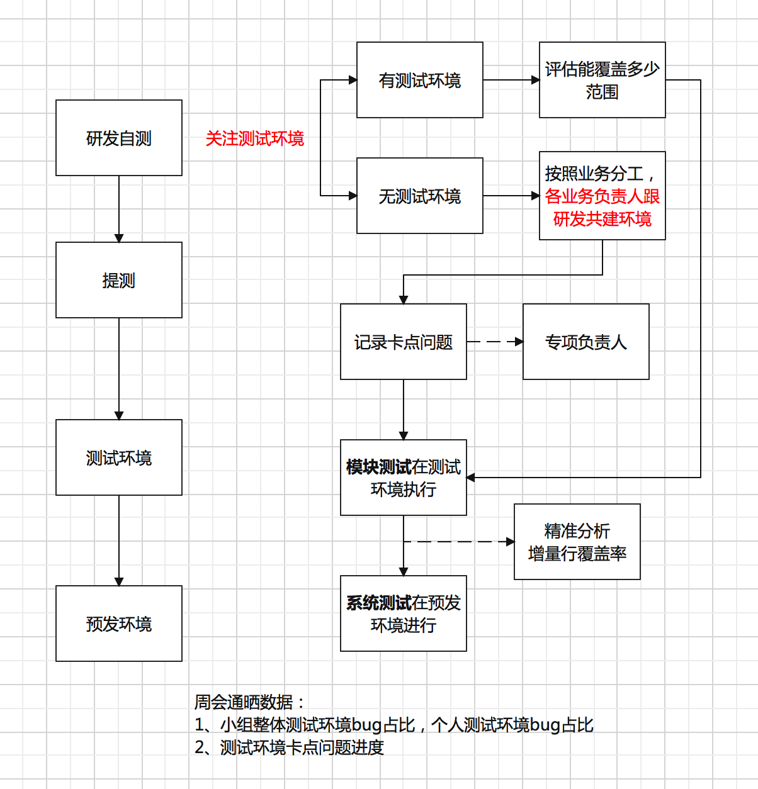
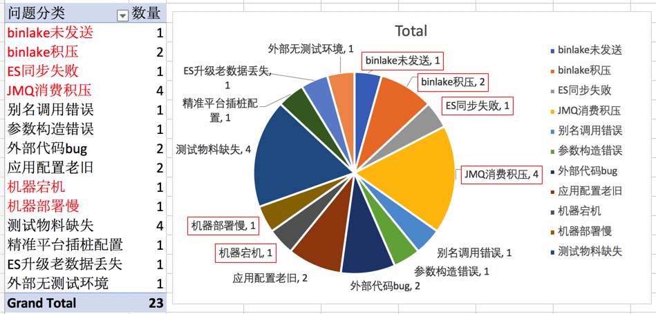

# 老板给我安排了个测试环境治理的活

## 测试环境困局

测试环境治理专项是在我入职2个月接手的活，用“烂摊子”来形容一点也不为过。年久失修，需求基本没有在测试环境使用，想用也有很多问题。人员缺乏信心，之前负责测试环境的同学抱怨极多，外部推不动，内部又没有技术能力支撑，负能量已经蔓延到整个团队。当然，我也是其中一员，这事确实难搞。在技术部**测试环境平台化**的大方向下，需要每个组出一个接口人来牵头，考虑到我以前写过测试平台，乱七八糟的事都整过，老板就指定了我。

## What，测试环境是什么？

测试环境是一套能够支撑业务系统运行的环境，是相对于预发环境和生产环境来说完全隔离的环境。**测试环境=应用+数据+配置+依赖服务**。应用包含系统应用和中间件等，数据就是测试物料，配置针对测试环境应该有单独的一套，依赖服务要跟外部联调好以后整个环境才是可用的。测试环境治理就是通过内部搭建和外部联调，保障业务系统能够在完全隔离的环境中运行。

## Why，为什么要做测试环境？

测试环境是为了隔离。如果只有一套生产环境，那么开发、测试、上线等活动，可能会对线上系统稳定性造成影响，可能会污染线上用户数据，可能引起客户投诉甚至资产损失，所以**需要有一套完全隔离的测试环境**。

## Who，谁来负责测试环境？

**每个测试人员**都需要具备测试环境搭建能力。当然可以推动运维或研发来搭建测试环境，但是测试人员需要具备搭建能力，能够自主编译，构建，部署，遇到问题能够根据日志做初步定位，将问题抛出推动研发或外部依赖方解决。

## When，什么时间做测试环境？

测试环境治理需要**前置到研发自测阶段**。在实践过程中，测试同学暴露出来最多的问题是，没有时间投入到测试环境搭建中，一方面是缺乏动力，不肯迈出艰难的第一步，另一方面也是跟项目节奏有关，研发就算用测试环境自测，也会在预发联调好以后再提测，到测试手上时，已经有可用的预发环境了，就不会再去用测试环境。“项目时间紧，测试环境不好用，直接用预发测吧”，顺理成章的就成为了很合理的借口。所以需要从提测，前置到，研发自测，做测试环境治理：

## Where，从哪里入手测试环境？

测试环境治理需要**从上往下**才能推动，先有文化，才有行动。假如只有某个部门想做测试环境治理，外部依赖基本上是推不动的，一个人呐喊得再愤怒其他人也可能无动于衷。所以得先把测试环境治理这件事，跟老板沟通，从高层入手，把它定义为一项政治任务，从上往下层层递进。

## How，怎么做测试环境？

工欲善其事，必先利其器，公司的基建比较完善，给测试人员搭建测试环境降低了很大难度。设想一下，假如只能折腾Docker和K8S，那可能需要专门的运维才能搞得定环境，对测试来说门槛就会比较高了，除了少数技术能力强的，其他同学基本没有什么可操作性。**测试环境平台化就是武器**。公司有个部署平台叫做JDOS，日常运维都是在这上面操作，没有运维人员，环境全靠开发人员和测试人员自己整。JDOS已经是页面化操作了，但它对测试环境没有特殊的应用场景，是个大而全的平台，所以二级部门开了一个测试环境平台，Env，"一款全流程自动化测试环境搭建的利器"。

Env的核心思想是`1+N`。`1`代表稳定分组（分组≈Pod），搭建稳定分组需要经过创建系统，创建应用，创建集群，申请机器，代码编译构建，部署镜像，修改配置等操作，需要选取master稳定版本，这样才能对外提供稳定服务。`N`是克隆`1`产生的多个分组，相互隔离，能让开发同学复用测试搭建好的环境，完成冒烟自测等过程；也能在多业务联调测试时，通过平台快速搭建一套全链路测试环境。

Env提供了环境监控的功能。对于搭建好的稳定环境，它可以每天监控机器是否可用，服务是否正常，镜像是否老旧，等等等，让你及时维护环境，保障稳定性。

Env提供了一键搭建的功能。新克隆的环境，只要点一下“一键搭建”，就会基于稳定分组，自动化搭建一套新环境，大大节约了时间成本。

Env提供了拓扑画图的功能。将多个应用拖到一张拓扑图里面，根据依赖关系连线，能够直观了解到应用之间的依赖关系。基于拓扑来克隆新环境，也能批量克隆多个应用。假如多项目需求并行迭代，想要多套联调的测试环境，就可以克隆多套新环境。

Env还解决了一个资源浪费的问题，以前搭建测试环境比较随意，申请资源也很容易，其实会导致很多机器用过后，一直空置在那里。Env收拢了申请资源入口，基于Env来创建稳定分组，只能有1个，想要更多必须走审批。而对于克隆的新环境，也会有期限，14天以后会自动释放，想要延期也必须走审批。

我所负责的第一件事，就是用Env来搭建一张拓扑图，把组内所有应用都从JDOS迁移到Env上，**维持稳定环境对外提供支撑对接，克隆环境对内支持多项目并行**。

搭建测试环境只是起步，**测试环境治理的目标是需求能够使用测试环境**。对于外部依赖少的业务模块来说，这相对容易。对于外部依赖很多的业务模块来说，这就很难了。那么该如何推动这件事呢？

第1个策略是共建，让研发和测试一起来搭建和维护测试环境。

第2个策略是做功能验证，梳理出链路用例，跟踪验证结果，识别卡点问题：

对于卡点问题的处理，把干系人单独拉群对，响应超过3天就往上抛，**一定会遇到推不动的问题，那么办法只能找自己的上游负责人，层层向上反馈，让上面的负责人去找对方负责人，然后推动对方的下游同学来协助解决**。卡点问题记录后需要做问题分类，做好统计，这既是工作量的体现，也是每周进度汇报的依据：

第3个策略就是制定kpi，强制大家使用测试环境完成绩效。

## How much，测试环境做到什么程度？

测试环境的kpi能反应出测试环境应该做到什么程度，可以使用**需求使用测试环境占比**和**测试环境bug占比**。需求使用测试环境占比的计算公式是`打标了测试环境的提测卡片数/总的提测卡片数`，测试在点击开始测试时，选择是否使用测试环境进行打标。测试环境bug占比的计算公式是`测试环境bug/(测试环境bug+预发环境bug+生产环境bug)`，在提交缺陷时选择环境类型进行打标。测试环境bug占比的意义更大，因为使用测试环境与否，最终的体现还是落在缺陷上面的，比较容易量化，需求使用测试环境占比不是很确定，需求多少功能在测试环境使用了，相对来说不是很好度量，但也可以作为辅助指标进行观察。

## 测试环境破局

测试环境关联了很多东西，比如物料、自动化、精准、流水线等，都可以围绕测试环境来做文章。测试环境既是团队重点，也是是我个人的大案例，目前已经解决了部分困难，要想做出一鸣惊人的成绩，还需要站在更高的角度去看待整个事情，这也是一个全新的挑战，需要不断刷新自己，突破。