# RabbitMQ消息队列官方教程Java学习笔记


## 消息队列

RabbitMQ是一个消息队列，它能够接收和转发消息。这个过程就像寄快递一样，把物件打包给快递小哥，快递小哥会负责把物件派送到正确的地址。

### 生产者和消费者

**生产者**就是用来生产消息（发送消息）的：


**消费者**就是用来消费消息（接收消息）的：


在生产者和消费者之间的就是**消息队列**：


它相当于消息缓冲区，最多能存储多少数据只受限于机器的内存和磁盘。多个生产者可以发送消息给同一个队列，多个消费者也可以从同一个队列接收消息。


### Windows安装RabbitMQ

参考mall商城学习教程的RabbitMQ部分内容：

http://www.macrozheng.com/#/architect/mall_arch_09?id=rabbitmq

原文中`rabbitmq-server-3.7.14.exe`下载地址失效了，改从这里下载：

https://github.com/rabbitmq/rabbitmq-server/releases/tag/v3.7.14

安装完成后，确认服务已开启：

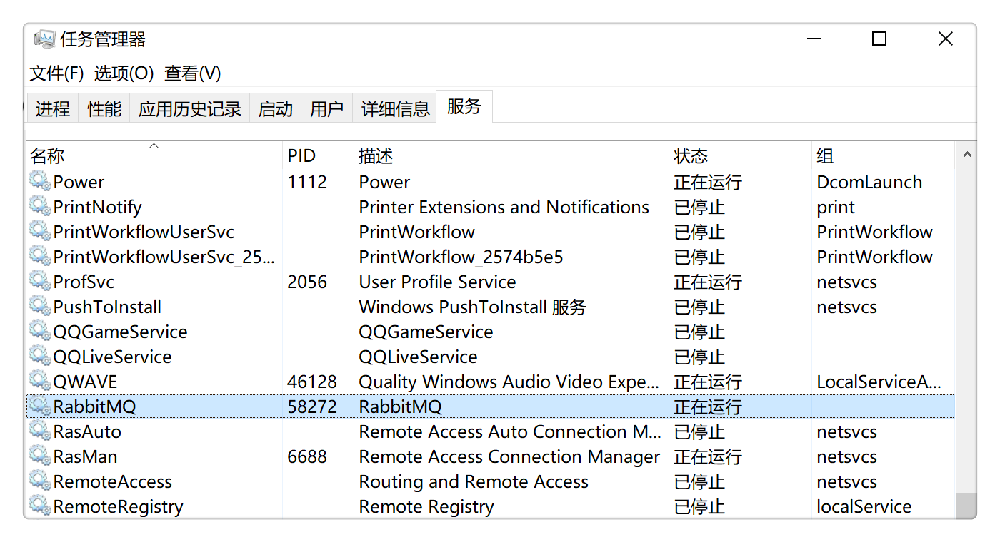

进入RabbitMQ安装目录下的sbin目录：

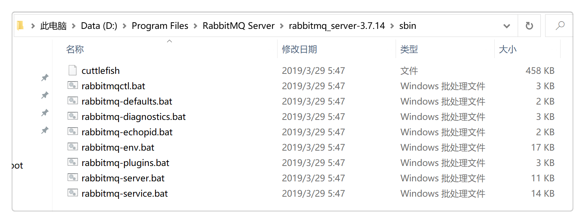

在地址栏输入cmd并回车启动命令行，然后输入以下命令启动管理功能：

```shell
rabbitmq-plugins enable rabbitmq_management
```

RabbitMQ运行在本地机器上：

http://localhost:15672/

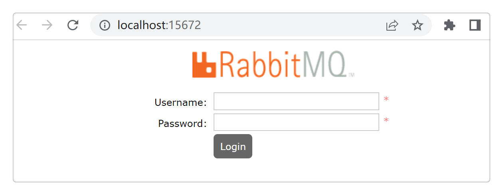

默认用户名密码为guest / guest：

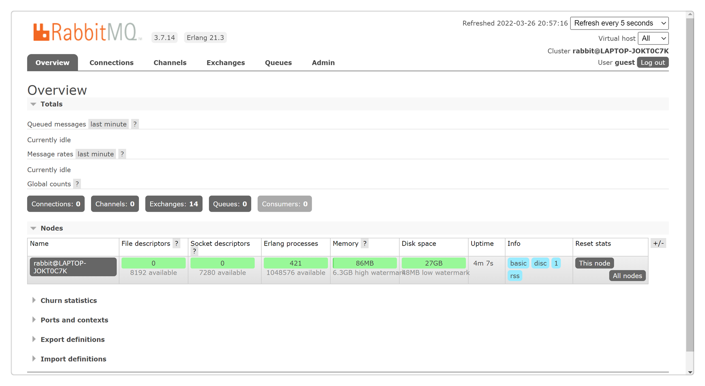

### Java客户端

`amqp-client-5.7.1.jar`是RabbitMQ官方提供的Java客户端：

https://www.rabbitmq.com/tutorials/tutorial-one-java.html

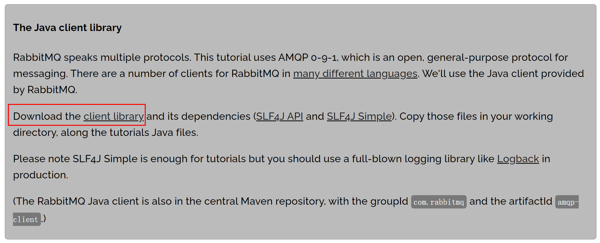

既可以直接下载jar包，也可以在Maven中添加依赖：

```java
<dependency>
    <groupId>com.rabbitmq</groupId>
    <artifactId>amqp-client</artifactId>
    <version>5.14.2</version>
</dependency>
```

### 生产消息


导包：

```java
import com.rabbitmq.client.ConnectionFactory;
import com.rabbitmq.client.Connection;
import com.rabbitmq.client.Channel;
```

创建类Send，定义队列名为hello：

```java
public class Send {
  private final static String QUEUE_NAME = "hello";
  public static void main(String[] argv) throws Exception {
      ...
  }
}
```

建立连接：

```java
ConnectionFactory factory = new ConnectionFactory();
factory.setHost("localhost");
try (Connection connection = factory.newConnection();
     Channel channel = connection.createChannel()) {

}
```

代码中创建了一个Connection实例和一个Channel实例，它们都用try语句包裹了起来，这是因为Connection和Channel类都实现了`java.io.Closeable`，try语句会自动关闭连接。

声明消息队列，并发送`Hello World!`消息到队列中：

```java
channel.queueDeclare(QUEUE_NAME, false, false, false, null);
String message = "Hello World!";
channel.basicPublish("", QUEUE_NAME, null, message.getBytes());
System.out.println(" [x] Sent '" + message + "'");
```

声明消息队列是个幂等操作，重复声明不会重复创建队列。

消息体是字节数组（byte array）。

`Send.java`完整代码：

https://github.com/rabbitmq/rabbitmq-tutorials/blob/master/java/Send.java

```java
import com.rabbitmq.client.Channel;
import com.rabbitmq.client.Connection;
import com.rabbitmq.client.ConnectionFactory;

import java.nio.charset.StandardCharsets;

public class Send {

    private final static String QUEUE_NAME = "hello";

    public static void main(String[] argv) throws Exception {
        ConnectionFactory factory = new ConnectionFactory();
        factory.setHost("localhost");
        try (Connection connection = factory.newConnection();
             Channel channel = connection.createChannel()) {
            channel.queueDeclare(QUEUE_NAME, false, false, false, null);
            String message = "Hello World!";
            channel.basicPublish("", QUEUE_NAME, null, message.getBytes(StandardCharsets.UTF_8));
            System.out.println(" [x] Sent '" + message + "'");
        }
    }
}
```

### 消费消息


消费消息的代码跟生产消息的代码类似，也需要导包，建立连接：

```java
import com.rabbitmq.client.Channel;
import com.rabbitmq.client.Connection;
import com.rabbitmq.client.ConnectionFactory;
import com.rabbitmq.client.DeliverCallback;


public class Recv {

  private final static String QUEUE_NAME = "hello";

  public static void main(String[] argv) throws Exception {
    ConnectionFactory factory = new ConnectionFactory();
    factory.setHost("localhost");
    Connection connection = factory.newConnection();
    Channel channel = connection.createChannel();

    channel.queueDeclare(QUEUE_NAME, false, false, false, null);
    System.out.println(" [*] Waiting for messages. To exit press CTRL+C");

  }
}
```

**消费者也声明了一个消息队列**，因为有可能消费者比生产者先启动。这样能确保消费消息时，有队列存在。

**消费者没有用try语句**，因为消费者一直在异步监听消息，如果把连接关闭了，它就没法消费了。

导包中有个`DeliverCallback`，通过它就能消费消息：

```java
DeliverCallback deliverCallback = (consumerTag, delivery) -> {
    String message = new String(delivery.getBody(), "UTF-8");
    System.out.println(" [x] Received '" + message + "'");
};
channel.basicConsume(QUEUE_NAME, true, deliverCallback, consumerTag -> { });
```

因为发送消息和接收消息都是异步的，所以它叫做，callback，回调。

`Recv.java`完整代码：

https://github.com/rabbitmq/rabbitmq-tutorials/blob/master/java/Recv.java

```java
import com.rabbitmq.client.Channel;
import com.rabbitmq.client.Connection;
import com.rabbitmq.client.ConnectionFactory;
import com.rabbitmq.client.DeliverCallback;

public class Recv {

    private final static String QUEUE_NAME = "hello";

    public static void main(String[] argv) throws Exception {
        ConnectionFactory factory = new ConnectionFactory();
        factory.setHost("localhost");
        Connection connection = factory.newConnection();
        Channel channel = connection.createChannel();

        channel.queueDeclare(QUEUE_NAME, false, false, false, null);
        System.out.println(" [*] Waiting for messages. To exit press CTRL+C");

        DeliverCallback deliverCallback = (consumerTag, delivery) -> {
            String message = new String(delivery.getBody(), StandardCharsets.UTF_8);
            System.out.println(" [x] Received '" + message + "'");
        };
        channel.basicConsume(QUEUE_NAME, true, deliverCallback, consumerTag -> { });
    }
}
```

### 运行效果

**运行``Send.java``生产消息后**，能看到RabbitMQ后台已经有1条消息：

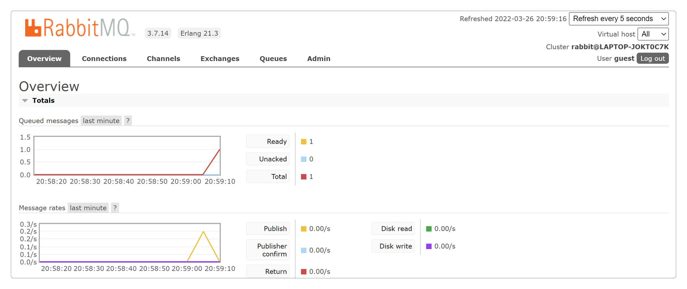

和1个消息队列：

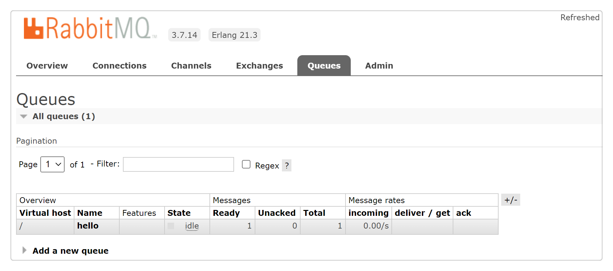

并且发送完成后就断开了连接。

**运行``Recv.java``消费消息后**，能看到队列中已经没有消息了：

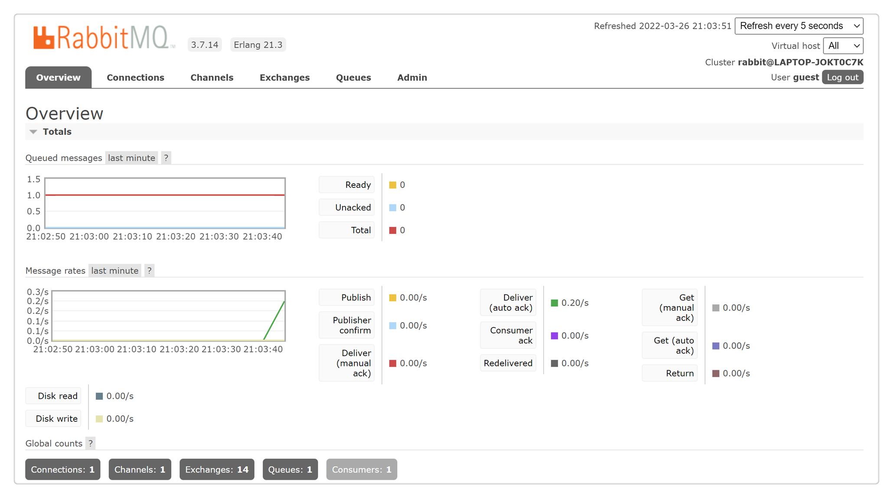

而消费者仍然保持着连接，持续监控新消息。如果把消费者停掉，连接就会断开。

从消息队列中能看到整个过程如下图所示：

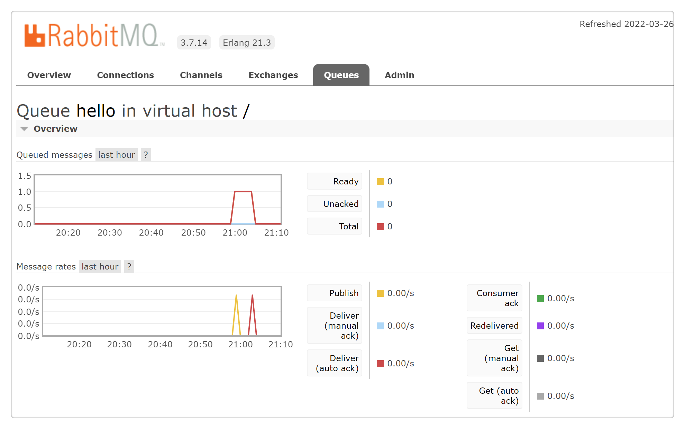

## 任务分发

任务分发是把多个任务扔进队列，然后分发给多个worker来执行。之所以要用队列来实现，是因为任务处理需要一定时长，如果一直等待会导致阻塞，而异步把任务排到队列里，就能加快分发，在取出任务时，也能根据各个worker负载情况，均衡分配。尤其是在Web应用中，HTTP连接短暂就会断开，异步处理就特别适用。排队比蜂拥而至办事效率更高。


实现任务分发，新建`NewTask.java`发送消息：

```java
String message = String.join(" ", argv);

channel.basicPublish("", "hello", null, message.getBytes());
System.out.println(" [x] Sent '" + message + "'");
```

用message来模拟任务。

新建`Worker.java`接收消息：

```java
DeliverCallback deliverCallback = (consumerTag, delivery) -> {
  String message = new String(delivery.getBody(), "UTF-8");

  System.out.println(" [x] Received '" + message + "'");
  try {
    doWork(message);
  } finally {
    System.out.println(" [x] Done");
  }
};
boolean autoAck = true; // acknowledgment is covered below
channel.basicConsume(TASK_QUEUE_NAME, autoAck, deliverCallback, consumerTag -> { });
```

```java
private static void doWork(String task) throws InterruptedException {
    for (char ch: task.toCharArray()) {
        if (ch == '.') Thread.sleep(1000);
    }
}
```

`doWrok()`模拟任务处理，用`.`来表示时长，`hello...`就代表要处理3秒。

然后在2个shell启动2个worker：

```shell
## shell 1
java -cp $CP Worker
## => [*] Waiting for messages. To exit press CTRL+C
```

```shell
## shell 2
java -cp $CP Worker
## => [*] Waiting for messages. To exit press CTRL+C
```

发送5条任务：

```shell
## shell 3
java -cp $CP NewTask First message.
## => [x] Sent 'First message.'
java -cp $CP NewTask Second message..
## => [x] Sent 'Second message..'
java -cp $CP NewTask Third message...
## => [x] Sent 'Third message...'
java -cp $CP NewTask Fourth message....
## => [x] Sent 'Fourth message....'
java -cp $CP NewTask Fifth message.....
## => [x] Sent 'Fifth message.....'
```

worker的处理情况如下：

```shell
java -cp $CP Worker
## => [*] Waiting for messages. To exit press CTRL+C
## => [x] Received 'First message.'
## => [x] Received 'Third message...'
## => [x] Received 'Fifth message.....'
```

```shell
java -cp $CP Worker
## => [*] Waiting for messages. To exit press CTRL+C
## => [x] Received 'Second message..'
## => [x] Received 'Fourth message....'
```

任务是**循环调度**的，worker1总是处理奇数序列的任务，worker2总是处理偶数序列的任务。

### 消息确认

RabbitMQ支持消息确认，consumer在**接收到消息并处理**后，会回传一个ack给producer，告诉RabbitMQ这条消息已经接收成功了。它的好处是能防止worker挂掉而丢失消息，因为假如producer没有收到消息确认，它会保留这条消息，重新发送给其他worker。消息确认过程默认有30秒的超时时间，超过30秒没有收到消息确认，就会重试。

在代码中有个默认设置：

```java
boolean autoAck = true;
channel.basicConsume(TASK_QUEUE_NAME, autoAck, deliverCallback, consumerTag -> { });
```

autoAck表示自动确认，在消息发送出去以后，就自动确认了。这就起不到防止消息丢失的效果，所以通常会设置为：

```java
boolean autoAck = false;
```

### 消息持久化

RabbitMQ重启以后，所有的队列和消息都会丢失，消息持久化能保留这些数据，在重启后恢复所有的队列和消息。

队列持久到用到了durable参数：

```java
boolean durable = true;
channel.queueDeclare("task_queue", durable, false, false, null);
```

**需要注意的是，修改队列的参数必须重新命名新的队列，因为RabbitMQ不支持对现有队列的参数进行修改。**

消息持久化用到了MessageProperties：

```java
import com.rabbitmq.client.MessageProperties;

channel.basicPublish("", "task_queue",
            MessageProperties.PERSISTENT_TEXT_PLAIN,
            message.getBytes());
```

### 均衡调度

均衡调度是根据worker负载情况来合理分配任务。前面实现的任务分发是循环调度的，worker1总是处理奇数序列的任务，worker2总是处理偶数序列的任务。假如奇数序列的任务始终比偶数序列的任务繁忙，处理起来耗时长，那么就会导致worker1一直繁忙而worker2处于空闲。这显然不是很合理。

这是因为RabbitMQ默认只是盲目的将第n个消息发给第n个consumer，而不会去管有多少个未确认的消息数量。

RabbitMQ提供了prefetchCount参数来实现均衡调度：

```java
int prefetchCount = 1;
channel.basicQos(prefetchCount);
```


通过设置prefetchCount为1，RabbitMQ一次只会给一个worker分发一条消息，假如某个worker比较繁忙，那么只会等它处理完成回传消息确认（Message acknowledgment）后，才会分发新消息给它。

### 完整代码

`NewTask.java`

```java
import com.rabbitmq.client.Channel;
import com.rabbitmq.client.Connection;
import com.rabbitmq.client.ConnectionFactory;
import com.rabbitmq.client.MessageProperties;

public class NewTask {

  private static final String TASK_QUEUE_NAME = "task_queue";

  public static void main(String[] argv) throws Exception {
    ConnectionFactory factory = new ConnectionFactory();
    factory.setHost("localhost");
    try (Connection connection = factory.newConnection();
         Channel channel = connection.createChannel()) {
        channel.queueDeclare(TASK_QUEUE_NAME, true, false, false, null);

        String message = String.join(" ", argv);

        channel.basicPublish("", TASK_QUEUE_NAME,
                MessageProperties.PERSISTENT_TEXT_PLAIN,
                message.getBytes("UTF-8"));
        System.out.println(" [x] Sent '" + message + "'");
    }
  }
}
```

`Worker.java`

```java
import com.rabbitmq.client.Channel;
import com.rabbitmq.client.Connection;
import com.rabbitmq.client.ConnectionFactory;
import com.rabbitmq.client.DeliverCallback;

public class Worker {

  private static final String TASK_QUEUE_NAME = "task_queue";

  public static void main(String[] argv) throws Exception {
    ConnectionFactory factory = new ConnectionFactory();
    factory.setHost("localhost");
    final Connection connection = factory.newConnection();
    final Channel channel = connection.createChannel();

    channel.queueDeclare(TASK_QUEUE_NAME, true, false, false, null);
    System.out.println(" [*] Waiting for messages. To exit press CTRL+C");

    channel.basicQos(1);

    DeliverCallback deliverCallback = (consumerTag, delivery) -> {
        String message = new String(delivery.getBody(), "UTF-8");

        System.out.println(" [x] Received '" + message + "'");
        try {
            doWork(message);
        } finally {
            System.out.println(" [x] Done");
            channel.basicAck(delivery.getEnvelope().getDeliveryTag(), false);
        }
    };
    channel.basicConsume(TASK_QUEUE_NAME, false, deliverCallback, consumerTag -> { });
  }

  private static void doWork(String task) {
    for (char ch : task.toCharArray()) {
        if (ch == '.') {
            try {
                Thread.sleep(1000);
            } catch (InterruptedException _ignored) {
                Thread.currentThread().interrupt();
            }
        }
    }
  }
}
```

## 发布订阅

**发布订阅**是发送一条消息给多个consumer的一对多模式。不同于任务分发的一个消息只发送给一个worker的一对一模式。

接下来将实现一个日志系统来说明发布订阅的一对多模式，它由2个程序组成，第一个程序负责提交日志消息，第二个程序负责接收消息并打印出来。第二个程序有2个实例，第1个实例接收消息存储到磁盘，同时第2个实例把日志打印到屏幕。

### Exchange

回顾几个概念：

- producer：生产者，发送消息。

- queue：队列，消息缓存。

- consumer：消费者，接收消息。

实际上producer并不会直接给queue发送消息，它并不知道消息会发给哪个queue。在producer和queue中间，有一个叫做Exchange的东西：


producer只会把消息发送给Exchage，而Exchange的作用就是定义**消息转发规则**：

- 消息发给一个队列？

- 消息发给多个队列？

- 消息应该被忽略掉？

- 等等等

Exchange有几种类型：**direct, topic, headers 和fanout**，这里讨论最后一个fanout，它会把所有消息广播给所有队列。

创建命名为`logs`的Exchange：

```java
channel.exchangeDeclare("logs", "fanout");
```

发送消息到Exchange：

```java
channel.basicPublish( "logs", "", null, message.getBytes());
```

还记得之前的代码么：

```java
channel.basicPublish("", "hello", null, message.getBytes());
```

第一个参数为空字符串，这并不是说没有Exchange，而是使用了RabbitMQ默认的Exchange。

**有Exchange的消息队列，才是真正的消息队列。**

### 临时队列

临时队列主要用来临时传输消息。在将要实现的日志系统中，因为是广播所有消息，所以并不关心转发给哪个具体的队列，只要有个队列就行。并且每次连接到队列时，都希望队列里面是空的，没有老数据。在consumer断开连接后，队列也能自动删除。

可以通过无参数的`queueDeclare()`来实现临时队列：

```java
String queueName = channel.queueDeclare().getQueue();
```

这样能创建一个非持久化的、独占的、自动删除的队列。它的队列名是个随机名字，比如`amq.gen-JzTY20BRgKO-HjmUJj0wLg`。

### 绑定

Exchange需要跟队列绑定：

```java
channel.queueBind(queueName, "logs", "");
```

绑定后Exchange才知道把消息发给哪些队列。


可以使用命令查看RabbitMQ存在哪些绑定：

```shell
rabbitmqctl list_bindings
```

### 完整代码


`EmitLog.java`

```java
public class EmitLog {

  private static final String EXCHANGE_NAME = "logs";

  public static void main(String[] argv) throws Exception {
    ConnectionFactory factory = new ConnectionFactory();
    factory.setHost("localhost");
    try (Connection connection = factory.newConnection();
         Channel channel = connection.createChannel()) {
        channel.exchangeDeclare(EXCHANGE_NAME, "fanout");

        String message = argv.length < 1 ? "info: Hello World!" :
                            String.join(" ", argv);

        channel.basicPublish(EXCHANGE_NAME, "", null, message.getBytes("UTF-8"));
        System.out.println(" [x] Sent '" + message + "'");
    }
  }
}
```

producer并不需要定义队列，它只把消息发给Exchange即可。

`ReceiveLogs.java`

```java
import com.rabbitmq.client.Channel;
import com.rabbitmq.client.Connection;
import com.rabbitmq.client.ConnectionFactory;
import com.rabbitmq.client.DeliverCallback;

public class ReceiveLogs {
  private static final String EXCHANGE_NAME = "logs";

  public static void main(String[] argv) throws Exception {
    ConnectionFactory factory = new ConnectionFactory();
    factory.setHost("localhost");
    Connection connection = factory.newConnection();
    Channel channel = connection.createChannel();

    channel.exchangeDeclare(EXCHANGE_NAME, "fanout");
    String queueName = channel.queueDeclare().getQueue();
    channel.queueBind(queueName, EXCHANGE_NAME, "");

    System.out.println(" [*] Waiting for messages. To exit press CTRL+C");

    DeliverCallback deliverCallback = (consumerTag, delivery) -> {
        String message = new String(delivery.getBody(), "UTF-8");
        System.out.println(" [x] Received '" + message + "'");
    };
    channel.basicConsume(queueName, true, deliverCallback, consumerTag -> { });
  }
}
```

### 运行效果

配置环境变量：

mac：

```shell
export CP=.:amqp-client-5.7.1.jar:slf4j-api-1.7.26.jar:slf4j-simple-1.7.26.jar
```

windows：

```shell
set CP=.;amqp-client-5.7.1.jar;slf4j-api-1.7.26.jar;slf4j-simple-1.7.26.jar
```

mac用`$CP`，windows用`%CP`。

编译：

```shell
javac -cp $CP EmitLog.java ReceiveLogs.java
```

保存日志到本地文件：

```shell
java -cp $CP ReceiveLogs > logs_from_rabbit.log
```

打印日志到屏幕：

```shell
java -cp $CP ReceiveLogs
```

此时就建立了2个临时队列，通过命令可以查看Exchange和队列的绑定：

```shell
sudo rabbitmqctl list_bindings
## => Listing bindings ...
## => logs    exchange        amq.gen-JzTY20BRgKO-HjmUJj0wLg  queue           []
## => logs    exchange        amq.gen-vso0PVvyiRIL2WoV3i48Yg  queue           []
## => ...done.
```

发送消息：

```shell
java -cp $CP EmitLog
```

就能看到2个consumer在同时消费消息了，一个会保存日志到本地文件，一个会打印日志到屏幕。

## 消息路由

消息路由是指**Exchange把某些消息转发到指定队列**。已经实现的日志系统是把所有消息都转发给了所有队列，接下来将实现只把error日志保存到本地文件，把info、warning和error都打印到屏幕。

### binding key

在给Exchange和Queue绑定的时候，可以指定第三个参数：

```java
channel.queueBind(queueName, EXCHANGE_NAME, "black");
```

这个参数叫做**binding key**。binding key的意义是根据Exchange来决定的，比如`fanout`类型的Exchange会忽略binding key而把所有消息转发给所有队列，而`direct`类型的Exchange会查找binding key匹配的**routing key**，然后把消息转发到匹配的队列中去。以下图示能说明这个匹配过程：


Exchange `X`的type是`direct`类型，它绑定了2个队列Q1和Q2。队列Q1有1个binding key `orange`，队列Q2有2个bingding key `black`和`green`。Exchange会把routing key为orange的消息转发给Q1，而把routing key为black或green的消息转发给Q2。**其他消息则会被Exchange忽略。**

1个Exchange能够**使用相同的binding key跟多个队列**进行绑定：


如图所示，Exchange会把带有routing key为`black`的消息同时转发给Q1和Q2。

### 代码实现

创建Exchange：

```java
channel.exchangeDeclare(EXCHANGE_NAME, "direct");
```

发送消息：

```java
channel.basicPublish(EXCHANGE_NAME, severity, null, message.getBytes());
```

severity是`info`、`warning`、`error`三者其中之一。

绑定Exchange和队列：

```java
String queueName = channel.queueDeclare().getQueue();

for(String severity : argv){
  channel.queueBind(queueName, EXCHANGE_NAME, severity);
}
```


`EmitLogDirect.java`完整代码如下：

https://github.com/rabbitmq/rabbitmq-tutorials/blob/master/java/EmitLogDirect.java

```java
import com.rabbitmq.client.Channel;
import com.rabbitmq.client.Connection;
import com.rabbitmq.client.ConnectionFactory;

public class EmitLogDirect {

  private static final String EXCHANGE_NAME = "direct_logs";

  public static void main(String[] argv) throws Exception {
    ConnectionFactory factory = new ConnectionFactory();
    factory.setHost("localhost");
    try (Connection connection = factory.newConnection();
         Channel channel = connection.createChannel()) {
        channel.exchangeDeclare(EXCHANGE_NAME, "direct");

        String severity = getSeverity(argv);
        String message = getMessage(argv);

        channel.basicPublish(EXCHANGE_NAME, severity, null, message.getBytes("UTF-8"));
        System.out.println(" [x] Sent '" + severity + "':'" + message + "'");
    }
  }
  //..
}
```

`ReceiveLogsDirect.java`完整代码如下：

https://github.com/rabbitmq/rabbitmq-tutorials/blob/master/java/ReceiveLogsDirect.java

```java
import com.rabbitmq.client.*;

public class ReceiveLogsDirect {

  private static final String EXCHANGE_NAME = "direct_logs";

  public static void main(String[] argv) throws Exception {
    ConnectionFactory factory = new ConnectionFactory();
    factory.setHost("localhost");
    Connection connection = factory.newConnection();
    Channel channel = connection.createChannel();

    channel.exchangeDeclare(EXCHANGE_NAME, "direct");
    String queueName = channel.queueDeclare().getQueue();

    if (argv.length < 1) {
        System.err.println("Usage: ReceiveLogsDirect [info] [warning] [error]");
        System.exit(1);
    }

    for (String severity : argv) {
        channel.queueBind(queueName, EXCHANGE_NAME, severity);
    }
    System.out.println(" [*] Waiting for messages. To exit press CTRL+C");

    DeliverCallback deliverCallback = (consumerTag, delivery) -> {
        String message = new String(delivery.getBody(), "UTF-8");
        System.out.println(" [x] Received '" +
            delivery.getEnvelope().getRoutingKey() + "':'" + message + "'");
    };
    channel.basicConsume(queueName, true, deliverCallback, consumerTag -> { });
  }
}
```

### 运行效果

编译：

```shell
javac -cp $CP ReceiveLogsDirect.java EmitLogDirect.java
```

只把error日志保存到本地文件：

```java
java -cp $CP ReceiveLogsDirect error > logs_from_rabbit.log
```

把info、warning、error日志都输出到屏幕：

```shell
java -cp $CP ReceiveLogsDirect info warning error
## => [*] Waiting for logs. To exit press CTRL+C
```

发送error消息：

```shell
java -cp $CP EmitLogDirect error "Run. Run. Or it will explode."
## => [x] Sent 'error':'Run. Run. Or it will explode.'
```

## Topic

topic是一种带有特殊含义的routing key。topic不是随意命名的，它由一个或多个单词构成，以`.`点号分隔，比如`stock.usd.nyse`、`nyse.vmw`、`quick.orange.rabbit`，且长度限制了255字节。在前面的日志系统中，已经实现了按照日志级别（info/warning/error）进行消息路由，但是比较单一。接下来将通过topic来实现既能按照日志级别，也能按照日志来源（auth/cron/kern）进行路由。

### Topic Exchange

`topic`类型的Exchange就是用来支持Topic的。它跟`direct`类型的Exchange比较类似，只是对于routing key的命名有要求，并且支持两种特殊字符：

- `*`代表1个单词。

- `#`代表0个或多个单词。

通过以下图示可以直观看到`topic`类型的Exchange是如何路由的：

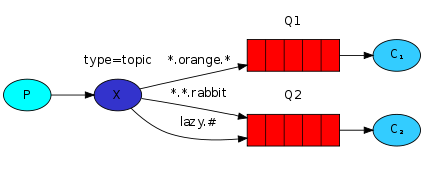

所有消息都是`<speed>.<colour>.<species>`格式的，分别代表速度、颜色、物种。队列Q1的binding key是`*.orange.*`，队列Q2的binding key是`*.*.rabbit`和`lazy.#`。

- 带有`quick.orange.rabbit`和`lazy.orange.elephant`的routing key的消息会转发到Q1和Q2。
- 带有`quick.orange.fox` routing key的消息只会转发到Q1。
- `lazy.brown.fox` 只会转发到Q2。
- `lazy.pink.rabbit`只会转发到Q2一次，虽然它同时命中了2个binding key，但还是只会转发1次。
- `quick.brown.fox`会被Exchange忽视，不转发给任何队列。
- **只传一个单词**`orange`或者四个单词`quick.orange.male.rabbit`，**会被Exchange忽视**。
- 四个单词`lazy.orange.male.rabbit`，只转发给Q2。

`topic`类型的Exchange是很灵活的，如果binding key设置为`#`，那么它就相当于`fanout`类型，转发所有消息。如果binding key里面不包含`*`或者`#`，那么它就相当于`direct`类型，转发指定消息。

### 完整代码

`EmitLogTopic.java`

https://github.com/rabbitmq/rabbitmq-tutorials/blob/master/java/EmitLogTopic.java

```java
import com.rabbitmq.client.Channel;
import com.rabbitmq.client.Connection;
import com.rabbitmq.client.ConnectionFactory;

public class EmitLogTopic {

  private static final String EXCHANGE_NAME = "topic_logs";

  public static void main(String[] argv) throws Exception {
    ConnectionFactory factory = new ConnectionFactory();
    factory.setHost("localhost");
    try (Connection connection = factory.newConnection();
         Channel channel = connection.createChannel()) {

        channel.exchangeDeclare(EXCHANGE_NAME, "topic");

        String routingKey = getRouting(argv);
        String message = getMessage(argv);

        channel.basicPublish(EXCHANGE_NAME, routingKey, null, message.getBytes("UTF-8"));
        System.out.println(" [x] Sent '" + routingKey + "':'" + message + "'");
    }
  }
  //..
}
```

`ReceiveLogsTopic.java`

https://github.com/rabbitmq/rabbitmq-tutorials/blob/master/java/ReceiveLogsTopic.java

```java
import com.rabbitmq.client.Channel;
import com.rabbitmq.client.Connection;
import com.rabbitmq.client.ConnectionFactory;
import com.rabbitmq.client.DeliverCallback;

public class ReceiveLogsTopic {

  private static final String EXCHANGE_NAME = "topic_logs";

  public static void main(String[] argv) throws Exception {
    ConnectionFactory factory = new ConnectionFactory();
    factory.setHost("localhost");
    Connection connection = factory.newConnection();
    Channel channel = connection.createChannel();

    channel.exchangeDeclare(EXCHANGE_NAME, "topic");
    String queueName = channel.queueDeclare().getQueue();

    if (argv.length < 1) {
        System.err.println("Usage: ReceiveLogsTopic [binding_key]...");
        System.exit(1);
    }

    for (String bindingKey : argv) {
        channel.queueBind(queueName, EXCHANGE_NAME, bindingKey);
    }

    System.out.println(" [*] Waiting for messages. To exit press CTRL+C");

    DeliverCallback deliverCallback = (consumerTag, delivery) -> {
        String message = new String(delivery.getBody(), "UTF-8");
        System.out.println(" [x] Received '" +
            delivery.getEnvelope().getRoutingKey() + "':'" + message + "'");
    };
    channel.basicConsume(queueName, true, deliverCallback, consumerTag -> { });
  }
}
```

topic的格式是`<facility>.<severity>`。

### 运行效果

编译：

```shell
javac -cp $CP ReceiveLogsTopic.java EmitLogTopic.java
```

接收所有日志：

```shell
java -cp $CP ReceiveLogsTopic "#"
```

只接收来源于kern的日志：

```java
java -cp $CP ReceiveLogsTopic "kern.*"
```

只接收critical严重级别的日志：

```shell
java -cp $CP ReceiveLogsTopic "*.critical"
```

也可以多重绑定：

```shell
java -cp $CP ReceiveLogsTopic "kern.*" "*.critical"
```

发送日志消息：

```shell
java -cp $CP EmitLogTopic "kern.critical" "A critical kernel error"
```

## RPC

RPC是Remote Procedure Call的缩写，远程过程调用，比如在远程机器中执行函数，并拿到返回结果。RabbitMQ能用来实现RPC服务。接下来就简单实现一个调用生成斐波那契数列的RPC服务。

整体设计如图所示：


Client发送RPC请求到rpc_queue里面，然后阻塞，等待返回。在请求中会指定一个回调队列的地址，通过reply_to来指定。Server从rpc_queue读取消息进行处理，根据reply_to把响应放到回调队列中。请求中还设置了一个correlation_id，Client在收到响应时，根据这个关联id来匹配，匹配上的消息才进行接收。

> correlation_id匹配不上的消息会忽略，为什么是忽略而不是抛出异常呢？因为RPC Server有可能发返回ack确认前就宕机，当它重启以后，会重新处理请求消息，从而导致消息重复处理。对于RPC来说最好是能够让重复场景是幂等的。

### 代码实现

`RPCServer.java`

https://github.com/rabbitmq/rabbitmq-tutorials/blob/master/java/RPCServer.java

```java
import com.rabbitmq.client.*;

public class RPCServer {

    private static final String RPC_QUEUE_NAME = "rpc_queue";

    private static int fib(int n) {
        if (n == 0) return 0;
        if (n == 1) return 1;
        return fib(n - 1) + fib(n - 2);
    }

    public static void main(String[] argv) throws Exception {
        ConnectionFactory factory = new ConnectionFactory();
        factory.setHost("localhost");

        try (Connection connection = factory.newConnection();
             Channel channel = connection.createChannel()) {
            channel.queueDeclare(RPC_QUEUE_NAME, false, false, false, null);
            channel.queuePurge(RPC_QUEUE_NAME);

            //设置n个Server进程
            channel.basicQos(1);

            System.out.println(" [x] Awaiting RPC requests");

            Object monitor = new Object();
            DeliverCallback deliverCallback = (consumerTag, delivery) -> {
                AMQP.BasicProperties replyProps = new AMQP.BasicProperties
                        .Builder()
                        .correlationId(delivery.getProperties().getCorrelationId())
                        .build();

                String response = "";

                try {
                    String message = new String(delivery.getBody(), "UTF-8");
                    int n = Integer.parseInt(message);

                    System.out.println(" [.] fib(" + message + ")");
                    response += fib(n);
                } catch (RuntimeException e) {
                    System.out.println(" [.] " + e.toString());
                } finally {
                    channel.basicPublish("", delivery.getProperties().getReplyTo(), replyProps, response.getBytes("UTF-8"));
                    channel.basicAck(delivery.getEnvelope().getDeliveryTag(), false);
                    // RabbitMq consumer worker thread notifies the RPC server owner thread
                    synchronized (monitor) {
                        monitor.notify();
                    }
                }
            };

            channel.basicConsume(RPC_QUEUE_NAME, false, deliverCallback, (consumerTag -> { }));
            // Wait and be prepared to consume the message from RPC client.
            while (true) {
                synchronized (monitor) {
                    try {
                        monitor.wait();
                    } catch (InterruptedException e) {
                        e.printStackTrace();
                    }
                }
            }
        }
    }
}
```

`RPCClient.java`

https://github.com/rabbitmq/rabbitmq-tutorials/blob/master/java/RPCClient.java

```java
import com.rabbitmq.client.AMQP;
import com.rabbitmq.client.Channel;
import com.rabbitmq.client.Connection;
import com.rabbitmq.client.ConnectionFactory;

import java.io.IOException;
import java.util.UUID;
import java.util.concurrent.ArrayBlockingQueue;
import java.util.concurrent.BlockingQueue;
import java.util.concurrent.TimeoutException;

public class RPCClient implements AutoCloseable {

    private Connection connection;
    private Channel channel;
    private String requestQueueName = "rpc_queue";

    public RPCClient() throws IOException, TimeoutException {
        ConnectionFactory factory = new ConnectionFactory();
        factory.setHost("localhost");

        connection = factory.newConnection();
        channel = connection.createChannel();
    }

    public static void main(String[] argv) {
        try (RPCClient fibonacciRpc = new RPCClient()) {
            for (int i = 0; i < 32; i++) {
                String i_str = Integer.toString(i);
                System.out.println(" [x] Requesting fib(" + i_str + ")");
                String response = fibonacciRpc.call(i_str);
                System.out.println(" [.] Got '" + response + "'");
            }
        } catch (IOException | TimeoutException | InterruptedException e) {
            e.printStackTrace();
        }
    }

    public String call(String message) throws IOException, InterruptedException {
        final String corrId = UUID.randomUUID().toString();

        String replyQueueName = channel.queueDeclare().getQueue();
        AMQP.BasicProperties props = new AMQP.BasicProperties
                .Builder()
                .correlationId(corrId)
                .replyTo(replyQueueName)
                .build();

        channel.basicPublish("", requestQueueName, props, message.getBytes("UTF-8"));

        //在响应到达前挂起main阻塞等待，1表示只等待1个响应
        final BlockingQueue<String> response = new ArrayBlockingQueue<>(1);

        String ctag = channel.basicConsume(replyQueueName, true, (consumerTag, delivery) -> {
            if (delivery.getProperties().getCorrelationId().equals(corrId)) {
                response.offer(new String(delivery.getBody(), "UTF-8"));
            }
        }, consumerTag -> {
        });

        String result = response.take();
        channel.basicCancel(ctag);
        return result;
    }

    public void close() throws IOException {
        connection.close();
    }
}
```

### 运行效果

编译：

```shell
javac -cp $CP RPCClient.java RPCServer.java
```

启动Server：

```shell
java -cp $CP RPCServer
## => [x] Awaiting RPC requests
```

运行Client：

```shell
java -cp $CP RPCClient
## => [x] Requesting fib(30)
```

如果Server处理慢，那么可以再在控制台启动新的Server来消费。

**注意，本文的示例都只是为了演示而编写的，不是真正意义上的实现。**

对于可靠的消息确认，RabbitMQ提供了一个扩展，感兴趣的话可以阅读：

https://www.rabbitmq.com/tutorials/tutorial-seven-java.html

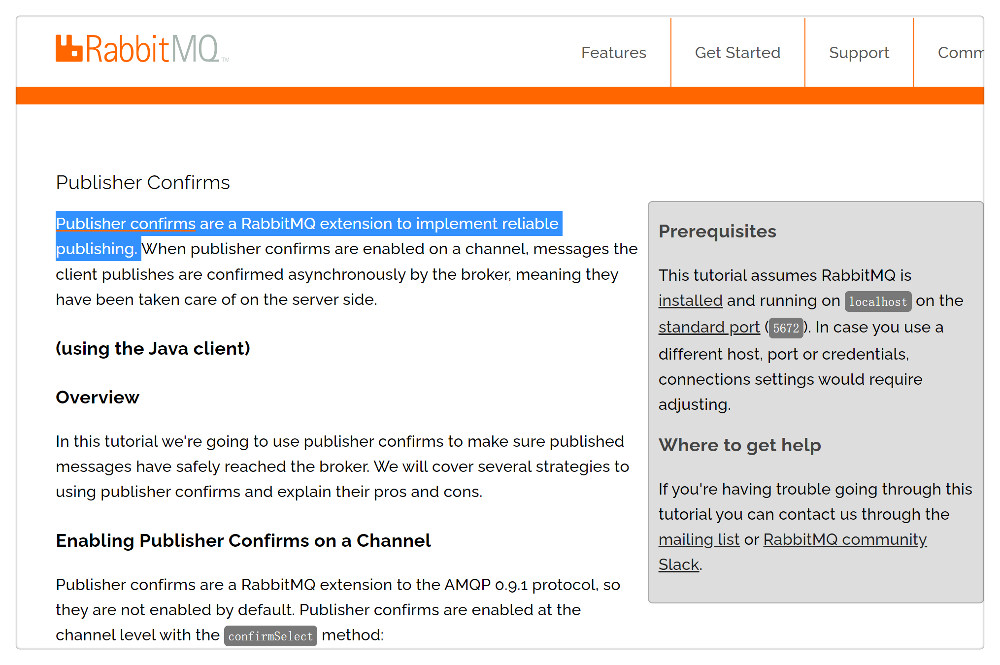

> 参考资料：
>
> https://www.rabbitmq.com/getstarted.html
>