# java+appium+安卓模拟器实现app自动化Demo


## 环境搭建

据说，很多人都被繁琐的环境搭建给吓到了。

是的，确实，繁琐。

### node.js

下载地址：

https://nodejs.org/en/download/

cmd 输入 node -v，出现下图说明成功：


### JDK

下载地址：

https://www.oracle.com/technetwork/java/javase/downloads/jdk8-downloads-2133151.html

百度一下“配置Java”，配置环境变量。

cmd 输入 java -version，出现下图说明成功：


### Android SDK

下载地址：

https://www.androiddevtools.cn/


百度一下"配置Android SDK环境变量"。

cmd 输入 adb，出现下图说明成功：


### Appium Desktop

下载地址：

https://github.com/appium/appium-desktop/releases

或

https://testerhome.com/topics/680

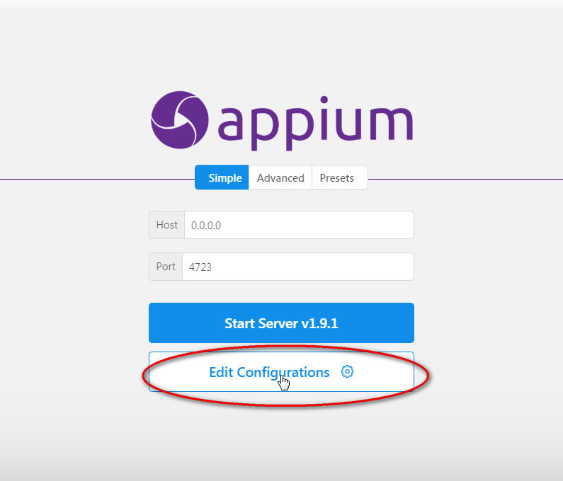

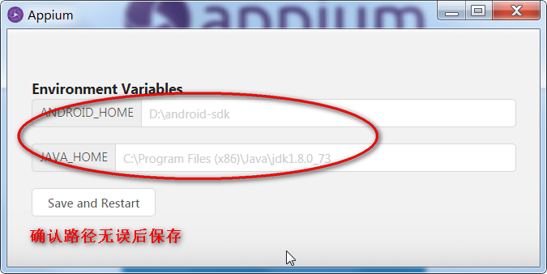

### Maven

下载地址：

http://maven.apache.org/download.cgi

百度一下“ maven环境配置”。

cmd 输入 mvn -version，出现下图说明成功：


### IntelliJ IDEA

下载地址：

http://www.jetbrains.com/idea/

### 安卓模拟器

下载地址：

https://www.yeshen.com/

把 Android SDK 目录下 `\platform-tool` 的 adb.exe 拷贝。

打开 `Nox\bin` 目录，粘贴替换 adb.exe。

打开模拟器。

cmd 输入 `adb connect 127.0.0.1:62001`，如下：


再输入 `adb devices`，如下


### 有道计算器

下载地址：

http://math.youdao.com/

下载后，apk 文件存放在某目录下即可。

将 apk 文件直接拖入安卓模拟器中：

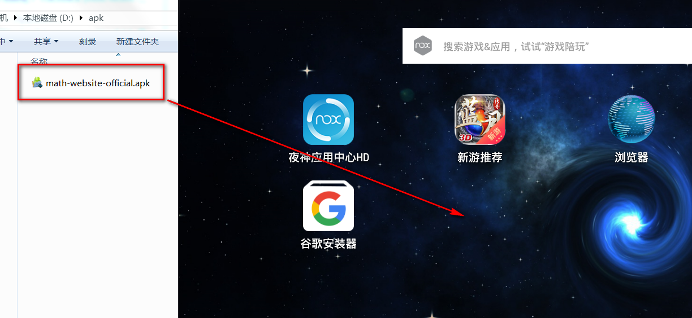


**至此，环境搭建完毕，共安装了8个程序。**

## 实现步骤

打开 IntelliJ。

创建 maven 项目：

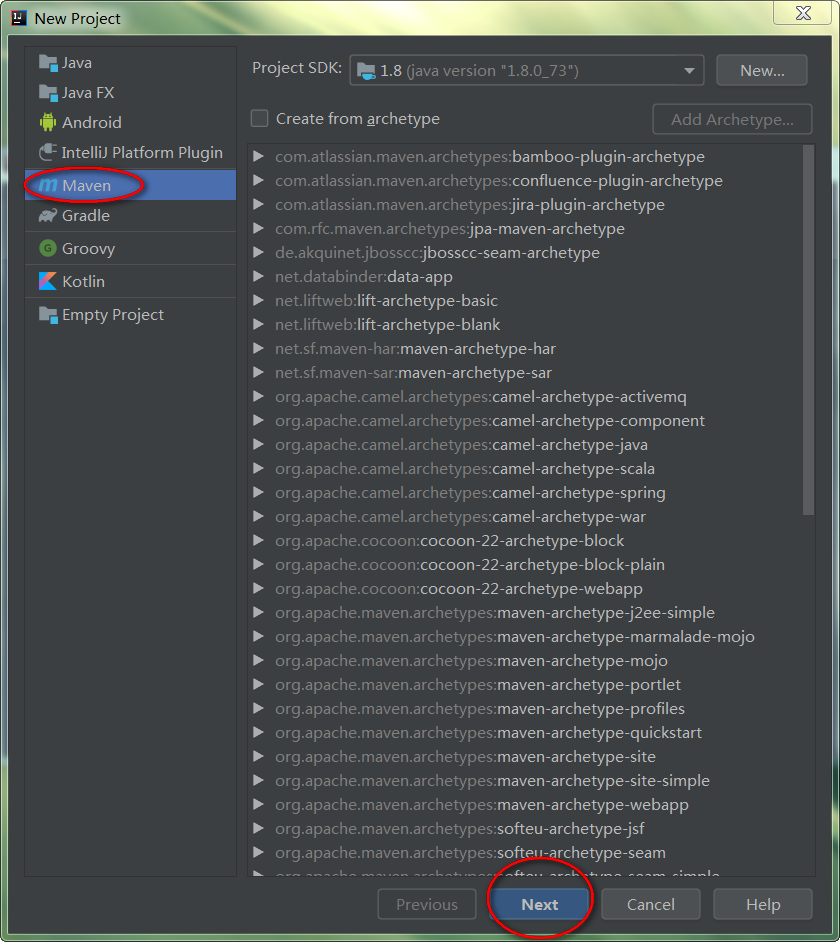

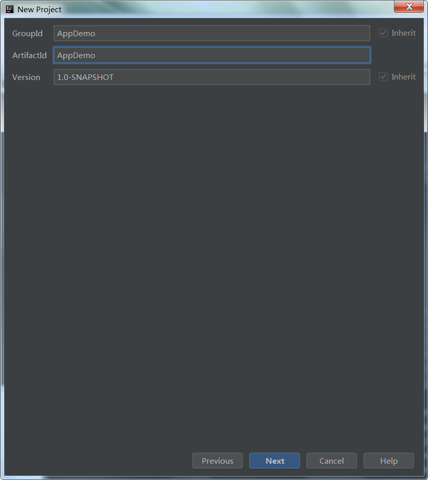

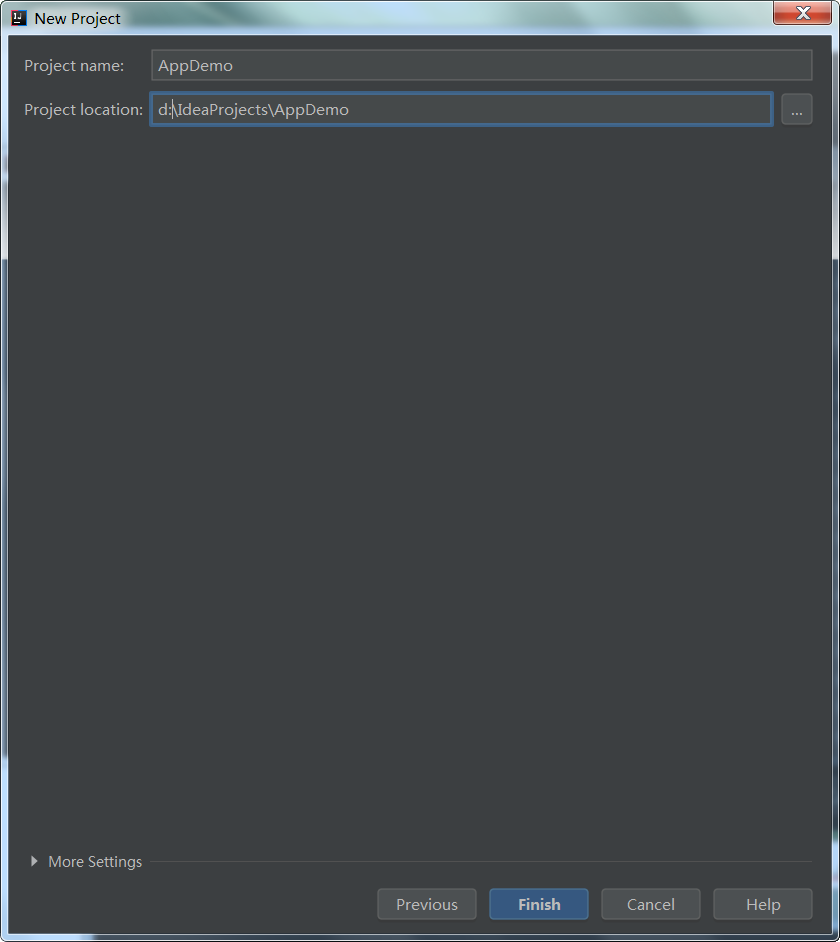


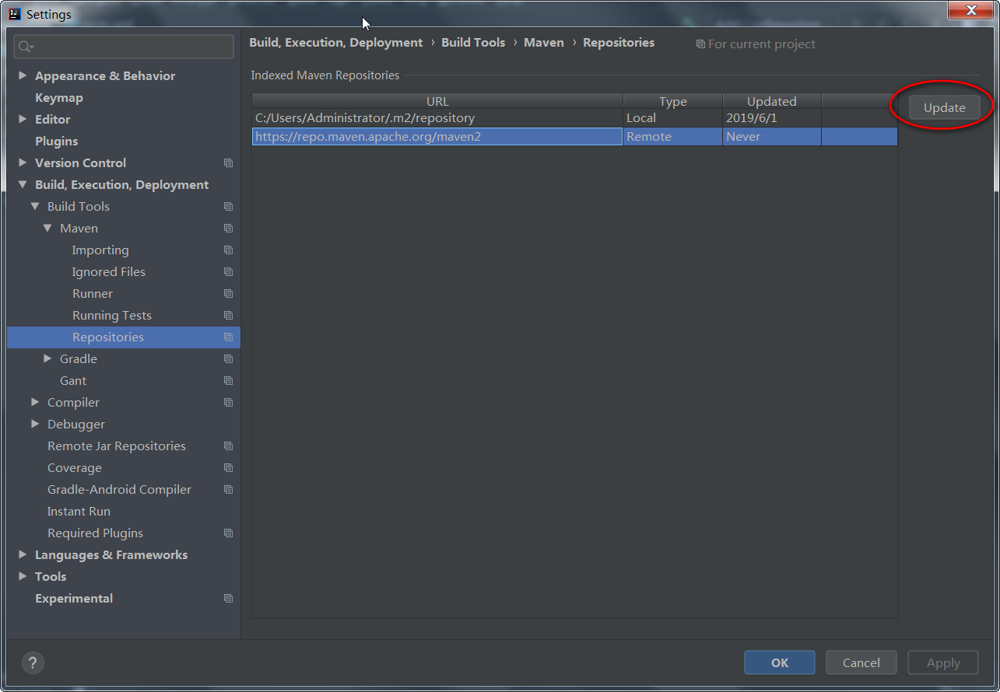

点击 ok 后，复制下面代码到 pom.xm 中：

```xml
  <dependencies>
        <dependency>
            <groupId>io.appium</groupId>
            <artifactId>java-client</artifactId>
            <version>4.1.2</version>
        </dependency>
        <dependency>
            <groupId>org.testng</groupId>
            <artifactId>testng</artifactId>
            <version>6.14.2</version>
        </dependency>
    </dependencies>
```

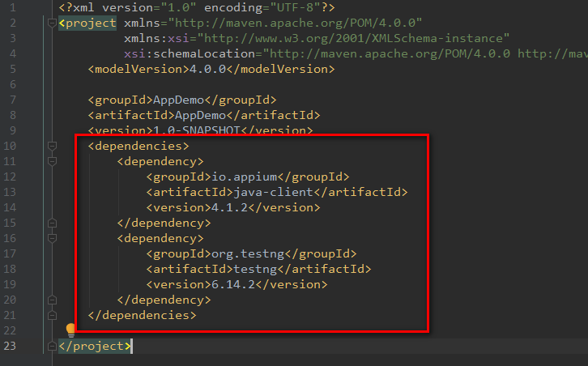

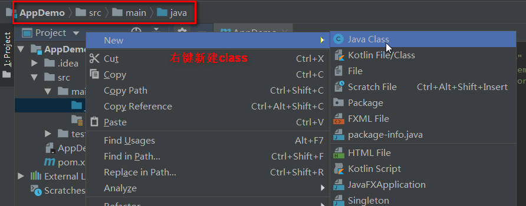
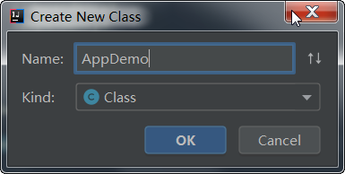


复制粘贴下面代码：

```java
import org.testng.annotations.Test;
import org.testng.annotations.BeforeClass;
import org.testng.annotations.AfterClass;

import io.appium.java_client.AppiumDriver;
import io.appium.java_client.android.AndroidDriver;

import java.net.URL;

import org.openqa.selenium.remote.CapabilityType;
import org.openqa.selenium.remote.DesiredCapabilities;

public class AppDemo {
    private AppiumDriver driver;

    @BeforeClass
    public void setup() throws Exception {
        DesiredCapabilities cap = new DesiredCapabilities();
        cap.setCapability(CapabilityType.BROWSER_NAME, "");
        cap.setCapability("platformName", "Android"); //指定测试平台
        cap.setCapability("deviceName", "127.0.0.1:62001"); //指定测试机的ID,通过adb命令`adb devices`获取
        cap.setCapability("platformVersion", "5.1.1");

        //将上面获取到的包名和Activity名设置为值
        cap.setCapability("appPackage", "com.youdao.calculator");
        cap.setCapability("appActivity", "com.youdao.calculator.activities.MainActivity");

//        //A new session could not be created的解决方法
//        cap.setCapability("appWaitActivity", "com.meizu.flyme.calculator.Calculator");
//        //每次启动时覆盖session，否则第二次后运行会报错不能新建session
//        cap.setCapability("sessionOverride", true);

        driver = new AndroidDriver(new URL("http://127.0.0.1:4723/wd/hub"), cap);
    }

    @Test
    public void plus() throws Exception {
        Thread.sleep(3000);
        int width = driver.manage().window().getSize().width;
        int height = driver.manage().window().getSize().height;
        int x0 = (int)(width * 0.8);  // 起始x坐标
        int x1 = (int)(height * 0.2);  // 终止x坐标
        int y = (int)(height * 0.5);  // y坐标
        for (int i=0; i<5; i++) {
            driver.swipe(x0, y, x1, y, 500);
            Thread.sleep(1000);
        }

        driver.findElementById("com.youdao.calculator:id/guide_button").click();
        for (int i=0; i<6; i++) {
            driver.findElementByXPath("//android.webkit.WebView[@text='Mathbot Editor']").click();
            Thread.sleep(1000);
        }

        String btn_xpath = "//*[@resource-id='com.youdao.calculator:id/view_pager_keyboard']/android.widget.GridView/android.widget.FrameLayout[%d]/android.widget.FrameLayout";
        driver.findElementByXPath(String.format(btn_xpath, 7)).click();
        driver.findElementByXPath(String.format(btn_xpath, 10)).click();
        driver.findElementByXPath(String.format(btn_xpath, 8)).click();
        Thread.sleep(3000);


    }

    @AfterClass
    public void tearDown() throws Exception {

        driver.quit();

    }
}

```

文件右键 run：

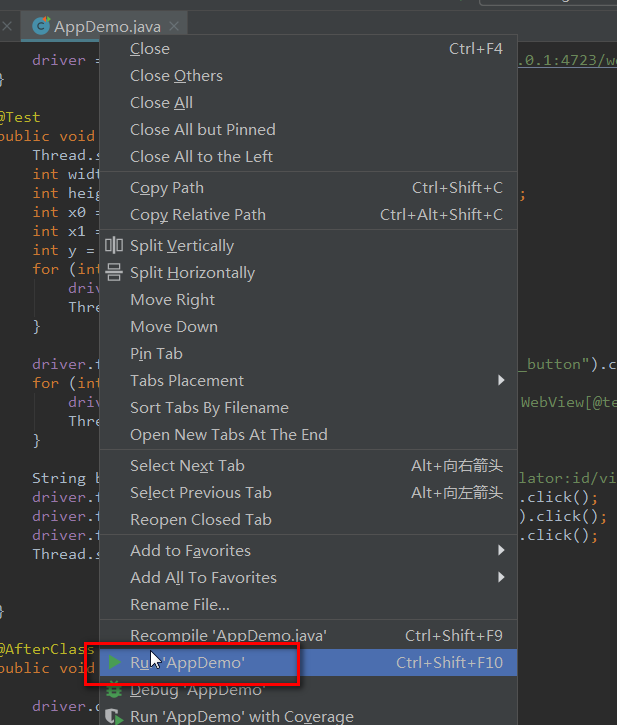

然后可以看到脚本在跑了，

打开安卓模拟器，

一会就看到，

计算器 app 在自己动了！
