java+appium+安卓模拟器实现app自动化Demo
=======================================

|image1|

环境搭建
--------

据说，很多人都被繁琐的环境搭建给吓到了。

是的，确实，繁琐。

node.js
~~~~~~~

下载地址：

https://nodejs.org/en/download/

cmd 输入 node -v，出现下图说明成功：

|image2|

JDK
~~~

下载地址：

https://www.oracle.com/technetwork/java/javase/downloads/jdk8-downloads-2133151.html

百度一下“配置Java”，配置环境变量。

cmd 输入 java -version，出现下图说明成功：

|image3|

Android SDK
~~~~~~~~~~~

下载地址：

https://www.androiddevtools.cn/

|image4|

|image5|

百度一下“配置Android SDK环境变量”。

cmd 输入 adb，出现下图说明成功：

|image6|

Appium Desktop
~~~~~~~~~~~~~~

下载地址：

https://github.com/appium/appium-desktop/releases

或

https://testerhome.com/topics/680

|image7|

|image8|

Maven
~~~~~

下载地址：

http://maven.apache.org/download.cgi

百度一下“ maven环境配置”。

cmd 输入 mvn -version，出现下图说明成功：

|image9|

IntelliJ IDEA
~~~~~~~~~~~~~

下载地址：

http://www.jetbrains.com/idea/

安卓模拟器
~~~~~~~~~~

下载地址：

https://www.yeshen.com/

把 Android SDK 目录下 ``\platform-tool`` 的 adb.exe 拷贝。

打开 ``Nox\bin`` 目录，粘贴替换 adb.exe。

打开模拟器。

cmd 输入 ``adb connect 127.0.0.1:62001``\ ，如下：

|image10|

再输入 ``adb devices``\ ，如下

|image11|

有道计算器
~~~~~~~~~~

下载地址：

http://math.youdao.com/

下载后，apk 文件存放在某目录下即可。

将 apk 文件直接拖入安卓模拟器中：

|image12|

|image13|

**至此，环境搭建完毕，共安装了8个程序。**

实现步骤
--------

打开 IntelliJ。

创建 maven 项目：

|image14|

|image15|

|image16|

|image17|

|image18|

点击 ok 后，复制下面代码到 pom.xm 中：

.. code:: xml

     <dependencies>
           <dependency>
               <groupId>io.appium</groupId>
               <artifactId>java-client</artifactId>
               <version>4.1.2</version>
           </dependency>
           <dependency>
               <groupId>org.testng</groupId>
               <artifactId>testng</artifactId>
               <version>6.14.2</version>
           </dependency>
       </dependencies>

|image19|

|image20| |image21|

|image22|

复制粘贴下面代码：

.. code:: java

   import org.testng.annotations.Test;
   import org.testng.annotations.BeforeClass;
   import org.testng.annotations.AfterClass;

   import io.appium.java_client.AppiumDriver;
   import io.appium.java_client.android.AndroidDriver;

   import java.net.URL;

   import org.openqa.selenium.remote.CapabilityType;
   import org.openqa.selenium.remote.DesiredCapabilities;

   public class AppDemo {
       private AppiumDriver driver;

       @BeforeClass
       public void setup() throws Exception {
           DesiredCapabilities cap = new DesiredCapabilities();
           cap.setCapability(CapabilityType.BROWSER_NAME, "");
           cap.setCapability("platformName", "Android"); //指定测试平台
           cap.setCapability("deviceName", "127.0.0.1:62001"); //指定测试机的ID,通过adb命令`adb devices`获取
           cap.setCapability("platformVersion", "5.1.1");

           //将上面获取到的包名和Activity名设置为值
           cap.setCapability("appPackage", "com.youdao.calculator");
           cap.setCapability("appActivity", "com.youdao.calculator.activities.MainActivity");

   //        //A new session could not be created的解决方法
   //        cap.setCapability("appWaitActivity", "com.meizu.flyme.calculator.Calculator");
   //        //每次启动时覆盖session，否则第二次后运行会报错不能新建session
   //        cap.setCapability("sessionOverride", true);

           driver = new AndroidDriver(new URL("http://127.0.0.1:4723/wd/hub"), cap);
       }

       @Test
       public void plus() throws Exception {
           Thread.sleep(3000);
           int width = driver.manage().window().getSize().width;
           int height = driver.manage().window().getSize().height;
           int x0 = (int)(width * 0.8);  // 起始x坐标
           int x1 = (int)(height * 0.2);  // 终止x坐标
           int y = (int)(height * 0.5);  // y坐标
           for (int i=0; i<5; i++) {
               driver.swipe(x0, y, x1, y, 500);
               Thread.sleep(1000);
           }

           driver.findElementById("com.youdao.calculator:id/guide_button").click();
           for (int i=0; i<6; i++) {
               driver.findElementByXPath("//android.webkit.WebView[@text='Mathbot Editor']").click();
               Thread.sleep(1000);
           }

           String btn_xpath = "//*[@resource-id='com.youdao.calculator:id/view_pager_keyboard']/android.widget.GridView/android.widget.FrameLayout[%d]/android.widget.FrameLayout";
           driver.findElementByXPath(String.format(btn_xpath, 7)).click();
           driver.findElementByXPath(String.format(btn_xpath, 10)).click();
           driver.findElementByXPath(String.format(btn_xpath, 8)).click();
           Thread.sleep(3000);

       }

       @AfterClass
       public void tearDown() throws Exception {

           driver.quit();

       }
   }

文件右键 run：

|image23|

然后可以看到脚本在跑了，

打开安卓模拟器，

一会就看到，

计算器 app 在自己动了！

.. |image1| image:: ../wanggang.png

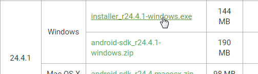
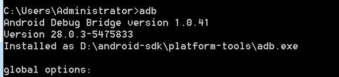
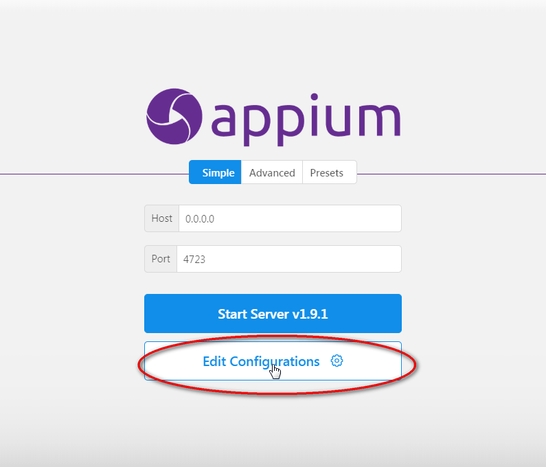
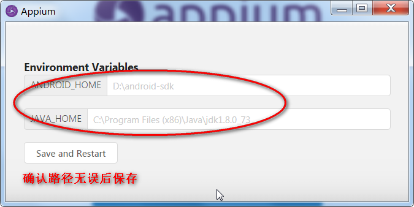
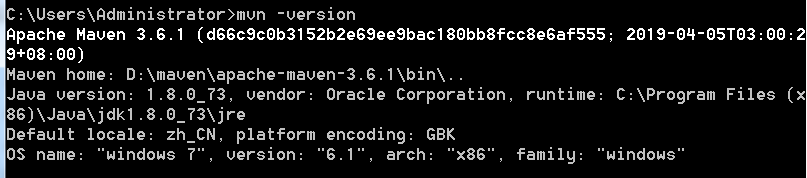
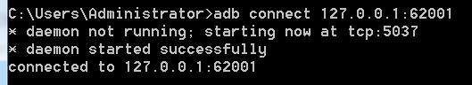
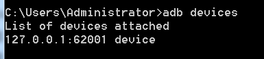
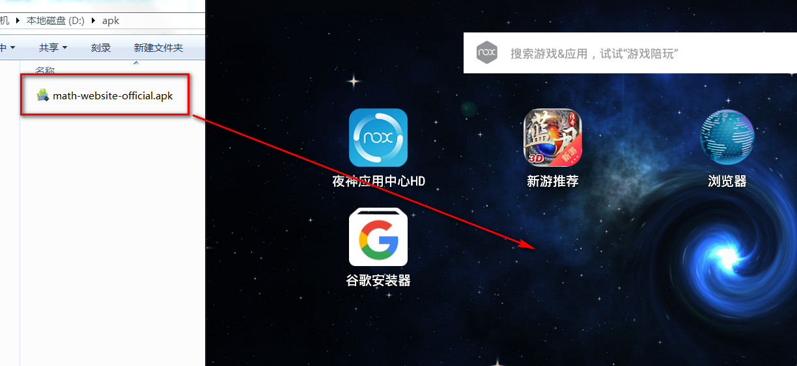
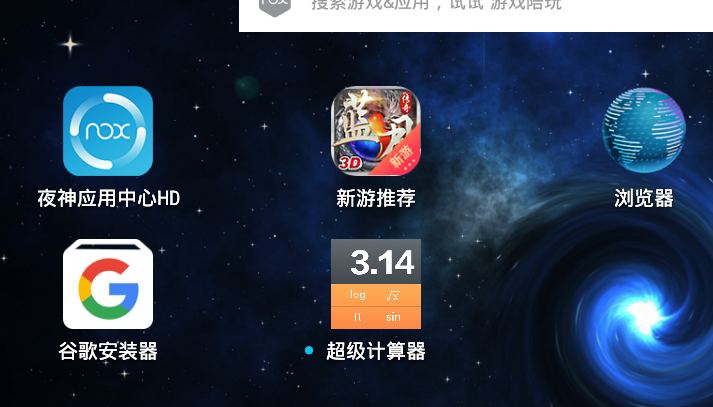
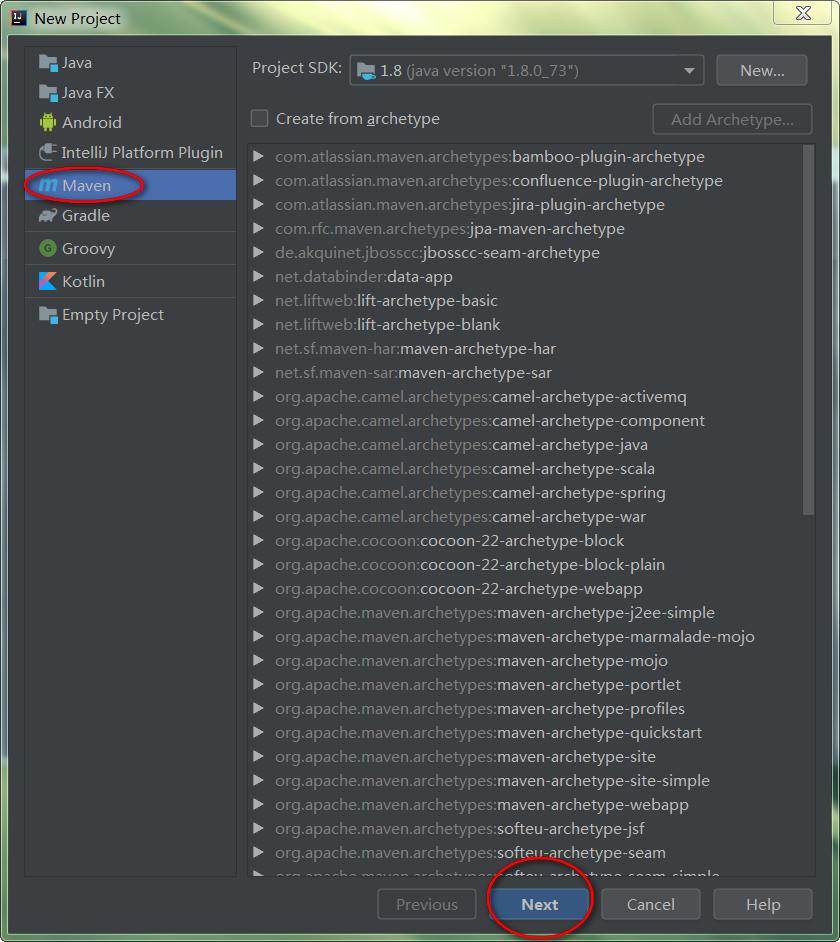
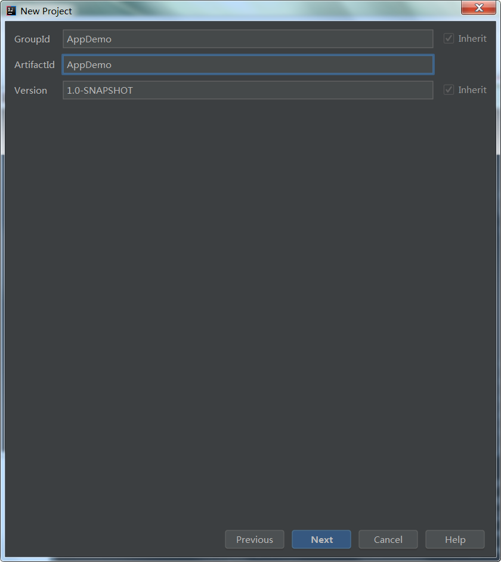
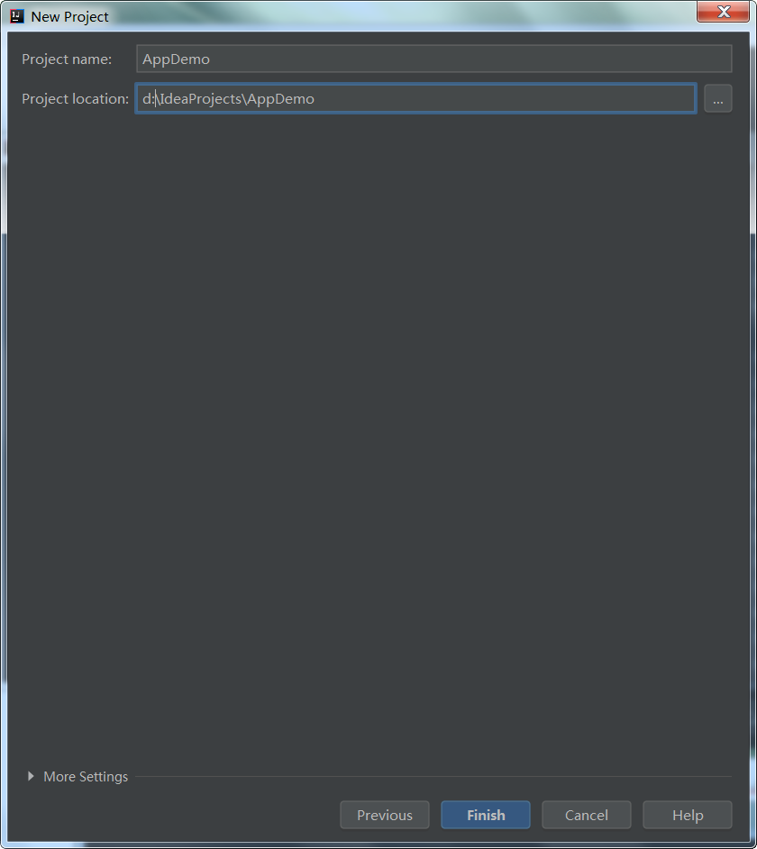

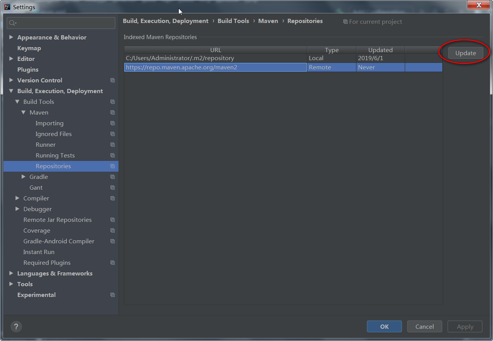
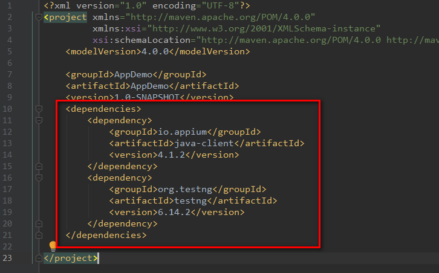
.. |image20| image:: 000001-java+appium+安卓模拟器实现app自动化Demo/1559369209234.png
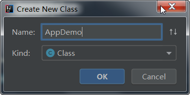

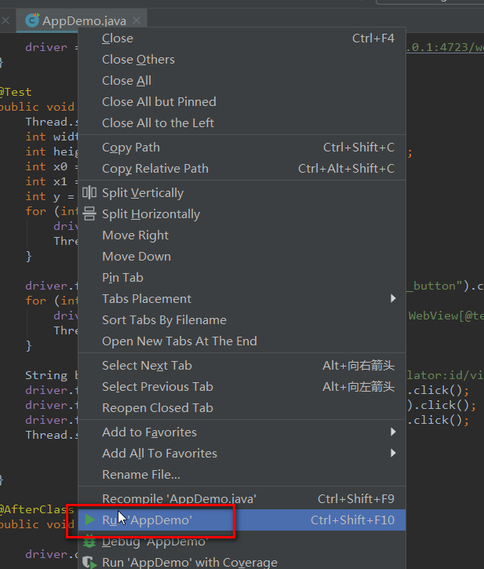
