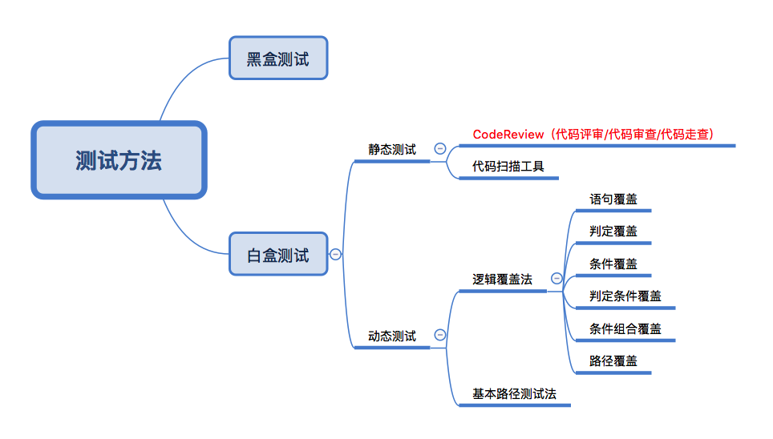

# CodeReview技巧和规范

## What-什么是CodeReview？

CodeReview，即代码评审，是白盒测试中，静态测试的一种方法，通过阅读代码，提出代码层面的缺陷。

## Why-为什么做CodeReview？

测试左移：在测试前就发现代码缺陷。

明确测试范围：根据需求文档和代码，对齐测试范围，防止研发夹带本次需求范围外的代码上线。

提升代码能力：学习研发优秀的编程技术。

深入原理：了解系统内部结构及实现。

发现隐藏缺陷：能发现某些极端场景下的问题或概率性问题。

减少测试研发周期占比：节省用例执行个数，尤其多个同类异常梳理，不用执行类似用例，CodeReview一行代码即可。

## Who-谁适合做CodeReview？

CodeReview需要三大门槛：

①熟悉编程语言，Java/Python/Go等。

②熟悉编程规范，《阿里巴巴XXX编码规范》、《华为XXX编码规范》、《京东XXX编码规范》。

③了解需求、架构和设计，需求文档/架构图/设计文档。

达到门槛才适合做CodeReview。

## When-什么时候做CodeReview？

提测前，通过Code Diff Review，自己走读代码或者参与研发代码评审会议均可，

发现功能缺陷时，通过走查代码定位代码原因，并分析是否有关联缺陷。

修复缺陷时，阅读研发commit记录，检查是否引入新缺陷。

上线前，通过merge范围检查是否有夹带代码，为了测试改动的临时代码是否恢复。

## Where-在哪里做CodeReview？

线上仓库（如Gitlab），适合于修改点单一，不需要查看上下文信息就能找到缺陷。直接在网页端评审代码且发表comment。

本地仓库（如IDEA），适合于修改点较多，需要查看上下文信息（变量或方法跳转到定义或使用之处）。在本地找到缺陷后在线上发表comment。

## How-CodeReview如何上手？

准备：了解需求、架构和设计；学习编程语言；学习代码规范；

实践：坚持CodeReview，记录缺陷，定期总结。如果看代码找缺陷比较困难，可以先从发现功能缺陷后，定位代码原因入手。

**常见CR缺陷：**

除数为0、整数溢出、精度损失；

可能死循环；

在finally程序块中关闭或者释放资源；

异常未处理或提示不明确（没有catch异常，集合等没有判空和长度为0）；

公式计算错误；

字符串对比不能用==，使用equals；

数组可能越界；

传递引用错误；

类型转换错误；

条件范围选择错误；

**重点检查项：**

一致性检查：是否需求相关；是否和方案设计一致；代码风格、日志规范、异常处理等是否和统一规范一致；

完整性检查：服务层是否包含了所有业务功能；数据层是否包含所有需要的数据和操作；

正确性检查：计算逻辑等业务逻辑是否正确；变量是否被正确定义和使用；代码是否符合制定的标准；

可修改性检查：代码涉及到常量是否易于修改，比如使用配置，定义为常量类等；建议业务方法只有一个出口和一个入口（异常处理除外）；重要公共方法是否有交叉注释说明；重要的对外方法修改后影响多个下游接口；

可预测性检查：变量初始化；方法稳定性；代码是否存在死循环；代码无穷递归检查；

健壮性检查：代码是否采取措施避免运行时错误（如数组边界溢出、被零除、值越界、堆栈溢出等）

高可用性检查：是否有预案（降级开发、限流配置、兜底策略）；补偿方案是否合理；

结构性检查：程序的每个功能是否都作为一个可辨识的代码块存在；

可理解性检查：是否使用到不明确或不必要的复杂代码；代码中的算法是否符合开发文档中描述的数学模型；每个变量都定义了合法的取值范围；

可验证性检查：代码功能是否便于测试；单元测试覆盖度是否足够；

可追溯性检查：代码是否包括一个修订历史记录，记录中对代码的修改和原因都有记录；

**编码规范：**

《阿里巴巴Java开发手册》

最新版本：黄山版（2022.2.3发布）

https://github.com/alibaba/p3c

