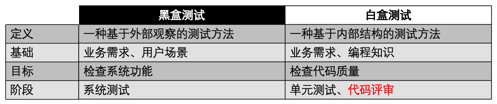
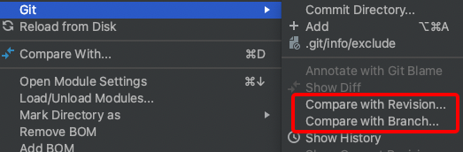

代码评审，揭示黑盒背后的真相
============================

|image1|

一、引言
--------

黑盒测试犹如案发现场，只能根据表象推断事件经过。

代码评审即深入调查，挖掘蛛丝马迹的线索，揭示背后的真相。

“They think I am hiding in the shadows, but I am the shadows.”

|image2|

二、黑盒测试与白盒测试的区别
----------------------------

|image3|

黑盒测试存在一些局限性：

-  可能无法发现与系统实现相关的问题

-  可能无法覆盖所有的测试场景

-  测试效率较低，比如准备物料、模拟场景

-  强依赖需求文档，如果文档不全，测试会漏

对于测试人员来说，可以在代码评审阶段，通过白盒测试改进测试的质量和效率。

三、代码评审的定义和意义
------------------------

代码评审，Code Review（CR），是一种通过检查代码来提高代码质量的过程。

对于测试人员来说，参与代码评审，可以尽量提前发现问题，减少修复代价，提高效能。

四、代码评审的形式
------------------

**多人讨论**

组织会议，研发牵头讲解代码，架构和测试参与，讨论交流。这是最普遍的一种形式。

**Code Diff**

查看Code Diff，可以借助Gitlab或IDEA，比较分支差异或版本差异。

|image4|

对比时机：

-  提测前和测试中，自行走查代码

-  发现缺陷，定位代码原因

-  修复缺陷后，评估影响范围

-  上线前，是否夹带代码

**精准测试**

评估测试用例的代码覆盖率，查漏补缺，Jacoco的on-the-fly模式支持动态收集代码覆盖率数据。

五、代码评审的方法
------------------

面向业务，面向业务，面向业务。重要的事情说三遍。

刚开始做代码评审，很容易把注意力集中在找代码规范问题上面，比如命名不规范、注释不清楚、代码实现冗长等。这些问题不是测试人员关注的重点，需要由研发团队或代码扫描工具来解决。

在做Code
Diff时，也没必要把每个文件、每行代码的意思搞懂，比如研发对代码结构做了调整，在diff时要梳理清楚的话，ROI会非常低，因为既消耗时间，又发现不了问题。

**那该怎么做代码评审呢？** 关注业务：

1. 跟需求文档比较，哪些需求是遗漏的，哪些代码是补充的，哪些代码是夹带的

2. 关注核心业务代码逻辑，使用条件覆盖、路径覆盖等方法设计测试用例

3. 优化测试用例，针对代码实现考虑异常、边界、幂等、并发等场景

代码评审要求测试人员具备代码能力，理解编程语言，掌握软件设计，熟悉代码结构和架构，多与开发同学交流，共同优化代码质量。

六、代码评审的实际案例
----------------------

1、空指针异常

.. code:: java

   import org.mybatis.spring.SqlSessionTemplate;
   import org.springframework.beans.factory.annotation.Autowired;
   import org.springframework.stereotype.Service;

   @Service
   public class UserService {

       private final SqlSessionTemplate sqlSessionTemplate;
       
       @Autowired
       public UserService(SqlSessionTemplate sqlSessionTemplate) {
           this.sqlSessionTemplate = sqlSessionTemplate;
       }
       
       public void getUserById(String userId) {
           User user = sqlSessionTemplate.selectOne("com.example.mapper.UserMapper.getUserById", userId);
           System.out.println(user.getName()); // 可能导致空指针异常
       }
   }

如果取到的 ``user`` 对象为空，就会导致空指针异常。

2、String类型判空用StringUtils.isBlank()，Collection类判空用CollectionUtils.isEmpty()

.. code:: java

   import org.apache.commons.lang3.StringUtils;

   public class ExampleStringUtils {

       public static void main(String[] args) {
           String str1 = "";
           String str2 = null;
           String str3 = "   ";

           if (StringUtils.isBlank(str1)) {
               System.out.println("str1 is blank or null");
           }

           if (StringUtils.isBlank(str2)) {
               System.out.println("str2 is blank or null");
           }

           if (StringUtils.isBlank(str3)) {
               System.out.println("str3 is blank or null");
           }
       }
   }

.. code:: java

   import org.apache.commons.collections4.CollectionUtils;

   import java.util.ArrayList;
   import java.util.List;

   public class ExampleCollectionUtils {

       public static void main(String[] args) {
           List<String> list1 = new ArrayList<>();
           List<String> list2 = null;

           if (CollectionUtils.isEmpty(list1)) {
               System.out.println("list1 is empty or null");
           }

           if (CollectionUtils.isEmpty(list2)) {
               System.out.println("list2 is empty or null");
           }
       }
   }

3、写操作的事务一致性

.. code:: java

   @Service
   public class UserService {

       private final UserMapper userMapper;
       private final AccountMapper accountMapper;

       // 省略构造方法

       public void addUserAndDeductBalance(User user, double amount) {
           try {
               userMapper.insertUser(user); // 插入用户信息
               accountMapper.deductBalance(user.getAccountId(), amount); // 扣除账户余额

               // 其他写操作...
           } catch (Exception e) {
               // 处理异常
           }
       }
   }

没有使用
``@Transactional``\ ，不会进行事务管理和回滚，如果执行\ ``accountMapper.deductBalance()``\ 时异常，那么已经执行的
``userMapper.insertUser()``
操作无法回滚，用户信息被插入但账户余额未扣除，导致数据的不一致性。

4、根据判断条件补充用例

.. code:: java

   public class ECommerceSystem {
       public static void main(String[] args) {
           String productCategory = "electronics";
           float productPrice = 999.99f;
           int userPoints = 100;

           if ("electronics".equals(productCategory)) {
               if (productPrice > 1000) {
                   if (userPoints > 50) {
                       applyDiscount(0.2f);
                   } else {
                       applyDiscount(0.1f);
                   }
               } else {
                   if (userPoints > 100) {
                       applyDiscount(0.15f);
                   } else {
                       applyDiscount(0.05f);
                   }
               }
           } else if ("clothing".equals(productCategory)) {
               if (productPrice > 500) {
                   if (userPoints > 100) {
                       applyDiscount(0.3f);
                   } else {
                       applyDiscount(0.2f);
                   }
               } else {
                   if (userPoints > 50) {
                       applyDiscount(0.1f);
                   } else {
                       applyDiscount(0.05f);
                   }
               }
           } else {
               if (productPrice > 100) {
                   if (userPoints > 10) {
                       applyDiscount(0.1f);
                   } else {
                       applyDiscount(0.05f);
                   }
               }
           }
       }

       private static void applyDiscount(float discount) {
           System.out.println("Applying discount of " + discount * 100 + "%");
           // 执行折扣逻辑
       }
   }

复杂的判断条件，文档很可能描述不全所有场景，需要针对代码实现，补充测试用例。

5、代码放在不同位置，影响范围变小

.. code:: java

   public class ShoppingCart {
       private List<Product> products = new ArrayList<>();

       public void addToCart(Product product) {
           products.add(product);
           updateCartTotal();
       }

       public void removeFromCart(Product product) {
           products.remove(product);
           updateCartTotal();
       }

       private void updateCartTotal() {
           float total = 0;
           for (Product product : products) {
               total += product.getPrice();
           }
           System.out.println("Cart Total: " + total);
       }
   }

   public class Product {
       private String name;
       private float price;

       // constructor, getters and setters

       public float getPrice() {
           return price;
       }
   }

如果需要更改计算总金额的逻辑，只需修改 ``updateCartTotal()`` 方法即可，而不需要修改调用该方法的其他部分代码，测试点更少，影响面更小。

6、for循环性能优化

.. code:: java

   public class PerformanceOptimization {
       public static void main(String[] args) {
           List<Integer> numbers = Arrays.asList(1, 2, 3, 4, 5);
           
           // 原始的 for 循环
           long startTime = System.nanoTime();
           for (int i = 0; i < numbers.size(); i++) {
               int number = numbers.get(i);
               System.out.println(number);
           }
           long endTime = System.nanoTime();
           long elapsedTime = endTime - startTime;
           System.out.println("原始 for 循环耗时: " + elapsedTime + " 纳秒");

           // 使用增强 for 循环
           startTime = System.nanoTime();
           for (int number : numbers) {
               System.out.println(number);
           }
           endTime = System.nanoTime();
           elapsedTime = endTime - startTime;
           System.out.println("增强 for 循环耗时: " + elapsedTime + " 纳秒");
       }
   }

如果for循环里面接口调用或计算量大，可能会导致性能问题。

7、finally块的return覆盖try-catch块中的return

.. code:: java

   public class ReturnInFinally {
       public static void main(String[] args) {
           System.out.println(testMethod());
       }
       
       public static int testMethod() {
           try {
               System.out.println("Inside try block");
               return 1;
           } catch (Exception ex) {
               System.out.println("Inside catch block");
               return 2;
           } finally {
               System.out.println("Inside finally block");
               return 3;
           }
       }
   }

如果确实需要在 ``finally`` 块中执行一些清理或资源释放操作，并希望保留
``try-catch`` 块中的返回结果，可以将返回值存储在一个变量中，在
``finally`` 块之后再进行返回。

8、多表同时更新，使用分布式事务

.. code:: java

   try {
       // 开启分布式事务
       beginDistributedTransaction();
       
       // 执行事务操作1
       updateTable1();
       
       // 执行事务操作2
       updateTable2();
       
       // 执行事务操作3
       updateTable3();
       
       // 提交分布式事务
       commitDistributedTransaction();
   } catch (Exception e) {
       // 回滚分布式事务
       rollbackDistributedTransaction();
       // 处理异常
       handleException(e);
   }

假设有两个服务，一个是订单服务，负责处理用户下单和创建订单；另一个是库存服务，负责管理商品的库存数量。当用户下单时，订单服务需要创建订单并扣减对应商品的库存。可能会出现数据不一致：在订单服务创建订单之后，库存服务还未扣减库存的情况下发生了故障，导致订单已经创建但库存没有被正确扣减。这会导致订单和库存之间的数据不一致。如果只是简单地依次执行两个操作，无法保证它们的原子性。

9、幂等

.. code:: java

   public class OrderService {
       public String createOrder(OrderData orderData) {
           // 生成订单号
           String orderId = generateOrderId();

           // 检查订单是否已经存在
           if (!isOrderExist(orderId)) {
               // 创建订单
               saveOrder(orderId, orderData);

               // 扣减库存
               decreaseInventory(orderData);

               return "订单创建成功";
           } else {
               return "订单已存在";
           }
       }

       private String generateOrderId() {
           // 省略具体实现
           return "123456789";
       }

       private boolean isOrderExist(String orderId) {
           // 省略具体实现
           return false;
       }

       private void saveOrder(String orderId, OrderData orderData) {
           // 省略具体实现
       }

       private void decreaseInventory(OrderData orderData) {
           // 省略具体实现
       }
   }

如果发起重复请求，上个请求还未处理完，可能会重复创建相同订单。考虑使用分布式锁来保证接口的幂等性。

10、执行频率高的代码日志，增加级别判断

.. code:: java

   import org.slf4j.Logger;
   import org.slf4j.LoggerFactory;

   public class MyClass {
       private static final Logger logger = LoggerFactory.getLogger(MyClass.class);

       public void myMethod() {
           // 判断日志级别是否为 INFO
           if (logger.isInfoEnabled()) {
               String message = "This is an info message.";
               logger.info(message);
           }
       }
   }

11、枚举类

.. code:: java

   public enum InvoiceStatus {
       PENDING("待处理"),
       APPROVED("已批准"),
       REJECTED("已拒绝"),
       CANCELLED("已取消"),
       PAID("已支付");
       // 省略定义
   }

如果筛选几个枚举作为状态判断，可能不准确。

12、更多业务类案例：

-  代码未找到需求相关实现，参考需求文档

-  上下游接口字段未对齐，参考接口文档

-  修改了公共方法，回归范围扩大

-  修改了方法A1，未修改方法A2，A1和A2是不同入口，都需要修改

七、总结
--------

从业务需求角度出发，剖析代码逻辑，运用测试经验，以更高的效率，发现更多的缺陷，这就是代码评审带来的烧脑体验。

.. |image1| image:: ../wanggang.png

