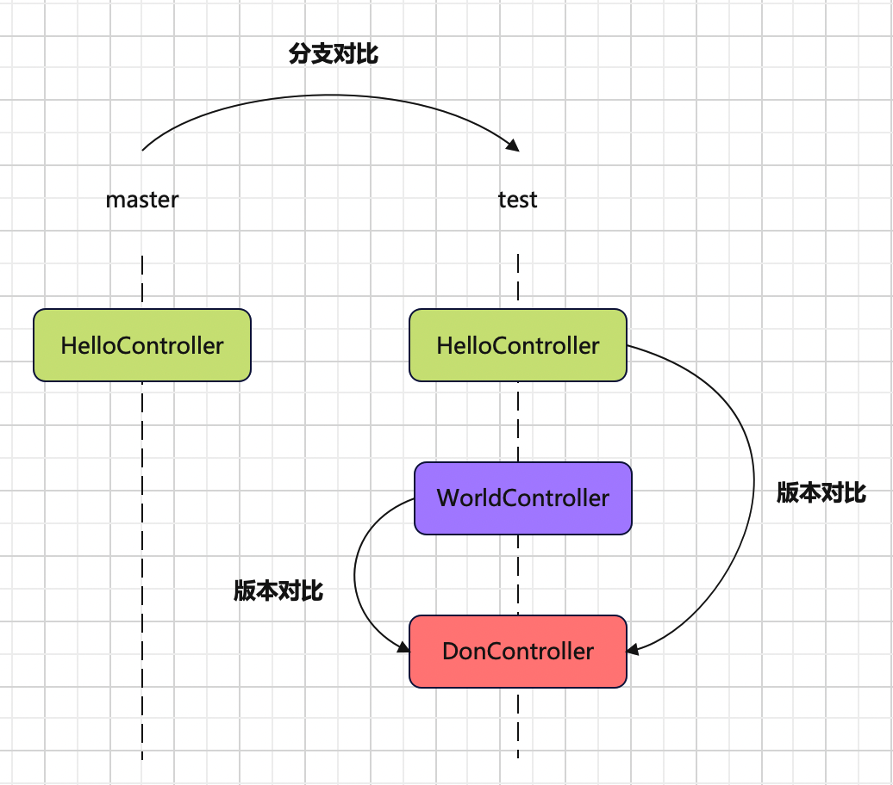
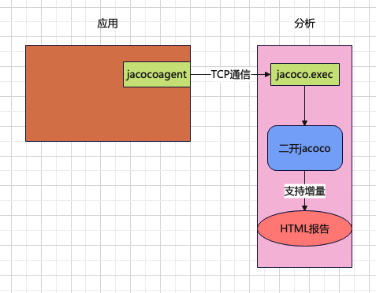
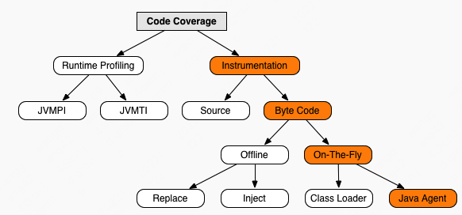
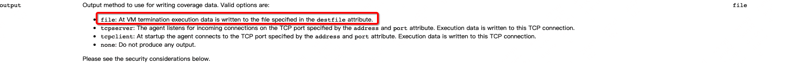
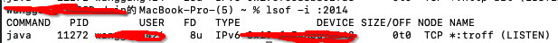
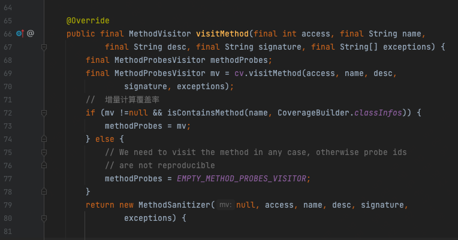
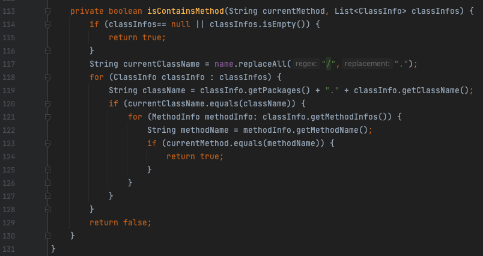
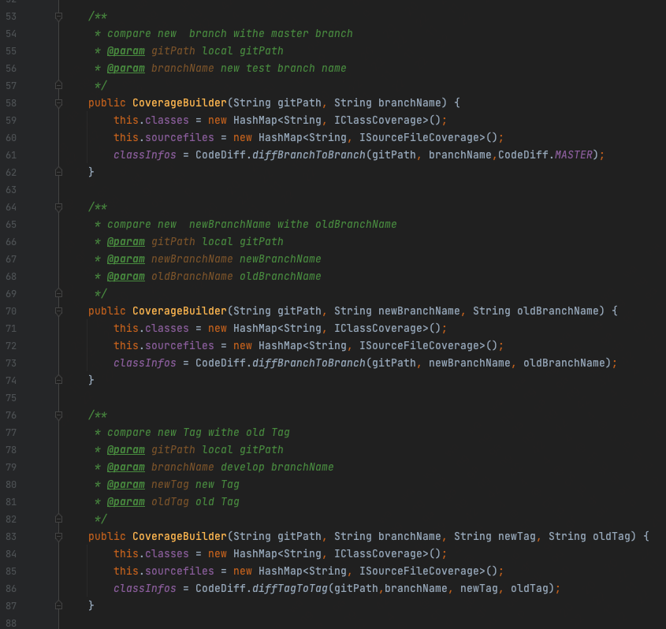
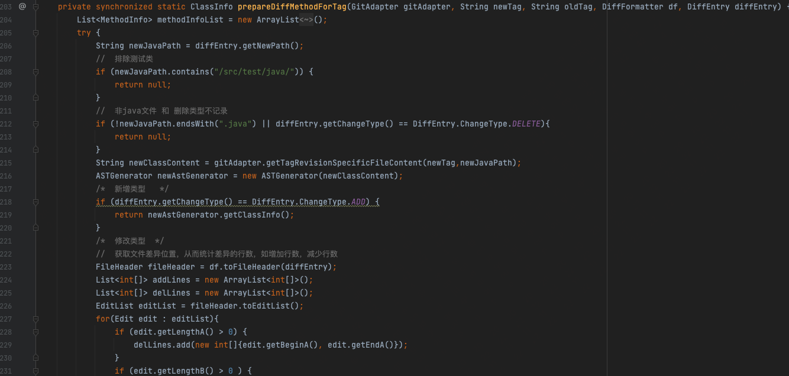

# 【JaCoCo】JaCoCo增量覆盖率的基本实现原理


## 【JaCoco】JaCoCo增量覆盖率的基本实现原理


### 什么是增量覆盖率



如图所示，在master分支提交了HelloController，然后从master拉了个新分支test；提交了第1次代码，增加了WorldController；提交了第2次代码，增加了DonController。增量的获取方式有两种：

- 版本对比：在分支上，第2次提交和第1次提交版本对比的增量代码，就是DonController；第2次提交和刚从master拉取分支时版本对比的增量代码，除了DonController还有WorldController；

- 分支对比：把test分支和master分支进行对比，增量代码就是DonController和WorldController；

增量，就是通过版本对比或分支对比，多出来的新增加的那部分代码。覆盖率是指程序运行以后，有多少代码被执行到了，除以总的代码数算出来的，即`覆盖率=执行代码行数/总代码行数`。增量覆盖率是针对增量代码来计算的，也就是`增量覆盖率=执行代码行数/增量代码行数`。

### 基本实现原理



使用JaCoCo的On-the-fly模式，以tcpserver方式启动，将远程机器的覆盖率数据通过TCP通信dump到本地jacoco.exec文件，二次开发JaCoCo源码，实现增量覆盖率分析和输出HTML报告。

### JaCoCo默认覆盖率

JaCoCo是一个开源的覆盖率工具，它的On-the-fly模式，无须侵入应用启动脚本，只需在JVM中通过-javaagent参数指定jar文件启动的代理程序，代理程序在ClassLoader装载一个class前判断是否需要注入class文件，将统计代码插入class，覆盖率分析就可以在JVM执行的过程中完成。



启动脚本示例：

```
java -javaagent:jacocoagent.jar -jar target/app.jar
```

默认情况下，**JaCoCo会在JVM停掉以后，生成覆盖率数据**，一个jacoco.exec文件。

官方手册也有相关说明：



output默认为file：At VM termination execution data is written to the file specified in the `destfile` attribute。这种方式有2个局限，一是必须停掉应用；二是只能把覆盖率数据生成到本地文件。

**output还有另外一个选项，tcpserver**：

```
java -javaagent:jacocoagent.jar=output=tcpserver,address=0.0.0.0,port=2014 -jar target/app.jar
```

address：服务端地址；

port：服务端端口；

通过这种方式启动后，会同时启动一个TCP服务端，使用`lsof -i :2014`命令查看端口进程：



然后就能通过TCP通信，来获取覆盖率数据，也就是所谓的”**dump**“。

代码片段：

```java
@Override
    public void dump(String dumpPath, String ip, int port) throws IOException {
        dumpPath = FileUtil.getAbsolutePath(dumpPath);
        if (!FileUtil.exist(dumpPath)) {
            FileUtil.mkdir(dumpPath);
        }
        FileOutputStream localFile = new FileOutputStream(dumpPath + File.separator + "jacoco.exec");
        ExecutionDataWriter localWriter = new ExecutionDataWriter(localFile);
        SocketAddress socketAddress = new InetSocketAddress(ip, port);
        Socket socket = new Socket();
        try {
            socket.connect(socketAddress, 10000);
            RemoteControlWriter writer = new RemoteControlWriter(socket.getOutputStream());
            RemoteControlReader reader = new RemoteControlReader(socket.getInputStream());
            reader.setSessionInfoVisitor(localWriter);
            reader.setExecutionDataVisitor(localWriter);
            log.info("开始dump:{} {}", ip, port);
            writer.visitDumpCommand(true, false);
            if (!reader.read()) {
                log.error("Socket closed unexpectedly");
                throw new IOException("Socket closed unexpectedly.");
            }
            log.info("dump完成:{} {}", ip, port);
        } catch (Exception e) {
            log.info("dump失败:{}", e.getMessage());
        } finally {
            socket.close();
            localFile.close();
        }
    }
```

dump经过TCP通信，将远程机器的覆盖率数据取到本地后，生成jacoco.exec文件，然后可以使用jacococli.jar生成HTML报告：

```
java -jar jacococli.jar report ./dump/jacoco.exec --classfiles ./target/classes/ --sourcefiles ./src/main/java/ --html ./report
```

第1个参数：jacoco.exec文件路径；

第2个参数：class文件路径；

第3个参数：src源码路径；

第4个参数：报告存放地址；

JaCoCo也提供了OpenApi来生成报告。

代码片段：

```java
dumpPath = FileUtil.getAbsolutePath(dumpPath);
classFilesPath = FileUtil.getAbsolutePath(classFilesPath);
srcPath = FileUtil.getAbsolutePath(srcPath);
reportPath = FileUtil.getAbsolutePath(reportPath);

File execFile = new File(dumpPath + File.separator + "jacoco.exec");
ExecFileLoader execFileLoader = new ExecFileLoader();
execFileLoader.load(execFile);

CoverageBuilder coverageBuilder = new CoverageBuilder();

Analyzer analyzer = new Analyzer(execFileLoader.getExecutionDataStore(), coverageBuilder);
analyzer.analyzeAll(new File(classFilesPath));
String reportTile = "报告标题";
IBundleCoverage bundleCoverage = coverageBuilder.getBundle(reportTile);
HTMLFormatter htmlFormatter = new HTMLFormatter();
IReportVisitor iReportVisitor = htmlFormatter.createVisitor(new FileMultiReportOutput(new File(reportPath)));
iReportVisitor.visitInfo(execFileLoader.getSessionInfoStore().getInfos(), execFileLoader.getExecutionDataStore().getContents());
DirectorySourceFileLocator directorySourceFileLocator = new DirectorySourceFileLocator(new File(srcPath), "utf-8", 4);
iReportVisitor.visitBundle(bundleCoverage, directorySourceFileLocator);
iReportVisitor.visitEnd();
```

JaCoCo的org.jacoco.core和org.jacoco.report两个包提供了这些方法。

**JaCoCo默认只能分析全量覆盖率。**

### 改造JaCoCo支持增量

改造的底层逻辑是，在分析覆盖率数据时，class文件只选取git diff的文件，从而只统计差异的增量代码，实现增量覆盖率。

在ClassProbesAdapter类的`visitMethod`方法里面，有一个对方法级别的探针计算逻辑，改造它，只对提取出的每个类的新增或变更方法做解析。

代码片段：





CoverageBuilder.classInfos是git diff出来的差异类。

改造CoverageBuilder支持分支对比和版本对比：



获取差异代码使用jgit和jdt切割到了方法粒度：



完整源码可以参考开源项目JacocoPlus：

https://github.com/512433465/JacocoPlus

### 关键点

JaCoCo分析覆盖率有时候结果不准确，通常跟这两个关键点有关：

一是dump，dump的频次很重要，建议每次分析时都dump一次，保证覆盖率数据是最新的。分布式集群会有多份覆盖率数据，可以使用ExecFileLoader的load和save方法将多份数据合并为一份。应用重启会丢失覆盖率数据，可以做一些备份。

二是class，在生成报告时，会将class和src进行比对，以统计覆盖率，只有当class和src完全匹配才能得到准确的覆盖率，假如我们自己拉最新的代码进行编译得到class，由于编译环境和版本的影响，编译出来的class说不定跟src就不匹配了，统计结果也就不会准确。最好是从应用上拉取部署的class来进行对比，以保证class和src的完全匹配。

> JaCoCo - Java Agent https://www.jacoco.org/jacoco/trunk/doc/agent.html
> 
> JaCoCo - API Usage Examples https://www.jacoco.org/jacoco/trunk/doc/api.html
> 
> 增量代码覆盖率工具 https://tech.youzan.com/yzicov/
> 
> 有赞精准测试实践 https://tech.youzan.com/thanos/
> 
> Java覆盖率Jacoco插桩的不同形式总结和踩坑记录 https://testerhome.com/topics/20632
> 
> jacoco 代码覆盖率使用中遇到的一些坑 https://testerhome.com/topics/16925
> 
> jacoco—增量代码覆盖率实现 https://blog.csdn.net/qq_34811445/article/details/127556617
