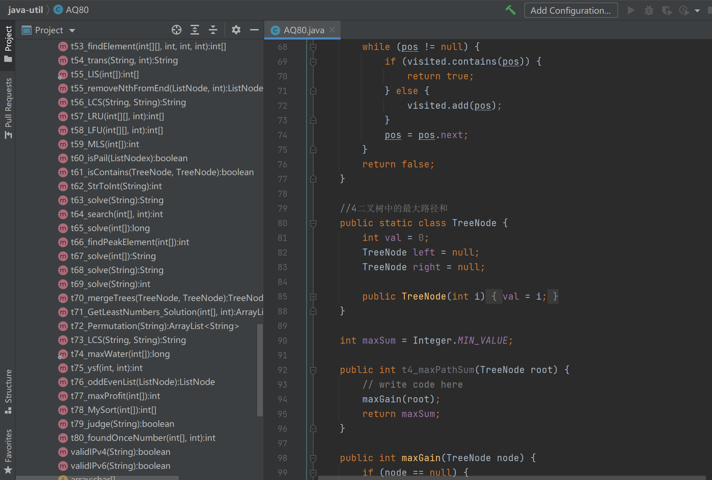

# 刷了80道算法题以后

刷了80道算法题以后，我最大的感受是，**自信心倍增**。既克服了对算法的恐惧，也加强了Java代码能力，还收集了2068行答案代码。

我刷算法题的理由很平常，就是想提高自己的竞争力，在面试的时候能过最后那一关。前后离职的两名同事都告诉我，在牛客网上面刷题就可以了。于是这次我就在牛客网上面按照`题库→在线编程→全部题目→测试`的路径，筛选了一下算法题，搜出来一共80道题：

我之前面试碰到过的字符串相加和判断字符串是否为IP地址的两道题，都出现在了这80道题之中。并且前同事面试做过的算法题都是在这上面做过的原题，我对比了一下也在这80道题里面。可以毫不夸张的说，**掌握这80道题，基本上90%的面试算法题，你都能通过**。

正是来着这样的决心，我就开始做题了，使用的编程语言是Java，借着这个机会也多拿Java练练手。有好几个阶段：

1. 直接做。做不来。
2. 先背答案，再敲代码，坚持到了第15题。背得费劲。
3. 对着代码，一个一个字母敲一遍，坚持到了第35题。敲的手疼。
4. 直接在题解中找答案代码，复制粘贴后提交。顺利“刷”完了80道题。

所有80道题的答案代码都上传到了我的GitHub上面：

https://github.com/dongfanger/java-util/blob/main/AQ80.java

接下来把这80道题的答案理解了或者背下来，面试考算法就基本上没多大问题了。

这80道题包含了简单、中等、困难所有3种难度，困难题可以选择性放弃，简单题必须掌握，中等题根据代码量平衡选择，一般测试考算法，不会让你写代码量特别多那种的。

算法题也是有套路可寻，重点会考察这些知识点：哈希表、链表、栈、排序、二分法、双指针、递归、动态规划、树的遍历等。对算法感兴趣也可以阅读这个大佬写的攻略：

https://github.com/labuladong/fucking-algorithm

希望这篇文章对正在求职的小伙伴能有所帮助！