# 【入门】测试人员学Java入门指南


## 目标读者

本指南特别适合有Python基础的同学学习Java入门，对于没有任何编程经验的同学可能会存在困难。

## 为什么测试人员要学Java

选择Java，应该不错。TesterHome测试论坛知名大佬基本都是以Java技术栈为主，少部分是Golang和Python。我公司2021年校招的两个同济大学研究生，测试开发，也是以Java为主。有一个测开同事跳槽去了美团，拿了高薪，只会Java。有一个测开同事跳槽去了创业公司做了测试架构师，只会Java。招聘网站搜索测试开发20K以上职位，基本都要求会Java。我接触到的开发，Java程序员占80%以上。

## 测试人员用Java能干嘛

如果你的公司是以Java技术栈为主，那么你可以用Java做所有事情，而且有些事情只能用Java来做。这个问题挺关键的，学习一门语言肯定是要能够学以致用。在自动化测试，Java会显得稍微有点笨重，而Python会适合一点。你可以用Python来写接口自动化脚本，在小范围内使用，但是当团队变大以后，脚本如何规范如何维护，就成了一个很大的问题，而Java由于静态语言特性和面向对象编程，正好可以用来解决这个问题。在测试平台和性能测试，Java有很成熟的Web开发框架和配套的生态。在测试工具开发，公司封装好的Java库可以拿来即用，碰到问题也可以找开发帮忙。白盒测试，基本上都是要靠Java来做的，看代码，用JaCoCo统计代码覆盖率。其他专项比如流量录制回放、全链路压测、Dubbo接口测试，都只能使用Java来做。

## 测试人员怎么学Java

我推荐刷完一遍基础语法后，在LeetCode上面刷算法题来加强练习。Java还是有一定的学习门槛的，初学者可能学起来会有些吃力，可以先从Python入手，了解编程语言的底层逻辑，等对编程有些许感知以后，再学习Java。基础语法可以快速浏览一遍，一遍并不会就能记住了，需要在编码中持续加强记忆。光学语法也不行，学习Java和其他编程语言一样，需要多敲多练，刷算法题，既能熟悉Java语法，也能熟悉算法，一举两得，题做不来就先把答案背一遍再做。另外，可以在工作中主动找研发开通下代码权限，尝试Review开发代码，看多了，有些技巧也会知道了。有机会，可以用Java写点工具或者平台，实践出真知。

## 搭建环境

**安装Java**

Java的安装包是个`.exe`文件，特殊地方在于文件名不是`java-xxx.exe`而是`jdk-xxx.exe`，比如`jdk-8u281-windows-x64.exe`，`jdk`是`Java Development Kit `的缩写，指Java开发工具包，包括以下内容：

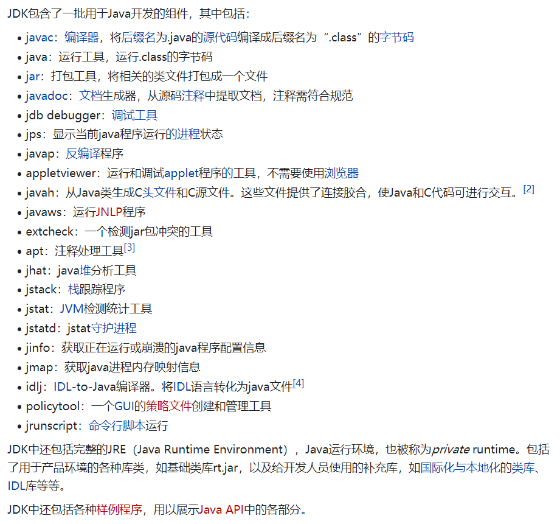

JDK的最新版本为15，但是国内大多数公司仍然使用的是JDK8，这是因为JDK8是各方面都很成熟稳定的版本，并且基于JDK8开发的业务系统已经具有一定规模，新版本JDK并不能完全无感知的迁移，需要做代码修改和测试，会是一笔巨大开销，为了降低成本和规避兼容问题风险，JDK8沿用到了至今。JDK8的下载地址如下：

https://www.oracle.com/java/technologies/javase/javase-jdk8-downloads.html

选择相应的版本下载：


比如我的电脑是Windows 64位的系统，就选择了`Windows x64`这个版本，会下载到一个`jdk-8u281-windows-x64.exe`文件。Java已经被Oracle收购了，需要登录Oracle账号后才能下载，没有账号注册一个也很方便：


下载后可以开始安装了：

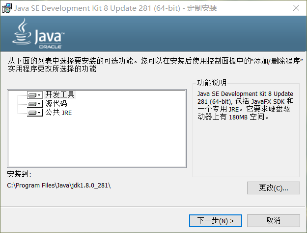

安装到默认位置即可，直接下一步。中途会让选择JRE（Java Runtime Environment，Java运行环境）的目标文件夹：

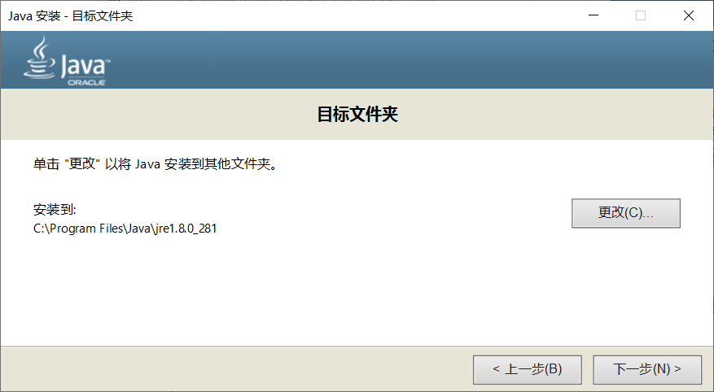

依然保持默认即可。安装结束后就能看到两个新文件夹了：

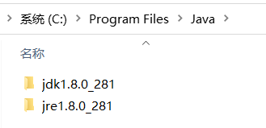

以前，还需要配置系统环境变量，设置`JAVA_HOME`和`CLASSPATH`才能使用Java（具体方法百度有很多）。现在，安装完成即可用，省去了不少麻烦，速度加快。打开`cmd`输入`java -version`，命令能执行成功就表示Java已经安装好了：

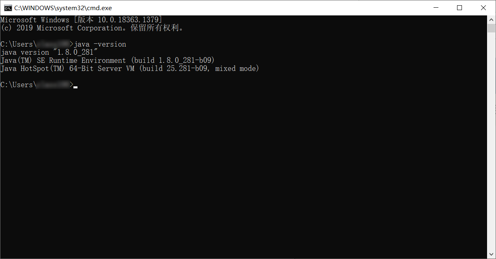

**安装IntelliJ IDEA**

JetBrains全家桶中也有专门用来写Java的，叫做`IntelliJ IDEA`，一般只说后面一个单词“哎迪儿”就知道是这个东西了。下载地址为：

https://www.jetbrains.com/idea/download/#section=windows

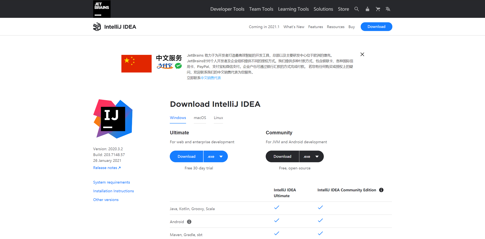

个人建议选择旗舰版，看着齐全。下载后双击`ideaIU-2020.3.2.exe`安装，先别忙着打开。

**Maven仓库**

Maven是用来管理Java第三方包的主流仓库工具，通过`pom.xml`文件来配置安装即可，在mvnrepository网站上能检索到所需配置信息：

https://mvnrepository.com/

官方仓库有时候下载速度很慢，本文用国内镜像替代，提高首次打开时同步仓库速度。我们先把Maven中央仓库从Apache替换成阿里云。打开本地目录`D:\Program Files\JetBrains\IntelliJ IDEA 2020.3.2\plugins\maven\lib\maven3\conf`：


编辑`settings.xml`文件，找到`<mirrors>`标签，添加代码：

```xml
    <mirror>
      <id>aliyunmaven</id>
      <mirrorOf>*</mirrorOf>
      <name>阿里云公共仓库</name>
      <url>https://maven.aliyun.com/repository/public</url>
    </mirror>
```

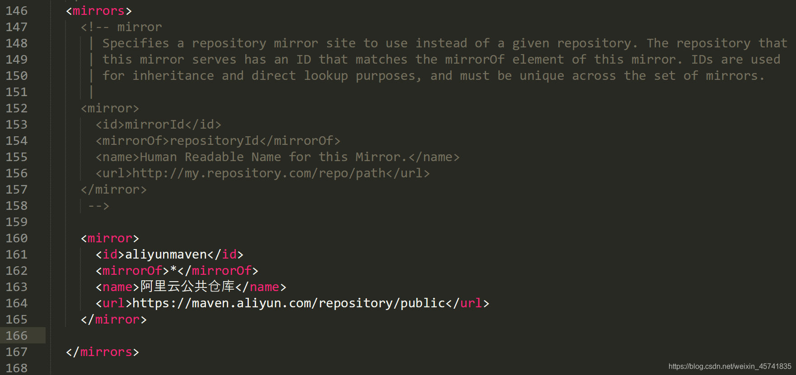

> 这是新版写法，官网https://maven.aliyun.com/mvn/guide有说明。

接着可以打开IDEA了，欢迎界面映入眼帘：


**新建项目**

选择新建Maven项目：

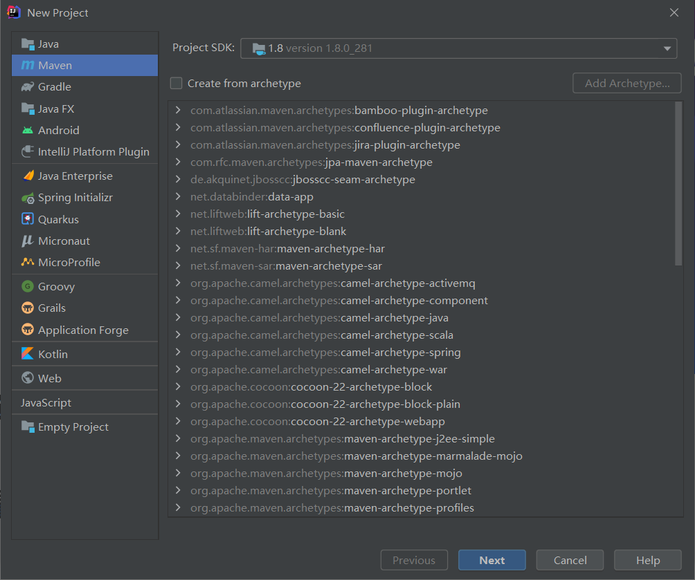

填写项目名和存放位置：

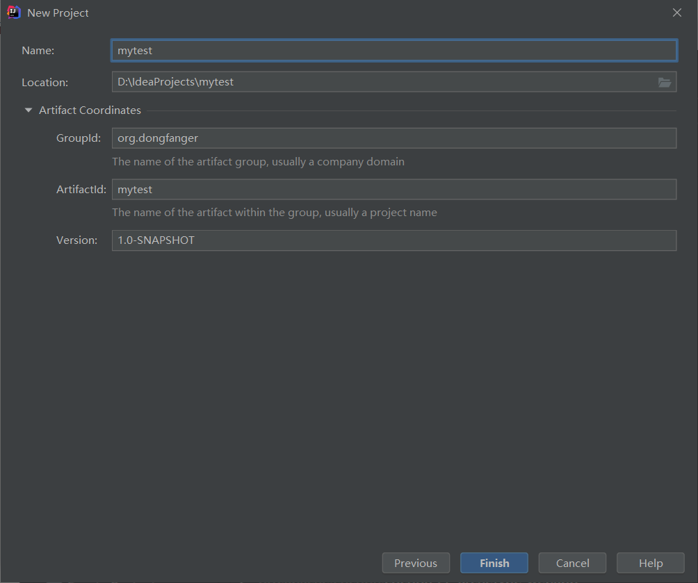

在`pom.xml`文件中添加仓库配置：

```xml
    <repositories>
        <repository>
            <id>public</id>
            <url>https://maven.aliyun.com/repository/public</url>
        </repository>
    </repositories>

    <pluginRepositories>
        <pluginRepository>
            <id>public</id>
            <url>https://maven.aliyun.com/repository/public</url>
        </pluginRepository>
    </pluginRepositories>

```


记得点击右上角的`Load Maven Changes`按钮，此时前面切换仓库的作用就体现出来了，右下角同步速度比默认明显增快。至此，以阿里云为Maven中央仓库的项目就创建好了。

**其他设置**

**UTF-8**

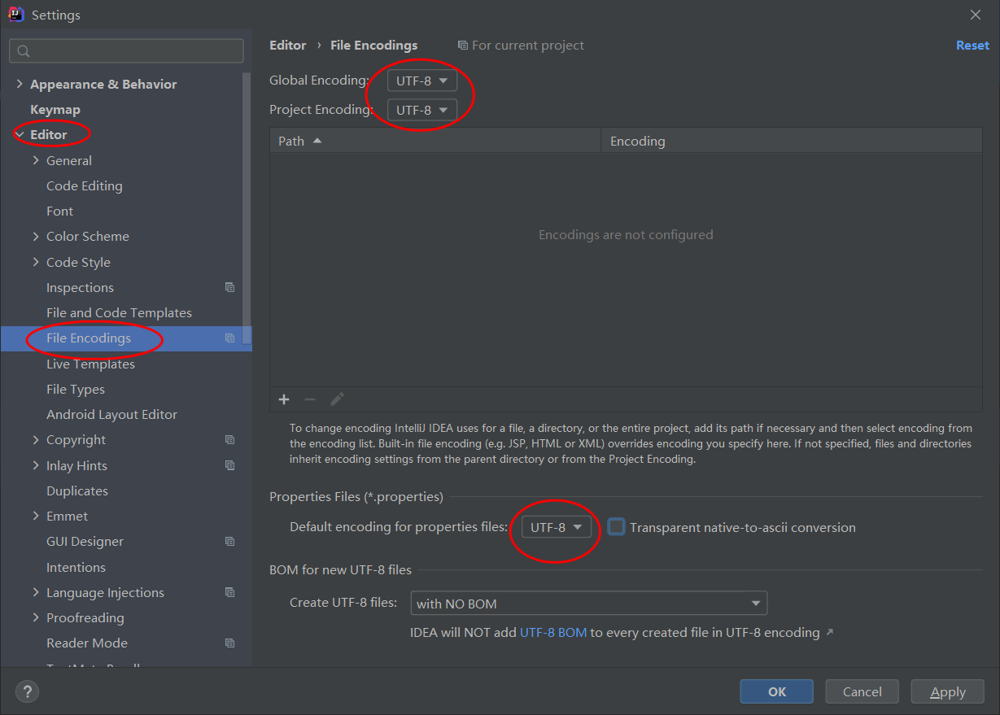

**网络自动代理**

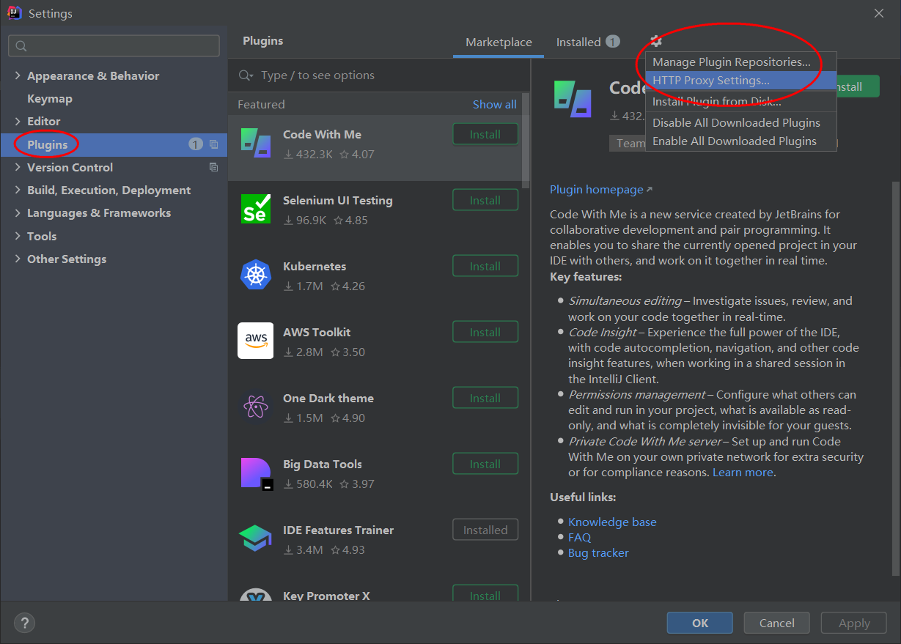


## 基础语法

Java虽然学习门槛有点高，但是如果熟悉Python以后，再看Java基础语法，其实是非常简单的。

**4个概念**

- 对象：Java是纯面向对象编程语言，对象的概念有点抽象，具体来说可以是一条狗，也可以是某个人。
- 类：类是对象的模板，有点像克隆的母体。
- 属性：属性就是状态，相当于变量。
- 方法：方法就是行为，跟函数类似，完成某个特定功能。

**Hello World**

Java的Hello World经常拿来和其他语言比较，嫌它啰嗦，然而啰嗦的背后是严谨：

```java
public class HelloWorld {
    public static void main(String[] args) {
        System.out.println("Hello World");
    }
}
```

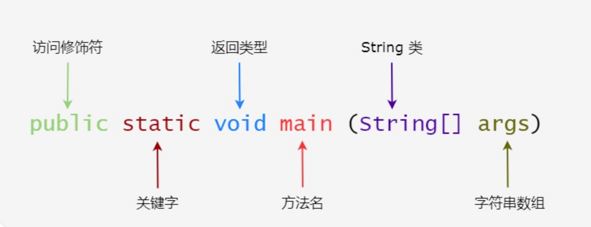

**Java把每个语法都显式的表达了出来，阅读代码就能知道是什么意思，不会产生额外的意想不到的结果。**

**基本语法**

- `public static void main(String[] args)`，是所有Java程序的执行入口。
- 源文件后缀是`.java`，源文件名称必须和类名一致。
- 源文件编译后的文件后缀是`.class`。
- Java是大小写敏感的，类名首字母应该大写，方法名首字母小写，也就是驼峰命名法。

**标识符**

类名、属性名和方法名都被称为标识符，Java标识符规则如下：

- 标识符是大小写敏感的
- 所有的标识符都应该以字母（`A-Z`或者`a-z`）、美元符（`$`）、或者下划线（`_`）开始
- 首字符之后可以是字母（`A-Z`或者`a-z`）,美元符（`$`）、下划线（`_`）或**数字**的任何字符组合
- 关键字不能用作标识符

比如合法的标识符：

```
age、$salary、_value、__1_value
```

非法的标识符：

```
123abc、-salary
```

**修饰符**

- 访问控制修饰符 : default, public, protected, private
- 非访问控制修饰符 : final, abstract, static, synchronized

Java的修饰符极大的提高了代码可阅读性。

**变量**

因为Java的代码都必须写到类里面，所以就只有以下三种变量：

- 类变量（静态变量），相当于全局变量
- 成员变量（非静态变量）
- 局部变量

**注释**

```java
public class HelloWorld {
   /* 这是第一个Java程序
    * 它将输出 Hello World
    * 这是一个多行注释的示例
    */
    public static void main(String[] args){
       // 这是单行注释的示例
       /* 这个也是单行注释的示例 */
       System.out.println("Hello World"); 
    }
}
```

**八种基本类型**

boolean  布尔型  1个字节 8bit（8位）

byte   字节类型  1个字节

char   字符类型  2个字节

short   短整型   2个字节

int     整型    4个字节

long   长整型   8个字节

double  双精度类型 8个字节

float   浮点型（单精度）4个字节

默认的整数类型是int，如果要定义为long ，则要在数值后加上`L`或者`l`。

默认的浮点型是double，如果要定义float，则要在数值后面加上`F`或者`f`。

## 对象和类

我们都知道Java是纯面向对象编程语言，这个对象是什么，类是什么，它们的关系是怎样呢？

**类和对象的关系**

先看一张图：


**类**是girl和boy，**对象**是每个具体的女孩（Lucy、Rose）和男孩（David、Jack）。

这完美解释了类和对象的关系，即：**类是对象的模板**。

**状态和行为**

对象有两个特征，一个是状态（又叫做属性），一个是行为（又叫做方法），我们拿狗来举例，狗的**状态**有品种、大小、颜色、年龄；**行为**有吃、跑、睡觉。如图所示：


图的左边是3个狗**对象**，右边是1个狗**类**。类定义了对象应该有哪些属性和方法，对象根据类定义好的模板，创建了个性化的实例。

代码实现如下：

```java
public class Dog {
    // 属性
    String breed;
    int size;
    String colour;
    int age;
 
    // 方法
    void eat() {
    }
 
    void run() {
    }
 
    void sleep(){
    }
}
```

**构造方法**

在通过类创建对象时，构造方法提供了如何创建对象的细节。Java会给类一个默认的构造方法，你也可以自定义一个或多个构造方法，**构造方法命名必须和类名相同**，比如：

```java
public class Dog{
    public Dog(String breed){
    }
}
```

代码中定义了2个构造方法，根据参数不同，在构造时会调用相应的构造方法。

**创建对象**

**如果没有对象，那么就new一个。**Java是通过new关键字来创建对象的。比如使用默认构造方法创建对象：

```java
Dog myDog = new Dog();
```

或者使用自定义构造方法创建对象：

```java
Dog myDog = new Dog("Bulldog");
```

**访问对象属性和方法**

Java和大多数语言一样，采用`.`运算符访问对象属性和方法，比如：

```java
public class Dog {
    int age;

    public void setAge(int age) {
        this.age = age;
    }

    public int getAge() {
        return this.age;
    }

    public static void main(String[] args) {
        // 创建对象
        Dog myDog = new Dog();
        // 通过方法来设定age
        myDog.setAge(2);
        // 调用另一个方法获取age
        System.out.println(myDog.getAge());
        // 也可以像下面这样访问成员变量
        System.out.println(myDog.age);
    }
}
```

**类存放规则**

Java源文件是用类来组织的，存放在源文件中的类遵循下面几项规则：

- 一个源文件只能有一个public类，可以有多个非public类。
- 源文件名必须与public类名一致。
- package语句在首行，其次是import语句，最后是类。

## 八大基本数据类型

Java内置了8个基本数据类型，它们分别是**byte**、**short**、**int**、**long**、**float**、**double**、**boolean**、**char**。

> 每种基本数据类型都有相应的**包装类**：Byte、Short、Integer、Long、Float、Double、Character。包装类提供了面向对象的实现，比如二进制位数（`Integer.SIZE`）、最小值（`Integer.MIN_VALUE`）、最大值（`Integer.MAX_VALUE`）等。

**byte**

8位整数，默认值是`0`，byte类型主要用在大型数组中节约空间，因为它占用的空间只有int类型的四分之一。

**short**

16位整数，默认值是`0`。跟byte类型用法类似，占用空间是int类型的二分之一。

**int**

32位整数，默认值是`0`。最常用的整数类型。

**long**

64位整数，默认值是`0L`。超出int范围的整数需要使用long类型。

**float**

32位浮点数，默认值是 `0.0f`。float类型用来表示小数。

**double**

64位浮点数，默认值是`0.0d`。**浮点数的默认类似是double类型。**

**boolean**

1位真假值（true/false），默认值是`false`。

**char**

16位Unicode字符，默认值是`u0000`。用来存储任何单一字符。

**第九种基本数据类型void**

实际上，Java还有第九种基本数据类型void，我们经常在方法返回值那里见到它，它的包装类是`java.lang.Void`。

## 三大变量类型

Java中的一个类可以包含3种类型的变量：局部变量、成员变量、类变量。它们的定义位置如下图所示：

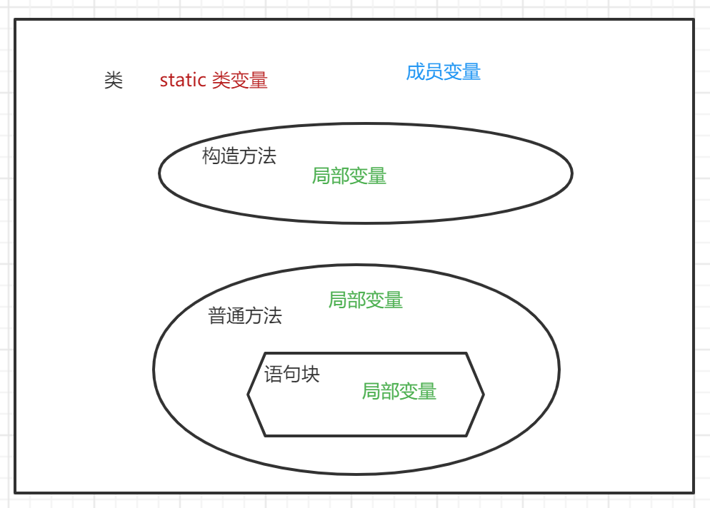

**局部变量**

局部变量是在方法、构造方法或者语句块中定义的变量。变量声明和初始化都是在方法中，方法结束后，变量就会自动销毁。

**成员变量**

成员变量是在类中，方法体之外定义的变量。变量在创建对象的时候实例化，可以被类中方法、构造方法和特定的语句块访问。

**类变量**

类变量跟成员变量定义的位置相同，只不过必须声明为static类型。

**成员变量和类变量**在使用上有个明显的区别是：类变量可以直接通过`类名.变量`形式进行访问，成员变量则不能。比如：

```java
public class B {
    static int classVar = 1;  // 类变量
    int memberVar = 2;  // 成员变量
}
```

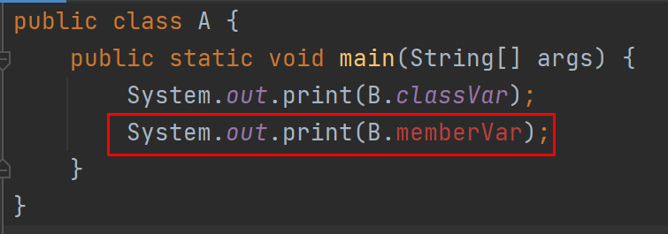

成员变量在写代码时IDEA就已经报错了。

## 修饰符

**Java修饰符**是让Java变得啰嗦的罪魁祸首之一。其他很多语言并没有这么多修饰符，取而代之的是语法规则，比如Python下划线开头的变量是私有变量，Golang小写字母开头的变量是私有变量。但是，正因为Java有着明确的修饰符，所以Java代码看起来是最直白的表述。

**修饰符概览**

Java修饰符有两大类，它们分别如下：

**访问控制修饰符**

- default（什么都不写）
- private
- public
- protected

**非访问控制修饰符**

- static
- final
- abstract
- synchronized
- transient
- volatile

**修饰符通常是放在一行代码最前面的，起到修饰作用**，比如：

```java
public class ClassName {
   // ...
}
private boolean myFlag;
static final double weeks = 9.5;
protected static final int BOXWIDTH = 42;
public static void main(String[] arguments) {
   // 方法体
}
```

**访问控制修饰符**

**访问控制，指的是对Java类、接口、变量、方法的访问权限的控制。**我们知道Java每个文件是一个类（Class），每个文件夹是一个包（Package），它们彼此之间能不能相互访问，就是通过修饰符决定的。

访问控制修饰符一览表，从上往下，访问权限越来越小：


**default**

什么都不写，不使用任何修饰符，默认为包访问权限，即**同一个包内都是可以访问的**。

> Java有个很棒的设计：同一个包里面的类不需要import就能直接使用。

示例：

```java
String version = "1.5.1";
boolean processOrder() {
   return true;
}
```

**private**

意思就像它的名字一样，私有的，**只有当前类的内部才可以访问**。private用来保护类的隐私，如果外部类想访问private的变量，那么只能通过public的getter方法暴露出去。需要注意的是，private可以用到变量、方法上，但是不能用到类和接口上（这么做没有意义，类总是要被外部调用的，接口总是要被外部实现的）。

示例：

```java
public class Logger {
   private String format;
   public String getFormat() {
      return this.format;
   }
   public void setFormat(String format) {
      this.format = format;
   }
}
```

**public**

公开的，**所有都能访问，没有任何限制**。

示例：

```java
public static void main(String[] arguments) {
   // ...
}
```

**protected**

当前类可以访问，子类**有可能**可以访问。子类有两种情况：

- 子类与父类在同一个包中：子类可以访问父类的protected。
- 子类与父类在不同的包中：子类可以访问，非子类内部的子类实例不能访问。

示例：

```java
package test1;


public class Base {
    int defaultInt;
    protected int protectedInt;
}
```

```java
// 不同的包
package test2;


// 子类
public class Test extends Base {
    public void test(){       
         Test t = new Test();
         //t.defaultInt = 2; 不可见
         t.protectedInt = 3;
    }
}


// 非子类
class TestNotSub{
    public void test(){
          Test t = new Test();
          //t.defaultInt = 2; 不可见
          //t.protectedInt = 3; 不可见
    }
}
```

需要注意的是，protected可以用到变量、方法上，但是不能用到类（**内部类除外**）和接口上。

**非访问控制修饰符**

**static**

static用来修饰**变量和方法**。修饰的变量叫做静态变量/类变量，修饰的方法叫做静态方法或/类方法。

静态的含义是，无论实例化多少个对象，静态变量或静态方法只有一份。作为类变量或类方法，static的用法是可以直接通过`ClassName.varName`访问类变量，或直接通过`ClassName.methodName()`访问类方法，无需实例化对象。

需要注意的是，静态方法里面不能使用类的非静态变量。

> 我以Python举例可以更好说明这一点，Python的类方法第一个入参是cls，如果想访问非类变量，那么入参必须是self。

**final**

- final修饰**变量**：通常和static一起用来声明常量，比如`static final String TITLE = "Manager";`
- final修饰**方法**：父类的final方法可以被子类继承，但是不能被重写，防止该方法的内容被篡改。
- final修饰**类**：final类不能被继承。

**abstract**

- abstract修饰**类**：抽象类。
- abstract修饰**方法**：抽象方法。

抽象意味着它们只定义了一个形式，没有具体内容，一定会由其他的类或方法进行具体实现。如果类中有抽象方法，那么这个类必须要定义为抽象类，否则会编译报错。

**synchronized**

用于修饰**方法**，这个方法同一时间只能被一个线程访问。

**transient**

修饰**变量**，用的很少，我也看不懂。

**volatile**

修饰变量，变量每次被线程访问时，都强制从共享内存中重新读取值，当变量发生变化时，会强制线程将变化值写入共享内存。这样两个线程在任何时候都能看到变量的同一个值。

## 运算符

Java一共有以下几类运算符：

- 算术运算符
- 关系运算符
- 位运算符
- 逻辑运算符
- 赋值运算符
- 其他运算符

总的来说，Java运算符跟其他编程语言的运算符大同小异，可以快速浏览一下。

**算术运算符**

假设整数变量A的值为10，整数变量B的值为20：

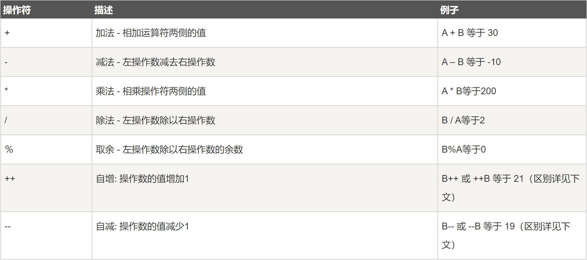

**特别的是**，前缀自增自减法（`++a` `--a`）和后缀自增自减法（`a++` `a--`）：

前缀自增自减法（`++a` `--a`）：先进行自增自减，再进行表达式运算。

后缀自增自减法（`a++` `a--`）：先进行表达式运算，再进行自增自减。

示例：

```java
public class Test {
    public static void main(String[] args) {
        int d = 25;
        // 查看  d++ 与 ++d 的不同
        System.out.println("d++   = " +  (d++) );
        System.out.println("++d   = " +  (++d) );
    }
}
```

结果为：

```
d++   = 25
++d   = 27
```

**关系运算符**

假设整数变量A的值为10，整数变量B的值为20：


**位运算符**

假设整数变量A的值为60，整数变量B的值为13：

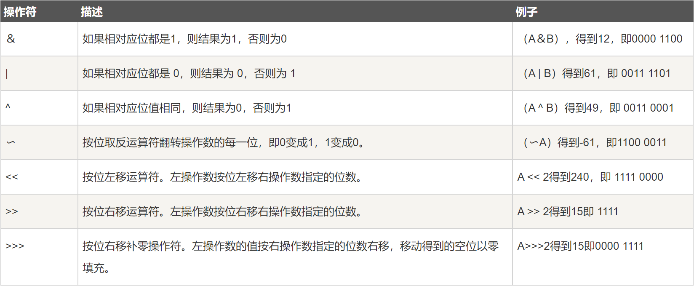

**逻辑运算符**

假设布尔变量A为真，布尔变量B为假：


**需要注意的是，如果第一个操作数已经能判断结果了，那么就不会执行下一个操作数**，比如：

```java
public class Test {
    public static void main(String[] args) {
        boolean a = false;
        boolean b = true;
        
        boolean c = a && b;  // a已经能判断结果为false，不再执行b
        
        boolean d = b || a;  // b已经能判断结果为true，不再执行a
    }
}
```

**赋值运算符**

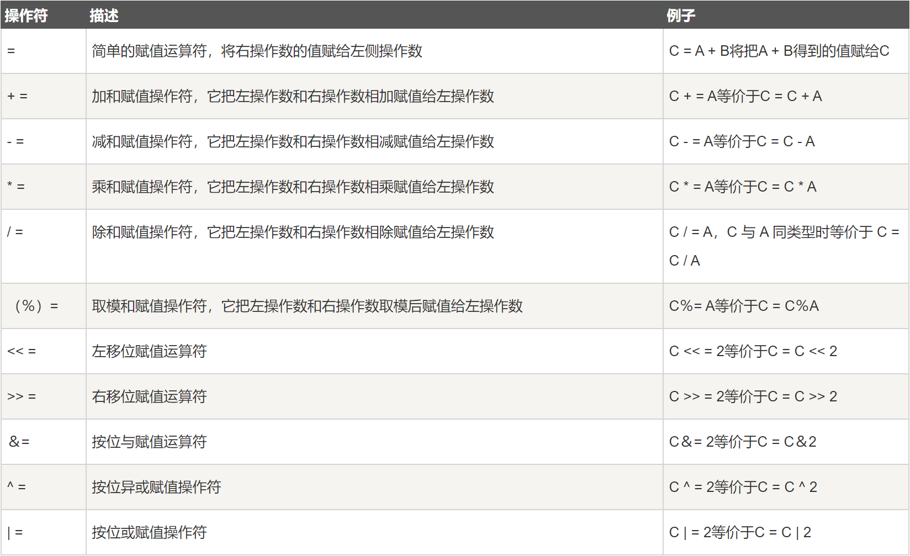

**其他运算符**

**条件运算符**

```
variable x = (expression) ? value if true : value if false
```

示例：

```java
public class Test {
   public static void main(String[] args){
      int a , b;
      a = 10;
      // 如果 a 等于 1 成立，则设置 b 为 20，否则为 30
      b = (a == 1) ? 20 : 30;
      System.out.println( "Value of b is : " +  b );  // 30
 
      // 如果 a 等于 10 成立，则设置 b 为 20，否则为 30
      b = (a == 10) ? 20 : 30;
      System.out.println( "Value of b is : " + b );  // 20
   }
}
```

条件运算符也叫做三元运算符，三元场景可以多用这个运算符简写代码。

**instanceof 运算符**

```
( Object reference variable ) instanceof  (class/interface type)
```

用来判断对象是否为类的实例。比如：

```java
String name = "James";
boolean result = name instanceof String; // 由于 name 是 String 类型，所以返回真
```

**Java运算符优先级**

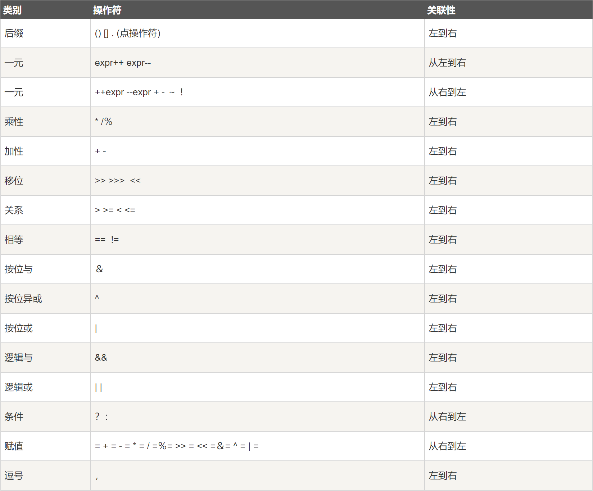

**在编写代码的时候，多用小括号把优先计算的表达式框起来，才不容易出错。**

## 循环结构

**循环结构**

**while**

```
while( 布尔表达式 ) {
  // 循环体
}
```

只要布尔表达式为True，就会一直反复执行循环体。

示例：

```java
public class Test {
   public static void main(String args[]) {
      int x = 10;
      while( x < 20 ) {
         System.out.print("value of x : " + x );
         x++;
         System.out.print("\n");
      }
   }
}
```

**do while**

```
do {
       // 循环体
}while( 布尔表达式 );
```

无论表达式是否为True，都先执行一次循环体，然后就跟while一样先判断布尔表达式，如果为True再继续执行循环，为False就退出循环。

示例：

```java
public class Test {
   public static void main(String args[]){
      int x = 10;
 
      do{
         System.out.print("value of x : " + x );
         x++;
         System.out.print("\n");
      }while( x < 20 );
   }
}
```

**for**

```
for(初始化; 布尔表达式; 更新) {
    // 循环体
}
```

- 初始化：定义一个或多个循环控制变量，也可以为空语句。
- 布尔表达式：根据True或False决定是否继续执行循环。
- 更新：更新循环控制变量。

示例：

```java
public class Test {
   public static void main(String args[]) {
 
      for(int x = 10; x < 20; x = x+1) {
         System.out.print("value of x : " + x );
         System.out.print("\n");
      }
   }
}
```

Java也有更方便从数组遍历元素的for循环：

```
for(声明语句 : 表达式)
{
   // 循环体
}
```

- 声明语句：跟数组元素类型匹配的局部变量。
- 表达式：数组或返回数组的方法。

示例：

```java
public class Test {
   public static void main(String args[]){
      int [] numbers = {10, 20, 30, 40, 50};
 
      for(int x : numbers ){
         System.out.print( x );
         System.out.print(",");
      }
      System.out.print("\n");
      String [] names ={"James", "Larry", "Tom", "Lacy"};
      for( String name : names ) {
         System.out.print( name );
         System.out.print(",");
      }
   }
}
```

**break**

跳出整个循环。

示例：

```java
public class Test {
   public static void main(String args[]) {
      int [] numbers = {10, 20, 30, 40, 50};
 
      for(int x : numbers ) {
         if( x == 30 ) {
            break;  // x等于30时跳出循环，后面都不打印了
         }
         System.out.print( x );
         System.out.print("\n");
      }
   }
}
```

**continue**

跳过当前这次循环，执行下一次循环。

示例：

```java
public class Test {
   public static void main(String args[]) {
      int [] numbers = {10, 20, 30, 40, 50};
 
      for(int x : numbers ) {
         if( x == 30 ) {
        	continue;  // 不会打印30，但是会继续打印后面元素
         }
         System.out.print( x );
         System.out.print("\n");
      }
   }
}
```

break和continue可以从字面意思来区分，break**中断**循环，continue**继续**下次循环。

## 条件语句

**if**

```
if(布尔表达式)
{
   //如果布尔表达式为true将执行的语句
}
```

示例：

```java
public class Test {
 
   public static void main(String args[]){
      int x = 10;
 
      if( x < 20 ){
         System.out.print("这是 if 语句");
      }
   }
}
```

**if else**

```
if(布尔表达式){
   //如果布尔表达式的值为true
}else{
   //如果布尔表达式的值为false
}
```

示例：

```java
public class Test {
 
   public static void main(String args[]){
      int x = 30;
 
      if( x < 20 ){
         System.out.print("这是 if 语句");
      }else{
         System.out.print("这是 else 语句");
      }
   }
}
```

也可以跟多个if else：

```
if(布尔表达式 1){
   //如果布尔表达式 1的值为true执行代码
}else if(布尔表达式 2){
   //如果布尔表达式 2的值为true执行代码
}else if(布尔表达式 3){
   //如果布尔表达式 3的值为true执行代码
}else {
   //如果以上布尔表达式都不为true执行代码
}
```

示例：

```java
public class Test {
   public static void main(String args[]){
      int x = 30;
 
      if( x == 10 ){
         System.out.print("Value of X is 10");
      }else if( x == 20 ){
         System.out.print("Value of X is 20");
      }else if( x == 30 ){
         System.out.print("Value of X is 30");
      }else{
         System.out.print("这是 else 语句");
      }
   }
}
```

**嵌套的if else**

```
if(布尔表达式 1){
   ////如果布尔表达式 1的值为true执行代码
   if(布尔表达式 2){
      ////如果布尔表达式 2的值为true执行代码
   }
}
```

示例：

```java
public class Test {
 
   public static void main(String args[]){
      int x = 30;
      int y = 10;
 
      if( x == 30 ){
         if( y == 10 ){
             System.out.print("X = 30 and Y = 10");
          }
       }
    }
}
```

**switch case**

```
switch(expression){
    case value :
       //语句
       break; //可选
    case value :
       //语句
       break; //可选
    //你可以有任意数量的case语句
    default : //可选
       //语句
}
```

- expression：变量或返回变量的方法，变量类型可以是byte、short、int或char，以及String类型。
- value：字符串常量或字面量，且与表达式的变量类型相同。
- break：可选，有break时会中断后续匹配跳出switch语句，没有break时会继续执行后面的case。
- default：当所有case都没有匹配到时，会执行default语句，一般放在最后的位置。

示例：

```java
public class Test {
   public static void main(String args[]){
      //char grade = args[0].charAt(0);
      char grade = 'C';
 
      switch(grade)
      {
         case 'A' :
            System.out.println("优秀"); 
            break;
         case 'B' :
         case 'C' :
            System.out.println("良好");
            break;
         case 'D' :
            System.out.println("及格");
            break;
         case 'F' :
            System.out.println("你需要再努力努力");
            break;
         default :
            System.out.println("未知等级");
      }
      System.out.println("你的等级是 " + grade);
   }
}
```

## Number类

Java是纯面向对象编程语言，**为了以对象的方式使用内置数据类型**，比如byte、int、long、double等，Java对它们进行了封装，封装后的类称为包装类。这里的封装一般也叫做装箱，反之叫做拆箱。

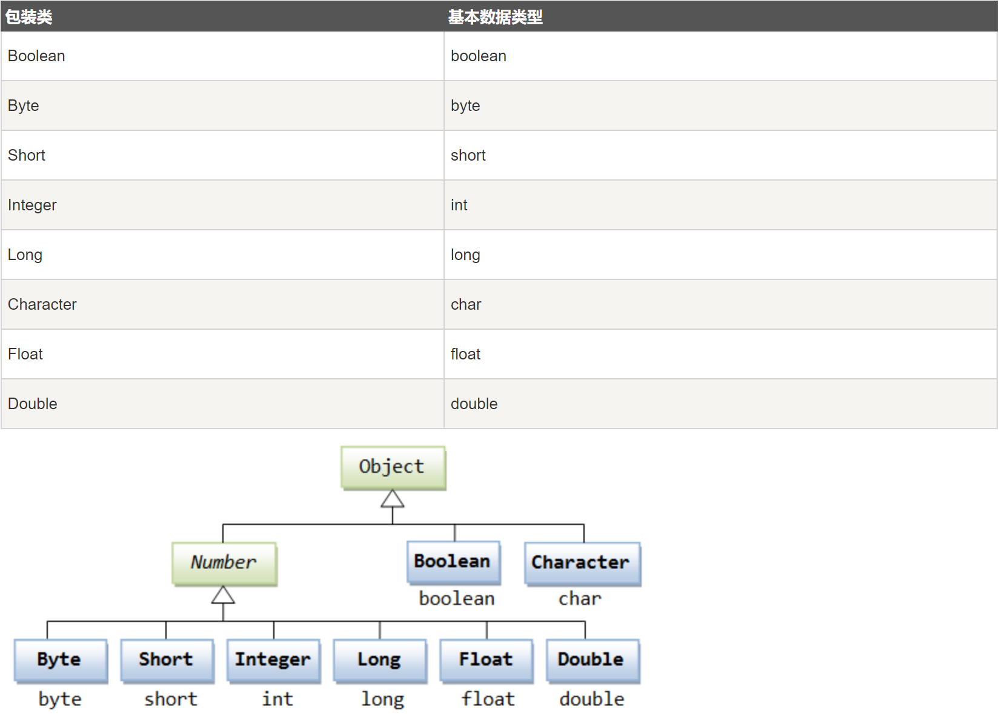

所有的数字包装类，都是抽象基类Number的子类，包括Byte、Short、Integer、Long、Float、Double。

示例：

```java
public class Test{
   public static void main(String[] args){
      Integer x = 5;  // 装箱
      x =  x + 10;  // 拆箱
      System.out.println(x); 
   }
}
```

## Math类

为了支持数学运算，Java提供了Math类，可以进行指数、对数、平方根等数学运算。

示例：

```java
public class Test {  
    public static void main (String []args)  
    {  
        System.out.println("90 度的正弦值：" + Math.sin(Math.PI/2));  
        System.out.println("0度的余弦值：" + Math.cos(0));  
        System.out.println("60度的正切值：" + Math.tan(Math.PI/3));  
        System.out.println("1的反正切值： " + Math.atan(1));  
        System.out.println("π/2的角度值：" + Math.toDegrees(Math.PI/2));  
        System.out.println(Math.PI);  
    }  
}
```

对于四舍五入，Math提供了round、floor、ceil三个方法：

- round：四舍五入
- floor：向下取整
- ceil：向上取整（返回double类型）

示例：


**基本类型与包装类区别**

1. 基本类型不是对象，不需要new关键字创建，包装类需要使用new关键字创建对象。
2. 存储方式不同，基本类型的值存在堆栈中，包装类的实例存在堆中。
3. 初始值不同，包装类的初始值为null，基本类型视具体类型而定，比如int初始值为0，boolean初始值为false。
4. 有些场景下只能使用包装类，比如与集合类交互，使用泛型和反射调用函数，某个字段允许null值，就只能使用包装类。

## Character类

Character用于对单个字符进行操作。

我们知道Java内置了数据类型char，但面向对象的Java在实际处理过程中需要的是**对象**，于是包装类Character就被设计了出来。

创建对象代码如下：

```java
Character ch = new Character('a');
```

也可以利用**装箱**简写代码：

```java
Character ch = 'a';
```

Character类具有以下方法：

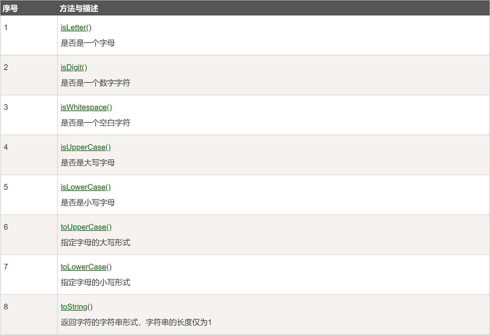

## String类

字符串在任何编程语言都是应用非常多的，Java提供了String类来对字符串进行操作。

创建字符串有两种方式：

**简单方式**

```java
String str = "Runoob";
```

**new关键字**

```java
String str2=new String("Runoob");
```

它们的区别在于，前者创建的字符串存放在公共池中，后者存放在堆上：

```java
// 简单方式 公共池
String s1 = "Runoob";             
String s2 = "Runoob";             
String s3 = s1;

// new关键字 堆
String s4 = new String("Runoob");   
String s5 = new String("Runoob");
```

如下图所示：


String有3个常用方法：

**获取长度**

```java
String site = "www.runoob.com";
int len = site.length();
```

**连接字符串**

```java
// 调用方法
"我的名字是 ".concat("Runoob");
// “+”操作符
"Hello," + " runoob" + "!"
```

**创建格式化字符串**

```java
String fs;
fs = String.format("浮点型变量的值为 " +
                   "%f, 整型变量的值为 " +
                   " %d, 字符串变量的值为 " +
                   " %s", floatVar, intVar, stringVar);
```

## StringBuilder类

String创建的字符串对象是不能修改的，如果想修改，那么需要用到StringBuffer和StringBuilder类。

**StringBuilder相对于StringBuffer来说有速度优秀，所以大多数时候使用StringBuilder即可。如果想要保证线程安全，那么只能使用StringBuffer。**

StringBuilder示例：

```java
public class RunoobTest{
    public static void main(String args[]){
        StringBuilder sb = new StringBuilder(10);
        sb.append("Runoob..");
        System.out.println(sb);  
        sb.append("!");
        System.out.println(sb); 
        sb.insert(8, "Java");
        System.out.println(sb); 
        sb.delete(5,8);
        System.out.println(sb);  
    }
```

## StringBuffer类

示例：

```java
public class Test{
  public static void main(String args[]){
    StringBuffer sBuffer = new StringBuffer("菜鸟教程官网：");
    sBuffer.append("www");
    sBuffer.append(".runoob");
    sBuffer.append(".com");
    System.out.println(sBuffer);  
  }
}
```

## 数组

**Java中的数组是用来存储固定大小的同类型元素。**

声明方式：

```java
dataType[] arrayRefVar;
```

创建数组：

```java
arrayRefVar = new dataType[arraySize];
```

声明和创建可以一行代码搞定：

```java
dataType[] arrayRefVar = new dataType[arraySize];
```

在创建时同时初始化值：

```java
dataType[] arrayRefVar = {value0, value1, ..., valuek};
```

或者创建匿名数组：

```java
System.out.println(Arrays.toString(new int[]{3, 1, 2, 6, 4, 2}));
```

数组是通过索引来访问元素的，索引值从0到arrayRefVar.length-1。

可以使用for循环来遍历数组，比如：

```java
public class TestArray {
   public static void main(String[] args) {
      double[] myArray = {1.9, 2.9, 3.4, 3.5};
 
      // 打印所有数组元素
      for (int i = 0; i < myArray.length; i++) {
         System.out.println(myArray[i] + " ");
      }
      // 计算所有元素的总和
      double total = 0;
      for (int i = 0; i < myArray.length; i++) {
         total += myArray[i];
      }
      System.out.println("Total is " + total);
      // 查找最大元素
      double max = myArray[0];
      for (int i = 1; i < myArray.length; i++) {
         if (myArray[i] > max) max = myArray[i];
      }
      System.out.println("Max is " + max);
   }
}
```

也能使用for each在不使用下标的情况下遍历数组：

```java
for(type element: array)
{
    System.out.println(element);
}
```

比如：

```java
public class TestArray {
   public static void main(String[] args) {
      double[] myArray = {1.9, 2.9, 3.4, 3.5};
 
      // 打印所有数组元素
      for (double element: myArray) {
         System.out.println(element);
      }
   }
}
```

前面介绍的都是一维数组，除了一维数组，还有多维数组，比如：

```java
String[][] str = new String[3][4];
int[][] a = new int[2][3];
```

java.util.Arrays类提供了很多方法来操作数组，这些方法都是静态的。比如：

- toString：转换为字符串。
- fill：给数组赋值。
- sort：对数组排序。
- equals：比较数组。
- binarySearch：对排序好的数组进行二分查找。

## 方法

Java中没有函数的概念，只有方法这一说法。但实际上他们的作用是一模一样的，都是把一段代码进行封装后调用。

**方法的命名规则**

Java中的方法采用驼峰命名法，第一个单词首字母小写，后面每个单词首字母均大写，比如addPerson。

**方法定义**

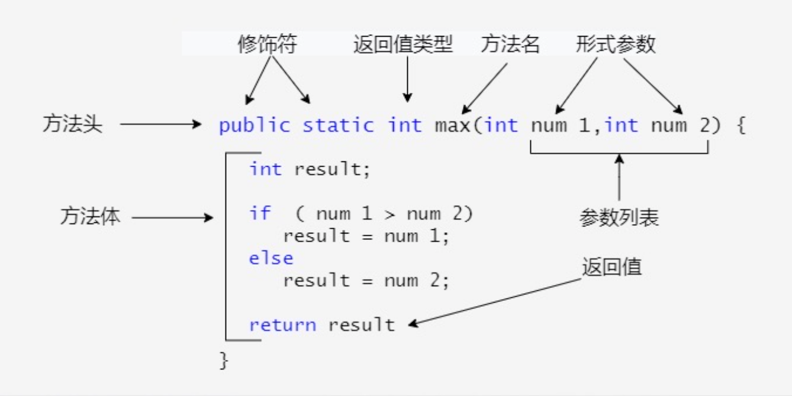

**main方法**

```java
public static void main(String[] args) {
	int i = 5;
	int j = 2;
	int k = max(i, j);
	System.out.println( i + " 和 " + j + " 比较，最大值是：" + k);
}
```

main方法的头部是不变的，带修饰符public和static，返回void类型值，方法名字是main，此外带一个String[]类型参数args。

**void**

void是Java基本数据类型之一，表明方法没有返回值。

**值传递**

Java方法的参数传递都是值传递。如果参数是基本类型，传递的值是基本类型字面量的拷贝。如果参数是对象，传递的值是对象引用的拷贝。

**构造方法**

构造方法和类名一模一样，是一种特殊的方法，没有返回值，在对象初始化时调用。一个类可以有多个构造方法，Java会根据参数进行匹配。比如：

```java
// 一个简单的构造函数
class MyClass {
    int x;

    // 构造函数
    MyClass() {
        x = 10;
    }

    // 构造函数
    MyClass(int i) {
        x = i;
    }
}
```

构造方法可以不用显式定义，Java会默认定义一个，一旦你定义了自己的构造方法，默认构造方法就会失效。默认构造方法的访问修饰符和类的访问修饰符相同，类为public构造方法也是public，类为protected构造方法也是protected。

**finalize()**

finalize()方式是构造函数的逆向，在对象销毁时调用，比如：

```java
public class FinalizationDemo {  
  public static void main(String[] args) {  
    Cake c1 = new Cake(1);  
    Cake c2 = new Cake(2);  
    Cake c3 = new Cake(3);  
      
    c2 = c3 = null;  
    System.gc(); //调用Java垃圾收集器
  }  
}  
 
class Cake extends Object {  
  private int id;  
  public Cake(int id) {  
    this.id = id;  
    System.out.println("Cake Object " + id + "is created");  
  }  
    
  protected void finalize() throws java.lang.Throwable {  
    super.finalize();  
    System.out.println("Cake Object " + id + "is disposed");  
  }  
}
```

**可变参数**

```
typeName... parameterName
```

一个方法中只能有一个可变参数，并且必须放在最后。比如：

```java
public class VarargsDemo {
    public static void main(String args[]) {
        // 调用可变参数的方法
        printMax(34, 3, 3, 2, 56.5);
        printMax(new double[]{1, 2, 3});
    }
 
    // 可变参数
    public static void printMax( double... numbers) {
        if (numbers.length == 0) {
            System.out.println("No argument passed");
            return;
        }
 
        double result = numbers[0];
 
        for (int i = 1; i <  numbers.length; i++){
            if (numbers[i] >  result) {
                result = numbers[i];
            }
        }
        System.out.println("The max value is " + result);
    }
}
```

## 异常处理

Java的异常检测格外的严格，如果没有合适的处理异常，有可能代码都无法编译。Java异常类如下图所示：


Throwable类有两个类Error和Exception，图中也列举了几个常见的子类，比如OutOfMemoryError内存溢出、NullPointerException空指针异常等。

**捕获异常**

```java
try
{
   // 程序代码
}catch(ExceptionName e1)
{
   //Catch 块
}
```

示例：

```java
// 文件名 : ExcepTest.java
import java.io.*;
public class ExcepTest{
 
   public static void main(String args[]){
      try{
         int a[] = new int[2];
         System.out.println("Access element three :" + a[3]);
      }catch(ArrayIndexOutOfBoundsException e){
         System.out.println("Exception thrown  :" + e);
      }
      System.out.println("Out of the block");
   }
}
```

**多重捕获**

一个try后面可以跟多个catch：

```java
try{
   // 程序代码
}catch(异常类型1 异常的变量名1){
  // 程序代码
}catch(异常类型2 异常的变量名2){
  // 程序代码
}catch(异常类型3 异常的变量名3){
  // 程序代码
}
```

示例：

```java
try {
    file = new FileInputStream(fileName);
    x = (byte) file.read();
} catch(FileNotFoundException f) { // Not valid!
    f.printStackTrace();
    return -1;
} catch(IOException i) {
    i.printStackTrace();
    return -1;
}
```

**throws/throw**

throws放在方法尾部用来抛出异常，throw放在方法中用来抛出异常。

```java
import java.io.*;
public class className
{
  public void deposit(double amount) throws RemoteException
  {
    // Method implementation
    throw new RemoteException();
  }
  //Remainder of class definition
}
```

一个方法可以抛出多个异常：

```java
import java.io.*;
public class className
{
   public void withdraw(double amount) throws RemoteException,
                              InsufficientFundsException
   {
       // Method implementation
   }
   //Remainder of class definition
}
```

**finally**

无论是否发生异常，finally代码块中的代码总会被执行。finally代码块不是必须而是可选的。

```java
try{
  // 程序代码
}catch(异常类型1 异常的变量名1){
  // 程序代码
}catch(异常类型2 异常的变量名2){
  // 程序代码
}finally{
  // 程序代码
}
```

示例：

```java
public class ExcepTest{
  public static void main(String args[]){
    int a[] = new int[2];
    try{
       System.out.println("Access element three :" + a[3]);
    }catch(ArrayIndexOutOfBoundsException e){
       System.out.println("Exception thrown  :" + e);
    }
    finally{
       a[0] = 6;
       System.out.println("First element value: " +a[0]);
       System.out.println("The finally statement is executed");
    }
  }
}
```

**自定义异常**

继承Exception或RuntimeException类可以自定义异常，比如：

```java
// 文件名InsufficientFundsException.java
import java.io.*;
 
//自定义异常类，继承Exception类
public class InsufficientFundsException extends Exception
{
  //此处的amount用来储存当出现异常（取出钱多于余额时）所缺乏的钱
  private double amount;
  public InsufficientFundsException(double amount)
  {
    this.amount = amount;
  } 
  public double getAmount()
  {
    return amount;
  }
}
```

定义好以后就可以`throw new InsufficientFundsException(needs);`抛出异常，然后再`try{} catch(InsufficientFundsException e){} `捕获异常。


> 参考资料：
>
> JDK维基百科 https://zh.wikipedia.org/zh-hans/JDK
>
> Java菜鸟教程 https://www.runoob.com/java/java-tutorial.html
>
> Java 到底是值传递还是引用传递？https://www.zhihu.com/question/31203609