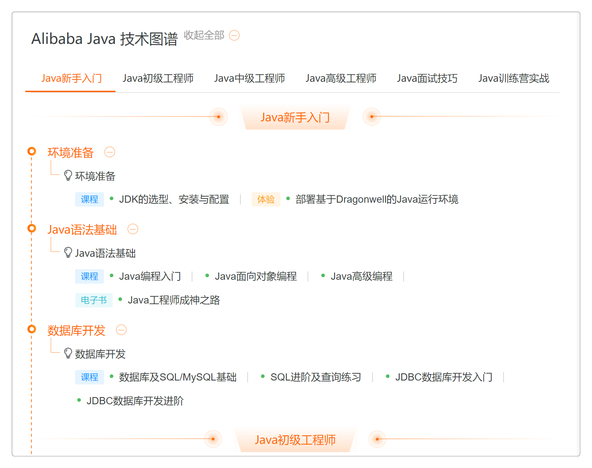
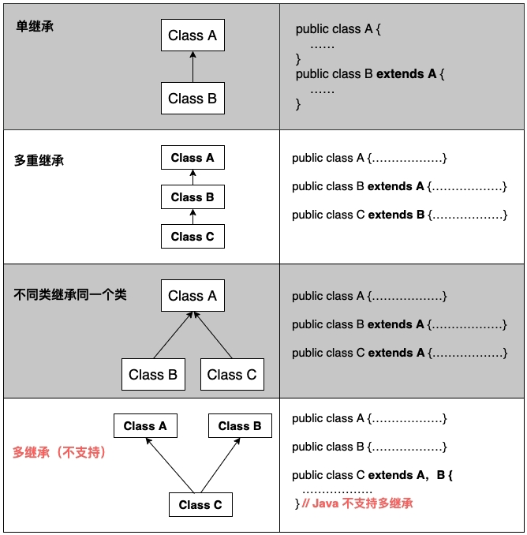
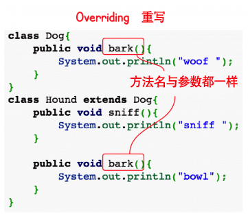
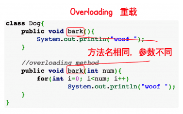
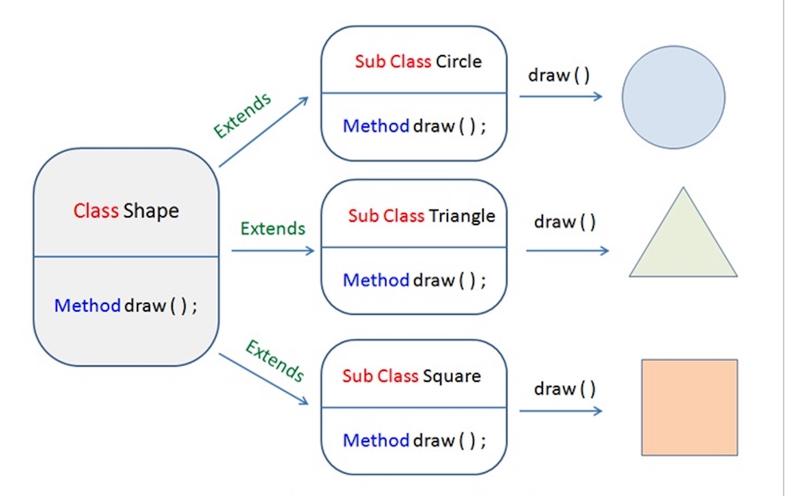
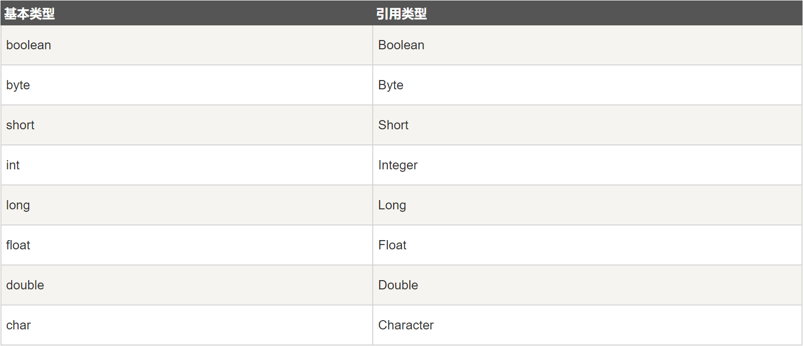
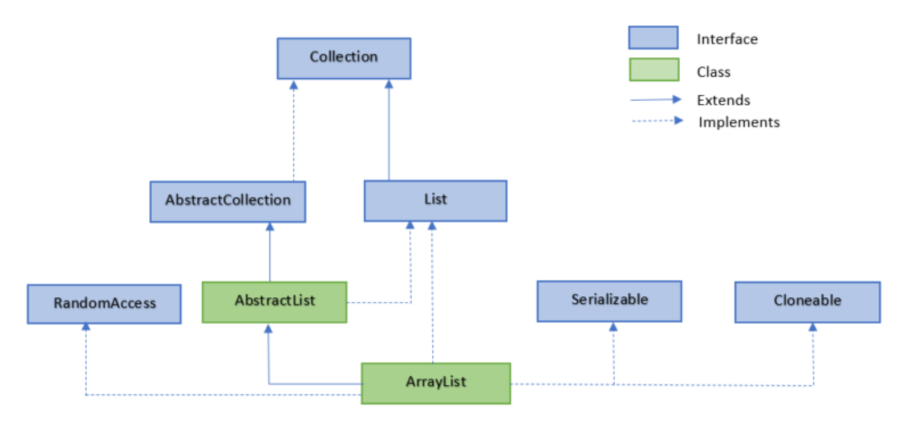
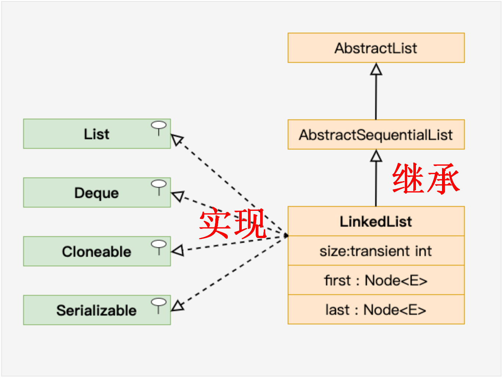

# 【进阶】Java高级编程精华笔记


## 学习路线

本文是Java高级编程精华笔记，是对菜鸟教程中Java面向对象和Java高级编程的重要章节进行了学习，整理形成的学习笔记，知识图谱如下图所示：


如果想对Java深入学习，可以参考**阿里巴巴的技术图谱**：

https://developer.aliyun.com/graph/java



## 继承

Java使用`extends`关键字来声明继承：

```
class 父类 {
}

class 子类 extends 父类 {
}
```

示例，子类企鹅和子类老鼠继承父类动物：

```java
//父类：动物
public class Animal {
    private String name;
    private int id;

    public Animal(String myName, int myid) {
        name = myName;
        id = myid;
    }

    public void eat() {
        System.out.println(name + "正在吃");
    }

    public void sleep() {
        System.out.println(name + "正在睡");
    }

    public void introduction() {
        System.out.println("大家好！我是" + id + "号" + name + ".");
    }
}
```

```java
//子类：企鹅
public class Penguin extends Animal { 
    public Penguin(String myName, int myid) { 
        super(myName, myid); 
    } 
}
```

```java
//子类：老鼠
public class Mouse extends Animal { 
    public Mouse(String myName, int myid) { 
        super(myName, myid); 
    } 
}
```

Java只支持单继承，不支持多继承，但可以多重继承：



- 子类会继承父类的非private属性、方法。

- 子类可以扩展自己的属性、方法。

- 子类可以覆盖父类的方法，用自己的方式实现。

也就是，**你的是我的，我的还是我的，我还可以改变你的**。

- 构造器，子类不会继承父类，而且如果父类的构造器有参数，子类必须通过`super`关键字显式调用。

也就是，**你老子始终是你老子**。

**implements关键字**

前面说到了Java使用extends声明**继承类**，而implements用来声明**实现接口**，并且可以同时实现多个接口。

```java
public interface A {
    public void eat();
    public void sleep();
}

public interface B {
    public void show();
}

public class C implements A,B {
}
```

**super和this关键字**

super：用来实现对父类成员的访问。

this：指向自己的引用。

示例：

```java
class Animal {
  void eat() {
    System.out.println("animal : eat");
  }
}

class Dog extends Animal {
  void eat() {
    System.out.println("dog : eat");
  }
  void eatTest() {
    this.eat();   // this 调用自己的方法
    super.eat();  // super 调用父类方法
  }
}

public class Test {
  public static void main(String[] args) {
    Animal a = new Animal();
    a.eat();
    Dog d = new Dog();
    d.eatTest();
  }
}
```

**final关键字**

如果修饰类，则表示类不能被继承。如果修饰方法，则表示方法不能被子类重写。

## 重写与重载

重写与重载的区别可以通过下面这张图来看：


重写就是子类覆盖父类，方法名和参数都一样：



重载就是在一个类里面的多个方法，方法名相同，参数不同。调用时根据入参匹配到不同的方法：



## 多态

多态是同一个行为具有多个不同表现形式或形态的能力。重写可以看做是父类和子类之间多态性的一种表现（重载可以理解成多态的具体表现形式），如图所示：



```java
class Shape {
    void draw() {}
}

class Circle extends Shape {
    void draw() {
        System.out.println("Circle.draw()");
    }
}

class Square extends Shape {
    void draw() {
        System.out.println("Square.draw()");
    }
}

class Triangle extends Shape {
    void draw() {
        System.out.println("Triangle.draw()");
    }
}
```

多态存在有三个必要条件：

- 继承

- 重写

- 父类引用指向子类对象：`Parent p = new Child();`

当使用多态方式调用方法时，首先检查父类中是否有该方法，如果没有，则编译错误；如果有，再去调用子类的同名方法。

多态有三种实现方式：

1. 重写

2. 接口

3. 抽象类和抽象方法

## 抽象类

抽象类更普通类的区别在于，它不能实例化对象，只能被继承使用。抽象类使用`abstract`关键字定义：

```java
public abstract class Employee
{
   private String name;
   private String address;
   private int number;
   public Employee(String name, String address, int number)
   {
      System.out.println("Constructing an Employee");
      this.name = name;
      this.address = address;
      this.number = number;
   }
   public double computePay()
   {
     System.out.println("Inside Employee computePay");
     return 0.0;
   }
   public void mailCheck()
   {
      System.out.println("Mailing a check to " + this.name
       + " " + this.address);
   }
   public String toString()
   {
      return name + " " + address + " " + number;
   }
   public String getName()
   {
      return name;
   }
   public String getAddress()
   {
      return address;
   }
   public void setAddress(String newAddress)
   {
      address = newAddress;
   }
   public int getNumber()
   {
     return number;
   }
}
```

**抽象方法**

抽象类里面既可以定义普通方法，也可以定义抽象方法：

```java
public abstract class Employee
{
   private String name;
   private String address;
   private int number;

   public abstract double computePay();
}
```

抽象方法也是通过`abstract`关键字定义，只有方法名，没有方法体（方法名后面是分号而不是花括号），具体实现由它的子类确定。

抽象方法最终必须被重写了才能在实例化对象中使用。如果一个类继承了带有抽象方法的抽象类，那么这个类要么也是抽象类，要么就必须重写抽象方法。

## 接口

**接口不是类**，它们属于不同的概念。接口通过`interface`关键字来定义：

```java
public interface Animal {
   public void eat();
   public void travel();
}
```

- 接口和接口中的方法是隐式抽象的，不必使用`abstract`关键字。

- 接口中的方法都是`public`。

类使用`implements`关键字实现接口：

```java
public class MammalInt implements Animal{

   public void eat(){
      System.out.println("Mammal eats");
   }

   public void travel(){
      System.out.println("Mammal travels");
   } 

   public int noOfLegs(){
      return 0;
   }

   public static void main(String args[]){
      MammalInt m = new MammalInt();
      m.eat();
      m.travel();
   }
}
```

类必须实现接口里面的所有方法，否则会编译失败。只有抽象类才可以不实现接口的方法。

一个接口能继承另一个接口，接口的继承也是使用`extends`关键字：

```java
// 文件名: Sports.java
public interface Sports
{
   public void setHomeTeam(String name);
   public void setVisitingTeam(String name);
}

// 文件名: Football.java
public interface Football extends Sports
{
   public void homeTeamScored(int points);
   public void visitingTeamScored(int points);
   public void endOfQuarter(int quarter);
}

// 文件名: Hockey.java
public interface Hockey extends Sports
{
   public void homeGoalScored();
   public void visitingGoalScored();
   public void endOfPeriod(int period);
   public void overtimePeriod(int ot);
}
```

并且接口支持多继承：

```java
public interface Hockey extends Sports, Event
```

实现了子接口的类，需要同时实现所有父接口中的方法。

接口里面也可以没有方法：

```java
package java.util;
public interface EventListener
{} 
```

它的主要目的是：

1. 建立一个公共的父接口。

2. 让实现它的类属于一个特定的类型。

## 枚举

**枚举是一种特殊的类**，一般用来表示一组常量。枚举使用`enum`关键字来定义，常量使用逗号`,`分隔：

```java
enum Color
{
    RED, GREEN, BLUE;
}
 
public class Test
{
    // 执行输出结果
    public static void main(String[] args)
    {
        Color c1 = Color.RED;
        System.out.println(c1);
    }
}
```

枚举也可以声明在内部类中：

```java
public class Test
{
    enum Color
    {
        RED, GREEN, BLUE;
    }
 
    // 执行输出结果
    public static void main(String[] args)
    {
        Color c1 = Color.RED;
        System.out.println(c1);
    }
}
```

枚举可以使用for语句遍历：

```java
enum Color
{
    RED, GREEN, BLUE;
}
public class MyClass {
  public static void main(String[] args) {
    for (Color myVar : Color.values()) {
      System.out.println(myVar);
    }
  }
}
```

也可以用在switch语句中：

```java
enum Color
{
    RED, GREEN, BLUE;
}
public class MyClass {
  public static void main(String[] args) {
    Color myVar = Color.BLUE;

    switch(myVar) {
      case RED:
        System.out.println("红色");
        break;
      case GREEN:
         System.out.println("绿色");
        break;
      case BLUE:
        System.out.println("蓝色");
        break;
    }
  }
}
```

enum定义的枚举默认继承了`java.lang.Enum`类，具有3个方法：

- `values()`，返回枚举中所有常量。

- `ordinal()`，返回常量的索引。

- `valueOf()`，返回指定字符串值的常量。

```java
enum Color
{
    RED, GREEN, BLUE;
}
 
public class Test
{
    public static void main(String[] args)
    {
        // 调用 values()
        Color[] arr = Color.values();
 
        // 迭代枚举
        for (Color col : arr)
        {
            // 查看索引
            System.out.println(col + " at index " + col.ordinal());
        }
 
        // 使用 valueOf() 返回枚举常量，不存在的会报错 IllegalArgumentException
        System.out.println(Color.valueOf("RED"));
    }
}
```

枚举跟普通类一样可以定义变量、方法和构造函数：

```java
enum Color
{
    RED, GREEN, BLUE;
 
    // 构造函数
    private Color()
    {
        System.out.println("Constructor called for : " + this.toString());
    }
 
    public void colorInfo()
    {
        System.out.println("Universal Color");
    }
}
 
public class Test
{    
    // 输出
    public static void main(String[] args)
    {
        Color c1 = Color.RED;
        System.out.println(c1);
        c1.colorInfo();
    }
}
```

输出：

```
Constructor called for : RED
Constructor called for : GREEN
Constructor called for : BLUE
RED
Universal Color
```

## 包

包可以理解为类的目录，使用`package`关键字定义：

```java
package com.runoob;
public class Runoob {
      
}
```

一个公司一般使用它互联网域名的倒序形式来作为它的包名，比如runoob.com，所有的包名都以com.runoob开头。

**同一个包中的类可以直接访问，而访问不同的包需要先import。**

```java
//导入包下所有类
import payroll.*;
//导入包下某个类
import payroll.Employee;
```

## 集合


集合（Collections）和数组（Arrays）的区别：

- 长度区别：数组固定；集合可变。
- 内容区别：数组既可以是基本类型，也可以是引用类型；集合只能是引用类型。
- 存储类型：数组只能存储一种类型；集合可以存储不同类型（但一般也只存储一种类型）

> 集合中只能使用基本类型的包装类：
>
> 

集合主要包括两种类型的容器：Collection和Map，Collection是元素集合，Map是键值对。

集合有3个层次：


接口代表集合的抽象数据类型，我们重点关注实现类和算法，尤其是4种常用实现类：ArrayList、LinkedList、HashSet、HashMap。

## ArrayList

ArrayList相当于可以动态修改的数组。它继承了AbstractList，并实现了List接口：



**定义**

```java
import java.util.ArrayList; // 引入 ArrayList 类

ArrayList<E> objectName = new ArrayList<>();　 // 初始化
```

**添加元素**

使用add()方法：

```java
import java.util.ArrayList;

public class RunoobTest {
    public static void main(String[] args) {
        ArrayList<String> sites = new ArrayList<String>();
        sites.add("Google");
        sites.add("Runoob");
        sites.add("Taobao");
        sites.add("Weibo");
        System.out.println(sites);
    }
}
```

**访问元素**

使用get()方法：

```java
import java.util.ArrayList;

public class RunoobTest {
    public static void main(String[] args) {
        ArrayList<String> sites = new ArrayList<String>();
        sites.add("Google");
        sites.add("Runoob");
        sites.add("Taobao");
        sites.add("Weibo");
        System.out.println(sites.get(1));  // 访问第二个元素
    }
}
```

**修改元素**

使用set()方法：

```java
import java.util.ArrayList;

public class RunoobTest {
    public static void main(String[] args) {
        ArrayList<String> sites = new ArrayList<String>();
        sites.add("Google");
        sites.add("Runoob");
        sites.add("Taobao");
        sites.add("Weibo");
        sites.set(2, "Wiki"); // 第一个参数为索引位置，第二个为要修改的值
        System.out.println(sites);
    }
}
```

**删除元素**

使用remove()方法：

```java
import java.util.ArrayList;

public class RunoobTest {
    public static void main(String[] args) {
        ArrayList<String> sites = new ArrayList<String>();
        sites.add("Google");
        sites.add("Runoob");
        sites.add("Taobao");
        sites.add("Weibo");
        sites.remove(3); // 删除第四个元素
        System.out.println(sites);
    }
}
```

**计算大小**

使用size()方法：

```java
import java.util.ArrayList;

public class RunoobTest {
    public static void main(String[] args) {
        ArrayList<String> sites = new ArrayList<String>();
        sites.add("Google");
        sites.add("Runoob");
        sites.add("Taobao");
        sites.add("Weibo");
        System.out.println(sites.size());
    }
}
```

**迭代遍历**

for循环：

```java
import java.util.ArrayList;

public class RunoobTest {
    public static void main(String[] args) {
        ArrayList<String> sites = new ArrayList<String>();
        sites.add("Google");
        sites.add("Runoob");
        sites.add("Taobao");
        sites.add("Weibo");
        for (int i = 0; i < sites.size(); i++) {
            System.out.println(sites.get(i));
        }
    }
}
```

for-each语句：

```java
import java.util.ArrayList;

public class RunoobTest {
    public static void main(String[] args) {
        ArrayList<String> sites = new ArrayList<String>();
        sites.add("Google");
        sites.add("Runoob");
        sites.add("Taobao");
        sites.add("Weibo");
        for (String i : sites) {
            System.out.println(i);
        }
    }
}
```

**排序**

使用Collections.sort()方法：

```java
import java.util.ArrayList;
import java.util.Collections;  // 引入 Collections 类

public class RunoobTest {
    public static void main(String[] args) {
        ArrayList<String> sites = new ArrayList<String>();
        sites.add("Taobao");
        sites.add("Wiki");
        sites.add("Runoob");
        sites.add("Weibo");
        sites.add("Google");
        Collections.sort(sites);  // 字母排序
        for (String i : sites) {
            System.out.println(i);
        }
    }
}
```

## LinkedList

LinkedList是链表，分为单向链表和双向链表。

单向链表包含2个值，①当前节点的值，②下一个节点的链接：


双向链表包含3个值，①当前节点的值，②向前的节点链接，③向后的节点链接：


与ArrayList相比，LinkedList的增加和删除的效率更高，而修改和查找的效率更低。

> 快速记忆法：
>
> 增删：LinkedList
>
> 改查：ArrayList

LinkedList继承了AbstractSequentialList，实现了很多接口：



**定义**

```java
// 引入 LinkedList 类
import java.util.LinkedList; 

LinkedList<E> list = new LinkedList<E>();   // 普通创建方法
或者
LinkedList<E> list = new LinkedList(Collection<? extends E> c); // 使用集合创建链表
```

**添加元素**

```java
import java.util.LinkedList;

public class RunoobTest {
    public static void main(String[] args) {
        LinkedList<String> sites = new LinkedList<String>();
        sites.add("Google");
        sites.add("Runoob");
        sites.add("Taobao");
        sites.add("Weibo");
        System.out.println(sites);
    }
}
```

**在列表开头添加元素**

使用addFirst()方法：

```java
// 引入 LinkedList 类
import java.util.LinkedList;

public class RunoobTest {
    public static void main(String[] args) {
        LinkedList<String> sites = new LinkedList<String>();
        sites.add("Google");
        sites.add("Runoob");
        sites.add("Taobao");
        // 使用 addFirst() 在头部添加元素
        sites.addFirst("Wiki");
        System.out.println(sites);
    }
}
```

**在列表结尾添加元素**

使用addLast()方法：

```java
// 引入 LinkedList 类
import java.util.LinkedList;

public class RunoobTest {
    public static void main(String[] args) {
        LinkedList<String> sites = new LinkedList<String>();
        sites.add("Google");
        sites.add("Runoob");
        sites.add("Taobao");
        // 使用 addLast() 在尾部添加元素
        sites.addLast("Wiki");
        System.out.println(sites);
    }
}
```

**在列表开头移除元素**

使用removeFirst()方法：

```java
// 引入 LinkedList 类
import java.util.LinkedList;

public class RunoobTest {
    public static void main(String[] args) {
        LinkedList<String> sites = new LinkedList<String>();
        sites.add("Google");
        sites.add("Runoob");
        sites.add("Taobao");
        sites.add("Weibo");
        // 使用 removeFirst() 移除头部元素
        sites.removeFirst();
        System.out.println(sites);
    }
}
```

**在列表结果移除元素**

使用removeLast()方法：

```java
// 引入 LinkedList 类
import java.util.LinkedList;

public class RunoobTest {
    public static void main(String[] args) {
        LinkedList<String> sites = new LinkedList<String>();
        sites.add("Google");
        sites.add("Runoob");
        sites.add("Taobao");
        sites.add("Weibo");
        // 使用 removeLast() 移除尾部元素
        sites.removeLast();
        System.out.println(sites);
    }
}
```

**获取列表开头的元素**

使用getFirst()方法：

```java
// 引入 LinkedList 类
import java.util.LinkedList;

public class RunoobTest {
    public static void main(String[] args) {
        LinkedList<String> sites = new LinkedList<String>();
        sites.add("Google");
        sites.add("Runoob");
        sites.add("Taobao");
        sites.add("Weibo");
        // 使用 getFirst() 获取头部元素
        System.out.println(sites.getFirst());
    }
}
```

**获取列表结尾的元素**

使用getLast()方法：

```java
// 引入 LinkedList 类
import java.util.LinkedList;

public class RunoobTest {
    public static void main(String[] args) {
        LinkedList<String> sites = new LinkedList<String>();
        sites.add("Google");
        sites.add("Runoob");
        sites.add("Taobao");
        sites.add("Weibo");
        // 使用 getLast() 获取尾部元素
        System.out.println(sites.getLast());
    }
}
```

**迭代元素**

可以使用for循环：

```java
// 引入 LinkedList 类
import java.util.LinkedList;

public class RunoobTest {
    public static void main(String[] args) {
        LinkedList<String> sites = new LinkedList<String>();
        sites.add("Google");
        sites.add("Runoob");
        sites.add("Taobao");
        sites.add("Weibo");
        for (int size = sites.size(), i = 0; i < size; i++) {
            System.out.println(sites.get(i));
        }
    }
}
```

也可以使用for-each语句：

```java
// 引入 LinkedList 类
import java.util.LinkedList;

public class RunoobTest {
    public static void main(String[] args) {
        LinkedList<String> sites = new LinkedList<String>();
        sites.add("Google");
        sites.add("Runoob");
        sites.add("Taobao");
        sites.add("Weibo");
        for (String i : sites) {
            System.out.println(i);
        }
    }
}
```

## HashMap

HashMap叫做哈希表，相当于键值对(key-value)的字典。它继承于AbstractMap，实现了Map、Cloneable、java.io.Serializable接口：


**定义**

```java
import java.util.HashMap; // 引入 HashMap 类

HashMap<Integer, String> Sites = new HashMap<>();
```

> HashMap中只能使用基本类型的包装类，因为HashMap也是集合一种，在集合中只能使用包装类。

**添加元素**

使用put()方法：

```java
// 引入 HashMap 类      
import java.util.HashMap;

public class RunoobTest {
    public static void main(String[] args) {
        // 创建 HashMap 对象 Sites
        HashMap<Integer, String> Sites = new HashMap<Integer, String>();
        // 添加键值对
        Sites.put(1, "Google");
        Sites.put(2, "Runoob");
        Sites.put(3, "Taobao");
        Sites.put(4, "Zhihu");
        System.out.println(Sites);
    }
}
```

**访问元素**

使用get()方法：

```java
// 引入 HashMap 类      
import java.util.HashMap;

public class RunoobTest {
    public static void main(String[] args) {
        // 创建 HashMap 对象 Sites
        HashMap<Integer, String> Sites = new HashMap<Integer, String>();
        // 添加键值对
        Sites.put(1, "Google");
        Sites.put(2, "Runoob");
        Sites.put(3, "Taobao");
        Sites.put(4, "Zhihu");
        System.out.println(Sites.get(3));
    }
}
```

**删除元素**

使用remove()方法：

```java
// 引入 HashMap 类      
import java.util.HashMap;

public class RunoobTest {
    public static void main(String[] args) {
        // 创建 HashMap 对象 Sites
        HashMap<Integer, String> Sites = new HashMap<Integer, String>();
        // 添加键值对
        Sites.put(1, "Google");
        Sites.put(2, "Runoob");
        Sites.put(3, "Taobao");
        Sites.put(4, "Zhihu");
        Sites.remove(4);
        System.out.println(Sites);
    }
}
```

**删除所有键值对**

使用clear()方法：

```java
// 引入 HashMap 类      
import java.util.HashMap;

public class RunoobTest {
    public static void main(String[] args) {
        // 创建 HashMap 对象 Sites
        HashMap<Integer, String> Sites = new HashMap<Integer, String>();
        // 添加键值对
        Sites.put(1, "Google");
        Sites.put(2, "Runoob");
        Sites.put(3, "Taobao");
        Sites.put(4, "Zhihu");
        Sites.clear();
        System.out.println(Sites);
    }
}
```

**计算大小**

使用size()方法：

```java
// 引入 HashMap 类      
import java.util.HashMap;

public class RunoobTest {
    public static void main(String[] args) {
        // 创建 HashMap 对象 Sites
        HashMap<Integer, String> Sites = new HashMap<Integer, String>();
        // 添加键值对
        Sites.put(1, "Google");
        Sites.put(2, "Runoob");
        Sites.put(3, "Taobao");
        Sites.put(4, "Zhihu");
        System.out.println(Sites.size());
    }
}
```

**迭代**

**推荐使用entrySet：**

```java
Map<Integer, Integer> map = new HashMap<Integer, Integer>();
for(Map.Entry<Integer, Integer> entry : map.entrySet()){
	System.out.println("key = " + entry.getKey() + ", value = " + entry.getValue())
}
```

也可以用其他方式：

```java
// 引入 HashMap 类      
import java.util.HashMap;

public class RunoobTest {
    public static void main(String[] args) {
        // 创建 HashMap 对象 Sites
        HashMap<Integer, String> Sites = new HashMap<Integer, String>();
        // 添加键值对
        Sites.put(1, "Google");
        Sites.put(2, "Runoob");
        Sites.put(3, "Taobao");
        Sites.put(4, "Zhihu");
        // 输出 key 和 value
        for (Integer i : Sites.keySet()) {
            System.out.println("key: " + i + " value: " + Sites.get(i));
        }
        // 返回所有 value 值
        for(String value: Sites.values()) {
          // 输出每一个value
          System.out.print(value + ", ");
        }
    }
}
```

## HashSet

HashSet是一个不允许有重复元素的集合。它实现了Set接口：


**定义**

```java
import java.util.HashSet; // 引入 HashSet 类

HashSet<String> sites = new HashSet<String>();
```

**添加元素**

```java
// 引入 HashSet 类      
import java.util.HashSet;

public class RunoobTest {
    public static void main(String[] args) {
    HashSet<String> sites = new HashSet<String>();
        sites.add("Google");
        sites.add("Runoob");
        sites.add("Taobao");
        sites.add("Zhihu");
        sites.add("Runoob");  // 重复的元素不会被添加
        System.out.println(sites);
    }
}
```

**判断元素是否存在**

使用contains()方法：

```java
// 引入 HashSet 类      
import java.util.HashSet;

public class RunoobTest {
    public static void main(String[] args) {
    HashSet<String> sites = new HashSet<String>();
        sites.add("Google");
        sites.add("Runoob");
        sites.add("Taobao");
        sites.add("Zhihu");
        sites.add("Runoob");  // 重复的元素不会被添加
        System.out.println(sites.contains("Taobao"));
    }
}
```

**删除元素**

使用remove()方法：

```java
// 引入 HashSet 类      
import java.util.HashSet;

public class RunoobTest {
    public static void main(String[] args) {
    HashSet<String> sites = new HashSet<String>();
        sites.add("Google");
        sites.add("Runoob");
        sites.add("Taobao");
        sites.add("Zhihu");
        sites.add("Runoob");     // 重复的元素不会被添加
        sites.remove("Taobao");  // 删除元素，删除成功返回 true，否则为 false
        System.out.println(sites);
    }
}
```

**删除所有元素**

使用clear()方法：

```java
// 引入 HashSet 类      
import java.util.HashSet;

public class RunoobTest {
    public static void main(String[] args) {
    HashSet<String> sites = new HashSet<String>();
        sites.add("Google");
        sites.add("Runoob");
        sites.add("Taobao");
        sites.add("Zhihu");
        sites.add("Runoob");     // 重复的元素不会被添加
        sites.clear();  
        System.out.println(sites);
    }
}
```

**计算大小**

使用size()方法：

```java
// 引入 HashSet 类      
import java.util.HashSet;

public class RunoobTest {
    public static void main(String[] args) {
    HashSet<String> sites = new HashSet<String>();
        sites.add("Google");
        sites.add("Runoob");
        sites.add("Taobao");
        sites.add("Zhihu");
        sites.add("Runoob");     // 重复的元素不会被添加
        System.out.println(sites.size());  
    }
}
```

**迭代**

使用for-each语句：

```java
// 引入 HashSet 类      
import java.util.HashSet;

public class RunoobTest {
    public static void main(String[] args) {
    HashSet<String> sites = new HashSet<String>();
        sites.add("Google");
        sites.add("Runoob");
        sites.add("Taobao");
        sites.add("Zhihu");
        sites.add("Runoob");     // 重复的元素不会被添加
        for (String i : sites) {
            System.out.println(i);
        }
    }
}
```

## Iterator

Iterator是迭代器，可以用来迭代ArrayList等集合。迭代器主要有3个方法：

- next()：返回下一个元素，并更新迭代器状态。
- hasNext()：检查是否还有元素。
- remove()：删除元素。

**获取集合的迭代器**

```java
// 引入 ArrayList 和 Iterator 类
import java.util.ArrayList;
import java.util.Iterator;

public class RunoobTest {
    public static void main(String[] args) {

        // 创建集合
        ArrayList<String> sites = new ArrayList<String>();
        sites.add("Google");
        sites.add("Runoob");
        sites.add("Taobao");
        sites.add("Zhihu");

        // 获取迭代器
        Iterator<String> it = sites.iterator();

        // 输出集合中的第一个元素
        System.out.println(it.next());
    }
}
```

**迭代器遍历集合**

```java
// 引入 ArrayList 和 Iterator 类
import java.util.ArrayList;
import java.util.Iterator;

public class RunoobTest {
    public static void main(String[] args) {

        // 创建集合
        ArrayList<String> sites = new ArrayList<String>();
        sites.add("Google");
        sites.add("Runoob");
        sites.add("Taobao");
        sites.add("Zhihu");

        // 获取迭代器
        Iterator<String> it = sites.iterator();

        // 输出集合中的所有元素
        while(it.hasNext()) {
            System.out.println(it.next());
        }
    }
}
```

**删除元素**

```java
// 引入 ArrayList 和 Iterator 类
import java.util.ArrayList;
import java.util.Iterator;

public class RunoobTest {
    public static void main(String[] args) {
        ArrayList<Integer> numbers = new ArrayList<Integer>();
        numbers.add(12);
        numbers.add(8);
        numbers.add(2);
        numbers.add(23);
        Iterator<Integer> it = numbers.iterator();
        while(it.hasNext()) {
            Integer i = it.next();
            if(i < 10) {  
                it.remove();  // 删除小于 10 的元素
            }
        }
        System.out.println(numbers);
    }
}
```

## 泛型

泛型可以理解为通用类型，不是具体某个类型，而是泛指某些类型。

Java中的泛型标记符如下所示：

- **E** - Element (在集合中使用，因为集合中存放的是元素)
- **T** - Type（Java 类）
- **K** - Key（键）
- **V** - Value（值）
- **N** - Number（数值类型）
- **？** - 表示不确定的 java 类型

示例：

```java
public class GenericMethodTest {
    // 泛型方法 printArray                         
    public static <E> void printArray(E[] inputArray) {
        // 输出数组元素            
        for (E element : inputArray) {
            System.out.printf("%s ", element);
        }
        System.out.println();
    }

    public static void main(String args[]) {
        // 创建不同类型数组： Integer, Double 和 Character
        Integer[] intArray = {1, 2, 3, 4, 5};
        Double[] doubleArray = {1.1, 2.2, 3.3, 4.4};
        Character[] charArray = {'H', 'E', 'L', 'L', 'O'};

        System.out.println("整型数组元素为:");
        printArray(intArray); // 传递一个整型数组

        System.out.println("\n双精度型数组元素为:");
        printArray(doubleArray); // 传递一个双精度型数组

        System.out.println("\n字符型数组元素为:");
        printArray(charArray); // 传递一个字符型数组
    }
}
```

其中`<E>`放在方法前表明这是一个泛型方法。可以通过`extends`限制类型的范围：

```java
public class MaximumTest
{
   // 比较三个值并返回最大值
   //java.lang.Comparable是个接口，包含一个compareTo()方法
   public static <T extends Comparable<T>> T maximum(T x, T y, T z)
   {                     
      T max = x; // 假设x是初始最大值
      if ( y.compareTo( max ) > 0 ){
         max = y; //y 更大
      }
      if ( z.compareTo( max ) > 0 ){
         max = z; // 现在 z 更大           
      }
      return max; // 返回最大对象
   }
   public static void main( String args[] )
   {
      System.out.printf( "%d, %d 和 %d 中最大的数为 %d\n\n",
                   3, 4, 5, maximum( 3, 4, 5 ) );
 
      System.out.printf( "%.1f, %.1f 和 %.1f 中最大的数为 %.1f\n\n",
                   6.6, 8.8, 7.7, maximum( 6.6, 8.8, 7.7 ) );
 
      System.out.printf( "%s, %s 和 %s 中最大的数为 %s\n","pear",
         "apple", "orange", maximum( "pear", "apple", "orange" ) );
   }
}
```

除了**泛型**、**泛型方法**，还可以定义**泛型类**：

```java
public class Box<T> {
   
  private T t;
 
  public void add(T t) {
    this.t = t;
  }
 
  public T get() {
    return t;
  }
 
  public static void main(String[] args) {
    Box<Integer> integerBox = new Box<Integer>();
    Box<String> stringBox = new Box<String>();
 
    integerBox.add(new Integer(10));
    stringBox.add(new String("菜鸟教程"));
 
    System.out.printf("整型值为 :%d\n\n", integerBox.get());
    System.out.printf("字符串为 :%s\n", stringBox.get());
  }
}
```

`?`是类型通配符，比如`List<?>`在逻辑上是`List<String>`、`List<Integer>`等的父类：

```java
import java.util.*;
 
public class GenericTest {
     
    public static void main(String[] args) {
        List<String> name = new ArrayList<String>();
        List<Integer> age = new ArrayList<Integer>();
        List<Number> number = new ArrayList<Number>();
        
        name.add("icon");
        age.add(18);
        number.add(314);
 
        getData(name);
        getData(age);
        getData(number);
       
   }
 
   public static void getData(List<?> data) {
      System.out.println("data :" + data.get(0));
   }
}
```

`?`也可以通过`extends`关键字来限定类型范围：

```java
import java.util.*;
 
public class GenericTest {
     
    public static void main(String[] args) {
        List<String> name = new ArrayList<String>();
        List<Integer> age = new ArrayList<Integer>();
        List<Number> number = new ArrayList<Number>();
        
        name.add("icon");
        age.add(18);
        number.add(314);
 
        //getUperNumber(name);//1
        getUperNumber(age);//2
        getUperNumber(number);//3
       
   }
 
   public static void getData(List<?> data) {
      System.out.println("data :" + data.get(0));
   }
   
    //只接受Number及其子类
   public static void getUperNumber(List<? extends Number> data) {
          System.out.println("data :" + data.get(0));
       }
}
```

`List<? extends Number`表示只接受Number及其子类（指定上限）。此外还能通过`List<? super Number>`来表示只能接受Number及其父类（指定下限）。

> 参考资料：
>
> Java面向对象 https://www.runoob.com/java/java-inheritance.html
>
> Java高级编程 https://www.runoob.com/java/java-data-structures.html
>
> Java集合超详解 https://blog.csdn.net/feiyanaffection/article/details/81394745
