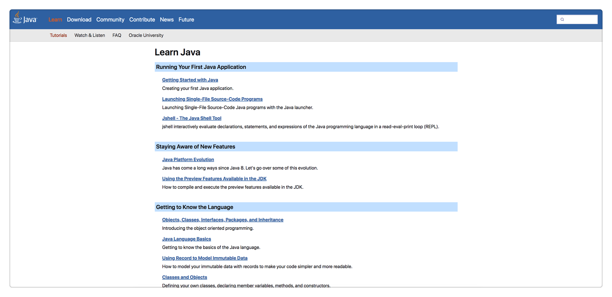

# 【进阶】刷完3个Java教程后不再犹豫

成年人最大的底气是你拥有一技之长，人生才不会被动。从事测试开发岗位，需要精通一门编程语言，是核心，是大招，是招牌技能。我内心一直在Java和Python之间选择，反复横跳。

**在《2020年度总结，似乎没有什么大的长进，似乎也得到了一些收获》中写到：** “Python 编程。我并不是没有编程基础，汇编语言、C 语言、C++、数据结构、算法导论是大学必修课，我自己学过 JavaScript、Java（大学有选修课我没报） 和 Golang。我的问题有 2 个，一个是同学对比下的挫败感导致对编程的畏惧，另一个是就业方向太多，我想的也太多，徘徊在十字路口，没有真正磨炼过。直到 Python 大火，我找到了适合我的路。它解决了我这 2 个问题，因为简单，所以我很轻松就能获得编程的成就感，Python 的生态虽然不是最好，但也还算不错。与其来回纠结，不如选择一条路走下去。精通 Python，也许能为我在工作上带来还没有出现过的那种兴奋。”

**在《2021非正式年度总结》中写到：** “在任何行业都存在金字塔原理，从下往上，越往上门槛越高，人越少，但是所获更多。对于测试来说，功能测试人员无疑是最多的，然后是自动化性能之类会写代码的，在写代码中，肯定是会Python的人是最多的，会Java的人少。而我身边除了前面提到的两位同事，以前听说拿高薪，以及我在招聘网站看到高薪岗位的要求，都是要求会Java的。甚至我还在TesterHome上研究了一些大佬，这些大佬有9成都是会Java的。在国内，Java程序员是最多的，会Java的测试理所当然会更加吃香。忘了说，去初创公司的那位同事，这家公司的创始人是阿里P10。”

很显然，最近这两三年，就是在犹豫中度过的。躁动的原因无非以下几点：

1、Python简单，Java太难；

2、只会Python好像还差点意思；

3、想学Java一直没找到门路；

直到我偶然遇见了它。

## Java官方教程

我花了2周时间，像看小说一样，迫不及待的把这个教程一口气看完了。最震撼的，反复品味的一个认知点是，Java8大数据类型：`byte`、`short`、`int`、`long`、`float`、`double`、`boolean`、`char`。它们都是**小写**。

> Java中有严格的大小写约定，大写字母开头的都是类名，基本类型都有对应的包装类，封装了更多对基本类型的方法，如Integer。

还有2个特殊的小写关键字：void和array(数组)。而大写的`String`其实是个类，而不是基本类型。

联想到Python的基本类型：Number(数字)、String(字符串)、List(列表)、Tuple(元组)、Set(集合)、Dictionary(字典)，一下就明白为啥Python是“万物皆对象”这句话的含义了。Python没有Java的**元类型**，Python的基本类型就已经是**类维度**的了。所以Python的变量都是指向的类的对象。Python中出现的`int()`、`str()`等小写的其实都是**函数**而已，不是基本类型。

语言果然是相通的！打通了这一点，很多之前卡住的概念顺理成章的就融会贯通了。对象、类、接口、包、继承、集合、泛化、Lambda表达式、注解、异常等概念很轻松就吃下来了。最难理解的还是Stream流那一块，以后在实践中再慢慢掌握吧。

另外一个感触很深的点是**Java的包管理机制**。它的命名是`公司域名倒置如com.jd + 一级目录 + 二级目录 + 三级目录 + 以此类推`的形式。Java提供了几个默认的包，比如`java.lang`，Java本身的很多类都在这个包里面，隐式已经import了，不需要再单独import。跟Python不一样的是，Python每个文件都是一个module，引用其他文件里面的对象必须import；而Java每个文件是一个class，文件夹是package，同一个package下面的文件，想引用其他文件里面的类不需要import。并且，Java只有相同层级的才是一个包，父文件夹和子文件夹不是同一个包，也就是说，子文件夹的class想引用父文件夹的class，还是需要import的。

理解了这一层，再看公司后端的代码，就要清晰很多了。所谓的分层设计，都要用到Java的包管理机制。

## SpringBoot官方教程

刷完Java官方教程后，我又马不停蹄的刷了SpringBoot官方教程。说实话体验很不好，我印象最深刻的就是`spring-boot-start`开头的是SpringBoot官方提供的封装好的库，而以它结尾的是三方自定义的库。这在看`pom.xml`的时候能有眉目一点。后面的知识点很多都是各种配置，加上全英文，理解难度很大。不过还是囫囵吞枣式的完整刷了一遍，说不定万一以后想到了，有点印象，能帮助检索呢。

> PS：后来明白了，SpringBoot本身就是约定大于配置，帮助简化开发的。真正要学习的框架是**Spring**。

## Java全栈知识体系

这不是官方教程了，是大佬整理的博客。建议大家重点看下Spring栏目下的内容。

我刷完了Spring、框架|中间件、架构3个栏目下的全部内容，大部分是略过，重点看了Spring演进过程、缓存、限流、降级和熔断、负载均衡几块内容。有三大收获：

**一、Spring是由bean构成的。** Spring中的bean相当于功能组件，我们通过组装这些bean来实现一个系统应用。IOC容器就是来存放这些bean的容器，IOC是控制反转，它的意思是，我们不需要自己用`new`来创建bean，而是由Spring来帮我们创建bean。把创建后的bean注入到程序代码里面，就叫做依赖注入，有3种方式：XML配置、代码配置、注解。理解到这个底层逻辑后，再往上看就能看懂设计理念了。Spring的演进过程是：J2EE (Java to 企业版) → Spring (SpringMVC是遵循MVC规范的Web开发框架) → SpringBoot (简化Spring开发)。

**二、接触Java才能拓展视野。** 在看架构栏目的时候，好多概念是在学习Python时无法体会的，比如缓存、限流、降级和熔断、负载均衡、分布式系统、全局唯一ID、数据库Sharding等。这些都是很多公司的后端技术，了解这些技术，有助于进行更深层次的测试。

**三、要善于画图。** 文章包含了很多图，流程图，结构图，时序图，架构图，各种图。也有淘宝、京东、闲鱼、美团等公司的案例分享文章，也是各种图。这说明在汇报时，图是最有表现力的一种形式，这是社会共识。我在快速浏览过程中，也是会优先看图，再看字。画图、会写PPT是很重要的一项软技能。

回想起左耳朵耗子的那段话：“离开Java的世界，基本上离开了做架构的世界
注：我以为用Java适合做架构这事应该是常识了，但是评论中有很多人非常反对这个事。那我解释一下吧：首先，小型的项目用什么语言都行，爱用什么用什么。但是，真正的企业级架构就不一样了，其中并不仅仅只是RESTful API或RPC，还有各种配套设施和控制系统，比如：应用网关，服务发现、配置中心、健康检查、服务监控、服务治理（熔断、限流、幂等、重试、隔离、事务补偿）、Tracing监控、SOA/ESB、CQRS、EDA……这些东西在非Java的技术栈体系内，很难看到全貌，Java强大的生态环境，就是让你把注意力放到更高层次的架构和业务上来的。（千万不要觉得，整几个服务RPC一下，加个缓存，加个队列，就能叫架构，那只是系统集成罢了）”。

**以【努力成为一名测试架构师】为目标来看，精通Java是必经之路了。**

> 参考资料：
> 
> Java官方教程 https://dev.java/learn/
> 
> SpringBoot官方教程 https://docs.spring.io/spring-boot/docs/current/reference/htmlsingle/#getting-started
> 
> Java全栈知识体系 https://pdai.tech/
> 
> 别让自己“墙”了自己 https://coolshell.cn/articles/20276.html
