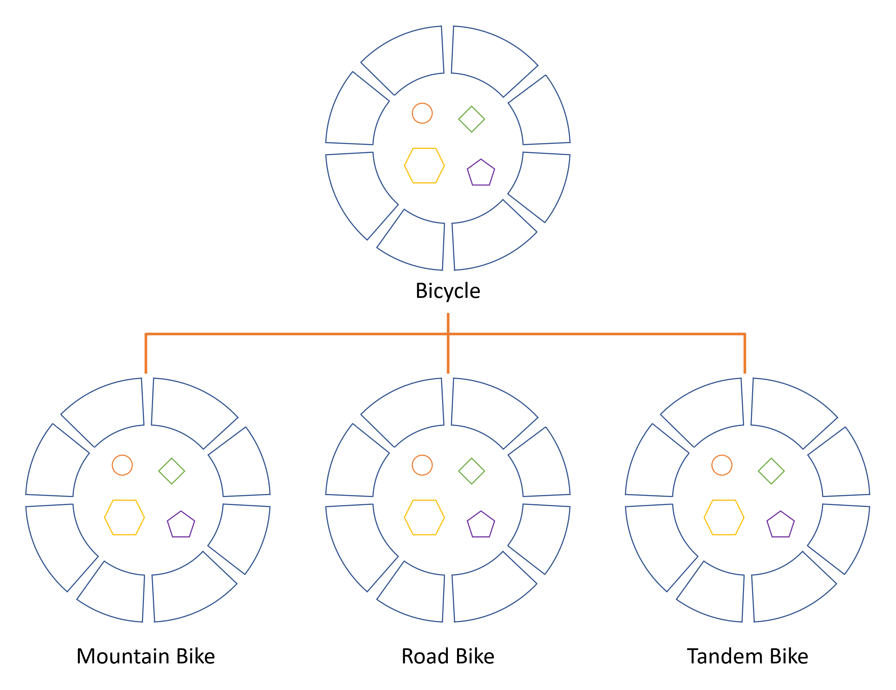
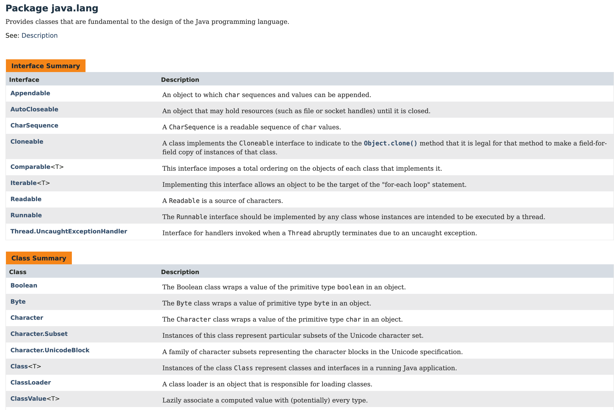

# 【官方】Java官方笔记2面向对象编程基本概念


#### 对象Object

对象有2个特征：**状态state和行为behavior**。我们可以用真实世界的对象来做类比，这样有助于理解面向对象编程，比如狗的状态（名字、颜色、品种）和行为（叫、抓、摇尾巴），自行车的状态（当前档位、当前踏板节奏、当前速度）和行为（切换档位、切换踏板节奏、踩刹车）。

软件对象也是由状态和行为组成：


状态，在软件对象中，叫做字段fields，或变量variables。

行为，在软件对象中，叫做方法methods，或函数functions。

所谓的数据封装data encapsulation，就是字段只在内部，不对外暴露，仅由方法进行操作，对象与对象之间通过方法来相互访问。

Java是**纯粹的**面向对象编程语言。

#### 类Class

类，可以视为对象的**模版**，基于类来创造出同一类对象。

比如自行车的类：

```java
class Bicycle {

    int cadence = 0;
    int speed = 0;
    int gear = 1;

    void changeCadence(int newValue) {
         cadence = newValue;
    }

    void changeGear(int newValue) {
         gear = newValue;
    }

    void speedUp(int increment) {
         speed = speed + increment;   
    }

    void applyBrakes(int decrement) {
         speed = speed - decrement;
    }

    void printStates() {
         System.out.println("cadence:" +
             cadence + " speed:" + 
             speed + " gear:" + gear);
    }
}
```

类也是有2个特征：字段和方法。比如Bicycle类有字段cadence、speed、gear和方法changeCadence()、changeGear()、speedUp()等。

你可能会发现这个类里面没有main方法，因为Bicycle类只是定义了对象的模版，可以新建一个类来实现Bicycle类对象的创建和使用：

```java
class BicycleDemo {
    public static void main(String[] args) {

        // Create two different 
        // Bicycle objects
        Bicycle bike1 = new Bicycle();
        Bicycle bike2 = new Bicycle();

        // Invoke methods on 
        // those objects
        bike1.changeCadence(50);
        bike1.speedUp(10);
        bike1.changeGear(2);
        bike1.printStates();

        bike2.changeCadence(50);
        bike2.speedUp(10);
        bike2.changeGear(2);
        bike2.changeCadence(40);
        bike2.speedUp(10);
        bike2.changeGear(3);
        bike2.printStates();
    }
}
```

运行输出：

```
cadence:50 speed:10 gear:2
cadence:40 speed:20 gear:3
```

#### 继承Inheritance

自行车有很多种，自行车的共同点可以用父类来表示，自行车的不同点可以用子类**继承**父类，然后添加自己的差异点：



图中的Bicycle是父类，MountainBike、RoadBike和TandemBike是子类。父类的字段和方法会同步给所有的子类，而子类可以继续添加自己的字段和方法。

继承使用`extends`来定义：

```java
class MountainBike extends Bicycle {

    // new fields and methods defining 
    // a mountain bike would go here

}
```

Java的子类只能有1个父类，但是父类可以有无限多个子类。

#### 接口Interface

就像电视机开关一样，你跟电视机交互，只需要按开关就可以，电视机暴露出来的是方法。接口就是一组方法，只有方法声明，没有具体实现。比如：

```java
interface Bicycle {

    //  wheel revolutions per minute
    void changeCadence(int newValue);

    void changeGear(int newValue);

    void speedUp(int increment);

    void applyBrakes(int decrement);
}
```

类使用`implements`来实现接口方法：

```java
class ACMEBicycle implements Bicycle {

    int cadence = 0;
    int speed = 0;
    int gear = 1;

   // The compiler will now require that methods
   // changeCadence, changeGear, speedUp, and applyBrakes
   // all be implemented. Compilation will fail if those
   // methods are missing from this class.

    void changeCadence(int newValue) {
         cadence = newValue;
    }

    void changeGear(int newValue) {
         gear = newValue;
    }

    void speedUp(int increment) {
         speed = speed + increment;   
    }

    void applyBrakes(int decrement) {
         speed = speed - decrement;
    }

    void printStates() {
         System.out.println("cadence:" +
             cadence + " speed:" + 
             speed + " gear:" + gear);
    }
}
```

Java为什么要发明接口呢？我们知道对象与对象只能通过方法来相互访问，而接口其实就是一种**契约**，编译器会在编译时强制执行这份契约。就像文章的大纲一样。

实现接口的类，必须实现接口中的所有方法。

#### 包Package

包相当于文件夹，用来组织接口和类。

Java API，也叫做Java类库，内置了很多包：

https://docs.oracle.com/javase/8/docs/api/index.html

包列表：


包里面的接口、类：



> 参考资料：
>
> Objects, Classes, Interfaces, Packages, and Inheritance https://dev.java/learn/oop/