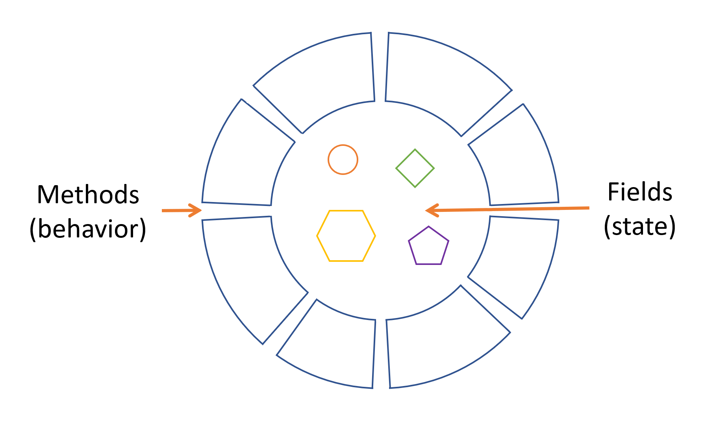
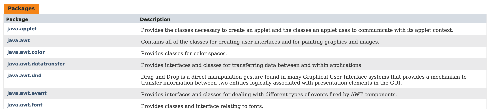
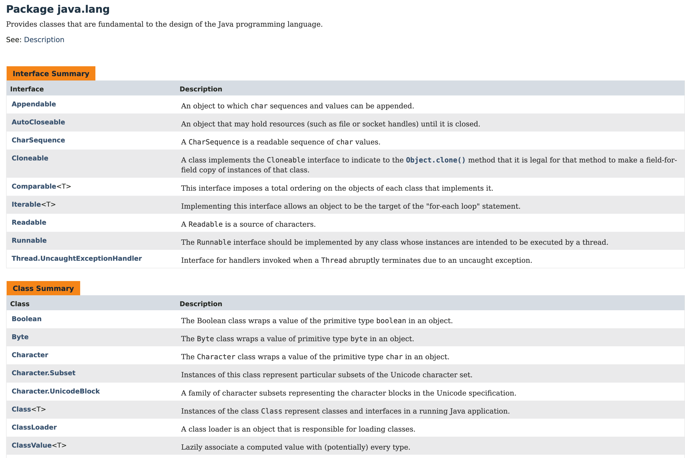

【官方】Java官方笔记2面向对象编程基本概念
=========================================

|image1|

对象Object
^^^^^^^^^^

对象有2个特征：\ **状态state和行为behavior**\ 。我们可以用真实世界的对象来做类比，这样有助于理解面向对象编程，比如狗的状态（名字、颜色、品种）和行为（叫、抓、摇尾巴），自行车的状态（当前档位、当前踏板节奏、当前速度）和行为（切换档位、切换踏板节奏、踩刹车）。

软件对象也是由状态和行为组成：

|image2|

状态，在软件对象中，叫做字段fields，或变量variables。

行为，在软件对象中，叫做方法methods，或函数functions。

所谓的数据封装data
encapsulation，就是字段只在内部，不对外暴露，仅由方法进行操作，对象与对象之间通过方法来相互访问。

Java是\ **纯粹的**\ 面向对象编程语言。

类Class
^^^^^^^

类，可以视为对象的\ **模版**\ ，基于类来创造出同一类对象。

比如自行车的类：

.. code:: java

   class Bicycle {

       int cadence = 0;
       int speed = 0;
       int gear = 1;

       void changeCadence(int newValue) {
            cadence = newValue;
       }

       void changeGear(int newValue) {
            gear = newValue;
       }

       void speedUp(int increment) {
            speed = speed + increment;   
       }

       void applyBrakes(int decrement) {
            speed = speed - decrement;
       }

       void printStates() {
            System.out.println("cadence:" +
                cadence + " speed:" + 
                speed + " gear:" + gear);
       }
   }

类也是有2个特征：字段和方法。比如Bicycle类有字段cadence、speed、gear和方法changeCadence()、changeGear()、speedUp()等。

你可能会发现这个类里面没有main方法，因为Bicycle类只是定义了对象的模版，可以新建一个类来实现Bicycle类对象的创建和使用：

.. code:: java

   class BicycleDemo {
       public static void main(String[] args) {

           // Create two different 
           // Bicycle objects
           Bicycle bike1 = new Bicycle();
           Bicycle bike2 = new Bicycle();

           // Invoke methods on 
           // those objects
           bike1.changeCadence(50);
           bike1.speedUp(10);
           bike1.changeGear(2);
           bike1.printStates();

           bike2.changeCadence(50);
           bike2.speedUp(10);
           bike2.changeGear(2);
           bike2.changeCadence(40);
           bike2.speedUp(10);
           bike2.changeGear(3);
           bike2.printStates();
       }
   }

运行输出：

::

   cadence:50 speed:10 gear:2
   cadence:40 speed:20 gear:3

继承Inheritance
^^^^^^^^^^^^^^^

自行车有很多种，自行车的共同点可以用父类来表示，自行车的不同点可以用子类\ **继承**\ 父类，然后添加自己的差异点：

|image3|

图中的Bicycle是父类，MountainBike、RoadBike和TandemBike是子类。父类的字段和方法会同步给所有的子类，而子类可以继续添加自己的字段和方法。

继承使用\ ``extends``\ 来定义：

.. code:: java

   class MountainBike extends Bicycle {

       // new fields and methods defining 
       // a mountain bike would go here

   }

Java的子类只能有1个父类，但是父类可以有无限多个子类。

接口Interface
^^^^^^^^^^^^^

就像电视机开关一样，你跟电视机交互，只需要按开关就可以，电视机暴露出来的是方法。接口就是一组方法，只有方法声明，没有具体实现。比如：

.. code:: java

   interface Bicycle {

       //  wheel revolutions per minute
       void changeCadence(int newValue);

       void changeGear(int newValue);

       void speedUp(int increment);

       void applyBrakes(int decrement);
   }

类使用\ ``implements``\ 来实现接口方法：

.. code:: java

   class ACMEBicycle implements Bicycle {

       int cadence = 0;
       int speed = 0;
       int gear = 1;

      // The compiler will now require that methods
      // changeCadence, changeGear, speedUp, and applyBrakes
      // all be implemented. Compilation will fail if those
      // methods are missing from this class.

       void changeCadence(int newValue) {
            cadence = newValue;
       }

       void changeGear(int newValue) {
            gear = newValue;
       }

       void speedUp(int increment) {
            speed = speed + increment;   
       }

       void applyBrakes(int decrement) {
            speed = speed - decrement;
       }

       void printStates() {
            System.out.println("cadence:" +
                cadence + " speed:" + 
                speed + " gear:" + gear);
       }
   }

Java为什么要发明接口呢？我们知道对象与对象只能通过方法来相互访问，而接口其实就是一种\ **契约**\ ，编译器会在编译时强制执行这份契约。就像文章的大纲一样。

实现接口的类，必须实现接口中的所有方法。

包Package
^^^^^^^^^

包相当于文件夹，用来组织接口和类。

Java API，也叫做Java类库，内置了很多包：

https://docs.oracle.com/javase/8/docs/api/index.html

包列表：

|image4|

包里面的接口、类：

|image5|

   参考资料：

   Objects, Classes, Interfaces, Packages, and Inheritance
   https://dev.java/learn/oop/

.. |image1| image:: ../wanggang.png

.. |image3| image:: 002002-【官方】Java官方笔记2面向对象编程基本概念/03_inheritance.png

