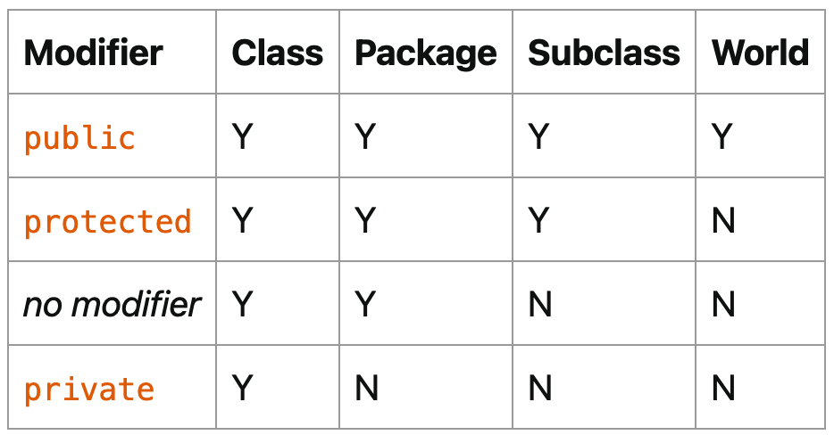

# 【官方】Java官方笔记4类和对象


### 创建类

定义类Bicycle：

```java
public class Bicycle {

    // the Bicycle class has
    // three fields
    public int cadence;
    public int gear;
    public int speed;

    // the Bicycle class has
    // one constructor
    public Bicycle(int startCadence, int startSpeed, int startGear) {
        gear = startGear;
        cadence = startCadence;
        speed = startSpeed;
    }

    // the Bicycle class has
    // four methods
    public void setCadence(int newValue) {
        cadence = newValue;
    }

    public void setGear(int newValue) {
        gear = newValue;
    }

    public void applyBrake(int decrement) {
        speed -= decrement;
    }

    public void speedUp(int increment) {
        speed += increment;
    }
}
```

创建子类MountainBike继承类Bicycle：

```java
public class MountainBike extends Bicycle {

    // the MountainBike subclass has
    // one field
    public int seatHeight;

    // the MountainBike subclass has
    // one constructor
    public MountainBike(int startHeight, int startCadence,
                        int startSpeed, int startGear) {
        super(startCadence, startSpeed, startGear);
        seatHeight = startHeight;
    }   

    // the MountainBike subclass has
    // one method
    public void setHeight(int newValue) {
        seatHeight = newValue;
    }   
}
```

可以看出定义类的语法如下：

```java
class MyClass {
    // field, constructor, and 
    // method declarations
}
```

复杂点的：

```java
class MyClass extends MySuperClass implements YourInterface {
    // field, constructor, and
    // method declarations
}
```

定义了类MyClass继承类MySuperClass，并实现接口YourInterface。类只能有一个父类，但是能实现多个接口。

### 定义方法

方法定义示例：

```java
public double calculateAnswer(double wingSpan, int numberOfEngines,
                              double length, double grossTons) {
    //do the calculation here
}
```

方法签名，方法名+参数类型，比如上面的方法签名是：

```java
calculateAnswer(double, int, double, double)
```

1个类中可以有多个同名的，但是不同参数的方法，也就是方法重载：

```java
public class DataArtist {
    ...
    public void draw(String s) {
        ...
    }
    public void draw(int i) {
        ...
    }
    public void draw(double f) {
        ...
    }
    public void draw(int i, double f) {
        ...
    }
}
```

但是方法重载应谨慎使用，它会降低代码可读性。

### 类构造器

类有个默认的无参数的构造器，也可以自定义：

```java
public Bicycle(int startCadence, int startSpeed, int startGear) {
    gear = startGear;
    cadence = startCadence;
    speed = startSpeed;
}
```

构造器跟类同名，没有return。类可以有多个不同参数列表的构造器。

### 调用

参数定义的叫做*Parameters* ，实际传入的叫做*Arguments* 。

基本数据类型

```java
public double computePayment(
                  double loanAmt,
                  double rate,
                  double futureValue,
                  int numPeriods) {
    double interest = rate / 100.0;
    double partial1 = Math.pow((1 + interest), 
                    - numPeriods);
    double denominator = (1 - partial1) / interest;
    double answer = (-loanAmt / denominator)
                    - ((futureValue * partial1) / denominator);
    return answer;
}
```

类对象

```java
public Polygon polygonFrom(Point[] corners) {
    // method body goes here
}
```

可变参数

```java
public Polygon polygonFrom(Point... corners) {
    int numberOfSides = corners.length;
    double squareOfSide1, lengthOfSide1;
    squareOfSide1 = (corners[1].x - corners[0].x)
                     * (corners[1].x - corners[0].x) 
                     + (corners[1].y - corners[0].y)
                     * (corners[1].y - corners[0].y);
    lengthOfSide1 = Math.sqrt(squareOfSide1);

    // more method body code follows that creates and returns a 
    // polygon connecting the Points
}
```

使用`...`来表示可变参数。

方法中的基本数据类型，return后消失：

```java
public class PassPrimitiveByValue {

    public static void main(String[] args) {

        int x = 3;

        // invoke passMethod() with 
        // x as argument
        passMethod(x);

        // print x to see if its 
        // value has changed
        System.out.println("After invoking passMethod, x = " + x);

    }

    // change parameter in passMethod()
    public static void passMethod(int p) {
        p = 10;
    }
}
```

方法中的引用类型，return后还有作用到原来的对象：

```java
public class RefType {
    public void moveCircle(Circle circle, int deltaX, int deltaY) {
        // code to move origin of circle to x+deltaX, y+deltaY
        circle.setX(circle.getX() + deltaX);
        circle.setY(circle.getY() + deltaY);

        // code to assign a new reference to circle
        circle = new Circle(0, 0);
    }

    public static void main(String[] args) {
        Circle circle = new Circle(1, 1);
        RefType refType = new RefType();
        refType.moveCircle(circle, 2, 2);
        System.out.println(circle.getX());
    }
}
```

运行结果为3。moveCircle里面的circle，**set方法调用**会影响到引用的对象。虽然最后new了一个新对象，但是赋值给的是方法内部的这个circle，return后消失，外面的circle不受影响。可以这么理解，外面和里面的两个circle，引用的都是同一个对象。

### 对象

创建对象：

```java
Point originOne = new Point(23, 94);
Rectangle rectOne = new Rectangle(originOne, 100, 200);
Rectangle rectTwo = new Rectangle(50, 100);
```

变量声明：

```java
type name;
```

如果是基本数据类型，则会先分配内存空间。如果是类引用，则不会，在new的时候才会分配内存空间。

字段：

```java
objectReference.fieldName
```

方法：

```java
objectReference.methodName(argumentList);
```

请记住，一个对象能有多个引用。

### 类的高级用法

方法退出有3种情况：

1. 代码执行完

2. throw异常

3. return

返回类型如果是类，那么可以return子类。返回类型如果是接口，那么可以return接口实现类。

this关键字表示当前类，或用来调用其他构造方法：

```java
public class Rectangle {
    private int x, y;
    private int width, height;
        
    public Rectangle() {
        this(0, 0, 1, 1);
    }
    public Rectangle(int width, int height) {
        this(0, 0, width, height);
    }
    public Rectangle(int x, int y, int width, int height) {
        this.x = x;
        this.y = y;
        this.width = width;
        this.height = height;
    }
    ...
}
```

调用其他构造方法必须放在第一行。

**范围控制**

top级别：public、package-private

member级别：public、private、protected、package-private

其中注意protected，等于package-private + 其他包中的子类（继承了当前类，但是在其他包里面）

> 怎么理解？在自己的地盘（package）随便玩，但是到了其他地盘，必须有父类保护（protected）



第3列的Subclass指的是其他包的子类。

访问控制有2个用途：

1. 在用别人的类时，看哪些可以使用

2. 定义自己的类时，决定哪些允许别人用

static关键字，创建类字段：

```java
public class Bicycle {
        
    private int cadence;
    private int gear;
    private int speed;
    private int id;
    private static int numberOfBicycles = 0;
        
    public Bicycle(int startCadence, int startSpeed, int startGear){
        gear = startGear;
        cadence = startCadence;
        speed = startSpeed;

        // increment number of Bicycles
        // and assign ID number
        id = ++numberOfBicycles;
    }

    // new method to return the ID instance variable
    public int getID() {
        return id;
    }
        ...
}
```

可以直接用类名访问：

```java
Bicycle.numberOfBicycles
```

**static关键字**

创建类方法：

```java
public static int getNumberOfBicycles() {
    return numberOfBicycles;
}
```

创建常量：

```java
static final double PI = 3.141592653589793;
```

注意，基本数据类型或string的常量，会在编译的时候直接替换。如果依赖外部包的常量值变化了，比如PI变成了3.9，那么当前代码需要重新编译。

关于static，有一个很重要的点是：static只能访问static，也就是class级别只能访问class级别，如果想访问member级别，必须实例化对象后通过引用来访问。

**static块**

对于字段初始化来说，如果想写多行代码来初始化（比如写个for循环来填充复杂数组），instance级别可以在构造函数来做，而对于class级别呢？就可以使用static块：

```java
public class MyClass {
    public static int x;
    public static int y;

    static {
        x = 10;
        y = 20;
        System.out.println("静态块执行");
    }

    public static void main(String[] args) {
        System.out.println("x=" + x);
        System.out.println("y=" + y);
    }
}
```

**static块是用来给class级别字段做值初始化的**，它们会按照在类中出现的顺序依次执行，并且它们在构造函数之前执行。

也可以定义static方法后赋值：

```java
class Whatever {
    public static varType myVar = initializeClassVariable();
        
    private static varType initializeClassVariable() {

        // initialization code goes here
    }
}
```

member级别字段初始化块，也就是不带static的：

```java
{
    // whatever code is needed for initialization goes here
}
```

会在每个constructor中执行。也可以使用final方法：

```java
class Whatever {
    private varType myVar = initializeInstanceVariable();
        
    protected final varType initializeInstanceVariable() {

        // initialization code goes here
    }
}
```

为什么这里必须要用final？因为在实例初始化期间调用非final方法会报错，这是为了提高代码健壮性、可读性和可维护性，初始化本来就是一个确定的事情，那么就用final限定清楚。

### 嵌套类

```java
class OuterClass {
    ...
    class InnerClass {
        ...
    }
    static class StaticNestedClass {
        ...
    }
}
```

**InnerClass能访问OutClass所有成员（可以理解为跟method类似），StaticNestedClass则不能。**

什么情况需要用嵌套类？

- 这个类只会被另外1个类使用，那么可以定义为嵌套类（helper classes），优化包结构

- 封装，嵌套类可以访问内部private成员

- 可读性，小的嵌套类，方便阅读

必须先实例化OuterClass再实例化InnerClass：

```java
OuterClass outerObject = new OuterClass();
OuterClass.InnerClass innerObject = outerObject.new InnerClass();
```

而static嵌套类跟普通类一样：

```java
StaticNestedClass staticNestedObject = new StaticNestedClass();
```

**注意，static嵌套类，跟其他顶层类是一样的，意味着它不能直接访问所在类的字段，而必须通过实例化对象引用才能访问。（也许是为了方便在一个文件里面写多个类，才设计了static嵌套类）**

以下是示例：

OuterClass.java

```java
public class OuterClass {

    String outerField = "Outer field";
    static String staticOuterField = "Static outer field";

    class InnerClass {
        void accessMembers() {
            System.out.println(outerField);
            System.out.println(staticOuterField);
        }
    }

    static class StaticNestedClass {
        void accessMembers(OuterClass outer) {
            // Compiler error: Cannot make a static reference to the non-static
            //     field outerField
            // System.out.println(outerField);
            System.out.println(outer.outerField);
            System.out.println(staticOuterField);
        }
    }

    public static void main(String[] args) {
        System.out.println("Inner class:");
        System.out.println("------------");
        OuterClass outerObject = new OuterClass();
        OuterClass.InnerClass innerObject = outerObject.new InnerClass();
        innerObject.accessMembers();

        System.out.println("\nStatic nested class:");
        System.out.println("--------------------");
        StaticNestedClass staticNestedObject = new StaticNestedClass();
        staticNestedObject.accessMembers(outerObject);

        System.out.println("\nTop-level class:");
        System.out.println("--------------------");
        TopLevelClass topLevelObject = new TopLevelClass();
        topLevelObject.accessMembers(outerObject);
    }
}
```

TopLevelClass.java

```java
public class TopLevelClass {

    void accessMembers(OuterClass outer) {
        // Compiler error: Cannot make a static reference to the non-static
        //     field OuterClass.outerField
        // System.out.println(OuterClass.outerField);
        System.out.println(outer.outerField);
        System.out.println(OuterClass.staticOuterField);
    }
}
```

一个变量引用的例子，这个例子展示了不同级别的**同名变量**，是如何取值的：

```java
public class ShadowTest {

    public int x = 0;

    class FirstLevel {

        public int x = 1;

        void methodInFirstLevel(int x) {
            System.out.println("x = " + x);
            System.out.println("this.x = " + this.x);
            System.out.println("ShadowTest.this.x = " + ShadowTest.this.x);
        }
    }

    public static void main(String... args) {
        ShadowTest st = new ShadowTest();
        ShadowTest.FirstLevel fl = st.new FirstLevel();
        fl.methodInFirstLevel(23);
    }
}
```

```java
x = 23
this.x = 1
ShadowTest.this.x = 0  // 注意这种在嵌套类取OuterClass同名字段的方式
```

**Local Class**，定义在method里面的嵌套类：

```java
public class LocalClassExample {

    static String regularExpression = "[^0-9]";

    public static void validatePhoneNumber(
        String phoneNumber1, String phoneNumber2) {

        final int numberLength = 10;

        // Valid in JDK 8 and later:

        // int numberLength = 10;

        class PhoneNumber {

            String formattedPhoneNumber = null;

            PhoneNumber(String phoneNumber){
                // numberLength = 7;
                String currentNumber = phoneNumber.replaceAll(
                  regularExpression, "");
                if (currentNumber.length() == numberLength)
                    formattedPhoneNumber = currentNumber;
                else
                    formattedPhoneNumber = null;
            }

            public String getNumber() {
                return formattedPhoneNumber;
            }

            // Valid in JDK 8 and later:

//            public void printOriginalNumbers() {
//                System.out.println("Original numbers are " + phoneNumber1 +
//                    " and " + phoneNumber2);
//            }
        }

        PhoneNumber myNumber1 = new PhoneNumber(phoneNumber1);
        PhoneNumber myNumber2 = new PhoneNumber(phoneNumber2);

        // Valid in JDK 8 and later:

//        myNumber1.printOriginalNumbers();

        if (myNumber1.getNumber() == null)
            System.out.println("First number is invalid");
        else
            System.out.println("First number is " + myNumber1.getNumber());
        if (myNumber2.getNumber() == null)
            System.out.println("Second number is invalid");
        else
            System.out.println("Second number is " + myNumber2.getNumber());

    }

    public static void main(String... args) {
        validatePhoneNumber("123-456-7890", "456-7890");
    }
}
```

Local Class只能访问方法里面的final变量，或者“看似final”的变量（值不会发生变化）。否则会报错：local variables referenced from an inner class must be final or effectively final。但是能直接方法参数列表的parameters。

**Anonymous Class**，定义在method里面的没有名字的嵌套类：

```java
public class HelloWorldAnonymousClasses {

    interface HelloWorld {
        public void greet();
        public void greetSomeone(String someone);
    }

    public void sayHello() {

        class EnglishGreeting implements HelloWorld {
            String name = "world";
            public void greet() {
                greetSomeone("world");
            }
            public void greetSomeone(String someone) {
                name = someone;
                System.out.println("Hello " + name);
            }
        }

        HelloWorld englishGreeting = new EnglishGreeting();

        HelloWorld frenchGreeting = new HelloWorld() {  // 匿名类
            String name = "tout le monde";
            public void greet() {
                greetSomeone("tout le monde");
            }
            public void greetSomeone(String someone) {
                name = someone;
                System.out.println("Salut " + name);
            }
        };

        HelloWorld spanishGreeting = new HelloWorld() {  // 匿名类
            String name = "mundo";
            public void greet() {
                greetSomeone("mundo");
            }
            public void greetSomeone(String someone) {
                name = someone;
                System.out.println("Hola, " + name);
            }
        };
        englishGreeting.greet();
        frenchGreeting.greetSomeone("Fred");
        spanishGreeting.greet();
    }

    public static void main(String... args) {
        HelloWorldAnonymousClasses myApp =
            new HelloWorldAnonymousClasses();
        myApp.sayHello();
    }
}
```

它的语法跟constructor类似，new后面跟上implements接口或extends类的名字，但它是一个表达式，所以最后要加上分号。

请记住，Local Class和Anonymous Class，都是应以在method里面的。


> 参考资料：
> 
> Classes and Objects https://dev.java/learn/classes-objects/