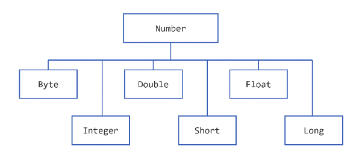

# 【官方】Java官方笔记5数字和字符串


### Numbers

Number的子类：



另外还有BigDecimal和BigInteger，用于高精度计算，AtomicInteger和AtomicLong用于多线程应用。

我们有时候需要用包装类而非基本数据类型，理由如下：

1. 方法入参类型为Object，只能传入对象

2. 使用包装类提供的常量，比如MIN_VALUE和MAX_VALUE

3. 使用包装类的方法来做类型转换

format

```java
import java.util.Calendar;
import java.util.Locale;

public class TestFormat {

    public static void main(String[] args) {
      long n = 461012;
      System.out.format("%d%n", n);      //  -->  "461012"
      System.out.format("%08d%n", n);    //  -->  "00461012"
      System.out.format("%+8d%n", n);    //  -->  " +461012"
      System.out.format("%,8d%n", n);    // -->  " 461,012"
      System.out.format("%+,8d%n%n", n); //  -->  "+461,012"

      double pi = Math.PI;

      System.out.format("%f%n", pi);       // -->  "3.141593"
      System.out.format("%.3f%n", pi);     // -->  "3.142"
      System.out.format("%10.3f%n", pi);   // -->  "     3.142"
      System.out.format("%-10.3f%n", pi);  // -->  "3.142"
      System.out.format(Locale.FRANCE,
                        "%-10.4f%n%n", pi); // -->  "3,1416"

      Calendar c = Calendar.getInstance();
      System.out.format("%tB %te, %tY%n", c, c, c); // -->  "May 29, 2006"

      System.out.format("%tl:%tM %tp%n", c, c, c);  // -->  "2:34 am"

      System.out.format("%tD%n", c);    // -->  "05/29/06"
    }
}
```

DecimalFormat

```java
import java.text.*;

public class DecimalFormatDemo {

   static public void customFormat(String pattern, double value ) {
      DecimalFormat myFormatter = new DecimalFormat(pattern);
      String output = myFormatter.format(value);
      System.out.println(value + "  " + pattern + "  " + output);
   }

   static public void main(String[] args) {

      customFormat("###,###.###", 123456.789);
      customFormat("###.##", 123456.789);
      customFormat("000000.000", 123.78);
      customFormat("$###,###.###", 12345.67);  
   }
}
```

Math

```java
public class BasicMathDemo {
    public static void main(String[] args) {
        double a = -191.635;
        double b = 43.74;
        int c = 16, d = 45;

        System.out.printf("The absolute value " + "of %.3f is %.3f%n", 
                          a, Math.abs(a));

        System.out.printf("The ceiling of " + "%.2f is %.0f%n", 
                          b, Math.ceil(b));

        System.out.printf("The floor of " + "%.2f is %.0f%n", 
                          b, Math.floor(b));

        System.out.printf("The rint of %.2f " + "is %.0f%n", 
                          b, Math.rint(b));

        System.out.printf("The max of %d and " + "%d is %d%n",
                          c, d, Math.max(c, d));

        System.out.printf("The min of of %d " + "and %d is %d%n",
                          c, d, Math.min(c, d));
    }
}
```

### Charaters

基本类型char

```java
char ch = 'a'; 
// Unicode for uppercase Greek omega character
char uniChar = '\u03A9';
// an array of chars
char[] charArray = { 'a', 'b', 'c', 'd', 'e' };
```

Character

```java
Character ch = new Character('a');
```

### Strings

定义：

```java
String greeting = "Hello world!";
```

```java
char[] helloArray = { 'h', 'e', 'l', 'l', 'o', '.' };
String helloString = new String(helloArray);
System.out.println(helloString);
```

回文字符串实现：

```java
public class StringDemo {
    public static void main(String[] args) {
        String palindrome = "Dot saw I was Tod";
        int len = palindrome.length();
        char[] tempCharArray = new char[len];
        char[] charArray = new char[len];

        // put original string in an 
        // array of chars
        for (int i = 0; i < len; i++) {
            tempCharArray[i] = 
                palindrome.charAt(i);
        } 

        // reverse array of chars
        for (int j = 0; j < len; j++) {
            charArray[j] =
                tempCharArray[len - 1 - j];
        }

        String reversePalindrome =
            new String(charArray);
        System.out.println(reversePalindrome);
    }
}
```

String转换为基本数据类型，parseXXX()比valueOf更好用：

```java
float a = (Float.valueOf(args[0])).floatValue(); 
float b = (Float.valueOf(args[1])).floatValue();
```

```java
float a = Float.parseFloat(args[0]);
float b = Float.parseFloat(args[1]);
```

基本数据类型转换为String：

```java
int i;
// Concatenate "i" with an empty string; conversion is handled for you.
String s1 = "" + i;
```

```java
// The valueOf class method.
String s2 = String.valueOf(i);
```

```java
int i;
double d;
String s3 = Integer.toString(i); 
String s4 = Double.toString(d); 
```

根据字符查找对应索引：

```java
String anotherPalindrome = "Niagara. O roar again!"; 
char aChar = anotherPalindrome.charAt(9);
```

子串：

```java
String anotherPalindrome = "Niagara. O roar again!"; 
String roar = anotherPalindrome.substring(11, 15); 
```

### String Builders

String不可变，StringBuilder可变。StringBuilder除了length()，还有个capacity()，返回分配的字符数量，大于等于length，并且会自动扩充。

```java
// creates empty builder, capacity 16
StringBuilder sb = new StringBuilder();
// adds 9 character string at beginning
sb.append("Greetings");
```

StringBuffer用的少，只在需要保证线程安全时使用。

### 自动装箱和拆箱

装箱，基本数据类型→包装类：

```java
List<Integer> ints = new ArrayList<>();
for (int i = 1; i < 50; i += 2)
    ints.add(i);
```

拆箱，包装类→基本数据类型：

```java
public static int sumEven(List<Integer> ints) {
    int sum = 0;
    for (Integer i: ints) {
        if (i % 2 == 0) {
            sum+=i;
        }
    }
    return sum;
}
```

> 参考资料：
> 
> Numbers and Strings https://dev.java/learn/numbers-strings/
