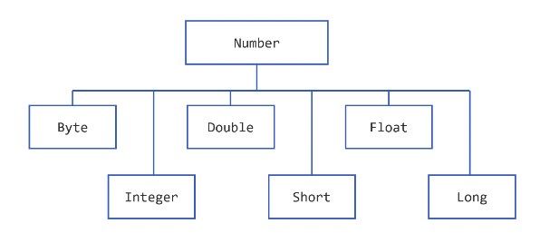

【官方】Java官方笔记5数字和字符串
=================================

|image1|

Numbers
~~~~~~~

Number的子类：

|image2|

另外还有BigDecimal和BigInteger，用于高精度计算，AtomicInteger和AtomicLong用于多线程应用。

我们有时候需要用包装类而非基本数据类型，理由如下：

1. 方法入参类型为Object，只能传入对象

2. 使用包装类提供的常量，比如MIN_VALUE和MAX_VALUE

3. 使用包装类的方法来做类型转换

format

.. code:: java

   import java.util.Calendar;
   import java.util.Locale;

   public class TestFormat {

       public static void main(String[] args) {
         long n = 461012;
         System.out.format("%d%n", n);      //  -->  "461012"
         System.out.format("%08d%n", n);    //  -->  "00461012"
         System.out.format("%+8d%n", n);    //  -->  " +461012"
         System.out.format("%,8d%n", n);    // -->  " 461,012"
         System.out.format("%+,8d%n%n", n); //  -->  "+461,012"

         double pi = Math.PI;

         System.out.format("%f%n", pi);       // -->  "3.141593"
         System.out.format("%.3f%n", pi);     // -->  "3.142"
         System.out.format("%10.3f%n", pi);   // -->  "     3.142"
         System.out.format("%-10.3f%n", pi);  // -->  "3.142"
         System.out.format(Locale.FRANCE,
                           "%-10.4f%n%n", pi); // -->  "3,1416"

         Calendar c = Calendar.getInstance();
         System.out.format("%tB %te, %tY%n", c, c, c); // -->  "May 29, 2006"

         System.out.format("%tl:%tM %tp%n", c, c, c);  // -->  "2:34 am"

         System.out.format("%tD%n", c);    // -->  "05/29/06"
       }
   }

DecimalFormat

.. code:: java

   import java.text.*;

   public class DecimalFormatDemo {

      static public void customFormat(String pattern, double value ) {
         DecimalFormat myFormatter = new DecimalFormat(pattern);
         String output = myFormatter.format(value);
         System.out.println(value + "  " + pattern + "  " + output);
      }

      static public void main(String[] args) {

         customFormat("###,###.###", 123456.789);
         customFormat("###.##", 123456.789);
         customFormat("000000.000", 123.78);
         customFormat("$###,###.###", 12345.67);  
      }
   }

Math

.. code:: java

   public class BasicMathDemo {
       public static void main(String[] args) {
           double a = -191.635;
           double b = 43.74;
           int c = 16, d = 45;

           System.out.printf("The absolute value " + "of %.3f is %.3f%n", 
                             a, Math.abs(a));

           System.out.printf("The ceiling of " + "%.2f is %.0f%n", 
                             b, Math.ceil(b));

           System.out.printf("The floor of " + "%.2f is %.0f%n", 
                             b, Math.floor(b));

           System.out.printf("The rint of %.2f " + "is %.0f%n", 
                             b, Math.rint(b));

           System.out.printf("The max of %d and " + "%d is %d%n",
                             c, d, Math.max(c, d));

           System.out.printf("The min of of %d " + "and %d is %d%n",
                             c, d, Math.min(c, d));
       }
   }

Charaters
~~~~~~~~~

基本类型char

.. code:: java

   char ch = 'a'; 
   // Unicode for uppercase Greek omega character
   char uniChar = '\u03A9';
   // an array of chars
   char[] charArray = { 'a', 'b', 'c', 'd', 'e' };

Character

.. code:: java

   Character ch = new Character('a');

Strings
~~~~~~~

定义：

.. code:: java

   String greeting = "Hello world!";

.. code:: java

   char[] helloArray = { 'h', 'e', 'l', 'l', 'o', '.' };
   String helloString = new String(helloArray);
   System.out.println(helloString);

回文字符串实现：

.. code:: java

   public class StringDemo {
       public static void main(String[] args) {
           String palindrome = "Dot saw I was Tod";
           int len = palindrome.length();
           char[] tempCharArray = new char[len];
           char[] charArray = new char[len];

           // put original string in an 
           // array of chars
           for (int i = 0; i < len; i++) {
               tempCharArray[i] = 
                   palindrome.charAt(i);
           } 

           // reverse array of chars
           for (int j = 0; j < len; j++) {
               charArray[j] =
                   tempCharArray[len - 1 - j];
           }

           String reversePalindrome =
               new String(charArray);
           System.out.println(reversePalindrome);
       }
   }

String转换为基本数据类型，parseXXX()比valueOf更好用：

.. code:: java

   float a = (Float.valueOf(args[0])).floatValue(); 
   float b = (Float.valueOf(args[1])).floatValue();

.. code:: java

   float a = Float.parseFloat(args[0]);
   float b = Float.parseFloat(args[1]);

基本数据类型转换为String：

.. code:: java

   int i;
   // Concatenate "i" with an empty string; conversion is handled for you.
   String s1 = "" + i;

.. code:: java

   // The valueOf class method.
   String s2 = String.valueOf(i);

.. code:: java

   int i;
   double d;
   String s3 = Integer.toString(i); 
   String s4 = Double.toString(d); 

根据字符查找对应索引：

.. code:: java

   String anotherPalindrome = "Niagara. O roar again!"; 
   char aChar = anotherPalindrome.charAt(9);

子串：

.. code:: java

   String anotherPalindrome = "Niagara. O roar again!"; 
   String roar = anotherPalindrome.substring(11, 15); 

String Builders
~~~~~~~~~~~~~~~

String不可变，StringBuilder可变。StringBuilder除了length()，还有个capacity()，返回分配的字符数量，大于等于length，并且会自动扩充。

.. code:: java

   // creates empty builder, capacity 16
   StringBuilder sb = new StringBuilder();
   // adds 9 character string at beginning
   sb.append("Greetings");

StringBuffer用的少，只在需要保证线程安全时使用。

自动装箱和拆箱
~~~~~~~~~~~~~~

装箱，基本数据类型→包装类：

.. code:: java

   List<Integer> ints = new ArrayList<>();
   for (int i = 1; i < 50; i += 2)
       ints.add(i);

拆箱，包装类→基本数据类型：

.. code:: java

   public static int sumEven(List<Integer> ints) {
       int sum = 0;
       for (Integer i: ints) {
           if (i % 2 == 0) {
               sum+=i;
           }
       }
       return sum;
   }

..

   参考资料：

   Numbers and Strings https://dev.java/learn/numbers-strings/

.. |image1| image:: ../wanggang.png

