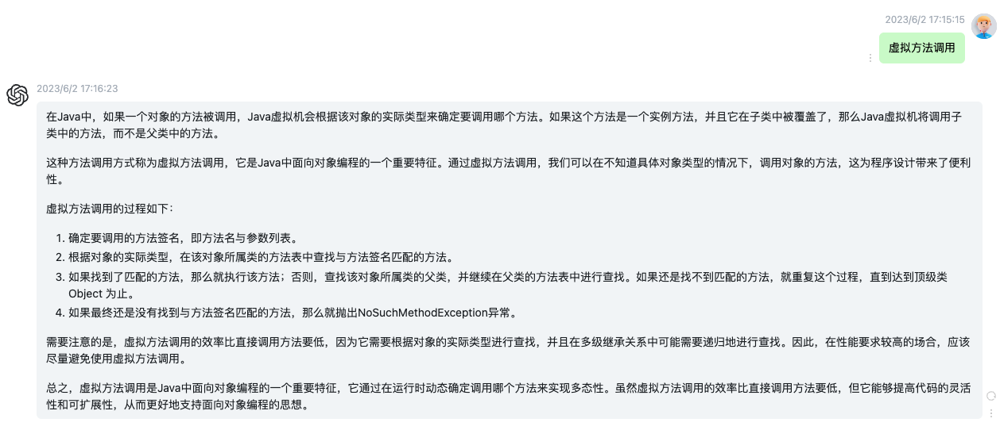
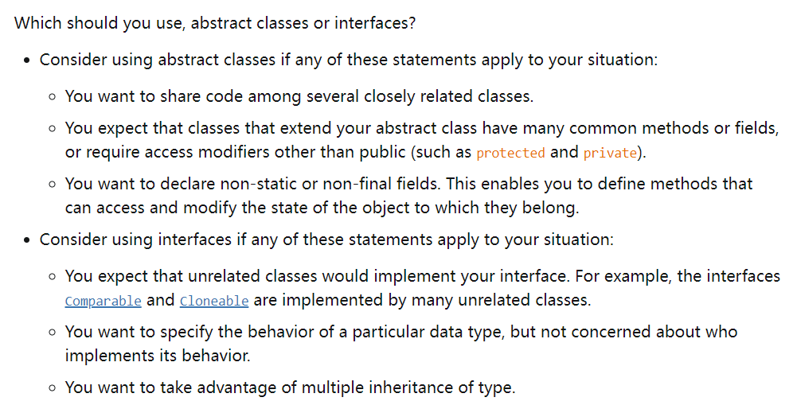

# 【官方】Java官方笔记6继承


### 继承

Java只有单继承，最顶级的父类是Object。

子类会继承父类的fields和methods，而不会继承constructors，因为constructors不属于methods，但是子类可以通过super调用父类的constructor。

子类继承父类的范围是：public、protected、package-private

隐式转换，子类转父类（只有1个爸爸）：

```java
Object obj = new MountainBike();
```

显示转换，父类转子类（有多个子女，所以要明确指定）：

```java
MountainBike myBike = (MountainBike)obj;
```

类有field，而接口没有，所以在多继承时就有问题：如果多个类有相同的field，那么子类将不知道用哪一个，而接口不存在这个问题。Java不支持继承多个类，但是可以实现多个接口。

### 重载

子类的方法跟父类有完全相同的签名和返回类型（也可以是子类），将会覆盖父类方法**Override**。

如果子类定义了1个static方法，跟父类完全相同，那么父类方法会被隐藏**Hide**。

Override和Hide是不同的：

```java
public class Animal {
    public static void testClassMethod() {
        System.out.println("The static method in Animal");
    }
    public void testInstanceMethod() {
        System.out.println("The instance method in Animal");
    }
}
```

```java
public class Cat extends Animal {
    public static void testClassMethod() {
        System.out.println("The static method in Cat");
    }
    public void testInstanceMethod() {
        System.out.println("The instance method in Cat");
    }

    public static void main(String[] args) {
        Cat myCat = new Cat();
        Animal myAnimal = myCat;  // 隐式转换
        Animal.testClassMethod();  // 调的父类
        myAnimal.testInstanceMethod();  // 父类对象引用，还是调的子类
    }
}
```

```java
The static method in Animal
The instance method in Cat
```

Override只会调子类方法，而Hide取决于调用方是父还是子，比如这里的myCat，**隐式转换**为父类Animal后，会调父类的static方法，而调的实例方法却是子类的。（如果不是隐式转换，而是直接给父类实例化，那肯定还是调父类方法）

类instance方法优先于接口default方法：

```java
public class Horse {
    public String identifyMyself() {
        return "I am a horse.";
    }
}

public interface Flyer {
    default public String identifyMyself() {
        return "I am able to fly.";
    }
}

public interface Mythical {
    default public String identifyMyself() {
        return "I am a mythical creature.";
    }
}

public class Pegasus extends Horse implements Flyer, Mythical {
    public static void main(String... args) {
        Pegasus myApp = new Pegasus();
        System.out.println(myApp.identifyMyself());
    }
}
```

输出为`I am a horse.`

Override的优先：

```java
public interface Animal {
    default public String identifyMyself() {
        return "I am an animal.";
    }
}

public interface EggLayer extends Animal {
    default public String identifyMyself() {
        return "I am able to lay eggs.";
    }
}

public interface FireBreather extends Animal { }

public class Dragon implements EggLayer, FireBreather {
    public static void main (String... args) {
        Dragon myApp = new Dragon();
        System.out.println(myApp.identifyMyself());
    }
}
```

输出为`I am able to lay eggs`

如果实现多接口，有同名的，需要显示指定调用方：

```java
public interface OperateCar {
    // ...
    default public int startEngine(EncryptedKey key) {
        // Implementation
    }
}

public interface FlyCar {
    // ...
    default public int startEngine(EncryptedKey key) {
        // Implementation
    }
}
```

```java
public class FlyingCar implements OperateCar, FlyCar {
    // ...
    public int startEngine(EncryptedKey key) {
        FlyCar.super.startEngine(key);  // 显示指定，并且使用super
        OperateCar.super.startEngine(key);  
    }
}
```

总结下，如果子类方法签名+return跟父类方法一样，有以下4种情况：


注意compile-time error，static方法不能和instance方法一样，因为它们是不同级别的。

### 多态

MountainBike和RoadBike都继承Bicycle，虽然都有printDescription，但它们有多样的形态：

```java
public class MountainBike extends Bicycle {
    private String suspension;

    public MountainBike(
               int startCadence,
               int startSpeed,
               int startGear,
               String suspensionType){
        super(startCadence,
              startSpeed,
              startGear);
        this.setSuspension(suspensionType);
    }

    public String getSuspension(){
      return this.suspension;
    }

    public void setSuspension(String suspensionType) {
        this.suspension = suspensionType;
    }

    public void printDescription() {
        super.printDescription();
        System.out.println("The " + "MountainBike has a" +
            getSuspension() + " suspension.");
    }
} 
```

```java
public class RoadBike extends Bicycle{
    // In millimeters (mm)
    private int tireWidth;

    public RoadBike(int startCadence,
                    int startSpeed,
                    int startGear,
                    int newTireWidth){
        super(startCadence,
              startSpeed,
              startGear);
        this.setTireWidth(newTireWidth);
    }

    public int getTireWidth(){
      return this.tireWidth;
    }

    public void setTireWidth(int newTireWidth){
        this.tireWidth = newTireWidth;
    }

    public void printDescription(){
        super.printDescription();
        System.out.println("The RoadBike" + " has " + getTireWidth() +
            " MM tires.");
    }
}
```

所谓的**虚拟方法调用**，名字很高大上，其实质就是，子类重载了父类方法，在调用子类实例方法时，先调子类实现：



注意，子类的field如果和父类的一样，那么父类的field会被hide，即使type不一样。如果要使用父类的field，需要关键字super。同名fileld是不好的设计，应该尽量避免。

**super关键字**

```java
public class Superclass {

    public void printMethod() {
        System.out.println("Printed in Superclass.");
    }
}
```

```java
public class Subclass extends Superclass {

    // overrides printMethod in Superclass
    public void printMethod() {
        super.printMethod();
        System.out.println("Printed in Subclass");
    }
    public static void main(String[] args) {
        Subclass s = new Subclass();
        s.printMethod();    
    }
}
```

在子类constructor中，如果没有显式super，那么会调用默认的super()

### Object

Java中的所有类，都终极继承了Object。（继承链的顶端）

**toString()**

```java
System.out.println(firstBook.toString());
```

**equals()**

```java
public class Book {
    String ISBN;
    
    public String getISBN() { 
        return ISBN;
    }
    
    public boolean equals(Object obj) {
        if (obj instanceof Book)
            return ISBN.equals((Book)obj.getISBN()); 
        else
            return false;
    }
}
```

**hashCode()**

如果两个对象相等，那么它们的hashCode一定相等。重写equals()，必须重写hashCode()

**getClass()**

```java
void printClassName(Object obj) {
    System.out.println("The object's" + " class is " +
        obj.getClass().getSimpleName());
}
```

**clone()**

```java
aCloneableObject.clone();
```

**finalize()**

垃圾回收时调用。它的调用时机是不确定的，不要使用它来做逻辑。

### 抽象

abstract class，抽象类，不能被实例化，但是可以继承。

```java
abstract void moveTo(double deltaX, double deltaY);
```

如果抽象类有method，那么也必须是abstract：

```java
public abstract class GraphicObject {
   // declare fields
   // declare nonabstract methods
   abstract void draw();
}
```

子类必须抽象类的所有方法，否则子类也必须是abstract。

抽象类：（not static、final） field，（public、protected、private） method

接口：public static final field，public method

Java中，抽象类的例子是AbstractMap、接口的例子是HashMap实现的Serializable, Cloneable, and Map<K, V>接口。



如果类没有实现接口中的所有方法，可以定义为abstract，然后由子类来实现剩余的全部方法：

```java
abstract class X implements Y {
  // implements all but one method of Y
}

class XX extends X {
  // implements the remaining method in Y
}
```

X没有实现全部方法，所以是abstract，子类XX实现剩余全部方法。

> 参考资料：
>
> Inheritance https://dev.java/learn/inheritance/
>