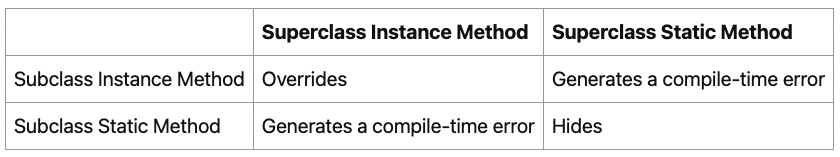
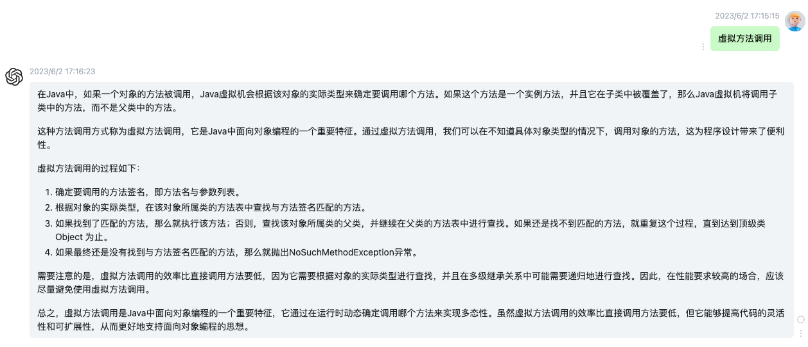
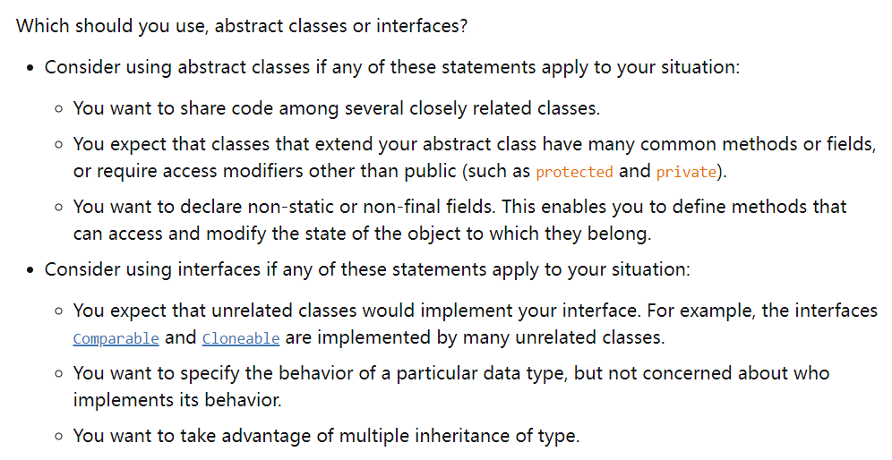

【官方】Java官方笔记6继承
=========================

|image1|

继承
~~~~

Java只有单继承，最顶级的父类是Object。

子类会继承父类的fields和methods，而不会继承constructors，因为constructors不属于methods，但是子类可以通过super调用父类的constructor。

子类继承父类的范围是：public、protected、package-private

隐式转换，子类转父类（只有1个爸爸）：

.. code:: java

   Object obj = new MountainBike();

显示转换，父类转子类（有多个子女，所以要明确指定）：

.. code:: java

   MountainBike myBike = (MountainBike)obj;

类有field，而接口没有，所以在多继承时就有问题：如果多个类有相同的field，那么子类将不知道用哪一个，而接口不存在这个问题。Java不支持继承多个类，但是可以实现多个接口。

重载
~~~~

子类的方法跟父类有完全相同的签名和返回类型（也可以是子类），将会覆盖父类方法\ **Override**\ 。

如果子类定义了1个static方法，跟父类完全相同，那么父类方法会被隐藏\ **Hide**\ 。

Override和Hide是不同的：

.. code:: java

   public class Animal {
       public static void testClassMethod() {
           System.out.println("The static method in Animal");
       }
       public void testInstanceMethod() {
           System.out.println("The instance method in Animal");
       }
   }

.. code:: java

   public class Cat extends Animal {
       public static void testClassMethod() {
           System.out.println("The static method in Cat");
       }
       public void testInstanceMethod() {
           System.out.println("The instance method in Cat");
       }

       public static void main(String[] args) {
           Cat myCat = new Cat();
           Animal myAnimal = myCat;  // 隐式转换
           Animal.testClassMethod();  // 调的父类
           myAnimal.testInstanceMethod();  // 父类对象引用，还是调的子类
       }
   }

.. code:: java

   The static method in Animal
   The instance method in Cat

Override只会调子类方法，而Hide取决于调用方是父还是子，比如这里的myCat，\ **隐式转换**\ 为父类Animal后，会调父类的static方法，而调的实例方法却是子类的。（如果不是隐式转换，而是直接给父类实例化，那肯定还是调父类方法）

类instance方法优先于接口default方法：

.. code:: java

   public class Horse {
       public String identifyMyself() {
           return "I am a horse.";
       }
   }

   public interface Flyer {
       default public String identifyMyself() {
           return "I am able to fly.";
       }
   }

   public interface Mythical {
       default public String identifyMyself() {
           return "I am a mythical creature.";
       }
   }

   public class Pegasus extends Horse implements Flyer, Mythical {
       public static void main(String... args) {
           Pegasus myApp = new Pegasus();
           System.out.println(myApp.identifyMyself());
       }
   }

输出为\ ``I am a horse.``

Override的优先：

.. code:: java

   public interface Animal {
       default public String identifyMyself() {
           return "I am an animal.";
       }
   }

   public interface EggLayer extends Animal {
       default public String identifyMyself() {
           return "I am able to lay eggs.";
       }
   }

   public interface FireBreather extends Animal { }

   public class Dragon implements EggLayer, FireBreather {
       public static void main (String... args) {
           Dragon myApp = new Dragon();
           System.out.println(myApp.identifyMyself());
       }
   }

输出为\ ``I am able to lay eggs``

如果实现多接口，有同名的，需要显示指定调用方：

.. code:: java

   public interface OperateCar {
       // ...
       default public int startEngine(EncryptedKey key) {
           // Implementation
       }
   }

   public interface FlyCar {
       // ...
       default public int startEngine(EncryptedKey key) {
           // Implementation
       }
   }

.. code:: java

   public class FlyingCar implements OperateCar, FlyCar {
       // ...
       public int startEngine(EncryptedKey key) {
           FlyCar.super.startEngine(key);  // 显示指定，并且使用super
           OperateCar.super.startEngine(key);  
       }
   }

总结下，如果子类方法签名+return跟父类方法一样，有以下4种情况：

|image2|

注意compile-time
error，static方法不能和instance方法一样，因为它们是不同级别的。

多态
~~~~

MountainBike和RoadBike都继承Bicycle，虽然都有printDescription，但它们有多样的形态：

.. code:: java

   public class MountainBike extends Bicycle {
       private String suspension;

       public MountainBike(
                  int startCadence,
                  int startSpeed,
                  int startGear,
                  String suspensionType){
           super(startCadence,
                 startSpeed,
                 startGear);
           this.setSuspension(suspensionType);
       }

       public String getSuspension(){
         return this.suspension;
       }

       public void setSuspension(String suspensionType) {
           this.suspension = suspensionType;
       }

       public void printDescription() {
           super.printDescription();
           System.out.println("The " + "MountainBike has a" +
               getSuspension() + " suspension.");
       }
   } 

.. code:: java

   public class RoadBike extends Bicycle{
       // In millimeters (mm)
       private int tireWidth;

       public RoadBike(int startCadence,
                       int startSpeed,
                       int startGear,
                       int newTireWidth){
           super(startCadence,
                 startSpeed,
                 startGear);
           this.setTireWidth(newTireWidth);
       }

       public int getTireWidth(){
         return this.tireWidth;
       }

       public void setTireWidth(int newTireWidth){
           this.tireWidth = newTireWidth;
       }

       public void printDescription(){
           super.printDescription();
           System.out.println("The RoadBike" + " has " + getTireWidth() +
               " MM tires.");
       }
   }

所谓的\ **虚拟方法调用**\ ，名字很高大上，其实质就是，子类重载了父类方法，在调用子类实例方法时，先调子类实现：

|image3|

注意，子类的field如果和父类的一样，那么父类的field会被hide，即使type不一样。如果要使用父类的field，需要关键字super。同名fileld是不好的设计，应该尽量避免。

**super关键字**

.. code:: java

   public class Superclass {

       public void printMethod() {
           System.out.println("Printed in Superclass.");
       }
   }

.. code:: java

   public class Subclass extends Superclass {

       // overrides printMethod in Superclass
       public void printMethod() {
           super.printMethod();
           System.out.println("Printed in Subclass");
       }
       public static void main(String[] args) {
           Subclass s = new Subclass();
           s.printMethod();    
       }
   }

在子类constructor中，如果没有显式super，那么会调用默认的super()

Object
~~~~~~

Java中的所有类，都终极继承了Object。（继承链的顶端）

**toString()**

.. code:: java

   System.out.println(firstBook.toString());

**equals()**

.. code:: java

   public class Book {
       String ISBN;
       
       public String getISBN() { 
           return ISBN;
       }
       
       public boolean equals(Object obj) {
           if (obj instanceof Book)
               return ISBN.equals((Book)obj.getISBN()); 
           else
               return false;
       }
   }

**hashCode()**

如果两个对象相等，那么它们的hashCode一定相等。重写equals()，必须重写hashCode()

**getClass()**

.. code:: java

   void printClassName(Object obj) {
       System.out.println("The object's" + " class is " +
           obj.getClass().getSimpleName());
   }

**clone()**

.. code:: java

   aCloneableObject.clone();

**finalize()**

垃圾回收时调用。它的调用时机是不确定的，不要使用它来做逻辑。

抽象
~~~~

abstract class，抽象类，不能被实例化，但是可以继承。

.. code:: java

   abstract void moveTo(double deltaX, double deltaY);

如果抽象类有method，那么也必须是abstract：

.. code:: java

   public abstract class GraphicObject {
      // declare fields
      // declare nonabstract methods
      abstract void draw();
   }

子类必须抽象类的所有方法，否则子类也必须是abstract。

抽象类：（not static、final） field，（public、protected、private）
method

接口：public static final field，public method

Java中，抽象类的例子是AbstractMap、接口的例子是HashMap实现的Serializable,
Cloneable, and Map<K, V>接口。

|image4|

如果类没有实现接口中的所有方法，可以定义为abstract，然后由子类来实现剩余的全部方法：

.. code:: java

   abstract class X implements Y {
     // implements all but one method of Y
   }

   class XX extends X {
     // implements the remaining method in Y
   }

X没有实现全部方法，所以是abstract，子类XX实现剩余全部方法。

   参考资料：

   Inheritance https://dev.java/learn/inheritance/

.. |image1| image:: ../wanggang.png

