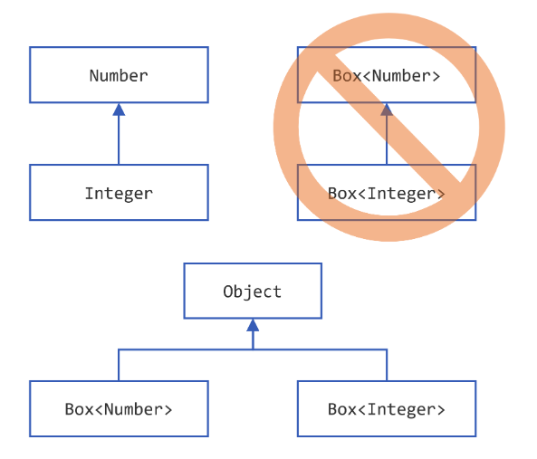
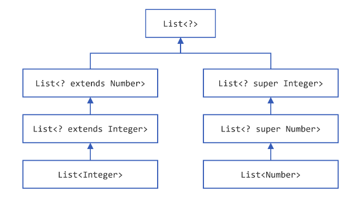

# 【官方】Java官方笔记8泛型


### 泛型

为什么需要泛型？generics enable types (classes and interfaces) to be parameters when defining classes, interfaces and methods.

> 说白了就像Python动态语言的变量，是动态的，可以指向任意类型。

泛型有个好处是不需要类型转换：

```java
List list = new ArrayList();
list.add("hello");
String s = (String) list.get(0);
```

```java
List<String> list = new ArrayList<String>();
list.add("hello");
String s = list.get(0);   // no cast
```

这个例子的泛型，是指List的实现使用了泛型`<T>`，从而给使用带来了好处。

**定义**

```java
class name<T1, T2, ..., Tn> { /* ... */ }
```

比如定义`class List<T>`，使用`List<String>`

将以下代码：

```java
public class Box {
    private Object object;

    public void set(Object object) { this.object = object; }
    public Object get() { return object; }
}
```

改为泛型实现：

```java
/**
 * Generic version of the Box class.
 * @param <T> the type of the value being boxed
 */
public class Box<T> {
    // T stands for "Type"
    private T t;

    public void set(T t) { this.t = t; }
    public T get() { return t; }
}
```

T必须是非基本数据类型：any class type, any interface type, any array type, or even another type variable

type parameter命名采用单个大写字母：

- E - Element (used extensively by the Java Collections Framework)
- K - Key
- N - Number
- T - Type
- V - Value
- S, U, V etc. - 2nd, 3rd, 4th types

这样能很好的跟其他命名区分开来。

使用泛型，必须要指定具体的值，比如这里的Integer：

```java
Box<Integer> integerBox;
```

这就跟方法调用传参是一个道理。

**Diamond**，将：

```java
Box<Integer> integerBox = new Box<Integer>();
```

简写为：

```java
Box<Integer> integerBox = new Box<>();
```

**多个type parameters**：

```java
public interface Pair<K, V> {
    public K getKey();
    public V getValue();
}

public class OrderedPair<K, V> implements Pair<K, V> {

    private K key;
    private V value;

    public OrderedPair(K key, V value) {
    this.key = key;
    this.value = value;
    }

    public K getKey()    { return key; }
    public V getValue() { return value; }
}
```

```java
Pair<String, Integer> p1 = new OrderedPair<String, Integer>("Even", 8);  // 这里的int类型8，自动装箱为了I
Pair<String, String>  p2 = new OrderedPair<String, String>("hello", "world");
```

简写为diamond：

```java
OrderedPair<String, Integer> p1 = new OrderedPair<>("Even", 8);
OrderedPair<String, String>  p2 = new OrderedPair<>("hello", "world");
```

嵌套：

```java
OrderedPair<String, Box<Integer>> p = new OrderedPair<>("primes", new Box<Integer>(...));
```

**Raw Types**

A *raw type* is the name of a generic class or interface without any type arguments.

比如：

```java
public class Box<T> {
    public void set(T t) { /* ... */ }
    // ...
}
```

```java
Box<Integer> intBox = new Box<>();
```

```java
Box rawBox = new Box();  // 这个就是rawType
```

> 在IDEA有时候会碰到警告Raw use of parameterized class 'List'，就是指的这个玩意。这是老式写法，raw types会绕过泛型的type checks，应该避免使用。

**Generic Methods**

定义，泛型位置在return type的前面：

```java
public class Util {
    public static <K, V> boolean compare(Pair<K, V> p1, Pair<K, V> p2) {
        return p1.getKey().equals(p2.getKey()) &&
               p1.getValue().equals(p2.getValue());
    }
}

public class Pair<K, V> {

    private K key;
    private V value;

    public Pair(K key, V value) {
        this.key = key;
        this.value = value;
    }

    public void setKey(K key) { this.key = key; }
    public void setValue(V value) { this.value = value; }
    public K getKey()   { return key; }
    public V getValue() { return value; }
}
```

使用：

```java
Pair<Integer, String> p1 = new Pair<>(1, "apple");
Pair<Integer, String> p2 = new Pair<>(2, "pear");
boolean same = Util.<Integer, String>compare(p1, p2);
```

调用泛型方法时也可以省略泛型入参：

```java
Pair<Integer, String> p1 = new Pair<>(1, "apple");
Pair<Integer, String> p2 = new Pair<>(2, "pear");
boolean same = Util.compare(p1, p2);  // 这里省略了泛型入参
```

**Bounded Type Parameters**

有点像Python的typing，限制动态变量的类型，使用extends关键字：

```java
public class Box<T> {

    private T t;          

    public void set(T t) {
        this.t = t;
    }

    public T get() {
        return t;
    }

    public <U extends Number> void inspect(U u){
        System.out.println("T: " + t.getClass().getName());
        System.out.println("U: " + u.getClass().getName());
    }

    public static void main(String[] args) {
        Box<Integer> integerBox = new Box<Integer>();
        integerBox.set(new Integer(10));
        integerBox.inspect("some text"); // error: this is still String!
    }
}
```

这样还能进一步调用bounded type parameters的方法：

```java
public class NaturalNumber<T extends Integer> {

    private T n;

    public NaturalNumber(T n)  { this.n = n; }

    public boolean isEven() {
        return n.intValue() % 2 == 0;  // intValue()是Integer的方法
    }

    // ...
}
```

**Multiple Bounds**

```java
Class A { /* ... */ }
interface B { /* ... */ }
interface C { /* ... */ }

class D <T extends A & B & C> { /* ... */ }
```

class的位置必须在interface前面。

**Bounded Type Parameters的用途**之一，比如：

```java
public static <T> int countGreaterThan(T[] anArray, T elem) {
    int count = 0;
    for (T e : anArray)
        if (e > elem)  // compiler error
            ++count;
    return count;
}
```

会编译报错，因为`>`符号只适用基本数据类型，如果想支持Object，怎么办呢：

```java
public static <T extends Comparable<T>> int countGreaterThan(T[] anArray, T elem) {
    int count = 0;
    for (T e : anArray)
        if (e.compareTo(elem) > 0)
            ++count;
    return count;
}
```

`extends Comparable<T>`以后调用`compareTo()`方法，就能既支持基本数据类型又能支持Object了。

**泛型在继承时**有个注意的点： `Box<Integer>` and `Box<Double>` are not subtypes of `Box<Number>`



正确的方式：

You can subtype a generic class or interface by extending or implementing it.

```java
interface PayloadList<E,P> extends List<E> {
  void setPayload(int index, P val);
  ...
}
```


### Type Inference

类型推断：*Type inference* is a Java compiler's ability to look at each method invocation and corresponding declaration to determine the type argument (or arguments) that make the invocation applicable.（换个理解方式，就是动态变量需要知道绑定哪个类型）

Diamond就是一种Type Inference：

```java
Map<String, List<String>> myMap = new HashMap<>();
```

在构造方法中进行推断：

```java
class MyClass<X> {
  <T> MyClass(T t) {
    // ...
  }
}
```

```java
MyClass<Integer> myObject = new MyClass<>("");
```

X推断为Integer，T推断为String。

Lambda Expressions也会根据上下文推断target type：

```java
public static void printPersons(List<Person> roster, CheckPerson tester)
```

```java
public void printPersonsWithPredicate(List<Person> roster, Predicate<Person> tester) 
```

```java
printPersons(
        people, 
        p -> p.getGender() == Person.Sex.MALE
            && p.getAge() >= 18
            && p.getAge() <= 25);  // 自动推断为CheckPerson
```

```java
printPersonsWithPredicate(
        people,
        p -> p.getGender() == Person.Sex.MALE
             && p.getAge() >= 18
             && p.getAge() <= 25);)  // 自动推断Predicate<Person>
```

- Variable declarations
- Assignments
- Return statements
- Array initializers
- Method or constructor arguments
- Lambda expression bodies
- Conditional expressions, `?:`
- Cast expressions

再看个例子：

```java
public interface Runnable {
    void run();
}

public interface Callable<V> {
    V call();
}
```

```java
void invoke(Runnable r) {
    r.run();
}

<T> T invoke(Callable<T> c) {
    return c.call();
}
```

```java
String s = invoke(() -> "done");  // Lambda 
```

实际推断使用哪个？答案是Callable，因为它有return，而Runnable没有。

### Wildcards

使用`?`，`extends`表示上限:

```java
List<? extends Number>
```

可以是 `List<Integer>`, `List<Double>`, and `List<Number>`

这里的`extends`既是class的extends，也是interface的implements。

`List<Object>`和`List<?>`有什么区别？

①子类型

```java
public static void printList(List<Object> list) {
    for (Object elem : list)
        System.out.println(elem + " ");
    System.out.println();
}
```

it prints only a list of [`Object`](https://docs.oracle.com/en/java/javase/20/docs/api/java.base/java/lang/Object.html) instances; it cannot print `List<Integer>`, `List<String>`, `List<Double>`, and so on, because they are not subtypes of `List<Object>`.

```java
public static void printList(List<?> list) {
    for (Object elem: list)
        System.out.print(elem + " ");
    System.out.println();
}
```

Because for any concrete type `A`, `List<A>` is a subtype of `List<?>`, you can use `printList()` to print a list of any type.

②值

You can insert an [`Object`](https://docs.oracle.com/en/java/javase/20/docs/api/java.base/java/lang/Object.html), or any subtype of [`Object`](https://docs.oracle.com/en/java/javase/20/docs/api/java.base/java/lang/Object.html), into a `List<Object>`. But you can only insert `null` into a `List<?>`.

使用`?`，`super`表示下限:

```java
public static void addNumbers(List<? super Integer> list) {
    for (int i = 1; i <= 10; i++) {
        list.add(i);
    }
}
```

可以是`List<Integer>`, `List<Number>`, and `List<Object>` — anything that can hold [`Integer`](https://docs.oracle.com/en/java/javase/20/docs/api/java.base/java/lang/Integer.html) values

`?`能支持集合子类型：



### Type Erasure

Type Erasure是Java编译器为了实现泛型做的：

- Replace all type parameters in generic types with their bounds or Object if the type parameters are unbounded. The produced bytecode, therefore, contains only ordinary classes, interfaces, and methods.
- Insert type casts if necessary to preserve type safety.
- Generate bridge methods to preserve polymorphism in extended generic types.

### Restriction on Generics

1、不能使用基本数据类型：

```java
class Pair<K, V> {

    private K key;
    private V value;

    public Pair(K key, V value) {
        this.key = key;
        this.value = value;
    }

    // ...
}
```

```java
Pair<int, char> p = new Pair<>(8, 'a');  // compile-time error
```

只能使用包装类：

```java
Pair<Integer, Character> p = new Pair<>(8, 'a');
```

2、不能创建泛型实例：

```java
public static <E> void append(List<E> list) {
    E elem = new E();  // compile-time error
    list.add(elem);
}
```

只能通过类来创建实例：

```java
public static <E> void append(List<E> list, Class<E> cls) throws Exception {
    E elem = cls.newInstance();   // OK
    list.add(elem);
}
```

```java
List<String> ls = new ArrayList<>();
append(ls, String.class);
```

3、static不能使用泛型

```java
public class MobileDevice<T> {
    private static T os;  // 在实例化后，会同时代表3种类型，显然不合理

    // ...
}
```

```java
MobileDevice<Smartphone> phone = new MobileDevice<>();
MobileDevice<Pager> pager = new MobileDevice<>();
MobileDevice<TabletPC> pc = new MobileDevice<>();
```

4、不能instanceof

```java
public static <E> void rtti(List<E> list) {
    if (list instanceof ArrayList<Integer>) {  // compile-time error
        // ...
    }
}
```

使用`?`可以：

```java
public static void rtti(List<?> list) {
    if (list instanceof ArrayList<?>) {  // OK; instanceof requires a reifiable type
        // ...
    }
}
```

5、不能创建泛型数组：

```java
List<Integer>[] arrayOfLists = new List<Integer>[2];  // compile-time error
```


6、Cannot Create, Catch, or Throw Objects of Parameterized Types

```java
// Extends Throwable indirectly
class MathException<T> extends Exception { /* ... */ }    // compile-time error

// Extends Throwable directly
class QueueFullException<T> extends Throwable { /* ... */ // compile-time error
```

```java
public static <T extends Exception, J> void execute(List<J> jobs) {
    try {
        for (J job : jobs)
            // ...
    } catch (T e) {   // compile-time error
        // ...
    }
}
```

throws可以：

```java
class Parser<T extends Exception> {
    public void parse(File file) throws T {     // OK
        // ...
    }
}
```

7、重载方法不能有擦除后相同的泛型：

```java
public class Example {
    public void print(Set<String> strSet) { }
    public void print(Set<Integer> intSet) { }  // 编译错误
}
```

> 参考资料：
> 
> Generics https://dev.java/learn/generics/
