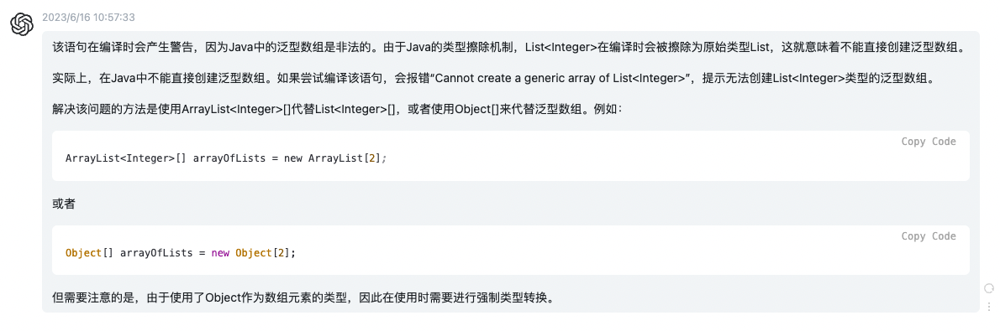

【官方】Java官方笔记8泛型
=========================

|image1|

泛型
~~~~

为什么需要泛型？generics enable types (classes and interfaces) to be
parameters when defining classes, interfaces and methods.

   说白了就像Python动态语言的变量，是动态的，可以指向任意类型。

泛型有个好处是不需要类型转换：

.. code:: java

   List list = new ArrayList();
   list.add("hello");
   String s = (String) list.get(0);

.. code:: java

   List<String> list = new ArrayList<String>();
   list.add("hello");
   String s = list.get(0);   // no cast

这个例子的泛型，是指List的实现使用了泛型\ ``<T>``\ ，从而给使用带来了好处。

**定义**

.. code:: java

   class name<T1, T2, ..., Tn> { /* ... */ }

比如定义\ ``class List<T>``\ ，使用\ ``List<String>``

将以下代码：

.. code:: java

   public class Box {
       private Object object;

       public void set(Object object) { this.object = object; }
       public Object get() { return object; }
   }

改为泛型实现：

.. code:: java

   /**
    * Generic version of the Box class.
    * @param <T> the type of the value being boxed
    */
   public class Box<T> {
       // T stands for "Type"
       private T t;

       public void set(T t) { this.t = t; }
       public T get() { return t; }
   }

T必须是非基本数据类型：any class type, any interface type, any array
type, or even another type variable

type parameter命名采用单个大写字母：

-  E - Element (used extensively by the Java Collections Framework)
-  K - Key
-  N - Number
-  T - Type
-  V - Value
-  S, U, V etc. - 2nd, 3rd, 4th types

这样能很好的跟其他命名区分开来。

使用泛型，必须要指定具体的值，比如这里的Integer：

.. code:: java

   Box<Integer> integerBox;

这就跟方法调用传参是一个道理。

**Diamond**\ ，将：

.. code:: java

   Box<Integer> integerBox = new Box<Integer>();

简写为：

.. code:: java

   Box<Integer> integerBox = new Box<>();

**多个type parameters**\ ：

.. code:: java

   public interface Pair<K, V> {
       public K getKey();
       public V getValue();
   }

   public class OrderedPair<K, V> implements Pair<K, V> {

       private K key;
       private V value;

       public OrderedPair(K key, V value) {
       this.key = key;
       this.value = value;
       }

       public K getKey()    { return key; }
       public V getValue() { return value; }
   }

.. code:: java

   Pair<String, Integer> p1 = new OrderedPair<String, Integer>("Even", 8);  // 这里的int类型8，自动装箱为了I
   Pair<String, String>  p2 = new OrderedPair<String, String>("hello", "world");

简写为diamond：

.. code:: java

   OrderedPair<String, Integer> p1 = new OrderedPair<>("Even", 8);
   OrderedPair<String, String>  p2 = new OrderedPair<>("hello", "world");

嵌套：

.. code:: java

   OrderedPair<String, Box<Integer>> p = new OrderedPair<>("primes", new Box<Integer>(...));

**Raw Types**

A *raw type* is the name of a generic class or interface without any
type arguments.

比如：

.. code:: java

   public class Box<T> {
       public void set(T t) { /* ... */ }
       // ...
   }

.. code:: java

   Box<Integer> intBox = new Box<>();

.. code:: java

   Box rawBox = new Box();  // 这个就是rawType

..

   在IDEA有时候会碰到警告Raw use of parameterized class
   ‘List’，就是指的这个玩意。这是老式写法，raw types会绕过泛型的type
   checks，应该避免使用。

**Generic Methods**

定义，泛型位置在return type的前面：

.. code:: java

   public class Util {
       public static <K, V> boolean compare(Pair<K, V> p1, Pair<K, V> p2) {
           return p1.getKey().equals(p2.getKey()) &&
                  p1.getValue().equals(p2.getValue());
       }
   }

   public class Pair<K, V> {

       private K key;
       private V value;

       public Pair(K key, V value) {
           this.key = key;
           this.value = value;
       }

       public void setKey(K key) { this.key = key; }
       public void setValue(V value) { this.value = value; }
       public K getKey()   { return key; }
       public V getValue() { return value; }
   }

使用：

.. code:: java

   Pair<Integer, String> p1 = new Pair<>(1, "apple");
   Pair<Integer, String> p2 = new Pair<>(2, "pear");
   boolean same = Util.<Integer, String>compare(p1, p2);

调用泛型方法时也可以省略泛型入参：

.. code:: java

   Pair<Integer, String> p1 = new Pair<>(1, "apple");
   Pair<Integer, String> p2 = new Pair<>(2, "pear");
   boolean same = Util.compare(p1, p2);  // 这里省略了泛型入参

**Bounded Type Parameters**

有点像Python的typing，限制动态变量的类型，使用extends关键字：

.. code:: java

   public class Box<T> {

       private T t;          

       public void set(T t) {
           this.t = t;
       }

       public T get() {
           return t;
       }

       public <U extends Number> void inspect(U u){
           System.out.println("T: " + t.getClass().getName());
           System.out.println("U: " + u.getClass().getName());
       }

       public static void main(String[] args) {
           Box<Integer> integerBox = new Box<Integer>();
           integerBox.set(new Integer(10));
           integerBox.inspect("some text"); // error: this is still String!
       }
   }

这样还能进一步调用bounded type parameters的方法：

.. code:: java

   public class NaturalNumber<T extends Integer> {

       private T n;

       public NaturalNumber(T n)  { this.n = n; }

       public boolean isEven() {
           return n.intValue() % 2 == 0;  // intValue()是Integer的方法
       }

       // ...
   }

**Multiple Bounds**

.. code:: java

   Class A { /* ... */ }
   interface B { /* ... */ }
   interface C { /* ... */ }

   class D <T extends A & B & C> { /* ... */ }

class的位置必须在interface前面。

**Bounded Type Parameters的用途**\ 之一，比如：

.. code:: java

   public static <T> int countGreaterThan(T[] anArray, T elem) {
       int count = 0;
       for (T e : anArray)
           if (e > elem)  // compiler error
               ++count;
       return count;
   }

会编译报错，因为\ ``>``\ 符号只适用基本数据类型，如果想支持Object，怎么办呢：

.. code:: java

   public static <T extends Comparable<T>> int countGreaterThan(T[] anArray, T elem) {
       int count = 0;
       for (T e : anArray)
           if (e.compareTo(elem) > 0)
               ++count;
       return count;
   }

``extends Comparable<T>``\ 以后调用\ ``compareTo()``\ 方法，就能既支持基本数据类型又能支持Object了。

**泛型在继承时**\ 有个注意的点： ``Box<Integer>`` and ``Box<Double>`` are
not subtypes of ``Box<Number>``

|image2|

正确的方式：

You can subtype a generic class or interface by extending or
implementing it.

.. code:: java

   interface PayloadList<E,P> extends List<E> {
     void setPayload(int index, P val);
     ...
   }

|image3|

Type Inference
~~~~~~~~~~~~~~

类型推断：\ *Type inference* is a Java compiler’s ability to look at
each method invocation and corresponding declaration to determine the
type argument (or arguments) that make the invocation
applicable.（换个理解方式，就是动态变量需要知道绑定哪个类型）

Diamond就是一种Type Inference：

.. code:: java

   Map<String, List<String>> myMap = new HashMap<>();

在构造方法中进行推断：

.. code:: java

   class MyClass<X> {
     <T> MyClass(T t) {
       // ...
     }
   }

.. code:: java

   MyClass<Integer> myObject = new MyClass<>("");

X推断为Integer，T推断为String。

Lambda Expressions也会根据上下文推断target type：

.. code:: java

   public static void printPersons(List<Person> roster, CheckPerson tester)

.. code:: java

   public void printPersonsWithPredicate(List<Person> roster, Predicate<Person> tester) 

.. code:: java

   printPersons(
           people, 
           p -> p.getGender() == Person.Sex.MALE
               && p.getAge() >= 18
               && p.getAge() <= 25);  // 自动推断为CheckPerson

.. code:: java

   printPersonsWithPredicate(
           people,
           p -> p.getGender() == Person.Sex.MALE
                && p.getAge() >= 18
                && p.getAge() <= 25);)  // 自动推断Predicate<Person>

-  Variable declarations
-  Assignments
-  Return statements
-  Array initializers
-  Method or constructor arguments
-  Lambda expression bodies
-  Conditional expressions, ``?:``
-  Cast expressions

再看个例子：

.. code:: java

   public interface Runnable {
       void run();
   }

   public interface Callable<V> {
       V call();
   }

.. code:: java

   void invoke(Runnable r) {
       r.run();
   }

   <T> T invoke(Callable<T> c) {
       return c.call();
   }

.. code:: java

   String s = invoke(() -> "done");  // Lambda 

实际推断使用哪个？答案是Callable，因为它有return，而Runnable没有。

Wildcards
~~~~~~~~~

使用\ ``?``\ ，\ ``extends``\ 表示上限:

.. code:: java

   List<? extends Number>

可以是 ``List<Integer>``, ``List<Double>``, and ``List<Number>``

这里的\ ``extends``\ 既是class的extends，也是interface的implements。

``List<Object>``\ 和\ ``List<?>``\ 有什么区别？

①子类型

.. code:: java

   public static void printList(List<Object> list) {
       for (Object elem : list)
           System.out.println(elem + " ");
       System.out.println();
   }

it prints only a list
of ```Object`` <https://docs.oracle.com/en/java/javase/20/docs/api/java.base/java/lang/Object.html>`__ instances;
it cannot print ``List<Integer>``, ``List<String>``, ``List<Double>``,
and so on, because they are not subtypes of ``List<Object>``.

.. code:: java

   public static void printList(List<?> list) {
       for (Object elem: list)
           System.out.print(elem + " ");
       System.out.println();
   }

Because for any concrete type ``A``, ``List<A>`` is a subtype
of ``List<?>``, you can use ``printList()`` to print a list of any type.

②值

You can insert
an ```Object`` <https://docs.oracle.com/en/java/javase/20/docs/api/java.base/java/lang/Object.html>`__,
or any subtype
of ```Object`` <https://docs.oracle.com/en/java/javase/20/docs/api/java.base/java/lang/Object.html>`__,
into a ``List<Object>``. But you can only insert ``null`` into
a ``List<?>``.

使用\ ``?``\ ，\ ``super``\ 表示下限:

.. code:: java

   public static void addNumbers(List<? super Integer> list) {
       for (int i = 1; i <= 10; i++) {
           list.add(i);
       }
   }

可以是\ ``List<Integer>``, ``List<Number>``, and ``List<Object>`` —
anything that can
hold ```Integer`` <https://docs.oracle.com/en/java/javase/20/docs/api/java.base/java/lang/Integer.html>`__ values

``?``\ 能支持集合子类型：

|image4|

Type Erasure
~~~~~~~~~~~~

Type Erasure是Java编译器为了实现泛型做的：

-  Replace all type parameters in generic types with their bounds or
   Object if the type parameters are unbounded. The produced bytecode,
   therefore, contains only ordinary classes, interfaces, and methods.
-  Insert type casts if necessary to preserve type safety.
-  Generate bridge methods to preserve polymorphism in extended generic
   types.

Restriction on Generics
~~~~~~~~~~~~~~~~~~~~~~~

1、不能使用基本数据类型：

.. code:: java

   class Pair<K, V> {

       private K key;
       private V value;

       public Pair(K key, V value) {
           this.key = key;
           this.value = value;
       }

       // ...
   }

.. code:: java

   Pair<int, char> p = new Pair<>(8, 'a');  // compile-time error

只能使用包装类：

.. code:: java

   Pair<Integer, Character> p = new Pair<>(8, 'a');

2、不能创建泛型实例：

.. code:: java

   public static <E> void append(List<E> list) {
       E elem = new E();  // compile-time error
       list.add(elem);
   }

只能通过类来创建实例：

.. code:: java

   public static <E> void append(List<E> list, Class<E> cls) throws Exception {
       E elem = cls.newInstance();   // OK
       list.add(elem);
   }

.. code:: java

   List<String> ls = new ArrayList<>();
   append(ls, String.class);

3、static不能使用泛型

.. code:: java

   public class MobileDevice<T> {
       private static T os;  // 在实例化后，会同时代表3种类型，显然不合理

       // ...
   }

.. code:: java

   MobileDevice<Smartphone> phone = new MobileDevice<>();
   MobileDevice<Pager> pager = new MobileDevice<>();
   MobileDevice<TabletPC> pc = new MobileDevice<>();

4、不能instanceof

.. code:: java

   public static <E> void rtti(List<E> list) {
       if (list instanceof ArrayList<Integer>) {  // compile-time error
           // ...
       }
   }

使用\ ``?``\ 可以：

.. code:: java

   public static void rtti(List<?> list) {
       if (list instanceof ArrayList<?>) {  // OK; instanceof requires a reifiable type
           // ...
       }
   }

5、不能创建泛型数组：

.. code:: java

   List<Integer>[] arrayOfLists = new List<Integer>[2];  // compile-time error

|image5|

6、Cannot Create, Catch, or Throw Objects of Parameterized Types

.. code:: java

   // Extends Throwable indirectly
   class MathException<T> extends Exception { /* ... */ }    // compile-time error

   // Extends Throwable directly
   class QueueFullException<T> extends Throwable { /* ... */ // compile-time error

.. code:: java

   public static <T extends Exception, J> void execute(List<J> jobs) {
       try {
           for (J job : jobs)
               // ...
       } catch (T e) {   // compile-time error
           // ...
       }
   }

throws可以：

.. code:: java

   class Parser<T extends Exception> {
       public void parse(File file) throws T {     // OK
           // ...
       }
   }

7、重载方法不能有擦除后相同的泛型：

.. code:: java

   public class Example {
       public void print(Set<String> strSet) { }
       public void print(Set<Integer> intSet) { }  // 编译错误
   }

..

   参考资料：

   Generics https://dev.java/learn/generics/

.. |image1| image:: ../wanggang.png
.. |image2| image:: 002008-【官方】Java官方笔记8泛型/2023-06-07-16-37-48-image.png
.. |image3| image:: 002008-【官方】Java官方笔记8泛型/2023-06-07-16-53-15-image.png


