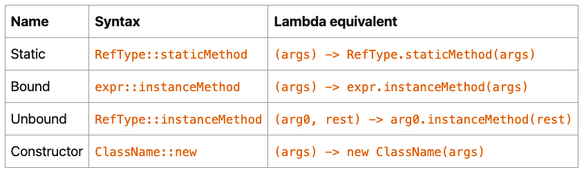

【官方】Java官方笔记9Lambda表达式
=================================

|image1|

Lambda Expression
~~~~~~~~~~~~~~~~~

有了Lambda Expression，就不用再写anonymous classes。

写Lambda，首先要找到它的类型。

There is a restriction on the type of a lambda expression: it has to be
a functional interface.

函数接口，只有1个抽象方法的接口：

.. code:: java

   @FunctionalInterface
   public interface Runnable {
       public abstract void run();
   }

默认方法do not count，所以下面这个也是函数接口：

.. code:: java

   @FunctionalInterface
   public interface Consumer<T> {

       void accept(T t);

       default Consumer<T> andThen(Consumer<? super T> after) {
           // the body of this method has been removed
       }
   }

静态方法也do not count，所以下面这个还是函数接口：

.. code:: java

   @FunctionalInterface
   public interface Predicate<T> {

       boolean test(T t);

       default Predicate<T> and(Predicate<? super T> other) {
           // the body of this method has been removed
       }

       default Predicate<T> negate() {
           // the body of this method has been removed
       }

       default Predicate<T> or(Predicate<? super T> other) {
           // the body of this method has been removed
       }

       static <T> Predicate<T> isEqual(Object targetRef) {
           // the body of this method has been removed
       }

       static <T> Predicate<T> not(Predicate<? super T> target) {
           // the body of this method has been removed
       }
   }

接着，实现函数接口的抽象方法，比如Predicate的抽象方法：

.. code:: java

   boolean test(T t);

实现\ ``Predicate<String>``\ ：

.. code:: java

   Predicate<String> predicate =
       (String s) -> {
           return s.length() == 3;
       };

省略了返回类型和方法名，只保留参数列表和方法体，用\ ``->``\ 连接。

再简化：

.. code:: java

   Predicate<String> predicate = s -> s.length() == 3;

这就是最常见的Lambda，因为前面有String，编译器能够知道，所以这里把\ ``(String s)``\ 简写为\ ``s``\ ，然后只有一行，再把大括号和return省略掉。

无return，跟省略掉return：

.. code:: java

   Consumer<String> print = s -> System.out.println(s);

无参数，用\ ``()``\ 代替：

.. code:: java

   Runnable runnable = () -> System.out.println("I am running");

Lambda的使用：

.. code:: java

   List<String> retainStringsOfLength3(List<String> strings) {

       Predicate<String> predicate = s -> s.length() == 3;
       List<String> stringsOfLength3 = new ArrayList<>();
       for (String s: strings) {
           if (predicate.test(s)) {
               stringsOfLength3.add(s);
           }
       }
       return stringsOfLength3;
   }

因为Lambda实现了接口的抽象方法，所以\ ``predicate.test(s)``\ 调用的实际上是Lambda。

Lambda不能修改变量值：

.. code:: java

   int calculateTotalPrice(List<Product> products) {

       int totalPrice = 0;
       Consumer<Product> consumer =
           product -> totalPrice += product.getPrice();  // 编译错误
       for (Product product: products) {
           consumer.accept(product);
       }
   }

编译错误：Variable used in lambda expression should be final or
effectively final

This process of accessing variable is called *capturing*: lambdas
cannot *capture* variables, they can only *capture* values. A final
variable is in fact a value.

也就是Lambda只能读，不能写。

使用Lambda
~~~~~~~~~~

Lambda是JDK8跨时代的语法技术，它引领了大量的JDK API重写。

java.util.function中包含了很多可供实现的函数接口，functional
interfaces：

https://docs.oracle.com/en/java/javase/20/docs/api/java.base/java/util/function/package-summary.html

比如：

.. code:: java

   @FunctionalInterface
   public interface Supplier<T> {

       T get();
   }

Lambda实现：

::

   Supplier<String> supplier = () -> "Hello Duke!";`

使用：

.. code:: java

   Random random = new Random(314L);
   Supplier<Integer> newRandom = () -> random.nextInt(10);

   for (int index = 0; index < 5; index++) {
       System.out.println(newRandom.get() + " ");
   }

比如：

.. code:: java

   List<String> strings = ...; // really any list of any kind of objects
   Consumer<String> printer = s -> System.out.println(s);
   strings.forEach(printer);

比如：

.. code:: java

   List<String> immutableStrings =
           List.of("one", "two", "three", "four", "five");
   List<String> strings = new ArrayList<>(immutableStrings);
   Predicate<String> isOddLength = s -> s.length() % 2 == 0;
   strings.removeIf(isOddLength);
   System.out.println("strings = " + strings);

比如：

.. code:: java

   @FunctionalInterface
   public interface Function<T, R> {

       R apply(U u);

       // default and static methods removed
   }

.. code:: java

   Function<String, Integer> toLength = s -> s.length();
   String word = ...; // any kind of word will do
   int length = toLength.apply(word);

以上是JDK中最经典的\ **4种function interface**\ ：

-  ``Supplier<T>``
-  ``Consumer<T>``
-  ``Predicate<T>``
-  ``Function<T, R>``

**总结一下，Lambda的使用就是先实现function interface的abstract
method，然后①接口实例调用abstract
method，或者②接口实例被forEach等调用。**

   Lambda使得function
   interface能够实例化：\ ``Predicate<String> isOddLength = s -> s.length() % 2 == 0;``

The
```java.util.function`` <https://docs.oracle.com/en/java/javase/20/docs/api/java.base/java/util/function/package-summary.html>`__
package is now central in Java, because all the lambda expressions you
are going to use in the Collections Framework or the Stream API
implement one of the interfaces from that package.

发现没有，把：

.. code:: java

   List<String> strings = ...; // really any list of any kind of objects
   Consumer<String> printer = s -> System.out.println(s);
   strings.forEach(printer);

简写一下，去掉中间的接口实例：

.. code:: java

   List<String> strings = ...; // really any list of any kind of objects
   strings.forEach(s -> System.out.println(s));

这不就是常见到的Lambda的形态嘛。换句话说，\ **Lambda的结果就是函数接口实例（Function
interface
instance）**\ ，使用Lambda本质上就是调用函数，Java中没有函数的概念，通过function
interface的abstract method，引入了函数，从而造就了Lambda。

Method References
~~~~~~~~~~~~~~~~~

Sometimes people call these lambda expressions “anonymous methods”,
since it is just that: a method that has no name, and that you can move
around your application, store in a field or a variable, pass as an
argument to a method or a constructor and return from a method.

.. code:: java

   Consumer<String> printer = s -> System.out.println(s);

这里的Lambda没有什么逻辑，其实就是System.out.println()方法的引用，所以可以简写为Bound（System.out优化前后一致）：

.. code:: java

   Consumer<String> printer = System.out::println;

Static：

.. code:: java

   IntBinaryOperator max = (a, b) -> Integer.max(a, b);

.. code:: java

   IntBinaryOperator max = Integer::max;

Unbound（优化前s，优化后String；优化前user，优化后User）：

.. code:: java

   Function<String, Integer> toLength = s -> s.length();

.. code:: java

   Function<String, Integer> toLength = String::length;

.. code:: java

   Function<User, String> getName = user -> user.getName();

.. code:: java

   Function<String, Integer> toLength = User::getName;

.. code:: java

   BiFunction<String, String, Integer> indexOf = (sentence, word) -> sentence.indexOf(word);

.. code:: java

   BiFunction<String, String, Integer> indexOf = String::indexOf;

Constructor：

.. code:: java

   Supplier<List<String>> newListOfStrings = () -> new ArrayList<>();

.. code:: java

   Supplier<List<String>> newListOfStrings = ArrayList::new;

总结：

|image2|

Combining Lambda Expressions
~~~~~~~~~~~~~~~~~~~~~~~~~~~~

Function interface中的defualt method该登场了。

.. code:: java

   Predicate<String> nonNull = s -> s != null;
   Predicate<String> nonEmpty = s -> s.isEmpty();
   Predicate<String> shorterThan5 = s -> s.length() < 5;

   Predicate<String> p = nonNull.and(nonEmpty).and(shorterThan5);

这里的\ ``and()``\ 就是default
method，它实现了Lambda的组合，也就是链式调用的既视感。

稍复杂点的：

.. code:: java

   Predicate<String> isNull = Objects::isNull;
   Predicate<String> isEmpty = String::isEmpty;
   Predicate<String> isNullOrEmpty = isNull.or(isEmpty);
   Predicate<String> isNotNullNorEmpty = isNullOrEmpty.negate();
   Predicate<String> shorterThan5 = s -> s.length() < 5;

   Predicate<String> p = isNotNullNorEmpty.and(shorterThan5);

Comparators
~~~~~~~~~~~

.. code:: java

   @FunctionalInterface
   public interface Comparator<T> {

       int compare(T o1, T o2);
   }

Lambda实现：

.. code:: java

   Comparator<Integer> comparator = (i1, i2) -> Integer.compare(i1, i2);

.. code:: java

   Comparator<Integer> comparator = Integer::compare;

Comparator的静态方法：

.. code:: java

   Comparator<String> comparator = Comparator.comparing(String::length);

This ```comparing()`` <https://docs.oracle.com/en/java/javase/20/docs/api/java.base/java/util/Comparator.html#comparing(java.util.function.Function)>`__ method
is a static method of
the ```Comparator`` <https://docs.oracle.com/en/java/javase/20/docs/api/java.base/java/util/Comparator.html>`__ interface.
It takes
a ```Function`` <https://docs.oracle.com/en/java/javase/20/docs/api/java.base/java/util/function/Function.html>`__ as
an argument, that should return a type that is an extension
of ```Comparable`` <https://docs.oracle.com/en/java/javase/20/docs/api/java.base/java/lang/Comparable.html>`__.

使用：

.. code:: java

   List<User> users = ...; // this is your list
   Comparator<User> byName = Comparator.comparing(User::getName);
   users.sort(byName);

还有默认方法thenComparing：

.. code:: java

   Comparator<User> byFirstNameThenLastName =
           Comparator.comparing(User::getFirstName)
                     .thenComparing(User::getLastName);

..

   参考资料：

   Lambda Expressions https://dev.java/learn/lambdas/

.. |image1| image:: ../wanggang.png

