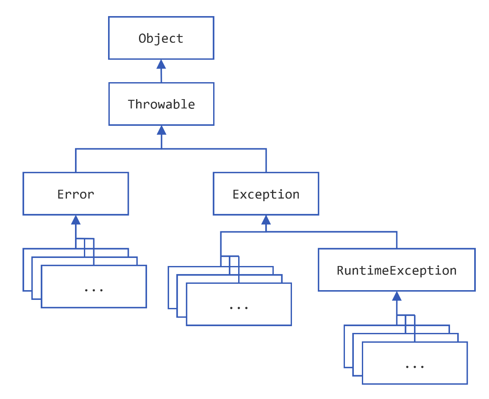

【官方】Java官方笔记12异常
==========================

|image1|

Exception
~~~~~~~~~

*Definition*: An *exception* is an event, which occurs during the
execution of a program, that disrupts the normal flow of the program’s
instructions.

**the checked exception**

比如，java.io.FileNotFoundException

**the error**

比如，java.io.IOError

**the runtime exception**

比如，NullPointerException

error和runtime exception又叫做unchecked exception

Catching and Handling Exceptions
~~~~~~~~~~~~~~~~~~~~~~~~~~~~~~~~

.. code:: java

   try {
       code
   }
   catch and finally blocks . . .

.. code:: java

   try {

   } catch (ExceptionType name) {

   } catch (ExceptionType name) {

   }

使用\ ``|``\ catch多个：

.. code:: java

   catch (IOException|SQLException ex) {
       logger.log(ex);
       throw ex;
   }

**finally**

The finally block always executes when the ``try`` block exits.

it allows the programmer to avoid having cleanup code accidentally
bypassed by a ``return``, ``continue``, or ``break``.

.. code:: java

   finally {
       if (out != null) {
           System.out.println("Closing PrintWriter");
           out.close();
       } else {
           System.out.println("PrintWriter not open");
       }
   }

finally一定会被执行，除非在try或catch的时候JVM退出了。

**The Try-with-resources Statement**

为了确保资源被回收，可以使用try-with-resources，类似于Python的with语句：

.. code:: java

   static String readFirstLineFromFile(String path) throws IOException {
       try (BufferedReader br =
                      new BufferedReader(new FileReader(path))) {
           return br.readLine();
       }
   }

Any object that
implements ```java.lang.AutoCloseable`` <https://docs.oracle.com/en/java/javase/20/docs/api/java.base/java/lang/AutoCloseable.html>`__,
which includes all objects which
implement ```java.io.Closeable`` <https://docs.oracle.com/en/java/javase/20/docs/api/java.base/java/io/Closeable.html>`__,
can be used as a resource.

OkHttp的示例代码就用到了try-with-resources语句：

.. code:: java

   OkHttpClient client = new OkHttpClient();

   String run(String url) throws IOException {
     Request request = new Request.Builder()
         .url(url)
         .build();

     try (Response response = client.newCall(request).execute()) {
       return response.body().string();
     }
   }

try-with-resources语句也可以跟catch和finally：

In a try-with-resources statement, any ``catch`` or ``finally`` block is
run after the resources declared have been closed.

.. code:: java

   public static void viewTable(Connection con) throws SQLException {

       String query = "select COF_NAME, SUP_ID, PRICE, SALES, TOTAL from COFFEES";

       try (Statement stmt = con.createStatement()) {
           ResultSet rs = stmt.executeQuery(query);

           while (rs.next()) {
               String coffeeName = rs.getString("COF_NAME");
               int supplierID = rs.getInt("SUP_ID");
               float price = rs.getFloat("PRICE");
               int sales = rs.getInt("SALES");
               int total = rs.getInt("TOTAL");

               System.out.println(coffeeName + ", " + supplierID + ", " +
                                  price + ", " + sales + ", " + total);
           }
       } catch (SQLException e) {
           JDBCTutorialUtilities.printSQLException(e);
       }
   }

**语法的区别在于，try-with-resources语句的try后面跟的是小括号\ ``()``\ ，而捕获异常语句的try后面跟的是大括号\ ``{}``\ 。**

try-with-resources语句，小括号里面多个语句以\ ``;``\ 分隔，但是结尾没有分号：

.. code:: java

   try(resource1;
       resource2
   ) {
       statement;
       // 隐式释放资源
   }

..

   对比Python with语句来看：

   ::

      with resource:
          statement

捕获异常语句：

.. code:: java

   try {
       statement;
   }

**对于try-with-resources语句，该如何捕获异常呢？**

比如：

.. code:: java

   try (Response response = client.newCall(request).execute()) {
       JSONObject resJson = (JSONObject) JSON.parse(Objects.requireNonNull(response.body()).string());
       String result = resJson.getJSONObject("data").getString("result");
       return JSON.parseObject(result);
   }

可以这样写，加个try把整个都包起来：

.. code:: java

   try {
       try (Response response = client.newCall(request).execute()) {
           JSONObject resJson = (JSONObject) JSON.parse(Objects.requireNonNull(response.body()).string());
           String result = resJson.getJSONObject("data").getString("result");
           return JSON.parseObject(result);
       }
   } catch (IOException e) {
       System.out.println(e.getMessage());
   }

但更优雅的方式，是直接跟上catch：

.. code:: java

   try (Response response = client.newCall(request).execute()) {
       JSONObject resJson = (JSONObject) JSON.parse(Objects.requireNonNull(response.body()).string());
       String result = resJson.getJSONObject("data").getString("result");
       result = result.replace("\n", "").replace("\t", "");
       return JSON.parseObject(result);
   } catch (IOException e) {
       System.out.println(e.getMessage());
   }

try-with-resources语句的try能两用，既with-resources，又catch-exception。

**Suppressed Exceptions**

If an exception is thrown from the ``try`` block and one or more
exceptions are thrown from the try-with-resources statement, then those
exceptions thrown from the try-with-resources statement are suppressed.

If try and finally both throw exceptions, then throws the exception
thrown from the ``finally`` block; the exception thrown from
the ``try`` block is suppressed.

Throwing Exceptions
~~~~~~~~~~~~~~~~~~~

使用\ ``throws``\ 关键字抛异常：

.. code:: java

   public void writeList() throws IOException {

而在方法内部，则使用\ ``throw``\ 关键字，注意没有\ ``s``\ ：

.. code:: java

   public Object pop() {  // EmptyStackException是unchecked，所以这里不用throws
       Object obj;

       if (size == 0) {
           throw new EmptyStackException();
       }

       obj = objectAt(size - 1);
       setObjectAt(size - 1, null);
       size--;
       return obj;
   }

You can throw only objects that inherit from
the ```java.lang.Throwable`` <https://docs.oracle.com/en/java/javase/20/docs/api/java.base/java/lang/Throwable.html>`__ class.

Note that the declaration of the ``pop()`` method does not contain
a ``throws`` clause. ```EmptyStackException`` <https://docs.oracle.com/en/java/javase/20/docs/api/java.base/java/util/EmptyStackException.html>`__ is
not a checked exception, so pop is not required to state that it might
occur.

**The Throwable hierarchy**

|image2|

**Chained Exceptions**

把低级别的异常，抛到高级别的异常，进行处理：

.. code:: java

   try {

   } catch (IOException e) {
       throw new SampleException("Other IOException", e);
   }

getStackTrace()

.. code:: java

   catch (Exception cause) {
       StackTraceElement elements[] = cause.getStackTrace();
       for (int i = 0, n = elements.length; i < n; i++) {       
           System.err.println(elements[i].getFileName()
               + ":" + elements[i].getLineNumber() 
               + ">> "
               + elements[i].getMethodName() + "()");
       }
   }

Logging

.. code:: java

   try {
       Handler handler = new FileHandler("OutFile.log");
       Logger.getLogger("").addHandler(handler);

   } catch (IOException e) {
       Logger logger = Logger.getLogger("package.name"); 
       StackTraceElement elements[] = e.getStackTrace();
       for (int i = 0, n = elements.length; i < n; i++) {
           logger.log(Level.WARNING, elements[i].getMethodName());
       }
   }

总结
~~~~

Most applications you write will throw objects that are instances
of ```Exception`` <https://docs.oracle.com/en/java/javase/20/docs/api/java.base/java/lang/Exception.html>`__.
Instances
of ```Error`` <https://docs.oracle.com/en/java/javase/20/docs/api/java.base/java/lang/Error.html>`__ are
normally used for serious, hard errors in the system, such as those that
prevent the JVM from running.

the Java programming language does not require methods to catch or to
specify unchecked exceptions
(```RuntimeException`` <https://docs.oracle.com/en/java/javase/20/docs/api/java.base/java/lang/RuntimeException.html>`__, ```Error`` <https://docs.oracle.com/en/java/javase/20/docs/api/java.base/java/lang/Error.html>`__,
and their subclasses).

Here’s the bottom line guideline: If a client can reasonably be expected
to recover from an exception, make it a checked exception. If a client
cannot do anything to recover from the exception, make it an unchecked
exception.

**异常的好处**

1、逻辑代码与异常处理代码解耦：

.. code:: java

   errorCodeType readFile {
       initialize errorCode = 0;

       open the file;
       if (theFileIsOpen) {
           determine the length of the file;
           if (gotTheFileLength) {
               allocate that much memory;
               if (gotEnoughMemory) {
                   read the file into memory;
                   if (readFailed) {
                       errorCode = -1;
                   }
               } else {
                   errorCode = -2;
               }
           } else {
               errorCode = -3;
           }
           close the file;
           if (theFileDidntClose && errorCode == 0) {
               errorCode = -4;
           } else {
               errorCode = errorCode and -4;
           }
       } else {
           errorCode = -5;
       }
       return errorCode;
   }

.. code:: java

   readFile {
       try {
           open the file;
           determine its size;
           allocate that much memory;
           read the file into memory;
           close the file;
       } catch (fileOpenFailed) {
          doSomething;
       } catch (sizeDeterminationFailed) {
           doSomething;
       } catch (memoryAllocationFailed) {
           doSomething;
       } catch (readFailed) {
           doSomething;
       } catch (fileCloseFailed) {
           doSomething;
       }
   }

2、根据调用链抛异常：

.. code:: java

   method1 {
       errorCodeType error;
       error = call method2;
       if (error)
           doErrorProcessing;
       else
           proceed;
   }

   errorCodeType method2 {
       errorCodeType error;
       error = call method3;
       if (error)
           return error;
       else
           proceed;
   }

   errorCodeType method3 {
       errorCodeType error;
       error = call readFile;
       if (error)
           return error;
       else
           proceed;
   }

.. code:: java

   method1 {
       try {
           call method2;
       } catch (exception e) {
           doErrorProcessing;
       }
   }

   method2 throws exception {
       call method3;
   }

   method3 throws exception {
       call readFile;
   }

3、将异常分类：

.. code:: java

   catch (FileNotFoundException e) {
       ...
   }

.. code:: java

   catch (IOException e) {
       ...
   }

.. code:: java

   // A (too) general exception handler
   catch (Exception e) {
       ...
   }

..

   参考资料：

   Exceptions https://dev.java/learn/exceptions/

.. |image1| image:: ../wanggang.png

