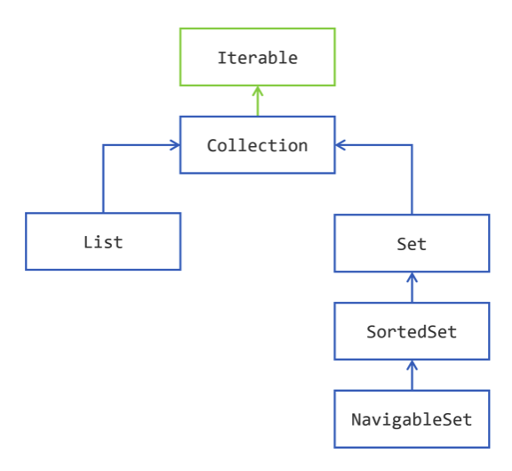
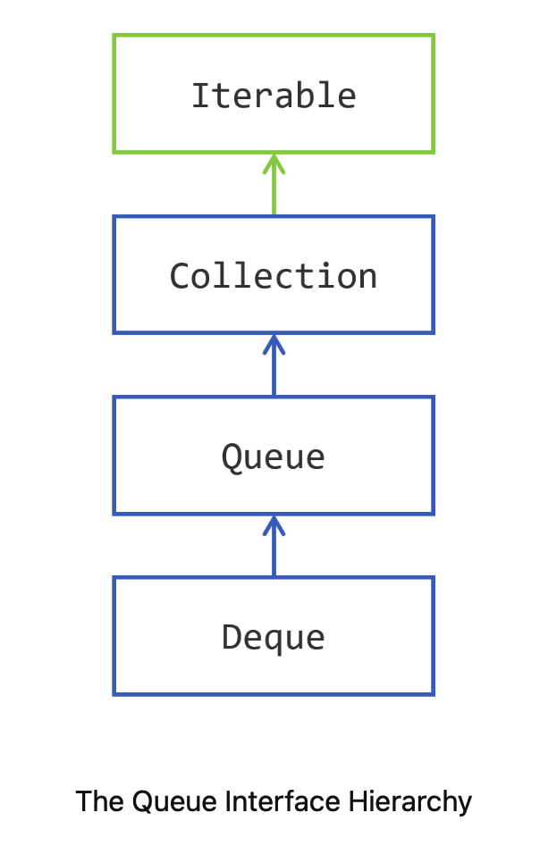
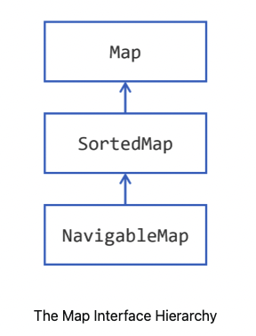

# 【官方】Java官方笔记13集合


### Storing Data

The Collections Framework is the most widely used API of the JDK.

> 集合不是数据类型，它是JDK的API，可以用来存储数据等，相当于数据结构。

the Collections Framework is a set of interfaces that models different way of storing data in different types of containers. Then the Framework provides at least one implementation for each interface.

There are two main categories of interfaces in the Collections Framework: collections and maps.（所以我猜想Python也是基于这样的考虑，设计了List和Dict，并作为Python基本数据类型，实际编码中要用到的也主要是这两类）

That makes two main categories, [`Collection`](https://docs.oracle.com/en/java/javase/20/docs/api/java.base/java/util/Collection.html) and [`Map`](https://docs.oracle.com/en/java/javase/20/docs/api/java.base/java/util/Map.html), a subcategory, [`Queue`](https://docs.oracle.com/en/java/javase/20/docs/api/java.base/java/util/Queue.html), and a side category, [`Iterator`](https://docs.oracle.com/en/java/javase/20/docs/api/java.base/java/util/Iterator.html).

a collection is an object，but an array is not an object in Java.

### Collection Hierarchy



The Iterable Interface is the super interface of the **Collection interface**, and thus of all the interfaces of this hierarchy. An object that implements [`Iterable`](https://docs.oracle.com/en/java/javase/20/docs/api/java.base/java/lang/Iterable.html) is an object that you can iterate over.

the [`Collection`](https://docs.oracle.com/en/java/javase/20/docs/api/java.base/java/util/Collection.html) interface also models different ways of accessing its elements:

- you can iterate over the elements of a collection, through the use of an iterator;
- you can create a stream on these elements, that can be parallel.

**List是有序列表**：

The difference between a [`List`](https://docs.oracle.com/en/java/javase/20/docs/api/java.base/java/util/List.html) of elements and a [`Collection`](https://docs.oracle.com/en/java/javase/20/docs/api/java.base/java/util/Collection.html) of elements, is that a [`List`](https://docs.oracle.com/en/java/javase/20/docs/api/java.base/java/util/List.html) remembers in what order its elements have been added. If you iterate over the elements of a list, the first element you will get is the first that has been added.

**You do not have this guarantee with a plain Collection nor for a Set.**

List跟Collection的区别是，增加了index。

Set跟Collection的区别是，不允许重复。

Set是无序的，SortedSet是排序过的，SortedSet的排序是指从小到大排列，跟List的有序不一样，List有序是指的先添加排前面，不一定是最小的。

### Storing Elements

```java
Collection<String> strings = new ArrayList<>();
strings.add("one");
strings.add("two");
System.out.println("strings = " + strings);
strings.remove("one");
System.out.println("strings = " + strings);
```

- [`containsAll()`](https://docs.oracle.com/en/java/javase/20/docs/api/java.base/java/util/Collection.html#containsAll(java.util.Collection)): defines the inclusion
  
  ```java
  Collection<String> strings = new ArrayList<>();
  strings.add("one");
  strings.add("two");
  strings.add("three");
  
  Collection<String> first = new ArrayList<>();
  strings.add("one");
  strings.add("two");
  
  Collection<String> second = new ArrayList<>();
  strings.add("one");
  strings.add("four");
  
  System.out.println("Is first contained in strings? " + strings.containsAll(first));
  System.out.println("Is second contained in strings? " + strings.containsAll(second));
  ```

- [`addAll()`](https://docs.oracle.com/en/java/javase/20/docs/api/java.base/java/util/Collection.html#addAll(java.util.Collection)): defines the union 并集
  
  Getting a `true` value does not mean that all the elements of the other collection have been added; it means that **at least one has been added**.
  
  ```java
  Collection<String> strings = new ArrayList<>();
  strings.add("one");
  strings.add("two");
  strings.add("three");
  
  Collection<String> first = new ArrayList<>();
  first.add("one");
  first.add("four");
  
  boolean hasChanged = strings.addAll(first);
  
  System.out.println("Has strings changed? " + hasChanged);
  System.out.println("strings = " + strings);
  ```

- [`removeAll()`](https://docs.oracle.com/en/java/javase/20/docs/api/java.base/java/util/Collection.html#removeAll(java.util.Collection)): defines the complement
  
  ```java
  Collection<String> strings = new ArrayList<>();
  strings.add("one");
  strings.add("two");
  strings.add("three");
  
  Collection<String> toBeRemoved = new ArrayList<>();
  toBeRemoved.add("one");
  toBeRemoved.add("four");
  
  boolean hasChanged = strings.removeAll(toBeRemoved);
  
  System.out.println("Has strings changed? " + hasChanged);
  System.out.println("strings = " + strings);
  ```

- [`retainAll()`](https://docs.oracle.com/en/java/javase/20/docs/api/java.base/java/util/Collection.html#retainAll(java.util.Collection)): defines the intersection 交集
  
  ```java
  Collection<String> strings = new ArrayList<>();
  strings.add("one");
  strings.add("two");
  strings.add("three");
  
  Collection<String> toBeRetained = new ArrayList<>();
  toBeRetained.add("one");
  toBeRetained.add("four");
  
  boolean hasChanged = strings.retainAll(toBeRetained);
  
  System.out.println("Has strings changed? " + hasChanged);
  System.out.println("strings = " + strings);
  ```

注意上面的并集和交集，Collection本来就是集合，所以能够求并集和交集是理所当然的。

isEmpty()、clear()

```java
Collection<String> strings = new ArrayList<>();
strings.add("one");
strings.add("two");
if (!strings.isEmpty()) {
    System.out.println("Indeed strings is not empty!");
}
System.out.println("The number of elements in strings is " + strings.size());
```

```java
Collection<String> strings = new ArrayList<>();
strings.add("one");
strings.add("two");
System.out.println("The number of elements in strings is " + strings.size());
strings.clear();
System.out.println("After clearing it, this number is now " + strings.size());
```

size()，Collection相当于容器，用size。而array和String，相当于序列，用length。

**toArray**

将Collection转为array：

①无入参：

```java
Collection<String> strings = ...; // suppose you have 15 elements in that collection

String[] tabString1 = strings.toArray(new String[] {}); // you can pass an empty array
String[] tabString2 = strings.toArray(new String[15]);   // or an array of the right size
```

②传参

```java
Collection<String> strings = List.of("one", "two");

String[] largerTab = {"three", "three", "three", "I", "was", "there"};
System.out.println("largerTab = " + Arrays.toString(largerTab));

String[] result = strings.toArray(largerTab);
System.out.println("result = " + Arrays.toString(result));

System.out.println("Same arrays? " + (result == largerTab));
```

```java
Collection<String> strings = List.of("one", "two");

String[] zeroLengthTab = {};
String[] result = strings.toArray(zeroLengthTab);

System.out.println("zeroLengthTab = " + Arrays.toString(zeroLengthTab));
System.out.println("result = " + Arrays.toString(result));
```

③简写

```java
Collection<String> strings = ...;

String[] tabString3 = strings.toArray(String[]::new);
```

Predicate + removeIf 实现有条件的删除，比如删除null和empty的元素：

```java
Predicate<String> isNull = Objects::isNull;
Predicate<String> isEmpty = String::isEmpty;
Predicate<String> isNullOrEmpty = isNull.or(isEmpty);

Collection<String> strings = new ArrayList<>();
strings.add(null);
strings.add("");
strings.add("one");
strings.add("two");
strings.add("");
strings.add("three");
strings.add(null);

System.out.println("strings = " + strings);
strings.removeIf(isNullOrEmpty);
System.out.println("filtered strings = " + strings);
```

### Iterating

for-each

```java
Collection<String> strings = List.of("one", "two", "three");

for (String element: strings) {
    System.out.println(string);
}
```

Iterator

```java
Collection<String> strings = List.of("one", "two", "three", "four");
for (Iterator<String> iterator = strings.iterator(); iterator.hasNext();) {
    String element = iterator.next();
    if (element.length() == 3) {
        System.out.println(element);
    }
}
```

### List

the List interface has 2: ArrayList and LinkedList. As you may guess, the first one is built on an internal array, and the second on a doubly-linked list.

**Iterating** over the elements of an ArrayList is much faster that over the elements of a LinkedList.
There are still cases where a linked list is faster than an array. A doubly-linked list can access its **first and last element** faster than an ArrayList can. This is the main use case that makes LinkedList better than ArrayList. So if your application needs a Last In, First Out (**LIFO**, covered later in this tutorial) stack, or a First In, First Out (**FIFO**, also covered later) waiting **queue**, then choosing a linked list is probably your best choice.

注意，链表在插入和删除的速度优势已经不在，因为现代硬件、CPU缓存和指针追踪已经很强大。

**index**

- [`add(index, element)`](https://docs.oracle.com/en/java/javase/20/docs/api/java.base/java/util/List.html#add(int,E)): inserts the given object at the `index`, adjusting the index if there are remaining elements
- [`get(index)`](https://docs.oracle.com/en/java/javase/20/docs/api/java.base/java/util/List.html#get(int)): returns the object at the given `index`
- [`set(index, element)`](https://docs.oracle.com/en/java/javase/20/docs/api/java.base/java/util/List.html#set(int,E)): replaces the element at the given index with the new element
- [`remove(index)`](https://docs.oracle.com/en/java/javase/20/docs/api/java.base/java/util/List.html#remove(int)): removes the element at the given `index`, adjusting the index of the remaining elements.

The methods [`indexOf(element)`](https://docs.oracle.com/en/java/javase/20/docs/api/java.base/java/util/List.html#indexOf(java.lang.Object)) and [`lastIndexOf(element)`](https://docs.oracle.com/en/java/javase/20/docs/api/java.base/java/util/List.html#lastIndexOf(java.lang.Object)) return the index of the given element in the list, or -1 if the element is not found.

subList：

```java
List<String> strings = new ArrayList<>(List.of("0", "1", "2", "3", "4", "5"));
System.out.println(strings);
strings.subList(2, 5).clear();
System.out.println(strings);
```

 [`addAll(int index, Collection collection)`](https://docs.oracle.com/en/java/javase/20/docs/api/java.base/java/util/List.html#addAll(int,java.util.Collection))

**ListIterator**

The [`ListIterator`](https://docs.oracle.com/en/java/javase/20/docs/api/java.base/java/util/ListIterator.html) interface extends the regular [`Iterator`](https://docs.oracle.com/en/java/javase/20/docs/api/java.base/java/util/Iterator.html) that you already know. It adds several methods to it.

- [`hasPrevious()`](https://docs.oracle.com/en/java/javase/20/docs/api/java.base/java/util/ListIterator.html#hasPrevious()) and [`previous()`](https://docs.oracle.com/en/java/javase/20/docs/api/java.base/java/util/ListIterator.html#previous()): to iterate in the descending order rather than the ascending order
- [`nextIndex()`](https://docs.oracle.com/en/java/javase/20/docs/api/java.base/java/util/ListIterator.html#nextIndex()) and [`previousIndex()`](https://docs.oracle.com/en/java/javase/20/docs/api/java.base/java/util/ListIterator.html#previousIndex()): to get the index of the element that will be returned by the next [`next()`](https://docs.oracle.com/en/java/javase/20/docs/api/java.base/java/util/ListIterator.html#next()) call, or the next [`previous()`](https://docs.oracle.com/en/java/javase/20/docs/api/java.base/java/util/ListIterator.html#previous()) call
- [`set(element)`](https://docs.oracle.com/en/java/javase/20/docs/api/java.base/java/util/ListIterator.html#set(E)): to update the last element returned by [`next()`](https://docs.oracle.com/en/java/javase/20/docs/api/java.base/java/util/ListIterator.html#next()) or [`previous()`](https://docs.oracle.com/en/java/javase/20/docs/api/java.base/java/util/ListIterator.html#previous()). If neither of these methods have been called on this iterator then an [`IllegalStateException`](https://docs.oracle.com/en/java/javase/20/docs/api/java.base/java/lang/IllegalStateException.html) is raised.

```java
List<String> numbers = Arrays.asList("one", "two", "three");
for (ListIterator<String> iterator = numbers.listIterator(); iterator.hasNext();) {
    String nextElement = iterator.next();
    if (Objects.equals(nextElement, "two")) {
        iterator.set("2");
    }
}
System.out.println("numbers = " + numbers);
```

### Set

The [`Set`](https://docs.oracle.com/en/java/javase/20/docs/api/java.base/java/util/Set.html) interface does not bring any new method to the [`Collection`](https://docs.oracle.com/en/java/javase/20/docs/api/java.base/java/util/Collection.html) interface. The Collections Framework gives you one plain implementation of the [`Set`](https://docs.oracle.com/en/java/javase/20/docs/api/java.base/java/util/Set.html) interface: [`HashSet`](https://docs.oracle.com/en/java/javase/20/docs/api/java.base/java/util/HashSet.html). **Internally, a [`HashSet`](https://docs.oracle.com/en/java/javase/20/docs/api/java.base/java/util/HashSet.html) wraps an instance of [`HashMap`](https://docs.oracle.com/en/java/javase/20/docs/api/java.base/java/util/HashMap.html).**

```java
List<String> strings = List.of("one", "two", "three", "four", "five", "six");
Set<String> set = new HashSet<>();
set.addAll(strings);
set.forEach(System.out::println);
```

The [`SortedSet`](https://docs.oracle.com/en/java/javase/20/docs/api/java.base/java/util/SortedSet.html) interface adds new methods to [`Set`](https://docs.oracle.com/en/java/javase/20/docs/api/java.base/java/util/Set.html).

- [`first()`](https://docs.oracle.com/en/java/javase/20/docs/api/java.base/java/util/TreeSet.html#first()) and [`last()`](https://docs.oracle.com/en/java/javase/20/docs/api/java.base/java/util/TreeSet.html#last()) returns the lowest and the largest elements of the set
- [`headSet(toElement)`](https://docs.oracle.com/en/java/javase/20/docs/api/java.base/java/util/TreeSet.html#headSet(E)) and [`tailSet(fromElement)`](https://docs.oracle.com/en/java/javase/20/docs/api/java.base/java/util/TreeSet.html#tailSet(E)) returns you subsets containing the elements lower than `toElement` or greater than `fromElement`
- [`subSet(fromElement, toElement)`](https://docs.oracle.com/en/java/javase/20/docs/api/java.base/java/util/TreeSet.html#subSet(E,E)) gives you a subset of the element between `fromElement` and `toElement`.

```java
SortedSet<String> strings = new TreeSet<>(Set.of("a", "b", "c", "d", "e", "f"));
SortedSet<String> subSet = strings.subSet("aa", "d");
System.out.println("sub set = " + subSet);
```

注意，subSet仅仅相当于视图。No copy is made, meaning that any change you make to these subsets will be reflected in the set, and the other way round.

[`NavigableSet`](https://docs.oracle.com/en/java/javase/20/docs/api/java.base/java/util/NavigableSet.html)

Some methods are overloaded by [`NavigableSet`](https://docs.oracle.com/en/java/javase/20/docs/api/java.base/java/util/NavigableSet.html). 

- [`headSet()`](https://docs.oracle.com/en/java/javase/20/docs/api/java.base/java/util/NavigableSet.html#headSet(E)), [`headSet()`](https://docs.oracle.com/en/java/javase/20/docs/api/java.base/java/util/NavigableSet.html#tailSet(E)), and [`headSet()`](https://docs.oracle.com/en/java/javase/20/docs/api/java.base/java/util/NavigableSet.html#subSet(E)) may take a further `boolean` arguments to specify whether the limits (`toElement` or `fromElement`) are to be included in the resulting subset. 

Other methods have been added.

- [`ceiling(element)`](https://docs.oracle.com/en/java/javase/20/docs/api/java.base/java/util/NavigableSet.html#ceiling(E)), and [`floor(element)`](https://docs.oracle.com/en/java/javase/20/docs/api/java.base/java/util/NavigableSet.html#floor(E)) return the greatest element lesser or equal than, or the lowest element greater or equal than the provided `element`. If there is no such element then `null` is returned
- [`floor(element)`](https://docs.oracle.com/en/java/javase/20/docs/api/java.base/java/util/NavigableSet.html#lower(E)), and [`higher(element)`](https://docs.oracle.com/en/java/javase/20/docs/api/java.base/java/util/NavigableSet.html#higher(E)) return the greater element lesser than, or the lowest element greater than the provided `element`. If there is no such element then `null` is returned.
- [`pollFirst()`](https://docs.oracle.com/en/java/javase/20/docs/api/java.base/java/util/NavigableSet.html#pollFirst()), and [`pollLast()`](https://docs.oracle.com/en/java/javase/20/docs/api/java.base/java/util/NavigableSet.html#pollLast()) return and removes the lowest or the greatest element of the set. 

Furthermore, [`NavigableSet`](https://docs.oracle.com/en/java/javase/20/docs/api/java.base/java/util/NavigableSet.html) also allows you to iterate over its elements in descending order. There are two ways to do this.

- You can call [`descendingIterator()`](https://docs.oracle.com/en/java/javase/20/docs/api/java.base/java/util/NavigableSet.html#descendingIterator()): it gives you a regular [`Iterator`](https://docs.oracle.com/en/java/javase/20/docs/api/java.base/java/util/Iterator.html) that traverses the set in the descending order.
- You can also call [`descendingSet()`](https://docs.oracle.com/en/java/javase/20/docs/api/java.base/java/util/NavigableSet.html#descendingSet()). What you get in return is another [`NavigableSet`](https://docs.oracle.com/en/java/javase/20/docs/api/java.base/java/util/NavigableSet.html) that is a view on this set and that makes you think you have the same set, sorted in the reversed order.

```java
NavigableSet<String> sortedStrings = new TreeSet<>(Set.of("a", "b", "c", "d", "e", "f"));
System.out.println("sorted strings = " + sortedStrings);
NavigableSet<String> reversedStrings = sortedStrings.descendingSet();
System.out.println("reversed strings = " + reversedStrings);
```

### Factory Methods

Java SE 9

```java
List<String> stringList = List.of("one", "two", "three");
Set<String> stringSet = Set.of("one", "two", "three");
```

Java SE 10

```java
Collection<String> strings = Arrays.asList("one", "two", "three");

List<String> list = List.copyOf(strings);
Set<String> set = Set.copyOf(strings);
```

**Arrays**

**The Collections Framework has a class** called [`Arrays`](https://docs.oracle.com/en/java/javase/20/docs/api/java.base/java/util/Arrays.html) with about 200 methods to handle arrays. Most of them are implementing various algorithms on arrays, like sorting, merging, searching.

**Collections**

The Collections Framework comes with another factory class: [`Collections`](https://docs.oracle.com/en/java/javase/20/docs/api/java.base/java/util/Collections.html), with a set of method to manipulate collections and their content.

**Finding a Sublist in a List**

Two methods locate a given sublist in a bigger list: 

- [`indexOfSublist(List<?> source, List<?> target)`](https://docs.oracle.com/en/java/javase/20/docs/api/java.base/java/util/Collections.html#indexOfSubList(java.util.List,java.util.List)): returns the first index of the first element of the `target` list in the `source` list, or -1 if it does not exist; 
- [`lastIndexOfSublist(List<?> source, List<?> target)`](https://docs.oracle.com/en/java/javase/20/docs/api/java.base/java/util/Collections.html#lastIndexOfSubList(java.util.List,java.util.List)): return the last of these indexes.

**Changing the Order of the Elements of a List**

- [`sort()`](https://docs.oracle.com/en/java/javase/20/docs/api/java.base/java/util/Collections.html#sort(java.util.List)) sorts the list in place. This method may take a comparator as an argument. As usual, if no comparator is provided, then the elements of the list must be comparable. If a comparator is provided, then it will be used to compare the elements. Starting with Java SE 8, you should favor the [`sort()`](https://docs.oracle.com/en/java/javase/20/docs/api/java.base/java/util/List.html#sort(java.util.Comparator)) method from the [`List`](https://docs.oracle.com/en/java/javase/20/docs/api/java.base/java/util/List.html)interface. 
- [`shuffle()`](https://docs.oracle.com/en/java/javase/20/docs/api/java.base/java/util/Collections.html#shuffle(java.util.List)) randomly shuffles the elements of the provided list. You can provide yout instance of [`Random`](https://docs.oracle.com/en/java/javase/20/docs/api/java.base/java/util/Random.html) if you need a random shuffling that you can repeat. 
- [`rotate()`](https://docs.oracle.com/en/java/javase/20/docs/api/java.base/java/util/Collections.html#rotate(java.util.List,int)) rotates the elements of the list. After a rotation the element at index 0 will be found at index 1 and so on. The last elements will be moved to the first place of the list. You can combine [`subList()`](https://docs.oracle.com/en/java/javase/20/docs/api/java.base/java/util/List.html#subList(int,int)) and [`rotate()`](https://docs.oracle.com/en/java/javase/20/docs/api/java.base/java/util/Collections.html#rotate(java.util.List,int)) to remove an element at a given index and to insert it in another place in the list.
- [`reverse()`](https://docs.oracle.com/en/java/javase/20/docs/api/java.base/java/util/Collections.html#reverse(java.util.List)): reverse the order of the elements of the list.
- [`swap()`](https://docs.oracle.com/en/java/javase/20/docs/api/java.base/java/util/Collections.html#swap(java.util.List,int,int)): swaps two elements from the list. This method can take a list as an argument, as well as a plain array.

### Stacks and Queues



Stacks are also called LIFO stacks, where LIFO stands for Last In, First Out. Queues are known as FIFO: First In First Out. 

These structures are very simple and gives you three main operations. 

- *push(element)*: adds an element to the queue, or the stack
- *pop()*: removes an element from the stack, that is, the youngest element added
- *poll()*: removes an element from the queue, that is, the oldest element added 
- *peek()*: allows you to see the element you will get with a *pop()* or a *poll()*, but without removing it from the queue of the stack.

**Queues and Stacks**

- the [`Queue`](https://docs.oracle.com/en/java/javase/20/docs/api/java.base/java/util/Queue.html) interface models a queue;
- the [`Deque`](https://docs.oracle.com/en/java/javase/20/docs/api/java.base/java/util/Deque.html) interface models a **double ended queue** (thus the name). You can push, pop, poll and peek elements on both the tail and the head of a [`Deque`](https://docs.oracle.com/en/java/javase/20/docs/api/java.base/java/util/Deque.html), making it both a **queue and a stack**.

Collection没有Stack接口，栈是通过Deque来定义的。

**Implementing Queue and Deque**

- [`ArrayDeque`](https://docs.oracle.com/en/java/javase/20/docs/api/java.base/java/util/ArrayDeque.html): which implements both. This implementation is backed by an array. The capacity of this class automatically grows as elements are added. So this implementation always accepts new elements.
- [`LinkedList`](https://docs.oracle.com/en/java/javase/20/docs/api/java.base/java/util/LinkedList.html): which also implements both. This implementation is backed by a linked list, making the access to its first and last element very efficient. A [`LinkedList`](https://docs.oracle.com/en/java/javase/20/docs/api/java.base/java/util/LinkedList.html) will always accept new elements. 
- [`PriorityQueue`](https://docs.oracle.com/en/java/javase/20/docs/api/java.base/java/util/PriorityQueue.html): that only implements [`Queue`](https://docs.oracle.com/en/java/javase/20/docs/api/java.base/java/util/Queue.html). This queue is backed by an array that keeps its elements sorted by their natural order or by an order specified by a [`Comparator`](https://docs.oracle.com/en/java/javase/20/docs/api/java.base/java/util/Comparator.html). The head of this queue is always the least element of the queue with respect to the specified ordering. The capacity of this class automatically grows as elements are added.

### Maps



implementations：

- HashMap

- [`LinkedHashMap`](https://docs.oracle.com/en/java/javase/20/docs/api/java.base/java/util/LinkedHashMap.html) is a [`HashMap`](https://docs.oracle.com/en/java/javase/20/docs/api/java.base/java/util/HashMap.html) with an internal structure to keep the key-value pairs ordered. Iterating on the keys or the key-value pairs will follow the order in which you have added your key-value pairs.
  
  这里注意，HashMap是无序的，LinkedHashMap是有序的。

- [`IdentityHashMap`](https://docs.oracle.com/en/java/javase/20/docs/api/java.base/java/util/IdentityHashMap.html) is a specialized [`Map`](https://docs.oracle.com/en/java/javase/20/docs/api/java.base/java/util/Map.html) that you should only be used in very precise cases. This implementation is not meant to be generally used in application. Instead of using [`equals()`](https://docs.oracle.com/en/java/javase/20/docs/api/java.base/java/lang/Object.html#equals(java.lang.Object)) and [`hashCode()`](https://docs.oracle.com/en/java/javase/20/docs/api/java.base/java/lang/Object.html#hashCode()) to compare the key objects, this implementation only compares the references to these keys, with an equality operator (`==`). Use it with caution, only if you are sure this is what you need.

Java SE 9

```java
Map<Integer, String> map = 
    Map.of(
        1, "one", 
        2, "two",
        3, "three"
    );
```

The [`Map`](https://docs.oracle.com/en/java/javase/20/docs/api/java.base/java/util/Map.html) defines a member interface: [`Map.Entry`](https://docs.oracle.com/en/java/javase/20/docs/api/java.base/java/util/Map.Entry.html) to model a key-value pair. This interface defines three methods to access the key and the values:

- [`getKey()`](https://docs.oracle.com/en/java/javase/20/docs/api/java.base/java/util/Map.Entry.html#getKey()): to read the key;
- [`getValue()`](https://docs.oracle.com/en/java/javase/20/docs/api/java.base/java/util/Map.Entry.html#getValue()) and [`setValue(value)`](https://docs.oracle.com/en/java/javase/20/docs/api/java.base/java/util/Map.Entry.html#setValue(V)): to read and update the value bound to that key.

**putIfAbsent()**，如果是null，会替换为默认值：

```java
for (String key : map.keySet()) {
    map.putIfAbsent(key, -1);
}
```

如果value是null，可能会报错，比如：

```java
Map<String, Integer> map = new HashMap<>();

map.put("one", 1);
map.put("two", null);
map.put("three", 3);
map.put("four", null);
map.put("five", 5);

for (int value : map.values()) {  // 这里是int
    System.out.println("value = " + value);  // Integer拆包为int时会报NPE
}
```

**getOrDefault()**，如果没有key，返回默认值：

```java
Map<Integer, String> map = new HashMap<>();

map.put(1, "one");
map.put(2, "two");
map.put(3, "three");

List<String> values = new ArrayList<>();
for (int i = 0; i < 5; i++) {
    values.add(map.getOrDefault(key,"UNDEFINED"));
}

System.out.println("values = " + values);
```

流式写法：

```java
List<String> values =
    IntStream.range(0, 5)
        .mapToObj(key -> map.getOrDefault(key, "UNDEFINED"))
        .collect(Collectors.toList());

System.out.println("values = " + values);
```

**remove(key)**，remove后返回value，可能为null。

**remove(key, value)**，remove时先判断value存在才移除，返回boolean，`true` if the key/value pair was removed from the map。

**containsKey(key) and containsValue(value)**  Both methods return true if the map contains the given key or value.

**putAll(otherMap)**  If some keys are present in both maps, then the values of otherMap will erase those of this map.（并集）

- [`keySet()`](https://docs.oracle.com/en/java/javase/20/docs/api/java.base/java/util/Map.html#keySet()): returns an instance of [`Set`](https://docs.oracle.com/en/java/javase/20/docs/api/java.base/java/util/Set.html), containing the keys defined in the map
- [`entrySet()`](https://docs.oracle.com/en/java/javase/20/docs/api/java.base/java/util/Map.html#entrySet()): returns an instance of [`Set<Map.Entry>`](https://docs.oracle.com/en/java/javase/20/docs/api/java.base/java/util/Set.html), containing the key/value pairs contained in the map
- [`values()`](https://docs.oracle.com/en/java/javase/20/docs/api/java.base/java/util/Map.html#values()): returns an instance of [`Collection`](https://docs.oracle.com/en/java/javase/20/docs/api/java.base/java/util/Collection.html), containing the values present in the map.

遍历推荐使用以下方式：

```java
for (Map.Entry<Integer, String> entry : map.entrySet()) {
    System.out.println("entry = " + entry);
}
```

**Lambda Expressions**

```java
Map<Integer, String> map = new HashMap<>();
map.put(1, "one");
map.put(2, "two");
map.put(3, "three");

map.forEach((key, value) -> System.out.println(key + " :: " + value));
```

```java
Map<Integer, String> map = new HashMap<>();

map.put(1, "one");
map.put(2, "two");
map.put(3, "three");

map.replaceAll((key, value) -> value.toUpperCase());
map.forEach((key, value) -> System.out.println(key + " :: " + value));
```

**compute**

The [`put()`](https://docs.oracle.com/en/java/javase/20/docs/api/java.base/java/util/Map.html#put(K,V)) methods return the previous value, whereas the [`compute()`](https://docs.oracle.com/en/java/javase/20/docs/api/java.base/java/util/Map.html#compute(K,java.util.function.BiFunction)) methods return the new value.

```java
List<String> strings = List.of("one", "two", "three", "four", "five", "six", "seven");
Map<Integer, List<String>> map = new HashMap<>();
for (String word: strings) {
    int length = word.length();
    if (!map.containsKey(length)) {
        map.put(length, new ArrayList<>());
    }
    map.get(length).add(word);
}

map.forEach((key, value) -> System.out.println(key + " :: " + value));
```

使用putIfAbsent优化：

```java
for (String word: strings) {
    int length = word.length();
    map.putIfAbsent(length, new ArrayList<>());
    map.get(length).add(word);
}
```

使用computeIfAbsent优化：

```java
for (String word: strings) {
    int length = word.length();
    map.computeIfAbsent(length, key -> new ArrayList<>())
       .add(word);
}
```

**merge**

```java
List<String> strings = List.of("one", "two", "three", "four", "five", "six", "seven");
Map<Integer, String> map = new HashMap<>();
for (String word: strings) {
    int length = word.length();
    map.merge(length, word, 
              (existingValue, newWord) -> existingValue + ", " + newWord);
}

map.forEach((key, value) -> System.out.println(key + " :: " + value));
```

**SortedMap and NavigableMap**

```java
SortedMap<Integer, String> map = new TreeMap<>();
map.put(1, "one");
map.put(2, "two");
map.put(3, "three");
map.put(5, "five");
map.put(6, "six");

SortedMap<Integer, String> headMap = map.headMap(3);
headMap.put(0, "zero"); // this line is ok
headMap.put(4, "four"); // this line throws an IllegalArgumentException
```

Here is the code of the [`add(element)`](https://docs.oracle.com/en/java/javase/20/docs/api/java.base/java/util/HashSet.html#add(E)) of the [`HashSet`](https://docs.oracle.com/en/java/javase/20/docs/api/java.base/java/util/HashSet.html) class:

```java
private transient HashMap<E,Object> map;
private static final Object PRESENT = new Object();

public boolean add(E e) {
    return map.put(e, PRESENT)==null;
}
```

What you can see is that in fact, **a hashset stores your object in a hashmap** (the `transient` keyword is not relevant). Your objects are the keys of this hashmap, and the value is just a placeholder, an object with no significance.

hashset 是用hashmap来存的，所以最好不要更新hashset的值（也就是hashmap的key），否则会有意想不到的Bug。

> 参考资料：
>
> The Collections Framework https://dev.java/learn/api/collections-framework/
>