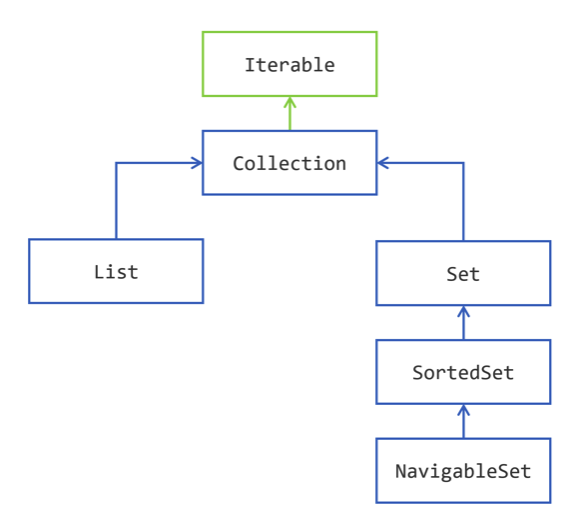
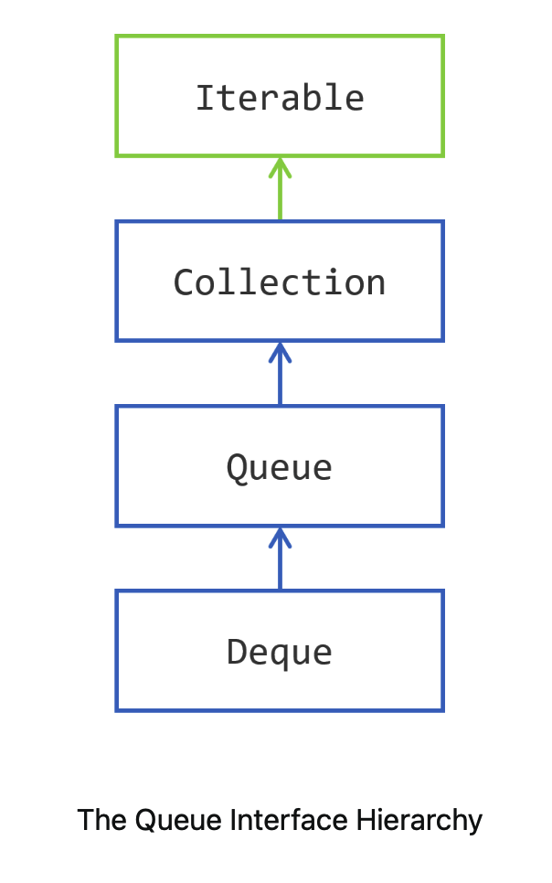
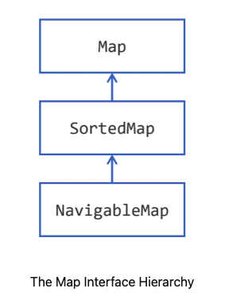

【官方】Java官方笔记13集合
==========================

|image1|

Storing Data
~~~~~~~~~~~~

The Collections Framework is the most widely used API of the JDK.

   集合不是数据类型，它是JDK的API，可以用来存储数据等，相当于数据结构。

the Collections Framework is a set of interfaces that models different
way of storing data in different types of containers. Then the Framework
provides at least one implementation for each interface.

There are two main categories of interfaces in the Collections
Framework: collections and
maps.（所以我猜想Python也是基于这样的考虑，设计了List和Dict，并作为Python基本数据类型，实际编码中要用到的也主要是这两类）

That makes two main
categories, ```Collection`` <https://docs.oracle.com/en/java/javase/20/docs/api/java.base/java/util/Collection.html>`__ and ```Map`` <https://docs.oracle.com/en/java/javase/20/docs/api/java.base/java/util/Map.html>`__,
a
subcategory, ```Queue`` <https://docs.oracle.com/en/java/javase/20/docs/api/java.base/java/util/Queue.html>`__,
and a side
category, ```Iterator`` <https://docs.oracle.com/en/java/javase/20/docs/api/java.base/java/util/Iterator.html>`__.

a collection is an object，but an array is not an object in Java.

Collection Hierarchy
~~~~~~~~~~~~~~~~~~~~

|image2|

The Iterable Interface is the super interface of
the **Collection interface**, and thus of all the interfaces of this
hierarchy. An object that
implements ```Iterable`` <https://docs.oracle.com/en/java/javase/20/docs/api/java.base/java/lang/Iterable.html>`__ is
an object that you can iterate over.

the ```Collection`` <https://docs.oracle.com/en/java/javase/20/docs/api/java.base/java/util/Collection.html>`__ interface
also models different ways of accessing its elements:

-  you can iterate over the elements of a collection, through the use of
   an iterator;
-  you can create a stream on these elements, that can be parallel.

**List是有序列表**\ ：

The difference between
a ```List`` <https://docs.oracle.com/en/java/javase/20/docs/api/java.base/java/util/List.html>`__ of
elements and
a ```Collection`` <https://docs.oracle.com/en/java/javase/20/docs/api/java.base/java/util/Collection.html>`__ of
elements, is that
a ```List`` <https://docs.oracle.com/en/java/javase/20/docs/api/java.base/java/util/List.html>`__ remembers
in what order its elements have been added. If you iterate over the
elements of a list, the first element you will get is the first that has
been added.

**You do not have this guarantee with a plain Collection nor for
a Set.**

List跟Collection的区别是，增加了index。

Set跟Collection的区别是，不允许重复。

Set是无序的，SortedSet是排序过的，SortedSet的排序是指从小到大排列，跟List的有序不一样，List有序是指的先添加排前面，不一定是最小的。

Storing Elements
~~~~~~~~~~~~~~~~

.. code:: java

   Collection<String> strings = new ArrayList<>();
   strings.add("one");
   strings.add("two");
   System.out.println("strings = " + strings);
   strings.remove("one");
   System.out.println("strings = " + strings);

-  ```containsAll()`` <https://docs.oracle.com/en/java/javase/20/docs/api/java.base/java/util/Collection.html#containsAll(java.util.Collection)>`__:
   defines the inclusion

   .. code:: java

      Collection<String> strings = new ArrayList<>();
      strings.add("one");
      strings.add("two");
      strings.add("three");

      Collection<String> first = new ArrayList<>();
      strings.add("one");
      strings.add("two");

      Collection<String> second = new ArrayList<>();
      strings.add("one");
      strings.add("four");

      System.out.println("Is first contained in strings? " + strings.containsAll(first));
      System.out.println("Is second contained in strings? " + strings.containsAll(second));

-  ```addAll()`` <https://docs.oracle.com/en/java/javase/20/docs/api/java.base/java/util/Collection.html#addAll(java.util.Collection)>`__:
   defines the union 并集

   Getting a ``true`` value does not mean that all the elements of the
   other collection have been added; it means that **at least one has
   been added**.

   .. code:: java

      Collection<String> strings = new ArrayList<>();
      strings.add("one");
      strings.add("two");
      strings.add("three");

      Collection<String> first = new ArrayList<>();
      first.add("one");
      first.add("four");

      boolean hasChanged = strings.addAll(first);

      System.out.println("Has strings changed? " + hasChanged);
      System.out.println("strings = " + strings);

-  ```removeAll()`` <https://docs.oracle.com/en/java/javase/20/docs/api/java.base/java/util/Collection.html#removeAll(java.util.Collection)>`__:
   defines the complement

   .. code:: java

      Collection<String> strings = new ArrayList<>();
      strings.add("one");
      strings.add("two");
      strings.add("three");

      Collection<String> toBeRemoved = new ArrayList<>();
      toBeRemoved.add("one");
      toBeRemoved.add("four");

      boolean hasChanged = strings.removeAll(toBeRemoved);

      System.out.println("Has strings changed? " + hasChanged);
      System.out.println("strings = " + strings);

-  ```retainAll()`` <https://docs.oracle.com/en/java/javase/20/docs/api/java.base/java/util/Collection.html#retainAll(java.util.Collection)>`__:
   defines the intersection 交集

   .. code:: java

      Collection<String> strings = new ArrayList<>();
      strings.add("one");
      strings.add("two");
      strings.add("three");

      Collection<String> toBeRetained = new ArrayList<>();
      toBeRetained.add("one");
      toBeRetained.add("four");

      boolean hasChanged = strings.retainAll(toBeRetained);

      System.out.println("Has strings changed? " + hasChanged);
      System.out.println("strings = " + strings);

注意上面的并集和交集，Collection本来就是集合，所以能够求并集和交集是理所当然的。

isEmpty()、clear()

.. code:: java

   Collection<String> strings = new ArrayList<>();
   strings.add("one");
   strings.add("two");
   if (!strings.isEmpty()) {
       System.out.println("Indeed strings is not empty!");
   }
   System.out.println("The number of elements in strings is " + strings.size());

.. code:: java

   Collection<String> strings = new ArrayList<>();
   strings.add("one");
   strings.add("two");
   System.out.println("The number of elements in strings is " + strings.size());
   strings.clear();
   System.out.println("After clearing it, this number is now " + strings.size());

size()，Collection相当于容器，用size。而array和String，相当于序列，用length。

**toArray**

将Collection转为array：

①无入参：

.. code:: java

   Collection<String> strings = ...; // suppose you have 15 elements in that collection

   String[] tabString1 = strings.toArray(new String[] {}); // you can pass an empty array
   String[] tabString2 = strings.toArray(new String[15]);   // or an array of the right size

②传参

.. code:: java

   Collection<String> strings = List.of("one", "two");

   String[] largerTab = {"three", "three", "three", "I", "was", "there"};
   System.out.println("largerTab = " + Arrays.toString(largerTab));

   String[] result = strings.toArray(largerTab);
   System.out.println("result = " + Arrays.toString(result));

   System.out.println("Same arrays? " + (result == largerTab));

.. code:: java

   Collection<String> strings = List.of("one", "two");

   String[] zeroLengthTab = {};
   String[] result = strings.toArray(zeroLengthTab);

   System.out.println("zeroLengthTab = " + Arrays.toString(zeroLengthTab));
   System.out.println("result = " + Arrays.toString(result));

③简写

.. code:: java

   Collection<String> strings = ...;

   String[] tabString3 = strings.toArray(String[]::new);

Predicate + removeIf 实现有条件的删除，比如删除null和empty的元素：

.. code:: java

   Predicate<String> isNull = Objects::isNull;
   Predicate<String> isEmpty = String::isEmpty;
   Predicate<String> isNullOrEmpty = isNull.or(isEmpty);

   Collection<String> strings = new ArrayList<>();
   strings.add(null);
   strings.add("");
   strings.add("one");
   strings.add("two");
   strings.add("");
   strings.add("three");
   strings.add(null);

   System.out.println("strings = " + strings);
   strings.removeIf(isNullOrEmpty);
   System.out.println("filtered strings = " + strings);

Iterating
~~~~~~~~~

for-each

.. code:: java

   Collection<String> strings = List.of("one", "two", "three");

   for (String element: strings) {
       System.out.println(string);
   }

Iterator

.. code:: java

   Collection<String> strings = List.of("one", "two", "three", "four");
   for (Iterator<String> iterator = strings.iterator(); iterator.hasNext();) {
       String element = iterator.next();
       if (element.length() == 3) {
           System.out.println(element);
       }
   }

List
~~~~

the List interface has 2: ArrayList and LinkedList. As you may guess,
the first one is built on an internal array, and the second on a
doubly-linked list.

**Iterating** over the elements of an ArrayList is much faster that over
the elements of a LinkedList. There are still cases where a linked list
is faster than an array. A doubly-linked list can access its **first and
last element** faster than an ArrayList can. This is the main use case
that makes LinkedList better than ArrayList. So if your application
needs a Last In, First Out (**LIFO**, covered later in this tutorial)
stack, or a First In, First Out (**FIFO**, also covered later) waiting
**queue**, then choosing a linked list is probably your best choice.

注意，链表在插入和删除的速度优势已经不在，因为现代硬件、CPU缓存和指针追踪已经很强大。

**index**

-  ```add(index, element)`` <https://docs.oracle.com/en/java/javase/20/docs/api/java.base/java/util/List.html#add(int,E)>`__:
   inserts the given object at the ``index``, adjusting the index if
   there are remaining elements
-  ```get(index)`` <https://docs.oracle.com/en/java/javase/20/docs/api/java.base/java/util/List.html#get(int)>`__:
   returns the object at the given ``index``
-  ```set(index, element)`` <https://docs.oracle.com/en/java/javase/20/docs/api/java.base/java/util/List.html#set(int,E)>`__:
   replaces the element at the given index with the new element
-  ```remove(index)`` <https://docs.oracle.com/en/java/javase/20/docs/api/java.base/java/util/List.html#remove(int)>`__:
   removes the element at the given ``index``, adjusting the index of
   the remaining elements.

The
methods ```indexOf(element)`` <https://docs.oracle.com/en/java/javase/20/docs/api/java.base/java/util/List.html#indexOf(java.lang.Object)>`__ and ```lastIndexOf(element)`` <https://docs.oracle.com/en/java/javase/20/docs/api/java.base/java/util/List.html#lastIndexOf(java.lang.Object)>`__ return
the index of the given element in the list, or -1 if the element is not
found.

subList：

.. code:: java

   List<String> strings = new ArrayList<>(List.of("0", "1", "2", "3", "4", "5"));
   System.out.println(strings);
   strings.subList(2, 5).clear();
   System.out.println(strings);

 ```addAll(int index, Collection collection)`` <https://docs.oracle.com/en/java/javase/20/docs/api/java.base/java/util/List.html#addAll(int,java.util.Collection)>`__

**ListIterator**

The ```ListIterator`` <https://docs.oracle.com/en/java/javase/20/docs/api/java.base/java/util/ListIterator.html>`__ interface
extends the
regular ```Iterator`` <https://docs.oracle.com/en/java/javase/20/docs/api/java.base/java/util/Iterator.html>`__ that
you already know. It adds several methods to it.

-  ```hasPrevious()`` <https://docs.oracle.com/en/java/javase/20/docs/api/java.base/java/util/ListIterator.html#hasPrevious()>`__ and ```previous()`` <https://docs.oracle.com/en/java/javase/20/docs/api/java.base/java/util/ListIterator.html#previous()>`__:
   to iterate in the descending order rather than the ascending order
-  ```nextIndex()`` <https://docs.oracle.com/en/java/javase/20/docs/api/java.base/java/util/ListIterator.html#nextIndex()>`__ and ```previousIndex()`` <https://docs.oracle.com/en/java/javase/20/docs/api/java.base/java/util/ListIterator.html#previousIndex()>`__:
   to get the index of the element that will be returned by the
   next ```next()`` <https://docs.oracle.com/en/java/javase/20/docs/api/java.base/java/util/ListIterator.html#next()>`__ call,
   or the
   next ```previous()`` <https://docs.oracle.com/en/java/javase/20/docs/api/java.base/java/util/ListIterator.html#previous()>`__ call
-  ```set(element)`` <https://docs.oracle.com/en/java/javase/20/docs/api/java.base/java/util/ListIterator.html#set(E)>`__:
   to update the last element returned
   by ```next()`` <https://docs.oracle.com/en/java/javase/20/docs/api/java.base/java/util/ListIterator.html#next()>`__ or ```previous()`` <https://docs.oracle.com/en/java/javase/20/docs/api/java.base/java/util/ListIterator.html#previous()>`__.
   If neither of these methods have been called on this iterator then
   an ```IllegalStateException`` <https://docs.oracle.com/en/java/javase/20/docs/api/java.base/java/lang/IllegalStateException.html>`__ is
   raised.

.. code:: java

   List<String> numbers = Arrays.asList("one", "two", "three");
   for (ListIterator<String> iterator = numbers.listIterator(); iterator.hasNext();) {
       String nextElement = iterator.next();
       if (Objects.equals(nextElement, "two")) {
           iterator.set("2");
       }
   }
   System.out.println("numbers = " + numbers);

Set
~~~

The ```Set`` <https://docs.oracle.com/en/java/javase/20/docs/api/java.base/java/util/Set.html>`__ interface
does not bring any new method to
the ```Collection`` <https://docs.oracle.com/en/java/javase/20/docs/api/java.base/java/util/Collection.html>`__ interface.
The Collections Framework gives you one plain implementation of
the ```Set`` <https://docs.oracle.com/en/java/javase/20/docs/api/java.base/java/util/Set.html>`__ interface: ```HashSet`` <https://docs.oracle.com/en/java/javase/20/docs/api/java.base/java/util/HashSet.html>`__.
**Internally,
a **\ ```HashSet`` <https://docs.oracle.com/en/java/javase/20/docs/api/java.base/java/util/HashSet.html>`__\ ** wraps
an instance
of **\ ```HashMap`` <https://docs.oracle.com/en/java/javase/20/docs/api/java.base/java/util/HashMap.html>`__\ **.**

.. code:: java

   List<String> strings = List.of("one", "two", "three", "four", "five", "six");
   Set<String> set = new HashSet<>();
   set.addAll(strings);
   set.forEach(System.out::println);

The ```SortedSet`` <https://docs.oracle.com/en/java/javase/20/docs/api/java.base/java/util/SortedSet.html>`__ interface
adds new methods
to ```Set`` <https://docs.oracle.com/en/java/javase/20/docs/api/java.base/java/util/Set.html>`__.

-  ```first()`` <https://docs.oracle.com/en/java/javase/20/docs/api/java.base/java/util/TreeSet.html#first()>`__ and ```last()`` <https://docs.oracle.com/en/java/javase/20/docs/api/java.base/java/util/TreeSet.html#last()>`__ returns
   the lowest and the largest elements of the set
-  ```headSet(toElement)`` <https://docs.oracle.com/en/java/javase/20/docs/api/java.base/java/util/TreeSet.html#headSet(E)>`__ and ```tailSet(fromElement)`` <https://docs.oracle.com/en/java/javase/20/docs/api/java.base/java/util/TreeSet.html#tailSet(E)>`__ returns
   you subsets containing the elements lower than ``toElement`` or
   greater than ``fromElement``
-  ```subSet(fromElement, toElement)`` <https://docs.oracle.com/en/java/javase/20/docs/api/java.base/java/util/TreeSet.html#subSet(E,E)>`__ gives
   you a subset of the element
   between ``fromElement`` and ``toElement``.

.. code:: java

   SortedSet<String> strings = new TreeSet<>(Set.of("a", "b", "c", "d", "e", "f"));
   SortedSet<String> subSet = strings.subSet("aa", "d");
   System.out.println("sub set = " + subSet);

注意，subSet仅仅相当于视图。No copy is made, meaning that any change you
make to these subsets will be reflected in the set, and the other way
round.

```NavigableSet`` <https://docs.oracle.com/en/java/javase/20/docs/api/java.base/java/util/NavigableSet.html>`__

Some methods are overloaded
by ```NavigableSet`` <https://docs.oracle.com/en/java/javase/20/docs/api/java.base/java/util/NavigableSet.html>`__. 

-  ```headSet()`` <https://docs.oracle.com/en/java/javase/20/docs/api/java.base/java/util/NavigableSet.html#headSet(E)>`__, ```headSet()`` <https://docs.oracle.com/en/java/javase/20/docs/api/java.base/java/util/NavigableSet.html#tailSet(E)>`__,
   and ```headSet()`` <https://docs.oracle.com/en/java/javase/20/docs/api/java.base/java/util/NavigableSet.html#subSet(E)>`__ may
   take a further ``boolean`` arguments to specify whether the limits
   (``toElement`` or ``fromElement``) are to be included in the
   resulting subset. 

Other methods have been added.

-  ```ceiling(element)`` <https://docs.oracle.com/en/java/javase/20/docs/api/java.base/java/util/NavigableSet.html#ceiling(E)>`__,
   and ```floor(element)`` <https://docs.oracle.com/en/java/javase/20/docs/api/java.base/java/util/NavigableSet.html#floor(E)>`__ return
   the greatest element lesser or equal than, or the lowest element
   greater or equal than the provided ``element``. If there is no such
   element then ``null`` is returned
-  ```floor(element)`` <https://docs.oracle.com/en/java/javase/20/docs/api/java.base/java/util/NavigableSet.html#lower(E)>`__,
   and ```higher(element)`` <https://docs.oracle.com/en/java/javase/20/docs/api/java.base/java/util/NavigableSet.html#higher(E)>`__ return
   the greater element lesser than, or the lowest element greater than
   the provided ``element``. If there is no such element
   then ``null`` is returned.
-  ```pollFirst()`` <https://docs.oracle.com/en/java/javase/20/docs/api/java.base/java/util/NavigableSet.html#pollFirst()>`__,
   and ```pollLast()`` <https://docs.oracle.com/en/java/javase/20/docs/api/java.base/java/util/NavigableSet.html#pollLast()>`__ return
   and removes the lowest or the greatest element of the set. 

Furthermore, ```NavigableSet`` <https://docs.oracle.com/en/java/javase/20/docs/api/java.base/java/util/NavigableSet.html>`__ also
allows you to iterate over its elements in descending order. There are
two ways to do this.

-  You can
   call ```descendingIterator()`` <https://docs.oracle.com/en/java/javase/20/docs/api/java.base/java/util/NavigableSet.html#descendingIterator()>`__:
   it gives you a
   regular ```Iterator`` <https://docs.oracle.com/en/java/javase/20/docs/api/java.base/java/util/Iterator.html>`__ that
   traverses the set in the descending order.
-  You can also
   call ```descendingSet()`` <https://docs.oracle.com/en/java/javase/20/docs/api/java.base/java/util/NavigableSet.html#descendingSet()>`__.
   What you get in return is
   another ```NavigableSet`` <https://docs.oracle.com/en/java/javase/20/docs/api/java.base/java/util/NavigableSet.html>`__ that
   is a view on this set and that makes you think you have the same set,
   sorted in the reversed order.

.. code:: java

   NavigableSet<String> sortedStrings = new TreeSet<>(Set.of("a", "b", "c", "d", "e", "f"));
   System.out.println("sorted strings = " + sortedStrings);
   NavigableSet<String> reversedStrings = sortedStrings.descendingSet();
   System.out.println("reversed strings = " + reversedStrings);

Factory Methods
~~~~~~~~~~~~~~~

Java SE 9

.. code:: java

   List<String> stringList = List.of("one", "two", "three");
   Set<String> stringSet = Set.of("one", "two", "three");

Java SE 10

.. code:: java

   Collection<String> strings = Arrays.asList("one", "two", "three");

   List<String> list = List.copyOf(strings);
   Set<String> set = Set.copyOf(strings);

**Arrays**

**The Collections Framework has a class**
called ```Arrays`` <https://docs.oracle.com/en/java/javase/20/docs/api/java.base/java/util/Arrays.html>`__ with
about 200 methods to handle arrays. Most of them are implementing
various algorithms on arrays, like sorting, merging, searching.

**Collections**

The Collections Framework comes with another factory
class: ```Collections`` <https://docs.oracle.com/en/java/javase/20/docs/api/java.base/java/util/Collections.html>`__,
with a set of method to manipulate collections and their content.

**Finding a Sublist in a List**

Two methods locate a given sublist in a bigger list: 

-  ```indexOfSublist(List<?> source, List<?> target)`` <https://docs.oracle.com/en/java/javase/20/docs/api/java.base/java/util/Collections.html#indexOfSubList(java.util.List,java.util.List)>`__:
   returns the first index of the first element of the ``target`` list
   in the ``source`` list, or -1 if it does not exist; 
-  ```lastIndexOfSublist(List<?> source, List<?> target)`` <https://docs.oracle.com/en/java/javase/20/docs/api/java.base/java/util/Collections.html#lastIndexOfSubList(java.util.List,java.util.List)>`__:
   return the last of these indexes.

**Changing the Order of the Elements of a List**

-  ```sort()`` <https://docs.oracle.com/en/java/javase/20/docs/api/java.base/java/util/Collections.html#sort(java.util.List)>`__ sorts
   the list in place. This method may take a comparator as an argument.
   As usual, if no comparator is provided, then the elements of the list
   must be comparable. If a comparator is provided, then it will be used
   to compare the elements. Starting with Java SE 8, you should favor
   the ```sort()`` <https://docs.oracle.com/en/java/javase/20/docs/api/java.base/java/util/List.html#sort(java.util.Comparator)>`__ method
   from
   the ```List`` <https://docs.oracle.com/en/java/javase/20/docs/api/java.base/java/util/List.html>`__\ interface. 
-  ```shuffle()`` <https://docs.oracle.com/en/java/javase/20/docs/api/java.base/java/util/Collections.html#shuffle(java.util.List)>`__ randomly
   shuffles the elements of the provided list. You can provide yout
   instance
   of ```Random`` <https://docs.oracle.com/en/java/javase/20/docs/api/java.base/java/util/Random.html>`__ if
   you need a random shuffling that you can repeat. 
-  ```rotate()`` <https://docs.oracle.com/en/java/javase/20/docs/api/java.base/java/util/Collections.html#rotate(java.util.List,int)>`__ rotates
   the elements of the list. After a rotation the element at index 0
   will be found at index 1 and so on. The last elements will be moved
   to the first place of the list. You can
   combine ```subList()`` <https://docs.oracle.com/en/java/javase/20/docs/api/java.base/java/util/List.html#subList(int,int)>`__ and ```rotate()`` <https://docs.oracle.com/en/java/javase/20/docs/api/java.base/java/util/Collections.html#rotate(java.util.List,int)>`__ to
   remove an element at a given index and to insert it in another place
   in the list.
-  ```reverse()`` <https://docs.oracle.com/en/java/javase/20/docs/api/java.base/java/util/Collections.html#reverse(java.util.List)>`__:
   reverse the order of the elements of the list.
-  ```swap()`` <https://docs.oracle.com/en/java/javase/20/docs/api/java.base/java/util/Collections.html#swap(java.util.List,int,int)>`__:
   swaps two elements from the list. This method can take a list as an
   argument, as well as a plain array.

Stacks and Queues
~~~~~~~~~~~~~~~~~

|image3|

Stacks are also called LIFO stacks, where LIFO stands for Last In, First
Out. Queues are known as FIFO: First In First Out. 

These structures are very simple and gives you three main operations. 

-  *push(element)*: adds an element to the queue, or the stack
-  *pop()*: removes an element from the stack, that is, the youngest
   element added
-  *poll()*: removes an element from the queue, that is, the oldest
   element added 
-  *peek()*: allows you to see the element you will get with
   a *pop()* or a *poll()*, but without removing it from the queue of
   the stack.

**Queues and Stacks**

-  the ```Queue`` <https://docs.oracle.com/en/java/javase/20/docs/api/java.base/java/util/Queue.html>`__ interface
   models a queue;
-  the ```Deque`` <https://docs.oracle.com/en/java/javase/20/docs/api/java.base/java/util/Deque.html>`__ interface
   models a **double ended queue** (thus the name). You can push, pop,
   poll and peek elements on both the tail and the head of
   a ```Deque`` <https://docs.oracle.com/en/java/javase/20/docs/api/java.base/java/util/Deque.html>`__,
   making it both a **queue and a stack**.

Collection没有Stack接口，栈是通过Deque来定义的。

**Implementing Queue and Deque**

-  ```ArrayDeque`` <https://docs.oracle.com/en/java/javase/20/docs/api/java.base/java/util/ArrayDeque.html>`__:
   which implements both. This implementation is backed by an array. The
   capacity of this class automatically grows as elements are added. So
   this implementation always accepts new elements.
-  ```LinkedList`` <https://docs.oracle.com/en/java/javase/20/docs/api/java.base/java/util/LinkedList.html>`__:
   which also implements both. This implementation is backed by a linked
   list, making the access to its first and last element very efficient.
   A ```LinkedList`` <https://docs.oracle.com/en/java/javase/20/docs/api/java.base/java/util/LinkedList.html>`__ will
   always accept new elements. 
-  ```PriorityQueue`` <https://docs.oracle.com/en/java/javase/20/docs/api/java.base/java/util/PriorityQueue.html>`__:
   that only
   implements ```Queue`` <https://docs.oracle.com/en/java/javase/20/docs/api/java.base/java/util/Queue.html>`__.
   This queue is backed by an array that keeps its elements sorted by
   their natural order or by an order specified by
   a ```Comparator`` <https://docs.oracle.com/en/java/javase/20/docs/api/java.base/java/util/Comparator.html>`__.
   The head of this queue is always the least element of the queue with
   respect to the specified ordering. The capacity of this class
   automatically grows as elements are added.

Maps
~~~~

|image4|

implementations：

-  HashMap

-  ```LinkedHashMap`` <https://docs.oracle.com/en/java/javase/20/docs/api/java.base/java/util/LinkedHashMap.html>`__ is
   a ```HashMap`` <https://docs.oracle.com/en/java/javase/20/docs/api/java.base/java/util/HashMap.html>`__ with
   an internal structure to keep the key-value pairs ordered. Iterating
   on the keys or the key-value pairs will follow the order in which you
   have added your key-value pairs.

   这里注意，HashMap是无序的，LinkedHashMap是有序的。

-  ```IdentityHashMap`` <https://docs.oracle.com/en/java/javase/20/docs/api/java.base/java/util/IdentityHashMap.html>`__ is
   a
   specialized ```Map`` <https://docs.oracle.com/en/java/javase/20/docs/api/java.base/java/util/Map.html>`__ that
   you should only be used in very precise cases. This implementation is
   not meant to be generally used in application. Instead of
   using ```equals()`` <https://docs.oracle.com/en/java/javase/20/docs/api/java.base/java/lang/Object.html#equals(java.lang.Object)>`__ and ```hashCode()`` <https://docs.oracle.com/en/java/javase/20/docs/api/java.base/java/lang/Object.html#hashCode()>`__ to
   compare the key objects, this implementation only compares the
   references to these keys, with an equality operator (``==``). Use it
   with caution, only if you are sure this is what you need.

Java SE 9

.. code:: java

   Map<Integer, String> map = 
       Map.of(
           1, "one", 
           2, "two",
           3, "three"
       );

The ```Map`` <https://docs.oracle.com/en/java/javase/20/docs/api/java.base/java/util/Map.html>`__ defines
a member
interface: ```Map.Entry`` <https://docs.oracle.com/en/java/javase/20/docs/api/java.base/java/util/Map.Entry.html>`__ to
model a key-value pair. This interface defines three methods to access
the key and the values:

-  ```getKey()`` <https://docs.oracle.com/en/java/javase/20/docs/api/java.base/java/util/Map.Entry.html#getKey()>`__:
   to read the key;
-  ```getValue()`` <https://docs.oracle.com/en/java/javase/20/docs/api/java.base/java/util/Map.Entry.html#getValue()>`__ and ```setValue(value)`` <https://docs.oracle.com/en/java/javase/20/docs/api/java.base/java/util/Map.Entry.html#setValue(V)>`__:
   to read and update the value bound to that key.

**putIfAbsent()**\ ，如果是null，会替换为默认值：

.. code:: java

   for (String key : map.keySet()) {
       map.putIfAbsent(key, -1);
   }

如果value是null，可能会报错，比如：

.. code:: java

   Map<String, Integer> map = new HashMap<>();

   map.put("one", 1);
   map.put("two", null);
   map.put("three", 3);
   map.put("four", null);
   map.put("five", 5);

   for (int value : map.values()) {  // 这里是int
       System.out.println("value = " + value);  // Integer拆包为int时会报NPE
   }

**getOrDefault()**\ ，如果没有key，返回默认值：

.. code:: java

   Map<Integer, String> map = new HashMap<>();

   map.put(1, "one");
   map.put(2, "two");
   map.put(3, "three");

   List<String> values = new ArrayList<>();
   for (int i = 0; i < 5; i++) {
       values.add(map.getOrDefault(key,"UNDEFINED"));
   }

   System.out.println("values = " + values);

流式写法：

.. code:: java

   List<String> values =
       IntStream.range(0, 5)
           .mapToObj(key -> map.getOrDefault(key, "UNDEFINED"))
           .collect(Collectors.toList());

   System.out.println("values = " + values);

**remove(key)**\ ，remove后返回value，可能为null。

**remove(key,
value)**\ ，remove时先判断value存在才移除，返回boolean，\ ``true`` if
the key/value pair was removed from the map。

**containsKey(key) and containsValue(value)** Both methods return true
if the map contains the given key or value.

**putAll(otherMap)** If some keys are present in both maps, then the
values of otherMap will erase those of this map.（并集）

-  ```keySet()`` <https://docs.oracle.com/en/java/javase/20/docs/api/java.base/java/util/Map.html#keySet()>`__:
   returns an instance
   of ```Set`` <https://docs.oracle.com/en/java/javase/20/docs/api/java.base/java/util/Set.html>`__,
   containing the keys defined in the map
-  ```entrySet()`` <https://docs.oracle.com/en/java/javase/20/docs/api/java.base/java/util/Map.html#entrySet()>`__:
   returns an instance
   of ```Set<Map.Entry>`` <https://docs.oracle.com/en/java/javase/20/docs/api/java.base/java/util/Set.html>`__,
   containing the key/value pairs contained in the map
-  ```values()`` <https://docs.oracle.com/en/java/javase/20/docs/api/java.base/java/util/Map.html#values()>`__:
   returns an instance
   of ```Collection`` <https://docs.oracle.com/en/java/javase/20/docs/api/java.base/java/util/Collection.html>`__,
   containing the values present in the map.

遍历推荐使用以下方式：

.. code:: java

   for (Map.Entry<Integer, String> entry : map.entrySet()) {
       System.out.println("entry = " + entry);
   }

**Lambda Expressions**

.. code:: java

   Map<Integer, String> map = new HashMap<>();
   map.put(1, "one");
   map.put(2, "two");
   map.put(3, "three");

   map.forEach((key, value) -> System.out.println(key + " :: " + value));

.. code:: java

   Map<Integer, String> map = new HashMap<>();

   map.put(1, "one");
   map.put(2, "two");
   map.put(3, "three");

   map.replaceAll((key, value) -> value.toUpperCase());
   map.forEach((key, value) -> System.out.println(key + " :: " + value));

**compute**

The
```put()`` <https://docs.oracle.com/en/java/javase/20/docs/api/java.base/java/util/Map.html#put(K,V)>`__
methods return the previous value, whereas the
```compute()`` <https://docs.oracle.com/en/java/javase/20/docs/api/java.base/java/util/Map.html#compute(K,java.util.function.BiFunction)>`__
methods return the new value.

.. code:: java

   List<String> strings = List.of("one", "two", "three", "four", "five", "six", "seven");
   Map<Integer, List<String>> map = new HashMap<>();
   for (String word: strings) {
       int length = word.length();
       if (!map.containsKey(length)) {
           map.put(length, new ArrayList<>());
       }
       map.get(length).add(word);
   }

   map.forEach((key, value) -> System.out.println(key + " :: " + value));

使用putIfAbsent优化：

.. code:: java

   for (String word: strings) {
       int length = word.length();
       map.putIfAbsent(length, new ArrayList<>());
       map.get(length).add(word);
   }

使用computeIfAbsent优化：

.. code:: java

   for (String word: strings) {
       int length = word.length();
       map.computeIfAbsent(length, key -> new ArrayList<>())
          .add(word);
   }

**merge**

.. code:: java

   List<String> strings = List.of("one", "two", "three", "four", "five", "six", "seven");
   Map<Integer, String> map = new HashMap<>();
   for (String word: strings) {
       int length = word.length();
       map.merge(length, word, 
                 (existingValue, newWord) -> existingValue + ", " + newWord);
   }

   map.forEach((key, value) -> System.out.println(key + " :: " + value));

**SortedMap and NavigableMap**

.. code:: java

   SortedMap<Integer, String> map = new TreeMap<>();
   map.put(1, "one");
   map.put(2, "two");
   map.put(3, "three");
   map.put(5, "five");
   map.put(6, "six");

   SortedMap<Integer, String> headMap = map.headMap(3);
   headMap.put(0, "zero"); // this line is ok
   headMap.put(4, "four"); // this line throws an IllegalArgumentException

Here is the code of the
```add(element)`` <https://docs.oracle.com/en/java/javase/20/docs/api/java.base/java/util/HashSet.html#add(E)>`__
of the
```HashSet`` <https://docs.oracle.com/en/java/javase/20/docs/api/java.base/java/util/HashSet.html>`__
class:

.. code:: java

   private transient HashMap<E,Object> map;
   private static final Object PRESENT = new Object();

   public boolean add(E e) {
       return map.put(e, PRESENT)==null;
   }

What you can see is that in fact, **a hashset stores your object in a
hashmap** (the ``transient`` keyword is not relevant). Your objects are
the keys of this hashmap, and the value is just a placeholder, an object
with no significance.

hashset
是用hashmap来存的，所以最好不要更新hashset的值（也就是hashmap的key），否则会有意想不到的Bug。

   参考资料：

   The Collections Framework
   https://dev.java/learn/api/collections-framework/

.. |image1| image:: ../wanggang.png



