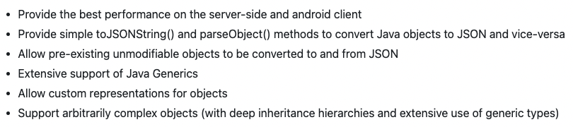
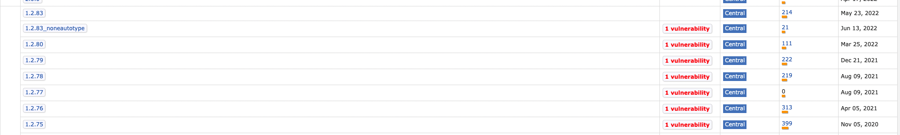
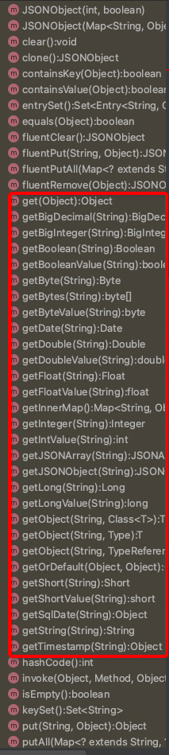

# 【库】fastjson知多少


## fastjson知多少


### fastjson介绍

fastjson是一个Java库，用来在Java对象和JSON之间相互转换。

fastjson的目标（官方原话）：



我翻译一下：

- 性能非常好；

- 封装非常高；

- 转换非常强；

- 泛型也支持；

- 自定义表示；

- 复杂也支持；

这6个目标，书读少的我理解起来费劲，看着这些字，视线开始模糊...突然这些字动了，不断变幻，凝聚成了两个字：“牛逼”。阿里巴巴也确实做到了，fastjson(24.9k star)作为国产原创库，PK掉了jackson(7.6k star)和gson(21.3k star)，在国内应用领域坐上了头把交椅。

### 安装fastsjon

Maven引入：

```xml
<dependency>
    <groupId>com.alibaba</groupId>
    <artifactId>fastjson</artifactId>
    <version>VERSION_CODE</version>
</dependency>
```

版本可以在 https://mvnrepository.com/artifact/com.alibaba/fastjson 查找：



虽然2.0.x版本出来了，但是使用得多的还是1.2.x版本。至少得1.2.48以上，因为这以下的版本之前出过轰动全国的安全漏洞。

### 入门示例

Group.java

```java
public class Group {

    private Long       id;
    private String     name;
    private List<User> users = new ArrayList<User>();

    public Long getId() {
        return id;
    }

    public void setId(Long id) {
        this.id = id;
    }

    public String getName() {
        return name;
    }

    public void setName(String name) {
        this.name = name;
    }

    public List<User> getUsers() {
        return users;
    }

    public void setUsers(List<User> users) {
        this.users = users;
    }

    public void addUser(User user) {
        users.add(user);
    }
}
```

User.java

```java
public class User {

    private Long   id;
    private String name;

    public Long getId() {
        return id;
    }

    public void setId(Long id) {
        this.id = id;
    }

    public String getName() {
        return name;
    }

    public void setName(String name) {
        this.name = name;
    }
}
```

编码，Java对象转换为JSON：

```java
import com.alibaba.fastjson.JSON;

Group group = new Group();
group.setId(0L);
group.setName("admin");

User guestUser = new User();
guestUser.setId(2L);
guestUser.setName("guest");

User rootUser = new User();
rootUser.setId(3L);
rootUser.setName("root");

group.addUser(guestUser);
group.addUser(rootUser);

// toJSONString方法
String jsonString = JSON.toJSONString(group);

System.out.println(jsonString);
```

输出：

```
{"id":0,"name":"admin","users":[{"id":2,"name":"guest"},{"id":3,"name":"root"}]}
```

解码，JSON转换为Java对象：

```java
String jsonString = ...;
// parseObject方法
Group group = JSON.parseObject(jsonString, Group.class);
```

fastjson封装了JSON类的`toJSONString()`和`parseObject()`方法，来实现Java对象和JSON之间相互转换。

在JSON转换为Java对象时，传入的String可以写在单行：

```java
String jsonString = "{\"id\":0,\"name\":\"admin\",\"users\":[{\"id\":2,\"name\":\"guest\"},{\"id\":3,\"name\":\"root\"}]}";
```

也可以格式化后复制粘贴为多行：

```java
String jsonString = "{\n" +
        "    \"id\":0,\n" +
        "    \"name\":\"admin\",\n" +
        "    \"users\":[\n" +
        "        {\n" +
        "            \"id\":2,\n" +
        "            \"name\":\"guest\"\n" +
        "        },\n" +
        "        {\n" +
        "            \"id\":3,\n" +
        "            \"name\":\"root\"\n" +
        "        }\n" +
        "    ]\n" +
        "}";
```

**单行和多行都能够转换成功**。

### 字符串转JSON提取数据

除了Java对象和JSON相互转换以外，还有个对于测试来说，更为常见的使用场景：把字符串转为JSON，提取其中某些字段的数据。

这也很简单，parseObject()方法不传第二个参数，返回的就是一个JSONObject对象：

```java
String jsonString = ...;
// parseObject方法
JSONObject jsonObj = JSON.parseObject(jsonString);
```

JSONObject提供了一系列不同数据类型的get()方法来提取数据：



对号入座提取想要的数据就可以了。

> 参考资料：
> 
> fastjson源码 https://github.com/alibaba/fastjson
> 
> fastjson详解 https://blog.csdn.net/cold___play/article/details/124525519
